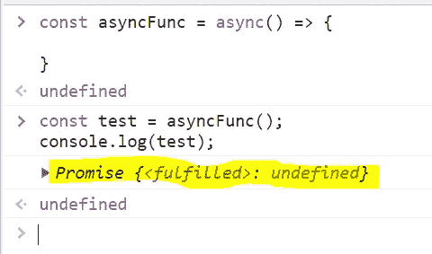

# 异步 JavaScript:幕后故事

> 原文：<https://javascript.plainenglish.io/asynchronous-javascript-under-the-hood-d2c2462be059?source=collection_archive---------3----------------------->

## 回调、承诺和异步/等待解释


Photo by [Taneli Lahtinen](https://unsplash.com/@tanelah?utm_source=medium&utm_medium=referral) on [Unsplash](https://unsplash.com?utm_source=medium&utm_medium=referral)

如果你已经学习或使用 JavaScript 有一段时间了，你肯定听过这个短语`asynchronous`。

JavaScript 是一种异步语言，这解释了这一点。然而，这实际上意味着什么呢？我想在这篇文章中向你展示这个想法有多简单。

## 同步与异步

在继续操作之前，让我们仔细看看这两个术语，同步和异步。

默认情况下，JavaScript 是一种单线程同步编程语言。这意味着指令只能顺序执行，不能并发执行。看看下面这段简短的代码:

```
let a = 1;
let b = 2;
let sum = a + b;
console.log(sum);
```

上面的代码只是将两个数字相加，并将结果记录在浏览器的控制台中。这些指令由解释程序依次执行，直到全部执行完毕。

但是这种方法也有缺点。假设我们想在从数据库中检索数据后，在界面上呈现大量数据。一旦解释器到达获取该数据的指令，剩余的代码就被阻止运行，直到数据被获取并返回。

现在，您可以争辩说，由于要获取的数据量并不大，所以不会花很长时间。考虑必须从多个位置收集数据的情况。当这种延迟加剧时，用户可能不希望遇到这种情况。

幸运的是，开发异步 JavaScript 是为了解决同步 JavaScript 的问题。

异步编程被认为是可以现在开始，以后结束的编程。当 JavaScript 异步运行时，命令并不总是按顺序执行，就像我们之前看到的那样。

多年来，开发人员采用了许多不同的方法来恰当地处理这种异步行为。每一个解决方案都建立在它之前的解决方案的基础上，这样可以优化代码，如果代码变得复杂了，也更容易理解。

我们将回顾回调函数、承诺、异步，并等待更好地理解 JavaScript 的异步本质。

## JavaScript 中的回调

回调是一个函数，它接收另一个函数内部的参数，然后用于执行该函数内部的任务。

迷惑？让我们通过付诸实践来简化它。

```
console.log('fired first');
console.log('fired second');

setTimeout(()=>{
    console.log('fired third');
},2000);

console.log('fired last');
```

上面的示例显示了一个将信息记录到控制台的小程序。但这是一种新颖的情况。解释器将执行第一条指令，然后转到第二条指令，跳过第三条指令，执行最后一条指令。

一个名为`setTimeout`的 JavaScript 函数接受两个参数。第二个参数指定另一个函数在第一个函数之后应该运行多长时间，以毫秒为单位，第一个函数是另一个函数。您现在可以清楚地看到回调在实践中是如何定义的。

在这个场景中，`setTimeout`函数必须在两秒钟(2000 毫秒)后执行。想象它被移动到浏览器的另一个区域执行，而其他指令仍在执行。两秒钟后返回函数的结果。

因此，如果我们在程序中运行上述代码片段，我们将看到以下内容:

```
fired first
fired second
fired last
fired third
```

您可以看到，在`setTimeout`函数提供其输出之前，记录了最后一个命令。假设我们使用这种技术从数据库中检索数据。当用户等待数据库调用提供结果时，执行流程不会停止。

这种方法非常有效，但只是在一定程度上有效。在他们的代码中，开发人员偶尔需要多次调用各种源。为了进行这些调用，回调被嵌套起来，这使得它们难以理解或维护。这就是所谓的**回调地狱**。

为了解决这一问题，出现了承诺。

## JavaScript 中的承诺

我们总是听到人们许诺一些事情。JavaScript 中的承诺与你的堂兄承诺给你免费的钱或一个小孩承诺不问就不再打开饼干罐的承诺有一点不同。

在我们的上下文中，承诺指的是需要时间来完成的任务。承诺可能有两种结果:

要么我们执行并履行承诺，要么因为一路上的错误而拒绝承诺。

承诺是为了解决回调函数的问题而产生的。promise 接受两个函数作为参数。换句话说，决定和拒绝。记住成功是解决的，失败是拒绝的。

让我们来看看工作中的承诺:

```
const getData = (dataEndpoint) => {
   return new Promise ((resolve, reject) => {
     //some request to the endpoint;

     if(request is successful){
       //do something;
       resolve();
     }
     else if(there is an error){
       reject();
     }

   });
};
```

上面代码中的承诺被对端点的请求所包围。正如我已经指出的，这个承诺包括决心和拒绝。

例如，如果在调用端点之后请求成功，我们将解析承诺，并继续对答案做我们想做的任何事情。但是，如果有一个错误，保证将被丢弃。

通过使用承诺和一种称为承诺链的技术，回调地狱相关的问题可以被巧妙地解决。通过更少的代码和更简单的技术，您可以使用这种方式从许多端点顺序检索数据。

但是有一种方法要好得多！您可能对下面的方法很熟悉，因为它是 JavaScript 中管理数据和 API 调用的首选机制。

## JavaScript 中的异步和等待

问题是，用与回调相同的方式将承诺链接在一起可能会变得相当笨拙和令人费解。正因为如此，`async`和`await`被研发出来。

您执行以下操作来定义一个`async`函数:

```
const asyncFunc = async() => {

}
```

记住，运行一个`async`函数总是会导致一个承诺被返回。查看以下内容:

```
const test = asyncFunc();
console.log(test);
```



Output

我们可以看到`asyncFunc`通过在浏览器控制台中运行上述代码产生了一个承诺。

现在让我们真正剖析一些代码。看看下面的短文:

```
const asyncFunc = async () => {
	const response = await fetch(resource);
   	const data = await response.json();
}
```

正如我前面指出的，我们使用`async`关键字定义异步函数。那么`await`怎么样呢？嗯，在承诺实现之前，JavaScript 无法将`fetch`绑定到响应变量。现在，在承诺实现后，可以将检索方法的结果添加到响应变量中。

在第 3 行，同样的事情发生了。`.json`方法返回一个承诺，我们仍然可以使用`await`来延迟分配，直到承诺被解决。

**闭锁或不闭锁代码**

你必须假设当我提到**停止**时，我的意思是使用 Async 和 Await 以某种方式阻止代码执行。你会问，如果我们的请求耗时太长怎么办？

不正确。尽管`async`函数包含阻塞代码，但这与程序的执行方式无关。我们的代码继续像以前一样异步运行。话虽如此，

```
const asyncFunc = async () => {
	const response = await fetch(resource);
   	const data = await response.json();
}

console.log(1);
cosole.log(2);

asyncFunc().then(data => console.log(data));

console.log(3);
console.log(4);
```

上述内容的输出可能会在我们浏览器的控制台中显示如下:

```
1
2
3
4
data returned by asyncFunc
```

你可以看到在调用`asyncFunc`之后，我们的代码一直运行，直到函数准备好返回结果。

## 结论

虽然我没有在本文中详细介绍这些概念，但是我想让您了解一下什么是异步 JavaScript 以及一些潜在的陷阱。

本文仅仅触及了 JavaScript 这个关键组件的表面。但是我确实希望这篇文章能够简化这些想法，至少在某种程度上。

```
**Want to Connect?** 
Connect with me on [LinkedIn](https://www.linkedin.com/in/gouravkajal/).
```

感谢阅读！

*更多内容请看*[***plain English . io***](https://plainenglish.io/)*。报名参加我们的* [***免费周报***](http://newsletter.plainenglish.io/) *。关注我们关于*[***Twitter***](https://twitter.com/inPlainEngHQ)[***LinkedIn***](https://www.linkedin.com/company/inplainenglish/)*[***YouTube***](https://www.youtube.com/channel/UCtipWUghju290NWcn8jhyAw)*[***不和***](https://discord.gg/GtDtUAvyhW) *。对增长黑客感兴趣？检查* [***电路***](https://circuit.ooo/) *。***