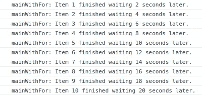

# JavaScript 中的异步循环—使用 forEach、map 和 for 循环

> 原文：<https://javascript.plainenglish.io/asynchronous-loops-in-javascript-using-foreach-map-and-for-loop-8a1db09fd3b1?source=collection_archive---------18----------------------->

## 在 async/await 中使用 JavaScript 循环的正确方法


使用 web 应用程序时，异步操作至关重要。我们都同意，在处理异步操作时，async/await 让我们的生活变得多么简单。

在这篇文章中，我们将看到如何在 async/await 中使用循环。

在我们深入研究之前，这里是我在演示中使用的实用函数

```
// creates a logger function to print logs with function name
function getLogger(fnName) {
  return function logger(value, diffInMS) {
    return console.log(
      `${fnName}: Item ${value} finished waiting ${Math.round(
        diffInMS / 1000
      )} seconds later.`
    );
  };
}

// simulates an async flow, a network request for example
async function waitFor(seconds) {
  // used to create the fancy waterfall
  fetch("https://random-data- 
         api.com/api/stripe/random_stripe" + Math.random());

  // the fake asynchronous task
  return new Promise((resolve, reject) => {
    setTimeout(resolve, seconds * 1000);
  });
}
```

# 经典 For 循环

```
const list = [1, 2, 3, 4, 5, 6, 7, 8 , 9, 10];

export async function mainWithFor() {
  const start = Date.now();
  const logger = getLogger("mainWithFor");
  for (const item of list) {
    await waitFor(2);
    const later = Date.now();
    logger(item, later - start);
  }
}
```

一个接一个地按顺序运行代码。在进行下一次迭代之前，等待每个`waitFor`完成。

下图展示了一个漂亮的瀑布演示，看看每个绿色部分是如何在前一个的 2 秒后开始的。(不要担心它们的持续时间，因为它是一个随机的终点。仅为了瀑布描绘)


for loop waterfall async/await

您还会注意到，日志一个接一个地出现，相差 2 秒。



for loop console logs

> *这种方法的一个很好的用例是运行顺序操作，其中您希望在前一个操作完成后运行下一个操作。*

# forEach 高阶方法

```
export async function mainWithForEach() {
  const start = Date.now();
  const logger = getLogger("mainWithForEach");
  list.forEach(async (item) => {
    await waitFor(2);
    const later = Date.now();
    logger(item, later - start);
  });
}
```

`forEach`循环的行为不同于`for`循环，而`for`循环在进一步移动之前`await`迭代，`forEach`循环同时执行所有迭代。因此，所有十次执行都在同一点开始，并在 2 秒后记录。


forEach loop console logs

我们也可以用瀑布图来观察，看看它们是如何同时开始的。(再次请忽略每次执行的持续时间，这是 random-API)。


forEach loop waterfall async/await

> *这种方法的一个很好的用例是运行并行操作，其中您不关心前一个操作是否完成。比* `*for*` *循环快多了。但是这种方法有一个警告:如果您请求的 API 有某种速率限制设置，那么同时请求可能会适得其反。*

# 映射高阶方法

```
export async function mainWithMap() {
  const start = Date.now();
  const logger = getLogger("mainWithMap");
  const promises = list.map(async (item) => {
    await waitFor(2);
    const later = Date.now();
    logger(item, later - start);
  });
  const finalAnswer = await Promise.all(promises)
}
```

就异步操作而言，`map`函数的行为与`forEach`完全相同，这意味着所有的回调同时开始，并在 2 秒后记录。

最重要的是，`.map`返回一个承诺数组(每次执行一个承诺，顺序相同)。

稍后我们可以做一个`await Promise.all(promises)`来从中获得最终的答案数组。

*需要注意的是，如果输入数组中只有一个承诺被拒绝，则 Promise.all 将被完全拒绝。*

> `*map*` *应该用在需要根据每个异步操作返回一些数据的地方。如果不是这样，坚持用* `*forEach*` *也不会是个坏选择。*

如果你想亲自尝试，这里有到 [codesandbox](https://codesandbox.io/s/async-await-loops-4brdl) 的链接。

我还制作了一个 [YouTube 视频](https://www.youtube.com/watch?v=Ce1ywrKeStI)来亲自解释这个帖子，

Asynchronous loops in JavaScript: Youtube video

我希望这篇文章对你有帮助。如果你有任何反馈或问题，请在下面的评论中提问。我很想听听他们的想法并为之努力。

如果您还没有，请[关注我](https://twitter.com/sun_anshuman)，以获得关于此类帖子的通知。

*原载于 2022 年 1 月 3 日*[*https://theanshuman . dev*](https://theanshuman.dev/articles/asynchronous-loops-in-javascript-using-foreach-vs-map-vs-for-loop-5020)*。*

*更多内容请看* [***说白了就是***](http://plainenglish.io/) *。报名参加我们的* [***免费每周简讯***](http://newsletter.plainenglish.io/) *。在我们的* [***社区***](https://discord.gg/GtDtUAvyhW) *获得独家获得写作机会和建议。*