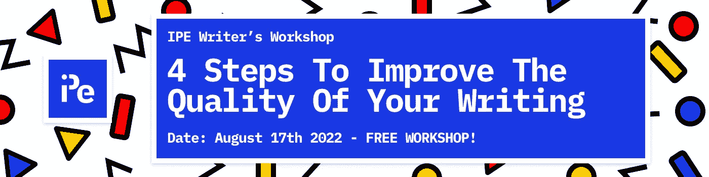

# 提高写作质量的四个步骤

> 原文：<https://javascript.plainenglish.io/attend-ipes-free-writing-workshop-b31792f849b5?source=collection_archive---------0----------------------->

## ***更新:本次研讨会现已召开。你可以在这里看直播***

[**说白了**](https://www.linkedin.com/company/inplainenglish/) 很高兴能举办我们第一次**作家工作坊**！

针对所有技能水平的内容创作者，我们的研讨会将帮助你成为一个更好的作家。您将获得独家提示、建议和资源，并有机会向超过 300 万读者发布您的作品。

姓名:**提高你写作质量的 4 个步骤**
日期:****2022 年 8 月 17 日**
时间: **1300 GMT+1****

**为订阅我们的 YouTube 频道，享受免费的直播。**

** [## 坦白地说

### 嘿！Sunil (@sunilsandhu)这里，软件开发人员，说白了就是创始人。我们喜欢复杂的话题和…

www.youtube.com](https://www.youtube.com/channel/UCtipWUghju290NWcn8jhyAw/about) 

如果您喜欢书面形式的内容，可以在下面找到:

 [## 如何为开发者写更好的内容:了解你的故事

### 每一篇文章都有一个目的。毕竟，作家写作是有原因的。他们有话要说，有理由…

电路. ooo](https://circuit.ooo/blog/how-to-write-better-content-for-developers-know-your-story)  [## 如何为开发者写更好的内容:了解你的受众

### 写作是联系作者和读者的媒介。如果作者的声音……

电路. ooo](https://circuit.ooo/blog/how-to-write-better-content-for-developers-know-your-audience)  [## 如何为开发者编写更好的内容:驾驭你的内在编辑器

### 在完成初稿后，作家需要转换视角来消除…

电路. ooo](https://circuit.ooo/blog/how-to-write-better-content-for-developers-harness-your-inner-editor)  [## 如何为开发者写出更好的内容:超脱自我

### 写小说的时候，一般会假设初稿不会是你的终稿。事实上，通常是…

电路. ooo](https://circuit.ooo/blog/how-to-write-better-content-for-developers-detach-yourself)  [## 如何为开发者创造更好的内容

### 开发人员是很难为其创建内容的受众。天生的怀疑论者，开发者倾向于重视真实性…

电路. ooo](https://circuit.ooo/blog/how-to-create-better-content-for-developers)**