# 使用 React + Node.js + Firebase 轻松进行用户身份验证:完整指南

> 原文：<https://javascript.plainenglish.io/auth-react-node-firebase-10030d160707?source=collection_archive---------8----------------------->

## 使用 React.js、Node.js 和 Firebase SDKs 在 web 应用程序中实现用户身份验证的全面指南。

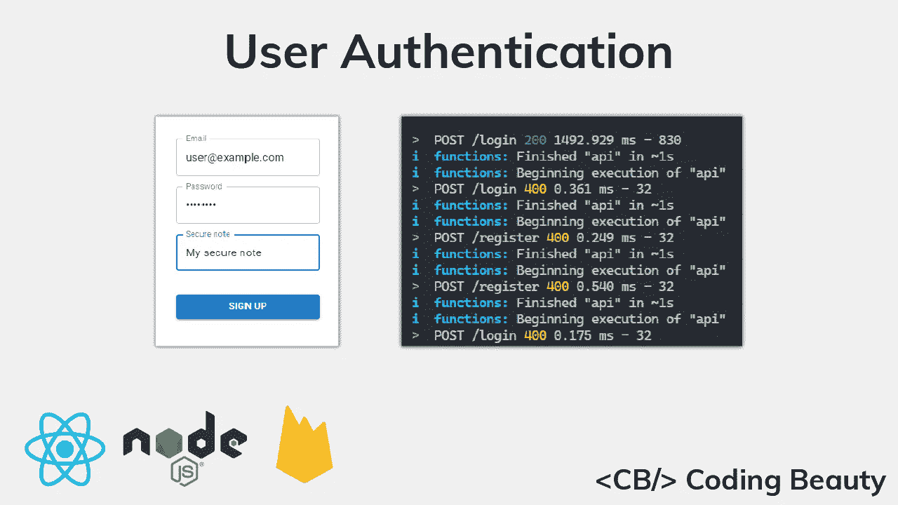

身份认证对于验证用户的身份至关重要，以便了解他们应该能够访问哪些数据以及他们应该能够执行哪些特权操作。Firebase 平台提供了强大的库，让我们可以轻松地将身份验证集成到我们的项目中。

在本文中，我们将通过构建一个 RESTful API 和一个 web 应用程序来实现身份验证，该应用程序允许用户使用一个只有该用户才能访问的安全注释进行注册。我们将使用 Node.js 和 Express 来构建 API，使用 React.js 来创建单页面 web 应用程序。

该应用程序的完整源代码可在 GitHub 的[这里](https://github.com/tariibaba/CB-Auth-Tutorial)获得。

# 你需要什么

*   Node.js 已安装
*   谷歌账户——使用 Firebase
*   React.js 和 Node.js 的基础知识
*   代码编辑器——类似于 Visual Studio 代码

# 设置 Firebase

在我们开始编码之前，让我们到 Firebase 控制台并创建一个新项目，这样我们就可以访问 Firebase 服务。我给我的起名叫`cb-auth-tutorial`，但是你可以给你的起你喜欢的名字。


Creating a new Firebase project

在给它命名后，你会被询问是否要启用谷歌分析。在本教程中，我们不会使用该服务，但如果您愿意，可以将其打开。

完成所有步骤后，您将被带到仪表板，在那里您可以看到您的 Firebase 项目的概述。它应该是这样的:

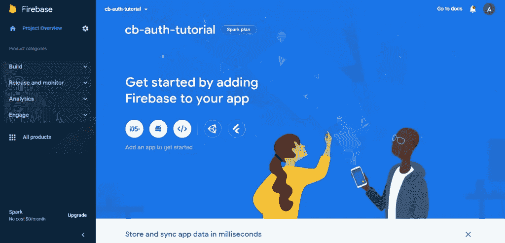

The Firebase dashboard

让我们创建一个 web 应用程序。单击此图标按钮开始:


Click this icon to start creating the web app

您将被要求输入该应用程序的昵称。这也可以是你喜欢的任何东西。为了与项目名称对称，我将我的命名为`CB Auth Tutorial`。


Completing the steps to create the web app

注册应用程序后，将为您提供一个配置，您需要用它来初始化您的应用程序，以便能够访问各种 Firebase APIs 和服务。

从仪表板侧边栏中，单击`Build > Authentication`，然后在显示的屏幕上单击`Get started`以启用 Firebase 身份验证。您将被要求添加初始登录方法。

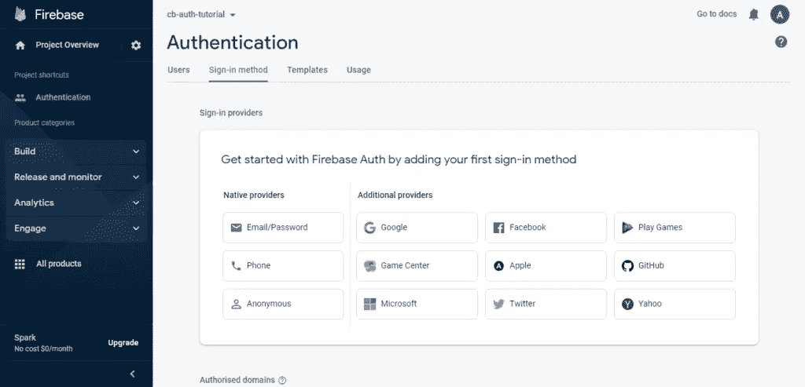

Adding a sign-in method

点击`Email/Password`并打开开关使其启动。

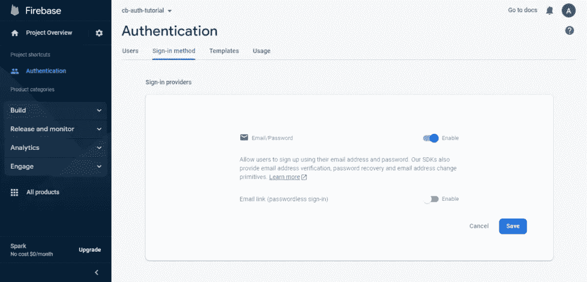

Enabling sign-in with email/password

接下来，我们将设置 Firebase Firestore。

点击侧边栏中的`Build > Firestore Database`，然后点击页面上的`Create database`按钮以启用 Firestore。

您将看到一个对话框，引导您完成创建数据库的步骤。

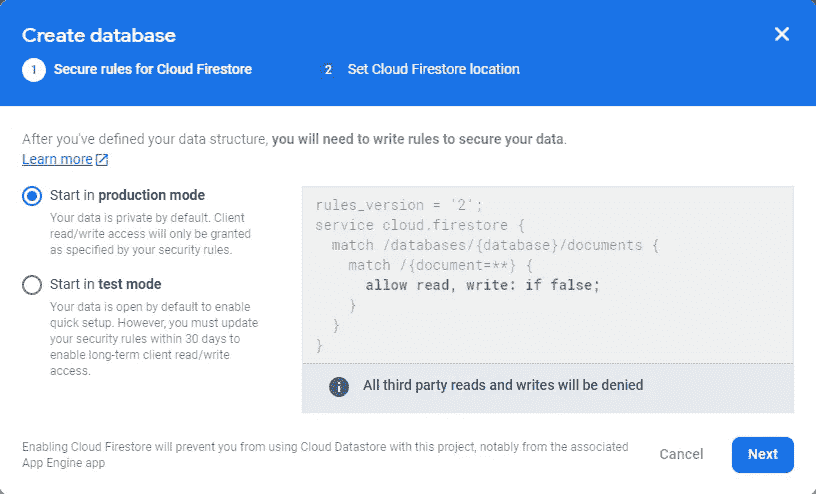

The dialog used to create the Firestore database

我们不会从客户端访问 Firestore，所以我们可以在生产模式下创建数据库。Firebase Admin 在与 Firestore 交互时会忽略安全规则。

接下来，我们需要生成一个服务帐户密钥，这是一个 JSON 文件，其中包含我们用来初始化管理应用程序的信息，以便能够创建将发送给客户端的自定义 web 令牌。遵循 Firebase 文档中的这些说明[来完成此操作。](https://firebase.google.com/docs/admin/setup#initialize-sdk)

让我们用 NPM 安装 Firebase CLI 工具。为此，请在终端中运行以下命令:

```
npm i -g firebase-tools
```

让我们为项目创建一个新文件夹。我将我的命名为`auth-tutorial`,因为它与 Firebase 项目对称，但是你可以随意命名。

使用以下命令初始化项目目录中的 Firebase:

```
firebase init
```

我们将使用 Firebase 函数和 Firebase 模拟器，所以当要求选择您想要为项目目录设置的特性时，请选择这些。

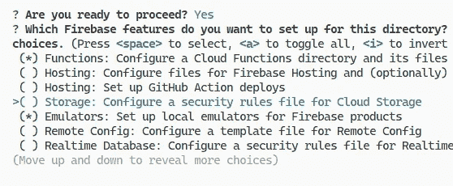

Setting up Firebase features in the project directory

下一个提示是让您将项目目录与 Firebase 项目关联起来。选择`Use an existing project` 并选择您之前创建的项目。

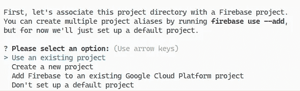

Associating the project directory with a Firebase project

我们将使用普通的 JavaScript 来编写函数，所以当询问您想要使用哪种语言时，请选择普通的 JavaScript。

我们将使用 Firebase 函数模拟器来测试我们的函数，所以当要求设置模拟器时选择它。

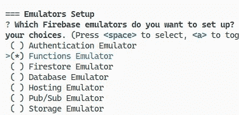

Setting up Firebase emulators

初始化 Firebase 后，项目目录结构应该如下所示:

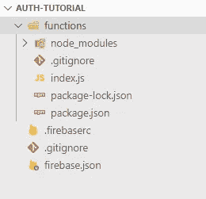

Our project directory structure after initializing Firebase

# 创建 REST API

我们将需要以下 NPM 包来编写我们的函数:

*   `express` : Node.js web 框架加速开发。
*   `cors` : Express 中间件，实现 CORS(跨源资源共享)。
*   `morgan`:用于 Express 的日志中间件。
*   `is-email`:用于服务器端邮件验证。
*   `firebase`:使用 Firebase Web SDK 对用户进行身份验证。

让我们用一个命令安装它们:

```
npm i express cors morgan is-email firebase
```

让我们为`/register`端点编写处理函数。在`functions`目录下创建一个名为`express`的新文件夹，其中包含一个名为`routes`的子文件夹，并使用以下代码在 routes 中创建一个新的`register.js`文件:

**functions/express/routes/register . js**

```
const {
  getAuth,
  createUserWithEmailAndPassword,
} = require('firebase/auth');
const {
  getAuth: getAdminAuth,
} = require('firebase-admin/auth');
const firestore = require('firebase-admin').firestore();async function register(req, res) {
  const { email, password, secureNote } = req.body;
  if (!secureNote) {
    res
      .status(400)
      .json({ error: { code: 'no-secure-note' } });
    return;
  } try {
    const auth = getAuth();
    const credential = await createUserWithEmailAndPassword(
      auth,
      email,
      password
    );
    const adminAuth = getAdminAuth();
    const token = await adminAuth.createCustomToken(
      credential.user.uid
    );
    await firestore
      .doc(`users/${credential.user.uid}`)
      .set({ secureNote });
    res.status(201).json({ token });
  } catch (err) {
    const { code } = err;
    if (code === 'auth/email-already-in-use') {
      res.status(400);
    } else {
      res.status(500);
    }
    res.json({
      error: {
        code: code ? code.replace('auth/', '') : undefined,
      },
    });
  }
}module.exports = register;
```

如果所有验证都成功，新用户的安全注释将保存在 Firestore 数据库中。让我们在一个新的`login.js`文件中创建一个处理向`/login`端点的 POST 请求的函数，该文件也保存在`routes`目录中。

**功能/快递/路线/登陆. js**

```
const {
  getAuth: getClientAuth,
  signInWithEmailAndPassword,
} = require('firebase/auth');
const {
  getAuth: getAdminAuth,
} = require('firebase-admin/auth');async function login(req, res) {
  const { email, password } = req.body;
  try {
    const credential = await signInWithEmailAndPassword(
      getClientAuth(),
      email,
      password
    );
    const token = await getAdminAuth().createCustomToken(
      credential.user.uid
    );
    res.status(200).json({ token });
  } catch (error) {
    if (
      error.code === 'auth/wrong-password' ||
      error.code === 'auth/user-not-found'
    ) {
      res.status(403);
    } else {
      res.status(500);
    }
    res.json({
      error: { code: error.code.replace('auth/', '') },
    });
  }
}module.exports = login;
```

请注意`/login`和`/register`路由处理程序不会对请求中发送的电子邮件或密码执行验证。这是因为我们将创建自定义的 [Express 中间件](https://expressjs.com/en/guide/using-middleware.html)来代替它。在`express`文件夹中创建一个新的`middleware`子文件夹，并在其中创建一个新的`validate-email-and-password.js`文件，包含以下代码:

**功能/快递/中间件/验证电子邮件和密码. js**

```
const isEmail = require('is-email');function validateEmailAndPassword(req, res, next) {
  const { email, password } = req.body; if (!email) {
    res.status(400).send({ error: { code: 'no-email' } });
    return;
  } if (!isEmail(email)) {
    res
      .status(400)
      .send({ error: { code: 'invalid-email' } });
    return;
  } if (!password) {
    res
      .status(400)
      .send({ error: { code: 'no-password' } });
    return;
  } next();
}module.exports = validateEmailAndPassword;
```

在这里，我们检查在请求正文中是否指定了密码和有效的电子邮件。如果是，则请求将被传递给下一个中间件。否则，我们将以错误结束请求。

让我们创建一个允许获取已登录用户的安全注释的端点。我们将在`routes`文件夹中保存的新`get-user.js`文件中执行此操作。

**功能/快递/路线/get-user.js**

```
const firestore = require('firebase-admin').firestore();async function getUser(req, res) {
  const userId = req.params.id;
  if (!userId) {
    res.status(400).json({ error: { code: 'no-user-id' } });
    return;
  } if (userId !== req.token.uid) {
    res
      .status(403)
      .json({ error: { code: 'unauthorized' } });
  } const snapshot = await firestore
    .collection('users')
    .doc(userId)
    .get();
  if (!snapshot.exists) {
    res
      .status(404)
      .json({ error: { code: 'user-not-found' } });
    return;
  }
  const user = snapshot.data(); res.status(200).json({ secureNote: user.secureNote });
}module.exports = getUser;
```

如果未指定使用者，或提出资料要求的使用者不是拥有者，我们就会回应错误。

`req.token.uid`由另一个中间件提供，该中间件在向 API 发出经过身份验证的请求时验证所发送的令牌。让我们在`express/middleware`文件夹中的`firebase-auth.js`文件中创建这个中间件。

**功能/表达/中间件/firebase-auth.js**

```
const { getAuth } = require('firebase-admin/auth');async function firebaseAuth(req, res, next) {
  const regex = /Bearer (.+)/i;
  try {
    const idToken =
      req.headers['authorization'].match(regex)?.[1];
    req.token = await getAuth().verifyIdToken(idToken);
    next();
  } catch (err) {
    res
      .status(401)
      .json({ error: { code: 'unauthenticated' } });
  }
}module.exports = firebaseAuth;
```

我们验证发送的 JSON web 令牌是否为有效令牌，并将其分配给`req.token`属性(如果是)。否则，我们发出`401`错误。

现在是时候将所有这些模块整合到一个 Express 应用程序中了，该应用程序将响应任何对`api`云功能的请求。将`functions`文件夹中的`index.js`文件替换为以下代码:

```
const functions = require('firebase-functions');
const express = require('express');
const admin = require('firebase-admin');
const validateEmailAndPassword = require('./express/middleware/validate-email-and-password');
const firebaseConfig = require('./firebase.config');
const { initializeApp } = require('firebase/app');
const cors = require('cors');
const morgan = require('morgan');
const serviceAccount = require('./service-account-key.json');admin.initializeApp({
  credential: admin.credential.cert(serviceAccount),
});
initializeApp(firebaseConfig);const register = require('./express/routes/register');
const login = require('./express/routes/login');
const firebaseAuth = require('./express/middleware/firebase-auth');
const getUser = require('./express/routes/get-user');const app = express();
app.use(cors());
app.use(morgan('dev'));app.post('/login', validateEmailAndPassword, login);
app.post('/register', validateEmailAndPassword, register);
app.get('/users/:id', firebaseAuth, getUser);exports.api = functions.https.onRequest(app);
```

将运行该文件来启动 Firebase 函数。我们使用了来自`firebase-admin`模块的`initializeApp()`方法来初始化 Firebase Admin SDK，该 SDK 带有您应该在前面创建的服务帐户密钥文件。

我们还使用了来自`firebase/app`模块的`initalizeApp()`方法，用存储在`firebase.config.js`文件中的配置初始化 Firebase Web。当您在 Firebase 控制台中创建 web 应用程序时，已经获得了这个配置。

**functions/firebase . config . js**

```
/**
  Enter the configuration for your Firebase web app
  module.exports = {
  apiKey: ...,
  authDomain: ...,
  projectId: ...,
  storageBucket: ...,
  messagingSenderId: ...,
  appId: ...,
  measurementId: ...
}; */
```

我们现在可以在模拟器中启动 Firebase 函数，方法是在项目目录中运行以下命令。

```
firebase emulators:start --only functions
```

# 测试 API

我们还没有编写客户端代码，但是我们可以用像 [Postman](https://www.postman.com/) 这样的工具测试我们的 API，或者我们可以使用 Firebase 文档中[这里](https://firebase.google.com/docs/functions/unit-testing)描述的方法之一。

这里我们用 Postman 测试`/register`端点:

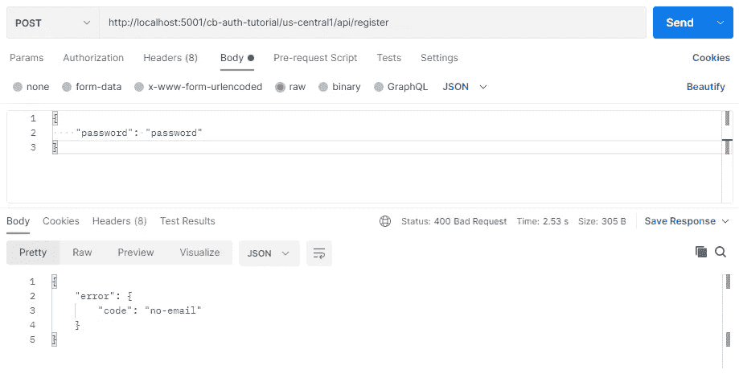

Testing the “/register” endpoint with Postman

# 使用 React 创建客户端应用程序

让我们编写将与 RESTful API 交互的客户端应用程序。使用创建 React 应用程序创建新的 React 应用程序。

```
npx create-react-app client
```

我们将在 React 应用程序中使用以下 NPM 包:

*   Material UI ( `@mui/material`、`@emotion/react`、`@emotion/styled`):为我们的客户端 UI 设计风格，使其更具吸引力。
*   `axios`:向我们创建的 API 发出 HTTP 请求。
*   `react-router-dom`:用于单页 app 路由。
*   `react-hook-form`:用于更容易的反应形式验证。
*   `firebase`:Firebase Web SDK 库。
*   `react-firebase-hooks`:为 Firebase 提供一套可重复使用的 React 挂钩。
*   `is-email`:用于客户端邮件验证。

```
npm install @mui/material @emotion/react @emotion/styled axios react-router-dom react-hook-form firebase react-firebase-hooks is-email
```

为了完成材质 UI 的设置，我们将添加 Roboto 字体，方法是将这个`link`元素放在我们的`client/public/index.html`文件的 head 标签中。

```
<link
  rel="stylesheet"
  href="https://fonts.googleapis.com/css?family=Roboto:300,400,500,700&display=swap"
/>
```

使用以下命令在`client`目录中启动 React:

```
npm start
```

通过在浏览器中打开`localhost:3000`来测试应用是否已启动并运行。您将在您的`client/src/App.js`文件中看到标准 React.js 样板文件的结果。我们稍后将编辑该文件。

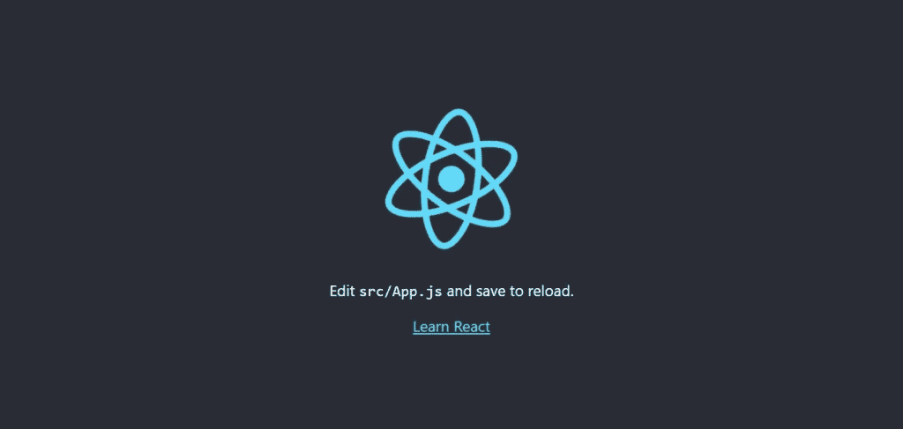

Testing the newly created React app

在模拟器中运行的云函数的 URL 来源与在生产环境中运行的不同。让我们创建一个`.env`文件来指定不同的原点。您需要指定的值将取决于您为 Firebase 项目指定的名称。

**客户/src/。环境**

```
REACT_APP_CF_PROD_=https://us-central1-cb-auth-tutorial.cloudfunctions.net
REACT_APP_CF_DEV=http://localhost:5001/cb-auth-tutorial/us-central1
```

我们还将创建一个`functions-origin.js`模块，它将根据我们当前的节点环境提供正确的原点。

**client/src/functions-origin . js**

```
export const CLOUD_FUNCTIONS_ORIGIN =
  process.env.NODE_ENV === 'development'
    ? process.env.REACT_APP_CF_DEV
    : process.env.REACT_APP_CF_PROD;
```

让我们创建一个模块，负责使用`axios`向我们的 RESTful API 发出 HTTP 请求。在一个`api-service.js`文件中创建这个模块。

下面是该模块的代码:

**client/src/API-service . js**

```
import axios from 'axios';
import { CLOUD_FUNCTIONS_ORIGIN } from './functions-origin';const apiUrl = `${CLOUD_FUNCTIONS_ORIGIN}/api`;export async function signIn({ email, password }) {
  const url = `${apiUrl}/login`;
  const res = await axios.post(url, { email, password });
  return res.data;
}export async function signUp({
  email,
  password,
  secureNote,
}) {
  const url = `${apiUrl}/register`;
  const res = await axios.post(url, {
    email,
    password,
    secureNote,
  });
  return res.data;
}export async function getUserData({ userIdToken, userId }) {
  const url = `${apiUrl}/users/${userId}`;
  const res = await axios.get(url, {
    headers: {
      Authorization: `Bearer ${userIdToken}`,
    },
  });
  return res.data;
}
```

之后，我们需要创建一些实用程序来帮助进行身份验证。用下面的代码创建一个新的`auth.js`文件:

**客户端/src/auth.js**

```
import * as apiService from './api-service';
import { useLocation, Navigate } from 'react-router-dom';
import {
  useEffect,
  createContext,
  useContext,
} from 'react';
import {
  getAuth,
  signInWithCustomToken,
  signOut as firebaseSignOut,
} from 'firebase/auth';
import { useAuthState } from 'react-firebase-hooks/auth';export function RequireAuth({ children }) {
  let auth = useAuth();
  let location = useLocation(); useEffect(() => {}, [auth.loading]); return auth.loading ? undefined : auth.user ? (
    children
  ) : (
    <Navigate
      to="/signin"
      state={{ from: location }}
      replace
    />
  );
}export const AuthContext = createContext(undefined);export function useAuth() {
  return useContext(AuthContext);
}export function AuthProvider({ children }) {
  const auth = getAuth();
  const [user, loading] = useAuthState(auth); const signIn = async ({ email, password }) => {
    const { token } = await apiService.signIn({
      email,
      password,
    });
    await signInWithCustomToken(auth, token);
  }; const signUp = async ({
    email,
    password,
    secureNote,
  }) => {
    const { token } = await apiService.signUp({
      email,
      password,
      secureNote,
    });
    await signInWithCustomToken(getAuth(), token);
  }; const signOut = async () => {
    const auth = getAuth();
    await firebaseSignOut(auth);
  }; const value = { user, loading, signIn, signOut, signUp }; return (
    <AuthContext.Provider value={value}>
      {children}
    </AuthContext.Provider>
  );
}
```

将 route 组件包装在`RequireAuth`组件中可以确保只有经过身份验证的用户才能查看它。如果没有登录，用户将被带到`/signin`路线，然后在成功登录后被重定向回他们试图查看的路线。

`AuthProvider`组件允许其子组件使用 React 上下文及其提供者访问重要的认证相关数据和方法。`useAuth()`钩子将用`useContext()`钩子向子组件提供上下文值。

`signIn()`和`signUp()`方法向 API 发出请求。如果成功，将从`firebase/auth`模块接收令牌并传递给`signInWithCustomToken()`方法，以在浏览器中验证用户。

现在是创建注册页面的时候了。用户通过电子邮件、密码和安全提示注册。我们将在新的`routes`文件夹中的`SignUp.jsx`文件中执行此操作。

**client/src/routes/sign up . jsx**

```
import {
  Box,
  Button,
  LinearProgress,
  TextField,
  Typography,
} from '@mui/material';
import { useState } from 'react';
import { useForm, Controller } from 'react-hook-form';import isEmail from 'is-email';
import { useAuth } from '../auth';
import { useNavigate } from 'react-router-dom';export default function SignUp() {
  const {
    control,
    handleSubmit,
    setError,
    formState: { errors },
  } = useForm();
  const [errorMessage, setErrorMessage] =
    useState(undefined);
  const [isSigningUp, setIsSigningUp] = useState(false);
  const { signUp } = useAuth();
  const navigate = useNavigate(); const onSubmit = async (data) => {
    const { email, password, secureNote } = data;
    setIsSigningUp(true);
    setErrorMessage(undefined);
    try {
      await signUp({ email, password, secureNote });
      navigate('/');
    } catch (error) {
      const res = error.response;
      if (res) {
        const code = res.data?.error?.code;
        if (code === 'email-already-in-use') {
          setError('email', {
            message: 'This email is taken',
          });
          return;
        }
      }
      setErrorMessage("Can't sign up right now");
    } finally {
      setIsSigningUp(false);
    }
  }; return (
    <Box
      sx={{
        height: '100%',
        display: 'flex',
        justifyContent: 'center',
        alignItems: 'center',
      }}
    >
      <form
        onSubmit={handleSubmit(onSubmit)}
        style={{ display: 'flex', flexDirection: 'column' }}
      >
        <Controller
          control={control}
          name="email"
          rules={{
            required: 'Enter an email',
            validate: {
              validateEmail: (email) =>
                isEmail(email) || 'Enter a valid email',
            },
          }}
          render={({ field }) => (
            <TextField
              {...field}
              label="Email"
              helperText={errors?.email?.message}
              error={Boolean(errors.email)}
              type="email"
            />
          )}
        />
        <Controller
          control={control}
          name="password"
          rules={{ required: 'Enter a password' }}
          render={({ field }) => (
            <TextField
              label="Password"
              {...field}
              helperText={errors?.password?.message}
              error={Boolean(errors.password)}
              sx={{ marginTop: 2 }}
              type="password"
            />
          )}
        />
        <Controller
          control={control}
          name="secureNote"
          rules={{ required: 'Enter a secure note' }}
          render={({ field }) => (
            <TextField
              {...field}
              label="Secure note"
              helperText={errors?.secureNote?.message}
              error={Boolean(errors?.secureNote)}
              sx={{ marginTop: 2 }}
            />
          )}
        />
        <LinearProgress
          variant="indeterminate"
          sx={{
            marginTop: 2,
            visibility: isSigningUp ? 'visible' : 'hidden',
          }}
        />
        <Button
          variant="contained"
          type="submit"
          sx={{ marginTop: 2 }}
        >
          Sign up
        </Button>
        <Box sx={{ marginTop: 2, textAlign: 'center' }}>
          <Typography
            sx={{
              visibility: errorMessage
                ? 'visible'
                : 'hidden',
            }}
            color="error"
          >
            {errorMessage}
          </Typography>
        </Box>
      </form>
    </Box>
  );
}
```

我们使用来自`react-hook-form`的`Controller`组件向`react-hook-form`注册材质 UI TextField 组件。我们使用`Controller` `rules`属性设置验证规则，以确保用户输入有效的电子邮件、密码和安全注释。

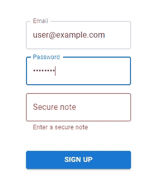

Form validation on the sign-up page

`react-hook-form`确保`onSubmit()`函数仅在满足所有验证规则时被调用。在这个函数中，我们用之前创建的`useAuth()`钩子中的`signUp()`方法注册用户。如果成功，我们把用户带到索引路线(`/`)。否则，我们会显示适当的错误消息。

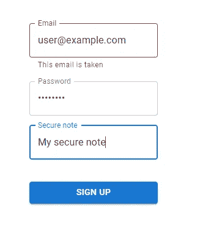

Displaying an error message after receiving an API response

让我们在同一个`routes`文件夹中的`SignIn.jsx`文件中创建登录页面。

**client/src/routes/sign in . jsx**

```
import {
  Box,
  Button,
  LinearProgress,
  TextField,
  Typography,
} from '@mui/material';
import { useState } from 'react';
import { useForm, Controller } from 'react-hook-form';
import isEmail from 'is-email';
import { useNavigate } from 'react-router-dom';
import { useAuth } from '../auth';export default function SignIn() {
  const {
    control,
    handleSubmit,
    setError,
    formState: { errors },
  } = useForm();
  const [errorMessage, setErrorMessage] =
    useState(undefined);
  const navigate = useNavigate();
  const { signIn } = useAuth(); const onSubmit = async (data) => {
    const { email, password } = data;
    setIsSigningIn(true);
    setErrorMessage(undefined);
    try {
      await signIn({ email, password });
      navigate('/');
    } catch (error) {
      const res = error.response;
      if (res) {
        const code = res.data?.error?.code;
        if (code === 'user-not-found') {
          setError('email', {
            message: 'No user has this email',
          });
          return;
        }
        if (code === 'wrong-password') {
          setError('password', {
            message: 'Wrong password',
          });
          return;
        }
      }
      setErrorMessage("Can't sign in right now");
    } finally {
      setIsSigningIn(false);
    }
  }; const [isSigningIn, setIsSigningIn] = useState(false); return (
    <Box
      sx={{
        display: 'flex',
        justifyContent: 'center',
        alignItems: 'center',
        height: '100%',
      }}
    >
      <form
        onSubmit={handleSubmit(onSubmit)}
        style={{
          display: 'flex',
          flexDirection: 'column',
        }}
      >
        <Controller
          control={control}
          name="email"
          rules={{
            required: 'Enter an email',
            validate: {
              validateEmail: (email) =>
                isEmail(email) || 'Enter a valid email',
            },
          }}
          render={({ field }) => (
            <TextField
              label="Email"
              {...field}
              helperText={errors.email?.message}
              error={Boolean(errors.email)}
              type="email"
            />
          )}
        />
        <Controller
          control={control}
          name="password"
          rules={{ required: 'Enter a password' }}
          render={({ field }) => (
            <TextField
              label="Password"
              {...field}
              helperText={errors.password?.message}
              error={Boolean(errors.password)}
              sx={{ marginTop: 2 }}
              type="password"
            />
          )}
        />
        <LinearProgress
          variant="indeterminate"
          sx={{
            visibility: isSigningIn ? 'visible' : 'hidden',
            marginTop: 2,
          }}
        />
        <Button
          variant="contained"
          type="submit"
          sx={{ marginTop: 2 }}
        >
          Sign in
        </Button>
        <Box
          sx={{
            marginTop: 2,
            textAlign: 'center',
          }}
        >
          <Typography
            sx={{
              visibility: errorMessage
                ? 'visible'
                : 'hidden',
            }}
            color="error"
          >
            {errorMessage}
          </Typography>
        </Box>
      </form>
    </Box>
  );
}
```

与在`SignUp`组件中不同，这里我们使用来自`useAuth()`钩子的`signIn()`方法让用户登录。

我们在这里处理的 HTTP 错误与我们在`SignUp`中处理的不同。在`SignUp`中，如果用户试图注册的电子邮件已经被使用，我们会显示一个错误。但是这里我们显示一个不存在的电子邮件或一个错误的密码的错误。

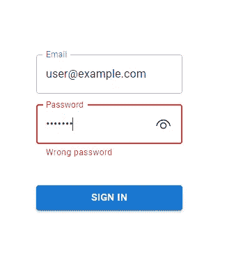

Displaying an error message for a wrong password after receiving an API response

现在让我们创建将为我们的索引路由显示的组件。用以下内容替换`App.js`的内容:

**client/src/App.js**

```
import logo from './logo.svg';
import './App.css';
import { useAuth } from './auth';
import { useEffect, useRef, useState } from 'react';
import { Button, Typography, Box } from '@mui/material';
import { Link } from 'react-router-dom';
import * as apiService from './api-service';function App() {
  const { user, loading } = useAuth();
  const [dataState, setDataState] = useState(undefined);
  const secureNoteRef = useRef(undefined); useEffect(() => {
    (async () => {
      if (!loading) {
        if (user) {
          setDataState('loading');
          const userIdToken = await user.getIdToken();
          try {
            const { secureNote } =
              await apiService.getUserData({
                userIdToken,
                userId: user.uid,
              });
            secureNoteRef.current = secureNote;
            setDataState('success');
          } catch {
            setDataState('error');
          }
        }
      }
    })();
  }, [user, loading]); const child = loading ? (
    <></>
  ) : user ? (
    dataState === 'loading' ? (
      <Typography>Getting your data...</Typography>
    ) : dataState === 'error' ? (
      <Typography>An error occured.</Typography>
    ) : dataState === 'success' ? (
      <div>
        <Typography variant="h6">Secure note</Typography>
        <Typography>{secureNoteRef.current}</Typography>
      </div>
    ) : undefined
  ) : (
    <div>
      <Typography>You're not signed in</Typography>
      <Box
        sx={{
          marginTop: 2,
        }}
      >
        <Button LinkComponent={Link} to="/signin">
          Sign in
        </Button>
        <Button
          LinkComponent={Link}
          to="/signup"
          sx={{ marginLeft: 2 }}
        >
          Sign up
        </Button>
      </Box>
    </div>
  );
  return (
    <div
      style={{
        display: 'flex',
        justifyContent: 'center',
        alignItems: 'center',
        height: '100%',
      }}
    >
      {child}
    </div>
  );
}export default App;
```

如果用户没有通过认证，我们会让他们知道他们没有登录，并包含相关链接。

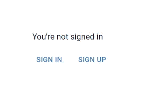

The view displayed to a user that is yet to be authenticated

如果他们已经登录，我们向 API 发出请求以获取安全注释并显示它。

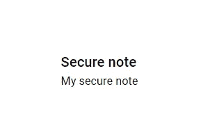

Displaying the private secure note to the user

我们使用了一个`dataState`变量来跟踪 API 请求的当前状态，并基于此向用户显示适当的视图。

我们在发出请求之前将`dataState`设置为`loading`，让用户知道他们的数据正在被检索。

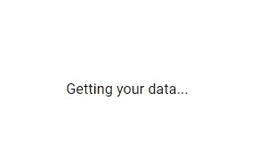

The view displayed when “dataState” is “loading”

如果在此过程中出现错误，我们通过将`dataState`设置为`error`让他们知道:


The view displayed when “dataState” is “error”

最后，让我们初始化 Firebase，并在我们的`index.js`文件中设置路由逻辑。

**client/src/index.js**

```
import React from 'react';
import ReactDOM from 'react-dom/client';
import './index.css';
import App from './App';
import reportWebVitals from './reportWebVitals';
import {
  BrowserRouter,
  Route,
  Routes,
} from 'react-router-dom';
import SignIn from './routes/SignIn';
import { AuthProvider } from './auth';
import { initializeApp } from 'firebase/app';
import firebaseConfig from './firebase.config';
import SignUp from './routes/SignUp';initializeApp(firebaseConfig);const root = ReactDOM.createRoot(
  document.getElementById('root')
);
root.render(
  <React.StrictMode>
    <AuthProvider>
      <BrowserRouter>
        <Routes>
          <Route path="/" element={<App />} />
          <Route path="/signin" element={<SignIn />} />
          <Route path="/signup" element={<SignUp />} />
        </Routes>
      </BrowserRouter>
    </AuthProvider>
  </React.StrictMode>
);reportWebVitals();
```

在您的`src`目录中应该有一个`firebase.config.js`文件，它包含您在 Firebase 控制台中设置 web 应用程序时收到的配置。这与我们在编写 API 时在管理环境中初始化 Web SDK 时使用的配置相同。

**client/src/firebase . config . js**

```
/**
  Enter the configuration for your Firebase web app
  module.exports = {
  apiKey: ...,
  authDomain: ...,
  projectId: ...,
  storageBucket: ...,
  messagingSenderId: ...,
  appId: ...,
  measurementId: ...
}; */
```

该应用程序现在应该功能齐全！

# 结论

在本文中，我们学习了如何使用 Firebase 在 web 应用程序中轻松设置身份验证。我们使用 Node.js 和 Express 框架创建了一个 RESTful API，以处理来自客户端应用程序的请求，该客户端应用程序是使用 React.js 和 Material UI 构建的。

*更新于:*[*【codingbeautydev.com】*](https://cbdev.link/ed7145)

# JavaScript 做的每一件疯狂的事情

一本关于 JavaScript 微妙的警告和鲜为人知的部分的迷人指南。


[**报名**](https://cbdev.link/d3c4eb) 立即免费领取一份。