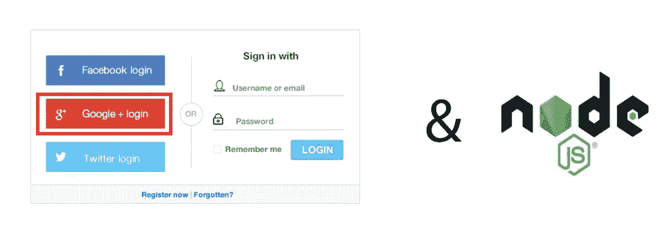
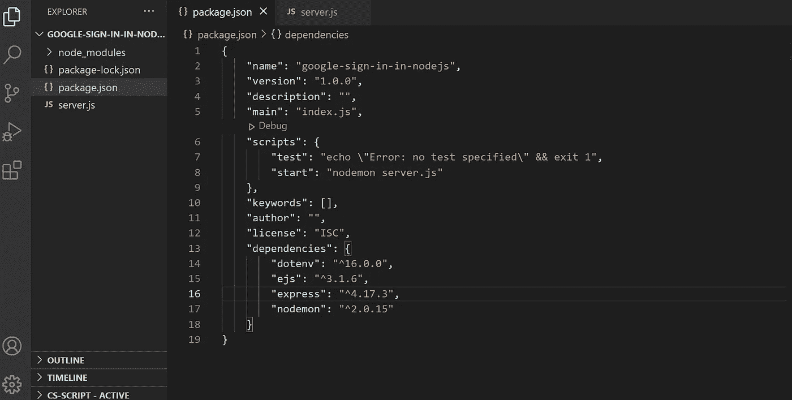
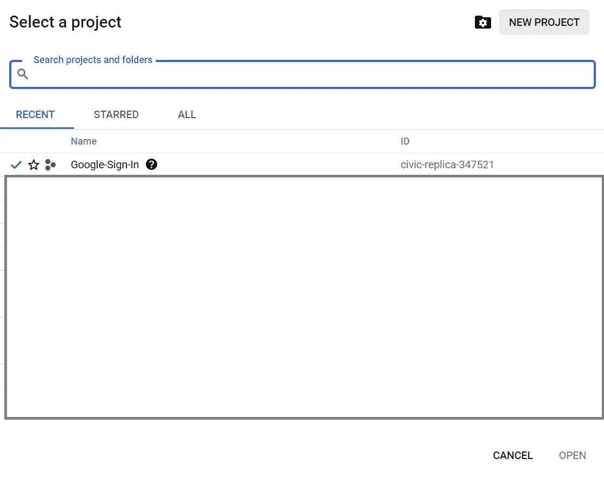
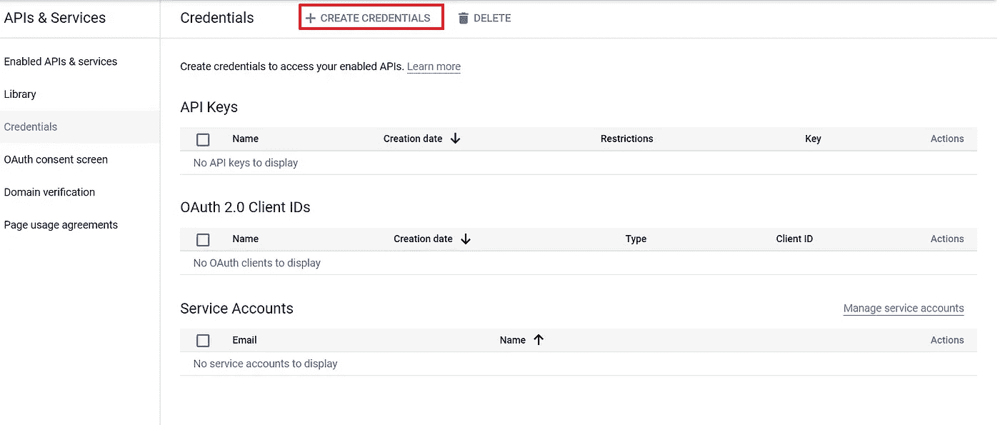
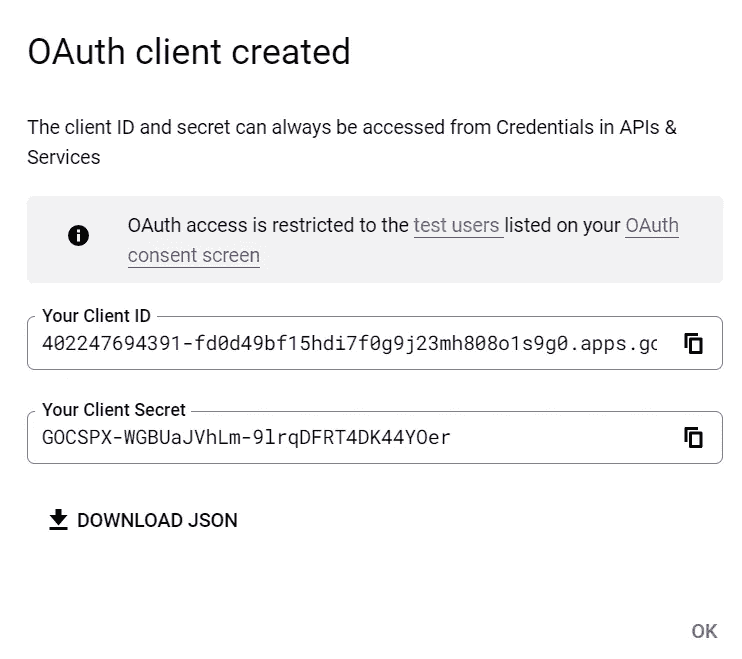
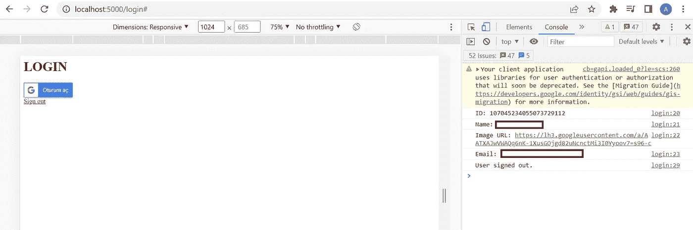

# 如何在 Node.js 中登录 Google

> 原文：<https://javascript.plainenglish.io/authentication-with-google-sign-in-in-node-js-419640f07b56?source=collection_archive---------2----------------------->

## 关于如何登录用 JavaScript 创建的网站的指南。



如果你不想花太多时间设置安全认证，Google Sign-In 正是你需要的。Google 为你自己的应用程序的用户提供了一种安全、有用和简单的方式来共享他们的个人资料信息。

在本文中，我将介绍使用 **JavaScript** 创建的网站使用和登录[和**的方法。**](https://developers.google.com/identity/sign-in/web/sign-in)

我将使用 **VS 代码**作为 **IDE** 并且我假设你对；

*   ***HTML，***
*   ***Express-node . js web******应用*** ，
*   [***【嵌入式 JavaScript(EJS)***](https://ejs.co/)
*   ****RESTful API****

*让我们从初始化一个新的 **Node.js** 项目开始。为此，在刚刚为项目创建的目录中打开命令提示符，并运行:*

```
*npm init -y*
```

*在文件 **package.json** 中，我在脚本范围中添加了这一行:*

```
*“start”: “nodemon server.js”*
```

*我安装依赖项:*

```
*npm install express ejs dotenv nodemon*
```

*安装完相关的包之后， **package.json** 应该是这样的:*

**

*package.json*

*现在我设置了 **REST API** 结构。为此，我创建了文件 **server.js** 并添加了以下代码:*

*我们必须在客户端向用户显示**谷歌按钮**。所以，我们需要 HTML 代码。而现在“ **ejs** ”开始发挥作用。*

***EJS** ( *嵌入式 JavaScript* )允许我们在服务器端项目中使用 **HTML** 。因此，我将文件 **login.ejs** 添加到项目中，并将 **HTML** 基础结构添加到其中。*

*在这个文件中，我在 **head 标签**中添加了三个 **meta 标签**。*

*meta 标签为我们提供了**谷歌认证**。但是在这里，有一些非常重要的东西。我们必须有一个**客户端 ID** 。为此，我们去了 https://console.cloud.google.com。我们创建了一个新项目:*

**

*creating a new Google Cloud project*

*我点击侧边菜单上的相关选项，进入**API&服务**页面。我在 **OAuth 同意屏幕**页面上点击**外部**选项作为**用户类型。**我点击**创建**按钮。然后是**编辑 app 注册**页面。在这里，我必须填写表格来注册该应用程序。*

*注册后，我点击侧面菜单上的**凭证**按钮。在此页面上，我单击下面指定的按钮:*

**

*create credentials button*

*我在接下来的菜单上选择 **OAuth 客户端 ID** 选项。又来了一份菜单。在该菜单中，我选择**网络应用**选项并填写表格。最后，我们可以获得客户端 id:*

**

*client id*

*我们复制客户机 id，并将其粘贴到 **login.ejs** 文件上的相关元标记中。然后，我们将魔法按钮和**登录**和**注销**方法添加到该文件中。现在, **login.ejs** 文件必须看起来像下面这样:*

*现在我必须向 server.js 添加一个中间件方法和 **/login** 路由，以便能够显示 google 按钮:*

*现在，当我们在浏览器上点击链接[**http://localhost:5000/log in**，](http://localhost:5000/login,)时，我们可以看到下面的页面。*

**

*login.ejs*

## *结论*

*在 Node.js 项目中使用 EJS 页面，我们可以用 Google-Authentication-Popup 创建更简单、更安全的网页。*

*你可以通过 [**这个链接**](https://github.com/azizkale/google-signin-nodejs-project) **到达项目。***

*这个题目到此为止。感谢您的阅读。*

**更多内容请看*[***plain English . io***](https://plainenglish.io/)*。报名参加我们的**[***免费周报***](http://newsletter.plainenglish.io/) *。关注我们关于*[***Twitter***](https://twitter.com/inPlainEngHQ)*和*[***LinkedIn***](https://www.linkedin.com/company/inplainenglish/)*。加入我们的* [***社区***](https://discord.gg/GtDtUAvyhW) *。***