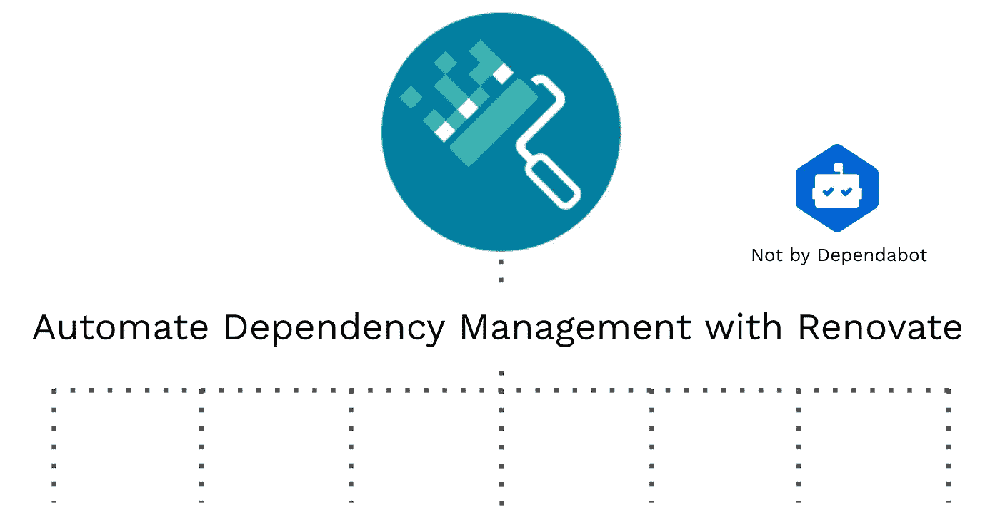
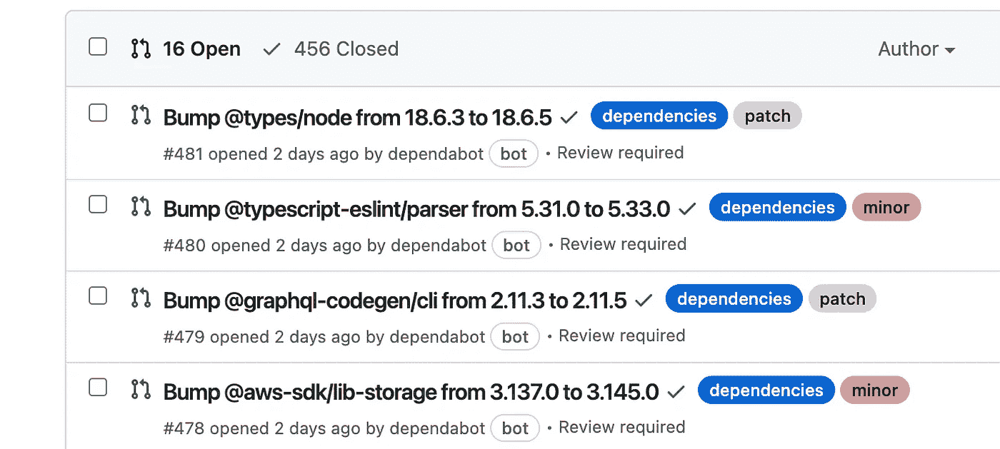
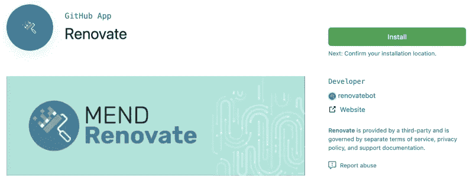
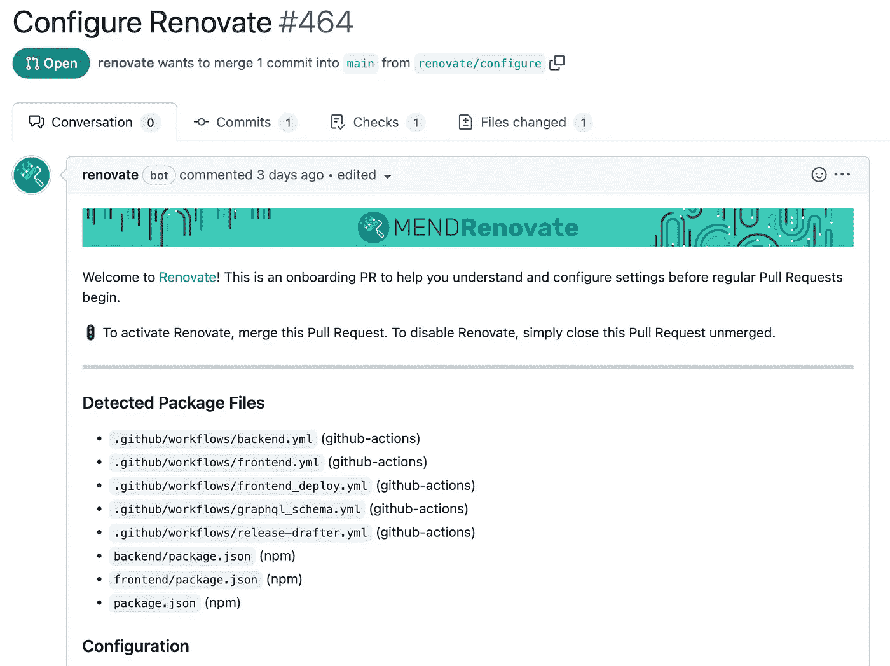
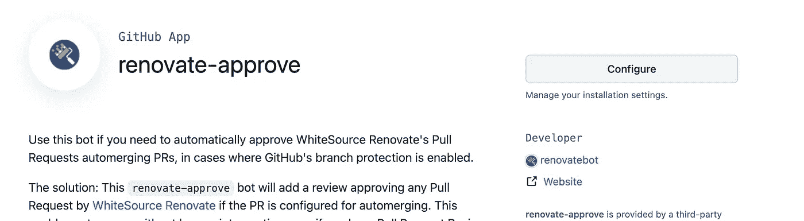

# 使用 renew 而不是 Dependabot 自动更新依赖关系

> 原文：<https://javascript.plainenglish.io/automate-dependency-updates-by-renovate-not-by-dependabot-6efddd549a3e?source=collection_archive---------0----------------------->

## 关于如何用 renew 自动化依赖项更新的指南。



持续的依赖更新是软件开发中最大的主题之一。尽管旧的依赖关系存在安全风险，并且在最坏的情况下您可能得不到支持，但是持续更新非常耗时。

于是就有了一些依赖管理工具，比如[依赖机器人](https://github.com/dependabot)和[翻新](https://docs.renovatebot.com/)。它们自动检测依赖性更新，并通常创建依赖性更新 PRs。

然而，因为即使在一个应用程序中也有许多依赖项，所以您将面临永无止境的更新。所以仅仅使用依赖管理是不够的，你需要更多的自动化！

现在是时候考虑使用 renew 了。renewal 比 Dependabot 更能自动化依赖性管理。所以这篇文章解释道:

*   为什么你应该选择更新作为依赖管理
*   翻新装置
*   更多自动化依赖关系管理的推荐设置

# 依赖性管理工具

正如我所解释的，依赖性管理工具的主要目标是持续的依赖性更新。因此，主要功能是检测相关性更新并创建相关性更新 PRs，如下所示:



PRs created by Dependabot

例如，最流行的工具之一是由 GitHub 官方支持的[依赖机器人](https://github.com/dependabot)。因为它非常容易设置，您将在 10 分钟内获得依赖关系更新 PRs。只需添加如下所示的简单配置:

```
// .github/dependabot.ymlversion: 2
updates:
  - package-ecosystem: 'npm'
    directory: '/'
    schedule:
      interval: 'daily'
```

一旦你引入了依赖机器人，你就会感受到自动化的力量🤖如果你自己检查依赖项更新，就没有时间开发你的应用程序了。

但实际上，依赖机器人产生了一个新问题。因为你会收到许多依赖关系更新 PR，并且你需要审查每一个 PR，所以你会觉得“这仍然很费时间，令人不知所措”。

那么为什么即使有了 Dependabot 还是很费时间呢？主要原因如下:

1.  您必须以相同的方式检查所有相关性，因为相关性更新 PRs 是在每个相关性上创建的。有些需要认真审查，但有些不需要。
2.  您必须不同地检查相关的依赖关系，因为 Dependabot 不关心依赖关系。

因为 Dependeabot 太简单了，所以没有太多的灵活性来解决这些问题。所以现在，翻新出现了。🚀

# 革新

Renovate 也是一个自动创建依赖关系更新 PRs 的依赖关系管理应用程序。但是除此之外，renewal 比 Dependabot 具有更大的灵活性。

例如，renewal 具有自动合并功能。您可以指定相关性，当更新请购单通过测试等状态检查时，它将被合并。

此外，renew 可以批量依赖更新 PRs。这对于需要同时更新的依赖组来说非常好。对于像`@babel`这样的 monorepo 依赖项也是如此。

尽管还有其他令人兴奋的特性，我想你已经感觉到 Renovate 在自动化依赖管理方面有巨大的潜力。

因此，从下一节开始，我将介绍 Renovate 的安装，并分享推荐的设置来自动化依赖关系管理。

# 安装翻新

翻新的设置流程如下所示:

1.  在您的存储库上安装更新应用程序
2.  自动更新创建配置 PR
3.  自定义配置 PR
4.  一旦您合并了一个配置 PR，更新创建依赖关系更新 PR

好了，我们安装翻新 app 吧！请进入 GitHub [翻新 app](https://github.com/apps/renovate) 页面，点击安装。我建议只在选定的存储库上安装它，因为它会在每个存储库上创建安装 PR。



Install Renovate on GitHub

正如我上面所说，安装后的初始设置如下图所示。



Initial setup PR on GitHub

翻新的默认设置如下。很简单。

```
// renovate.json{
  "$schema": "[https://docs.renovatebot.com/renovate-schema.json](https://docs.renovatebot.com/renovate-schema.json)",
  "extends": [
    "config:base"
  ]
}
```

如你所见，它有`extends`选项，选项中有`[config:base](https://docs.renovatebot.com/presets-config/#configbase)`。`config:base`覆盖如下一些默认设置:

```
{   
  "extends": [
     ":dependencyDashboard",
     ":semanticPrefixFixDepsChoreOthers",
     ":ignoreModulesAndTests",
     ":autodetectPinVersions",
     ":prHourlyLimit2",
     ":prConcurrentLimit10",
     "group:monorepos",
     "group:recommended",
     "workarounds:all"
  ]
}
```

`[:dependencyDashboard](https://docs.renovatebot.com/presets-default/#dependencydashboard)`启用作为问题创建的[相关性仪表板](https://docs.renovatebot.com/key-concepts/dashboard/)。它显示了当前相关性更新状态的概述。您也可以检查关闭的依赖项更新。用 Dependabot 是做不到的。

`[:ignoreModulesAndTests](https://docs.renovatebot.com/presets-default/#ignoremodulesandtests)`防止从类似 node_modules 和 vendor 创建更新请购单。

`[:autodetectPinVersions](https://docs.renovatebot.com/presets-default/#autodetectpinversions)`将[范围策略](https://docs.renovatebot.com/configuration-options/#rangestrategy)设置为`auto`。意思是怎么修改版本就看翻新了。

`[:prHourlyLimit2](https://docs.renovatebot.com/presets-default/#prhourlylimit2)`很容易理解。它将一小时内创建的 PRs 更新数量限制为 2 个。虽然这是为了 CI 堆叠，但 2 个 PRs 可能太小了。

`[:prConcurrentLimit10](https://docs.renovatebot.com/presets-default/#prconcurrentlimit10)`任何时候最多限制 10 个 PRs。也许它也太小了。

`[group:monorepos](https://docs.renovatebot.com/presets-group/#groupmonorepos)`是一个超级有用的更新分组预置。它批量更新众所周知的 monorepo 软件包的 PR。

`[group:recommended](https://docs.renovatebot.com/presets-group/#grouprecommended)`与`group:monorepo`非常相似。这是非 monorepo 包的批量预设。

`[workaround:all](https://docs.renovatebot.com/presets-workarounds/#workaroundsall)`是一个针对软件包的错误修复方法。

都是关于 renew 的默认设置。我想你已经了解了翻新的基本知识。

# 编辑初始设置

在继续之前，我建议添加一些配置。

首先，设置[翻新计划](https://docs.renovatebot.com/key-concepts/scheduling/)使翻新在办公时间之外进行。如果在开发过程中更新创建了大量的 pr，那么 CI(持续集成)就很容易被卡住。

```
// renovate.json{
  "$schema": "[https://docs.renovatebot.com/renovate-schema.json](https://docs.renovatebot.com/renovate-schema.json)",
  "extends": [
    "config:base",
    "schedule:daily"   // ADD
  ],
  "timezone": "Japan"  // ADD
}
```

`[schedule:daily](https://docs.renovatebot.com/presets-schedule/#scheduledaily)`是一个预设的更新计划，更新会在凌晨 2 点前创建 PRs。此外，您应该设置`timezone`,因为默认情况下，计划工作在 UTC 时间。

其次，您应该取消创建每小时 PRs 的速率限制和开放 PRs 的数量。也许你认为你的 PRs 页面会被更新的 PRs 填满🤔

其实是真的。但是请不要忘记依赖管理的主要目的。是为了不断升级依赖。如果减贫战略的数量有限，主要目的就无法实现。

如果你感到不知所措，是时候考虑进一步自动化，而不是停止升级。

```
// renovate.json{
  "$schema": "[https://docs.renovatebot.com/renovate-schema.json](https://docs.renovatebot.com/renovate-schema.json)",
  "extends": [
    "config:base",
    "schedule:daily",
    ":disableRateLimiting"  // ADD
  ],
  "timezone": "Japan"
}
```

你可以用`[:disableRateLimiting](https://docs.renovatebot.com/presets-default/#disableratelimiting)`来代替。它取消了创建每小时 PRs 和打开 PRs 数量的速率限制。

# 更多自动化的推荐设置

正如我上面所说的，使用依赖关系管理不足以自动化依赖关系更新，因为会有许多 PRs 需要审查。所以让我们尽可能地自动化它。

# 自动合并

首先，你应该设置[自动合并](https://docs.renovatebot.com/key-concepts/automerge/)。当您审查每个依赖项时，您会注意到有些依赖项需要认真审查，但有些不需要，尤其是开发依赖项。renew auto merge 是一个特性，当状态检查(如测试)通过时，renew 试图合并更新 PR。

作为一个例子，我将展示`@types`、linters 和锁文件变更的自动合并设置。

## @types 的自动合并设置

```
// renovate.json{
  ...
  "packageRules": [
    {
      "matchPackagePrefixes": ["@types/"],
      "automerge": true,
      // If you need
      "major": {
        "automerge": false
      }" 
    }
  ]
}
```

`packageRules` key 是一个很棒的特性，你可以创建自定义规则并使用 regex 指定依赖关系。

所以对于`@types`依赖项，你可以指定`@types/`作为依赖项的前缀，并设置`automerge`为真。如果不想自动合并`@types`的主版本，可以用`major`选项将其排除。

很简单！😀

但是，请记住，如果您需要对每个请购单进行请购单审核，review 不能自动合并更新请购单。在这种情况下，就该用[改审批](https://github.com/apps/renovate-approve)了。通过更新-批准，更新的 PRs 可以自动合并。可以用翻新 app 的方法安装。



renovate-approve

## 棉绒自动融合设置

这个设置几乎与@types 相同。

```
// renovate.json{
  ...
  "packageRules": [
    ...
    {
      "matchDepTypes": ["devDependencies"],
      "matchPackagePatterns": ["lint", "prettier"],
      "automerge": true,
    }
  ]
}
```

因为有一个名为 [package:linters](https://docs.renovatebot.com/presets-packages/#packageslinters) 的 linter 预置，您可以通过扩展它来实现同样的事情。但对我来说，自定义设置比读取预置简单。

## 锁定文件更改的自动合并设置

依赖项更新不仅可以在项目依赖项定义中使用(比如 package.json)，也可以在锁文件中使用(比如 yarn.lock)。可能不像 dependencies 和 devDependencies 那么重要，但是有时候它们也会有安全问题。所以我也建议更新它们。

```
// renovate.json{
  ...
  "packageRules": [
    ...
  ],
  "lockFileMaintenance": {
     "enabled": true,
     "automerge": true
  }
}
```

因为自动合并设置取决于您的依赖项，所以您也可以添加其他设置。实际上，我也使用 automerge 来测试库(比如 Jest)和 GraphQL 代码生成器(比如@graphql-codegen/cli)。

# 包装分组

其次，你要设置[打包](https://docs.renovatebot.com/noise-reduction/#package-grouping)。即使在设置了自动合并之后，您可能仍然有许多 pr。您可能会注意到，您应该使用不同的依赖项更新 PRs 多次查看同一发行说明。monorepo 依赖通常会发生这种情况。

在这种情况下，您可以将它们的更新 PR 组合成一个 PR。比如我用它做 [@sentry/tracing](https://www.npmjs.com/package/@sentry/tracing) 和 [@sentry/react](https://www.npmjs.com/package/@sentry/react) 。由于类型问题，它们需要同时更新，所以我将它们的 PRs 归为一组。

```
// renovate.json{
  "packageRules": [
    ...
    {
      "matchSourceUrlPrefixes": [
        "https://github.com/getsentry/sentry-javascript"
      ],
      "groupName": "sentry-javascript"
    },
  ],
  ...
}
```

我猜你想出了许多类型的分组。但是通常你不必定制包分组，因为初始设置中的`config:base`已经扩展了`[group:monorepos](https://docs.renovatebot.com/presets-group/#groupmonorepos)`和`[group:recommended](https://docs.renovatebot.com/presets-group/#grouprecommended)`。因此，您可以在几个星期后更新安装时设置包分组。

好了🚀没有那么多配置👏请合并配置 PR，您将在存储库中看到更新的 PRs。

最后，一件重要的事情！在合并配置 PR 之后，您可能会注意到仍然有许多 PR。这是因为每个应用程序的依赖关系都非常不同。因此，您应该不断地调整您的配置。

# 技巧

读完这篇文章，做了翻新设置，我猜你会自定义翻新更多。为了进一步定制，我介绍一些小技巧。

首先，`renovate-config-validator`对于本地编辑很有用。如果你想在本地环境中运行，通过 npx 使用它，而不需要在你的应用中安装这个包。

```
$ npx --package renovate -c 'renovate-config-validator'
```

此外，您可以使用[renew-config-validator](https://github.com/marketplace/actions/renovate-config-validator)在 GitHub 操作中检查更新配置。

本文解释了如何使用 renew 自动化依赖项更新。随着革新，我希望你能更喜欢软件工程！

# 参考

*   [翻新](https://docs.renovatebot.com/)
*   [依赖机器人](https://github.com/dependabot)
*   [更新配置验证器](https://github.com/marketplace/actions/renovate-config-validator)

*更多内容看* [***说白了。报名参加我们的***](https://plainenglish.io/) **[***免费周报***](http://newsletter.plainenglish.io/) *。关注我们关于* [***推特***](https://twitter.com/inPlainEngHQ)[***LinkedIn***](https://www.linkedin.com/company/inplainenglish/)*[***YouTube***](https://www.youtube.com/channel/UCtipWUghju290NWcn8jhyAw)*[***不和***](https://discord.gg/GtDtUAvyhW) *。*****