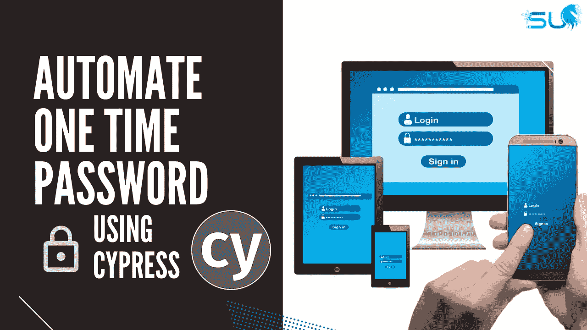

# 使用 Cypress 自动化一次性密码(OTP)

> 原文：<https://javascript.plainenglish.io/automate-one-time-password-otp-using-cypress-fe1436b858da?source=collection_archive---------2----------------------->

## 使用 Cypress 实现 OTP 自动化的教程。

自动化一次性密码(OTP)总是有点挑战性，因为您需要使用第三方服务来发送/接收消息。让我们看看如何使用 Cypress 实现这一点。

# ⚙️属地

*   [Cypress](https://cypress.io/) :浏览器自动化框架(可以用任何其他 JS 浏览器自动化框架替换)
*   [接收短信](https://receive-smss.com/):生成一个临时电话号码，接收短信。注意:这很容易被付费服务所取代，如 Twilio、SMSArc 等。
*   [GitHub](https://github.com/) :测试 OTP 的示例站点

# 在本视频中，我们将逐步介绍如何使用 Cypress 实现 OTP 自动化:

**👩🏻‍💻在这里** **访问源代码** [**。**](https://subscribepage.io/otp-cypress)

**要了解更多关于 Cypress 的知识，请点击这里查看我的免费 Cypress 教程系列**

[https://www.youtube.com/watch?v=krpKuSqQ0XM&list = pl 6 adzyjjd 5 har _ jq1 hwpfuio 49 uybz 9ma](https://www.youtube.com/watch?v=krpKuSqQ0XM&list=PL6AdzyjjD5HAr_Jq1hwpFUIO49uyBZ9ma)

👩🏻‍💻是时候加入 SDET 大学学院来推进你的职业生涯了👇🏻
[加入学院](https://bit.ly/3Vcqv69)

📧订阅我的[邮件列表](https://automationbro.com/mailing-list)以获取更多类似的内容，并成为令人惊叹的免费赠品的一部分。

👍你也可以在这里关注我的内容

*   [推特](https://twitter.com/automationbro)
*   [领英](https://www.linkedin.com/company/automation-bro)

感谢阅读！

*更多内容请看*[***plain English . io***](https://plainenglish.io/)*。报名参加我们的* [***免费周报***](http://newsletter.plainenglish.io/) *。关注我们关于*[***Twitter***](https://twitter.com/inPlainEngHQ)[***LinkedIn***](https://www.linkedin.com/company/inplainenglish/)*[***YouTube***](https://www.youtube.com/channel/UCtipWUghju290NWcn8jhyAw)*[***不和***](https://discord.gg/GtDtUAvyhW) *。对增长黑客感兴趣？检查* [***电路***](https://circuit.ooo/) *。***