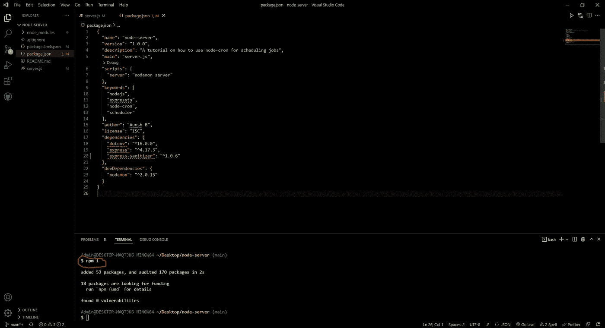
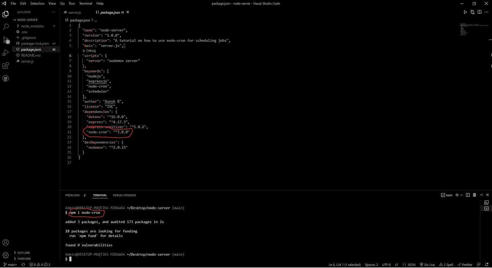
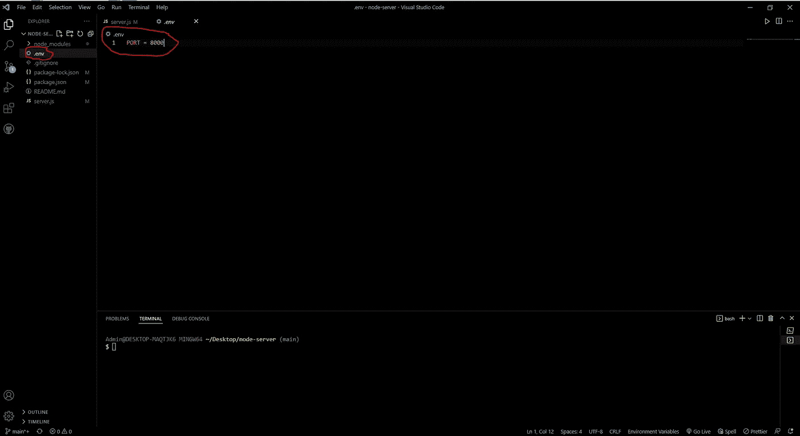
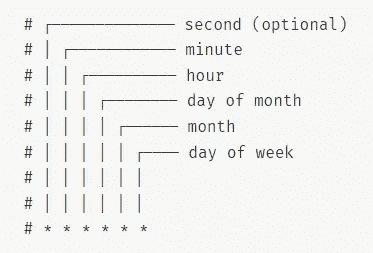
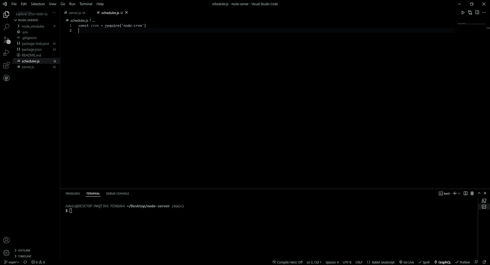
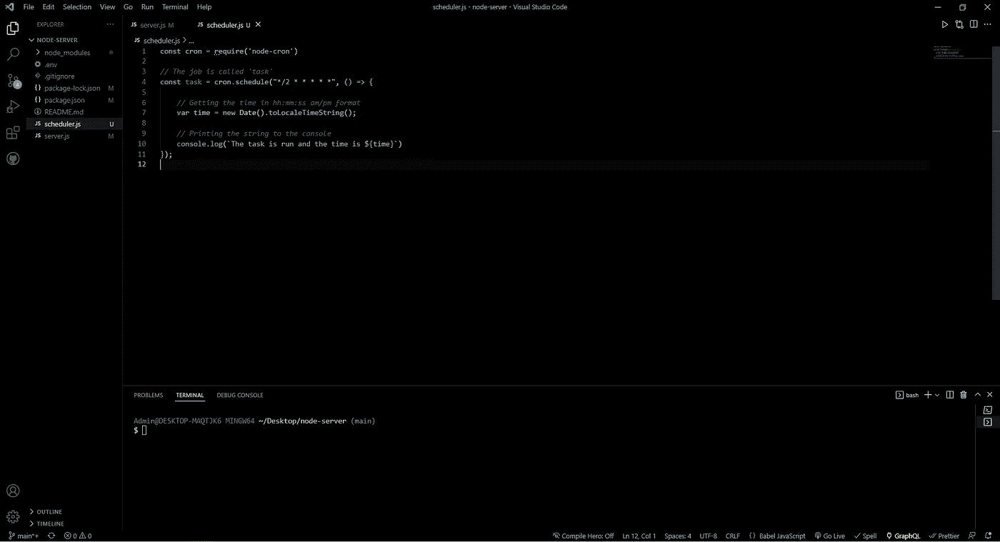
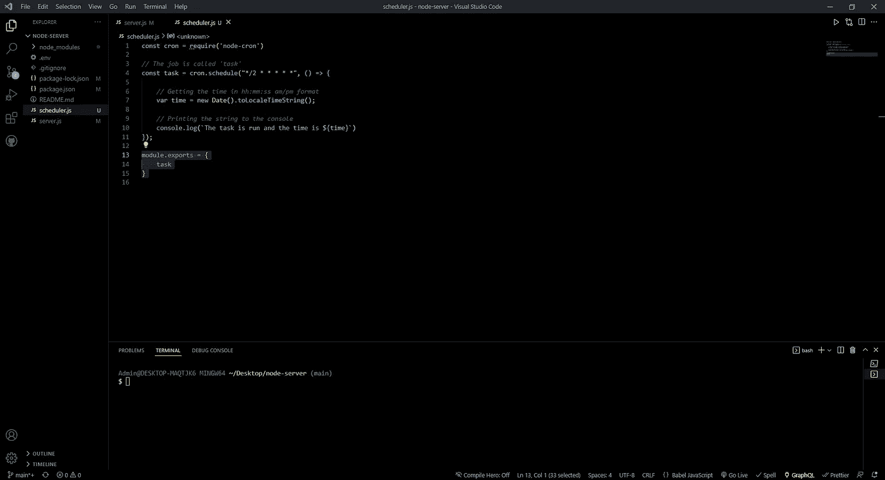
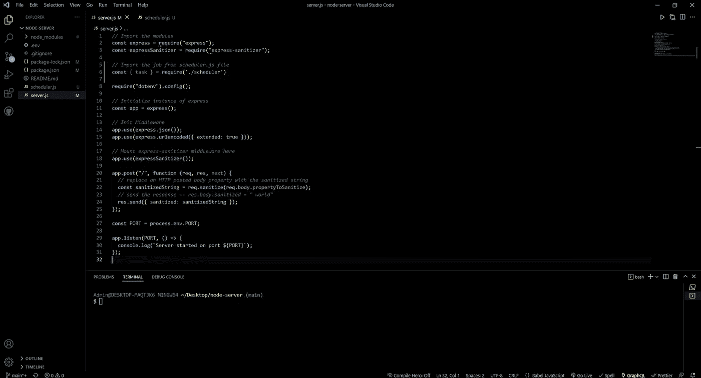
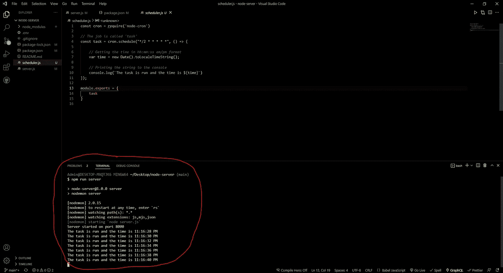

# 使用 node-cron 自动执行节点中的任务

> 原文：<https://javascript.plainenglish.io/automate-tasks-in-node-with-node-cron-fbb276bdaede?source=collection_archive---------10----------------------->

## 探索一种非常简单的方法，用最少的编码技巧自动完成小任务。


Photo by [Lauren Kay](https://unsplash.com/@lakael?utm_source=unsplash&utm_medium=referral&utm_content=creditCopyText) on [Unsplash](https://unsplash.com/s/photos/sleepy?utm_source=unsplash&utm_medium=referral&utm_content=creditCopyText)

# 简介:

你有没有想过，当你有一台机器可以为你做的时候，为什么你需要花很多时间使用网络做一些琐碎的事情？

在本文中，我们将探索一种非常简单的方法，用最少的编码技巧来自动化小任务。

*调度任务的应用:*

1.  Web 解析器和爬虫
2.  自动短信和电子邮件
3.  交易数据分析等等

*要求:初级——初学者*

1.  JS 基础
2.  节点 js 基础
3.  熟悉 npm 和 express js。

如果你从未听说过上面列出的技术，看看这篇 [***文章***](https://aunsh.medium.com/creating-a-server-in-using-node-and-express-1ff36c7fa358) ，它解释了如何使用 express js 在 node 中设置你的第一个服务器。

考虑到这一点，我们开始吧！

# 依赖关系:

克隆 [***本***](https://github.com/aunshx/server-starter-code.git) 回购为首发代码。

克隆完成后，在命令终端输入 *npm i* 下载所有依赖项。



起始代码包括以下软件包:

1.  *express:* 轻松创建 API 的 Web 框架
2.  *dotenv:* 创造环境变量
3.  *快速杀毒器:*对来自请求的条目进行杀毒
4.  *nodemon:* 当代码发生任何变化时，Dev 依赖于自动启动服务器。

为了自动化我们的任务，我们将使用 node-cron NPM 包

要下载 *node-cron* 包，请在命令终端输入 *npm i node-cron* 。下载完成后，检查软件包是否已经安装在 *package.json* 文件中。



创建一个文件"*。env* "来存储我们的环境变量，这些变量将用于保存端口号。*中。env"* 文件保存" PORT = 8000 "。



# 理论:

为了创建健壮的 cron 作业，理解一些相关的理论是有益的。

**什么是 node-cron？**

*   根据文档，node-cron 是 JS 的一个简单的类似 cron 的任务调度器。

**什么是 cron 和任务调度？**

*   cron 是一个标准的 Unix 实用程序，用于调度命令在特定的时间间隔自动执行。这意味着，如果您想要在给定的时间间隔内执行一个脚本或函数，而不需要任何外部命令或激励，我们"*调度*"一个 cron 作业。
*   例如，假设您想使用 *send_message()* 函数每 5 小时向一组人发送一条消息，那么您可以创建一个 cron 作业，以便 *send_message()* 每 5 小时执行一次，并且在没有任何干预的情况下发送消息。
*   由于 node-cron 是一个 npm 包，它模仿了 cron 的功能。因此，它是类似于*的*。

cron 的工作是什么样的？

```
cron.schedule(**'5 * * * *'**, () => {
  console.log('The task is executed');
});
```

*   *突出显示的*星*是 *cron 表达式*，它告诉调度程序何时运行任务，该任务是*回调函数*。*
*   放在*回调函数*中的任何一段代码都会在设定的时间间隔后运行。
*   在这里，我们将在过去一个小时的每 5 分钟后在控制台中看到*“任务已执行”*。

如何安排 cron 作业？

*   为了调度 cron 作业，我们需要使用一个 cron 表达式来指定作业运行的时间间隔。下图中指定了创建表达式的方法:



*   表达式中有 5 颗星，第六颗星是可选的。

***示例 1:*** 创建 cron 表达式每三十分钟运行一次作业

**表情:* ***/30 * * * ****

****示例 2:*** 创建 cron 表达式，每隔三十分钟运行一次作业*

***表情:* **30 * * * *****

*****例 3:*** 创建一个 cron 表达式每秒运行一个作业**

****表情:* * * *** * * ******

**注意:这里我们用的是 6 颗星而不是 5 颗。**

*****例 4:*** 创建 cron 表达式每天凌晨 1:00 运行作业**

****表情:* 0 1 * * ****

***示例 5:* 创建 cron 表达式以在每天下午 1:00 运行作业**

****表情:* * 13 * * ****

## **创建 cron 表达式:**

**考虑到这一点，让我们编写一个 cron 表达式，每 2 秒钟运行一次。**

***表情:* ***/2 * * * * *****

# **计划 cron 作业:**

**在 VS 代码中，新建一个名为" *schedulers.js"* 的文件，导入 *node-cron* 模块*。***

****

**使用我们导入的 cron 对象创建一个任务。在此任务中，我们将向控制台打印“此任务已运行，时间是 hh:mm:ss am/pm”。**

**使用 javascript 中的*日期*对象，我们将使用*。toLocaleString()* 方法以 hh:mm:ss 格式获取当前时间。这只是为了查看我们的作业是否如 cron 表达式中给出的那样每两秒钟运行一次。**

**这就是我们的“ *scheduler.js* ”文件的样子。**

****

**现在，我们将作业导出到我们的主文件中，即 *server.js* 文件。**

***scheduler.js* 文件最终将如下所示:**

****

**在 *server.js* 文件中，从 *scheduler.js* 文件中导入*任务*作业**

**我们最终的 *server.js* 文件将如下所示:**

****

# **启动服务器:**

**在命令终端输入 *npm run server* 启动我们的服务器。如果服务器正在运行，你会在控制台中看到*“服务器在端口 8000 上启动”*。**

**此外，由于作业被安排为每 2 秒运行一次，因此每 2 秒后，您会在控制台中看到“*任务正在运行，时间是 hh:mm:ss am/pm”*。**

****

**正如我们在上面的图像中看到的，从 11:16:28PM 开始，每两秒钟就有一个控制台条目，并且每两秒钟递增一次，这就是我们设计调度程序的目的。**

**这样，我们就创建了第一个功能强大的作业调度程序！**

# **结论:**

**在本文中，我们创建了一个作业调度器来执行自动化任务。**

**不是每 2 秒记录一个字符串，你可以创建一个任务来访问一个 API，在给定的时间间隔内从网上获取信息或者给你的朋友发送消息。**

***干杯！***

**来源:**

1.  **[node-cron](https://www.npmjs.com/package/node-cron)**

***更多内容请看*[***plain English . io***](https://plainenglish.io/)*。报名参加我们的**[***免费周报***](http://newsletter.plainenglish.io/) *。关注我们关于* [***推特***](https://twitter.com/inPlainEngHQ) ， [***领英***](https://www.linkedin.com/company/inplainenglish/) *，*[***YouTube***](https://www.youtube.com/channel/UCtipWUghju290NWcn8jhyAw)*，以及* [***不和***](https://discord.gg/GtDtUAvyhW) *。对增长黑客感兴趣？检查* [***电路***](https://circuit.ooo/) *。****