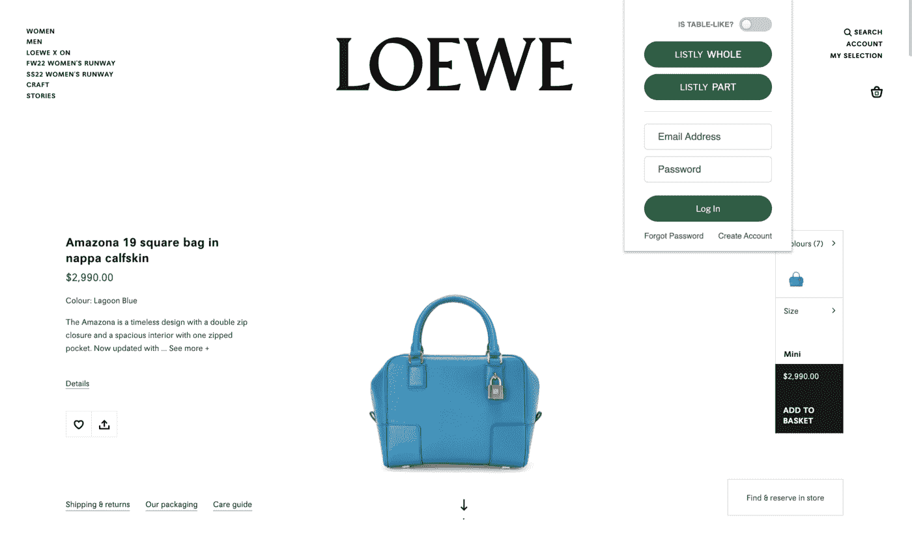
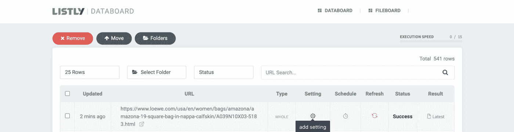
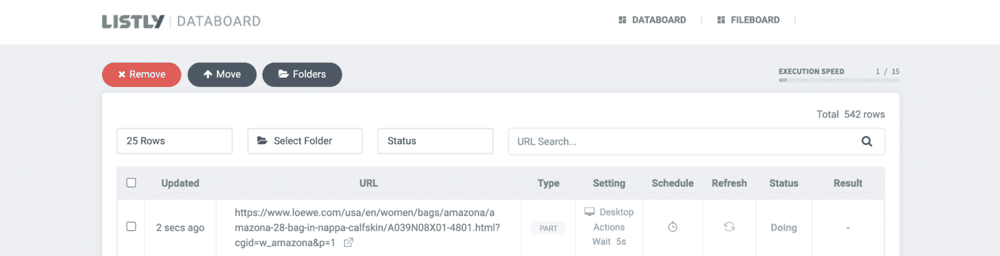

# 使用易于使用的浏览器扩展自动抓取网页

> 原文：<https://javascript.plainenglish.io/automate-web-scraping-with-an-easy-to-use-browser-extension-cb6073f1e61d?source=collection_archive---------13----------------------->

## 如何使用 Listly，一个初学者友好的无代码工具，轻松实现 web 抓取过程的自动化。


Photo by Pixabay: [https://www.pexels.com/photo/tuned-on-gray-laptop-computer-163097/](https://www.pexels.com/photo/tuned-on-gray-laptop-computer-163097/)

为您的项目收集数据可能是一项乏味的任务，会占用您一天中的很长时间，但总有更好的方式来完成它——网络搜集。对于那些不熟悉网络抓取的人来说，它也被称为[数据抓取](https://en.wikipedia.org/wiki/Data_scraping)，从网站中提取数据。

但是，如果你曾经试图从网站上搜集数据，你可能知道有几件事可能会完全出错。该网站可能会阻止您的 IP 地址或完全改变其结构。而这一切都可能毫无征兆地发生。

随着令人惊叹的无代码网络抓取工具的兴起，你绝对应该选择 Listly 这样的网络抓取工具。

Listly 是一个易于使用的无代码网络抓取工具，具有非常实惠的定价模式。(也就是说，任何人都可以免费使用 Listly！)

这是一个网页抓取 Chrome 浏览器扩展，你可以设置它来自动收集数据。这项服务是基于点击和刮擦，所以它非常适合编程初学者。

你只需要你想从中提取数据的网页(你可以控制网页的哪个部分)和安装的 Listly 扩展。这个过程是完全自动化的，你可以很快得到 Excel 表格或谷歌电子表格的结果。

本演练将帮助您使用 Listly 的动作脚本服务自动完成数据搜集过程。

## 第一步:点击列表整体抓取网站

点击**列表整体**，抓取图像信息，如下图所示。



Adapted from Loewe. Source: Loewe.

点击按钮后，Listly 将带您进入结果页面，显示从网站中提取的信息。嗯……这并不常见，但是一些网站把他们的信息完全隐藏起来，这样就没人能刮到了，就像这个案例一样。


别担心！根据请求，Listly 为那些陷入网络抓取的人提供**动作脚本**服务。

## 步骤 2:将动作脚本复制并粘贴到设置中

转到您的**数据板**并点击**设置**图标。



将动作脚本复制到下面——它的设计是为了刮掉 Loewe 网站，这是一家专门经营皮具和服装的西班牙奢侈时装公司——并将其粘贴到**动作脚本**部分——就这样！

```
listly_action_end = false;let sleep = (t) => { return new Promise(resolve=>setTimeout(resolve,t)); }async function custom_action() {// CUSTOM_ACTION — START// Replace the Thumbnail Blob src with link srcthumbnail_elements = document.querySelectorAll(“#js-image-container > div.swiper-container.js-pdp-images-swiper > div.swiper-wrapper > div > picture”);for (let te of thumbnail_elements) {img_element = te.querySelector(“img”);link_element = te.querySelector(“link”);if (img_element == null || link_element == null) {break} else {img_element.src = link_element.href;}await sleep(200);}// CUSTOM_ACTION — END}async function process() {console.log(“process function started”);await custom_action();console.log(“process function finished”);listly_action_end = true;}process();
```


## 第三步:点击刷新，重新抓取网站

保存更改后，点击**刷新**图标，重新进行抓取。


然后，你的状态会变成**在做**。如果您想查看状态更新，请刷新浏览器。



一旦你的网页抓取完成，点击右边的**最新**按钮。


现在，你会看到所有从网站上刮下来的图片信息。有了 Listly，没有什么是不可能的。


更多详情，查看 [**Listly 的博客**](https://bit.ly/3KtJ6px) ！

## 进一步阅读

[](/top-5-instant-data-scraping-tools-for-easy-web-scraping-2f3d1c4b07f0) [## 轻松抓取网页的五大即时数据抓取工具

### 光明数据，ParseHub，Apify，Octopase，Mozenda。有大量的即时网页抓取工具可供选择。如何挑选…

javascript.plainenglish.io](/top-5-instant-data-scraping-tools-for-easy-web-scraping-2f3d1c4b07f0) [](/overcoming-3-major-web-scraping-challenges-that-developers-face-1e664ffe4783) [## 克服开发者面临的 3 大网络抓取挑战

### 如何克服 3 个主要的网络抓取限制—动态网站、网站交互和指纹管理…

javascript.plainenglish.io](/overcoming-3-major-web-scraping-challenges-that-developers-face-1e664ffe4783) 

*更多内容看* [***说白了就是***](https://plainenglish.io/) *。报名参加我们的* [***免费周报***](http://newsletter.plainenglish.io/) *。关注我们关于* [***推特***](https://twitter.com/inPlainEngHQ) ， [***领英***](https://www.linkedin.com/company/inplainenglish/) *，*[***YouTube***](https://www.youtube.com/channel/UCtipWUghju290NWcn8jhyAw)*，以及* [***不和***](https://discord.gg/GtDtUAvyhW) *。*