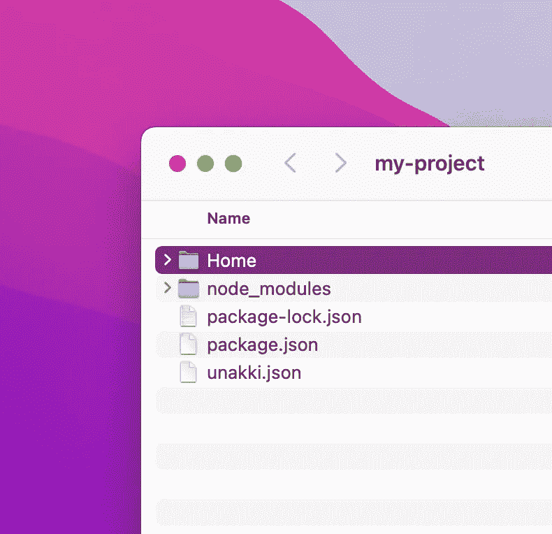
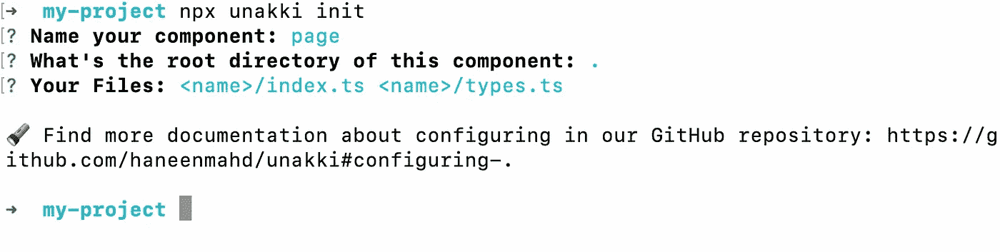
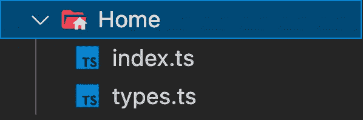
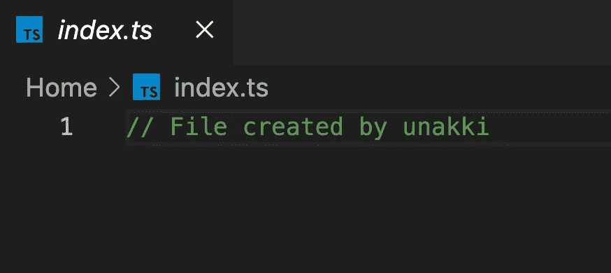

# 使用 Unakki 自动创建 Node.js 项目的文件

> 原文：<https://javascript.plainenglish.io/automate-your-node-js-projects-file-creation-with-unakki-f167331144c2?source=collection_archive---------15----------------------->

## 使用 unakki 来组织您的项目，并在每次需要创建新组件时自动创建不同的文件。



Project files

一遍又一遍的创建同一种文件，太无聊了。例如，在 React 应用程序中创建另一个组件。有时你也可能会搞砸，因为当你创建或做其他事情时，一些文件可能会丢失。

这里有一个简单的🥳工具！

我创建了 **unakki** ，这样开发者可以组织他们的项目，并在每次需要创建新组件时自动创建不同的文件。它不仅可以帮助他们创建不同的文件，还可以在文件中分配默认内容！这将帮助开发人员在他们的项目中建立一致的文件夹和文件结构。

让我们不要浪费任何时间，直接投入使用吧！

首先，创建一个文件夹并初始化 Node.js 项目，安装 **unakki。**

```
mkdir my-project && cd my-project
npm init
npm install -D unakki
```

现在，您已经设置好了一切🙌！

继续运行这个命令，用 **unakki** 初始化你的项目！

```
npx unakki init
```

它会问你一些问题:



Initialise project

首先，它询问一个组件的名字:你可以给它起任何名字，这将在以后被用来创建组件。

**您的组件**的根目录:创建的文件将存储在此。

**您的文件**:应该创建的文件，多个文件可以用一个空格写。 **<名称>** 表示传递到 CLI 中的自定义名称参数，它可以帮助您每次创建不同的组件。

现在它已经在项目的根目录下创建了一个配置文件 **unakki.json** 。所以，你们都可以走了！如果您将来需要添加一些文件和一个新的对象到包含这些信息的配置文件中。

现在，让我们立即创建一些文件⚡️！

在终端中运行以下命令:

```
unakki dev create page Home
```

忠太🎊，现在您可以看到两个新文件:



Folder view



File view

如果你正在做大量的工作，或者甚至是一些小项目，这会节省你很多时间！

让我们看看如何将默认值添加到文件中:

```
"files": {{ "name": "<name>/index.ts", "defaultValue": "export * from './types';" },{ "name": "<name>/types.ts", "defaultValue": "export interface Type {};" }}
```

用文件名添加一个 **defaultValue** 属性将会用您添加的值替换默认注释。

了解更多关于**una kki**这里！别忘了扔颗星星给⭐️！

希望你今天学到了更多的东西！

支持我的工作: [Paypal](https://www.paypal.com/paypalme/haneenmahdin) 💰

如果你想了解我更多，这是我的[链接树](https://linktr.ee/haneenmahdin)🌲。

感谢你阅读❤️！

*更多内容请看*[***plain English . io***](https://plainenglish.io/)*。报名参加我们的* [***免费周报***](http://newsletter.plainenglish.io/) *。关注我们关于*[***Twitter***](https://twitter.com/inPlainEngHQ)*和*[***LinkedIn***](https://www.linkedin.com/company/inplainenglish/)*。查看我们的* [***社区不和谐***](https://discord.gg/GtDtUAvyhW) *加入我们的* [***人才集体***](https://inplainenglish.pallet.com/talent/welcome) *。*