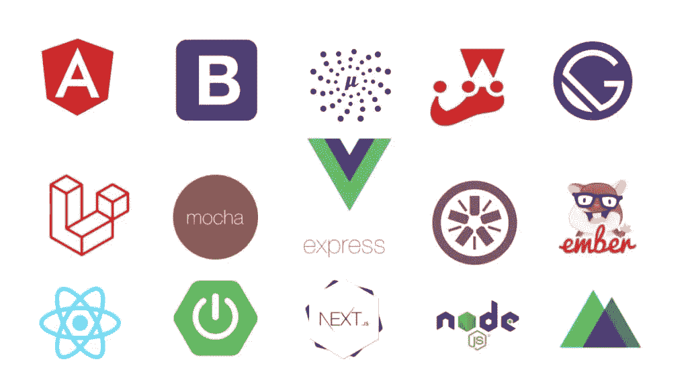
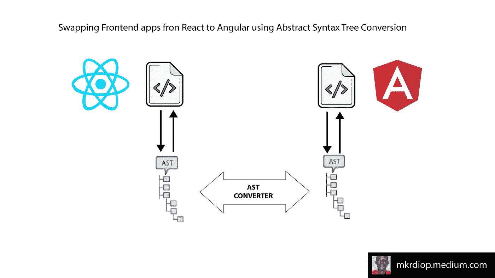

# 一个 JavaScript 前端框架代码到另一个的自动翻译

> 原文：<https://javascript.plainenglish.io/automatic-translation-of-one-javascript-frontend-framework-code-to-another-862e1c050f61?source=collection_archive---------18----------------------->

开发人员生产力和用户体验效率是我们应该用来判断框架的两个竞争优势。有些让开发人员更有效率，但是在用户体验方面结果如何呢？有些很难实现，效率也不高，但是从用户体验的角度来看，它们可能更有效率。

让我们回想一下，我的观点是，用户体验比软件工程团队或像我这样孤独的软件工程师的生产力更有分量和优先权。但我的产品管理和设计技能本能地大声说出认知，告诉我为什么我没有说产品经理和设计师，而不是软件工程师——因为我用这些词告诉你的也是关于处理 web 应用程序的技术产品的设计和管理，它们的开发，生产力和性能测试以及基准测试，不仅用于技术决策，还用于向最终用户提供更好的体验。

技术人员基于科学、知识和数据做出决策。那么 ***为什么在没有明确的性能和用户体验数据的情况下就决定选择一个框架*** 和 ***为什么不使用所有可用的框架来构建我们的解决方案，并根据用户的环境为每个用户提供最高效的解决方案呢？***

我在这里向你们解释的这个创业项目就是关于这个的，并且与这个关于第三方技术工程的项目有关。告诉你这些让我想起了我试图取悦中等算法的时候。我在测试 medium 这个词的使用和出现，以及在我与你分享的文章中链接到 Medium 上发表的文章，是否能帮助更多像你一样的人阅读我的文章。但请相信我，在我决定投身于 Medium 之前，我对 Medium engineering way 非常感兴趣，Medium 是一个出版平台，它实际上是连接我和你的纽带。我决定去获取数据，看看我所做的关于使用“媒介”一词并链接到“媒介”的假设是否在像我这样的作家的文章表现中发挥作用。这可能会被视为跑题，但它仍然是关于衡量绩效以做出更好的决策。

我希望我会很感激，因为这种分析可以对现在生产中的每个 web 应用程序进行，并且可以通过有针对性的和仔细的专家评论来完成，这些专家评论是关于这些 web 应用程序与它们当前的前端框架的性能如何，它们与其他给定的技术框架和堆栈的性能如何，它们可以通过使用一组而不是一个获得什么。

正如类似于[**grey io heart Experiment**](https://mkrdiop.medium.com/list/greyio-heart-experiment-6676cc9f1f96)、 [**Words 和 Metric**](https://mkrdiop.medium.com/list/words-metrics-0f50785757d8) **、**这样的发布实验一样，这类文章也可以是关于 web 应用程序性能的发布实验，同时构建这个[下一代前端框架](/javascript-frontend-speed-is-the-next-big-thing-4caef920e441)及其工具和管理系统，以及这个[下一代编译器](https://medium.com/nerd-for-tech/next-generation-compilers-1346af6cdc51)及其[基础设施](https://medium.com/codex/compilation-operating-system-f464bcf8f25a)和 saas 平台。

每当我管理的另外两个项目中有一个项目积压了新的东西并取得成功时，我总是满怀希望地为另一家仅提供邮件的出版初创公司 Book Dojo 找到有趣的工作，这家公司出版数据驱动的书籍，并为图书爱好者和图书社区运营图书驱动的平台。但是，我在这里与你们分享的一切都是因为为运行 Book Dojo 并使它成为一个成功的初创公司所做的努力。

颠覆性不同于创造性，但创造性也可能导致颠覆性，而且经常如此，因为它有能力创造新的、更大的、更好的、更好的东西，而不破坏任何东西，只是扩大现有的东西，使之更容易、更好。当这种力量应用于某些事物时，它可能看起来令人不安，但它这样做只是因为它是新事物，而且通常它可以与旧事物相提并论。

在过去的几天里，Book Dojo 似乎被降到了次要的位置，更多的技术工作要做，而不是编写简单的数据驱动的文章。其中一项需要完成的技术性工作是关于 JS 前端源代码从框架 A(如 React)到框架 B(如 Svelte、Vue.js、Ember.js、Angular 等)转换的自动化。围绕 JS 前端源代码要做的这项工作的最简单的表示在上面的段落中已经解释过了，第一步是处理要翻译成另一个源代码的抽象语法树。

**使用生成的 AST 进行代码转换**

我们能够从一个 JS 前端框架源代码转移到另一个的解决方案之一是处理每个 JS 前端框架产生的抽象语法树，并构建一个转换器，能够将每个给定的 AST 转换为另一个目标 AST 格式。之后，我们将很容易把输出的 AST 转换成目标 JS 前端框架的语法。

为了构建这个 AST 转换器，我们可以直接使用 Babel 或者使用每个框架可用的一些模块。例如，对于 react，我们可以使用 react AST 生产者和 [Jam](https://medium.com/u/1c68c61c2100?source=post_page-----862e1c050f61--------------------------------) 的这篇[文章](https://medium.com/@codejamninja/render-abstract-syntax-trees-with-react-e35f1882b4c0)来清楚地解释如何用 React 生成抽象语法树。对我来说，这听起来似乎很难，但对于像你这样的软件工程师来说，这是一个简单的系统，如果你使用像[Jam](https://medium.com/u/1c68c61c2100?source=post_page-----862e1c050f61--------------------------------)这样的人已经生产的资源，你就可以快速开发出来，因为开发软件是艺术，艺术也是关于利用别人已经建立的东西来使它们变得更好或生产新的东西。

处理 AST 并不是唯一要做的工作，利用人工智能的力量来提高开发效率也是一条实际上正在探索的道路，这里是我认为人工智能可以如何帮助构建 JS 前端框架源代码翻译工具的项目。我如何使用人工智能将很快在人工智能上用简单的英语详细说明。

聪明的软件工程师、开发人员和程序员应该始终考虑人工智能如何帮助他们简化他们正在从事的项目的开发。在我这个处理 JavaScript 框架的技术栈项目中，我考虑了人工智能如何帮助我走得更快。

这个项目主要是关于编译和语言处理，然后我认为人工智能自然语言处理工具几乎成熟，在寻找文本和源代码之间的相似性方面很有效，希望不只是简单的文本，而是结构化的文本。

使用语言的结构模式和一些源代码作为机器学习系统的特征，我们可以输出并生成一个代码转换器，它将成为我们的 JS 框架源代码翻译器。希望也有很多合格的、有经验的、积极的、热情的、快乐的软件工程师、开发人员、程序员和编码人员已经使用所有可用的 JS 框架编写了许多应用程序，如果没有这些代码源，我们的 AI 系统将永远不会足够聪明，仅仅依靠我糟糕的编程技能。那么所有这些源代码就构成了一个大数据源，就是我们 AI 软件开发助手的输入。

*更多内容请看*[***plain English . io***](http://plainenglish.io/)*。报名参加我们的* [***免费周报***](http://newsletter.plainenglish.io/) *。在我们的* [***社区***](https://discord.gg/GtDtUAvyhW) *获得独家获得写作机会和建议。*