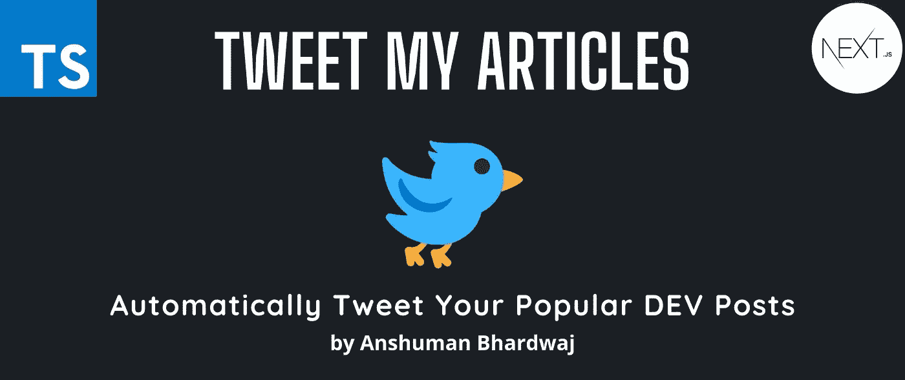
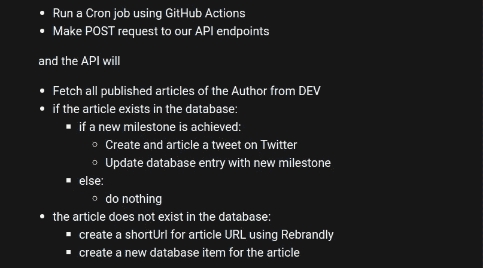

# 从 DEV 自动发布热门文章

> 原文：<https://javascript.plainenglish.io/automatically-tweet-popular-articles-from-dev-46da29c7a20c?source=collection_archive---------28----------------------->

## 开源工具，自动发布你的热门文章



Tweet my articles

大家好，上周我已经建立了这个项目，它将自动从开发我的热门帖子。它在 [Tweet 我的文章](https://tma.theanshuman.dev)上直播，你也可以从 [GitHub](https://github.com/Anshuman71/tweet-my-articles) 上转发。

# 发我的文章

这是一个开源工具，用于自动将著名的 DEV 帖子发布到作者的 Twitter 帐户。

# 动机

我是 DEV 的技术博客作者。最近，我的帖子在平台上获得了很多牵引，对我来说，这是值得与世界分享的新闻。所以，我开始在推特上发布里程碑事件，比如 1000 次浏览等等。

开始时，这很好，但是有一天 Daily.dev [@dailydevtips1](https://dev.to/dailydevtips1) 在这条推文中给我加了标签。

DailyDev tagged Anshuman

这让我想到“如果他们能自动化，我也能”。

我的朋友们就是这样开始启动这个项目的。

# 技术问题陈述

当关于 DEV 的文章 X 跨越预定义的里程碑时，我们希望发送一条 tweet。

# 故障



Breakdown of technical flow

# 技术堆栈

这个项目是一个爱好项目，为一个非营利组织。这里使用的所有工具都是免费和公开的。

1.  **Next.js** :这个项目是使用 Next.js 引导的。
2.  GitHub :用于源代码管理和使用 GitHub 动作运行 cron 作业。
3.  **Vercel** :作为平台。我们使用他们的“无服务器和边缘功能”。
4.  **MongoDB Atlas** :用作数据库提供者来保存每篇文章的里程碑信息。
5.  **更名**:作为链接缩短服务

# 我如何使用这个项目？

## 第一步

从 [GitHub](https://github.com/Anshuman71/tweet-my-articles) 中派生这个项目

## 第二步

在上创建帐户

*   韦尔塞尔
*   Twitter 开发者
*   阿特拉斯
*   重新划分

## 第三步

从每个平台设置并获取以下凭据

**开发**

```
DEV_USERNAME=<xxxxxxxxxxxxxxxxxx>
DEV_API_URL=<xxxxxxxxxxxxxxxxxx>
DEV_API_KEY=<xxxxxxxxxxxxxxxxxx>
```

您可以从设置>帐户>开发者社区 API 密钥中获取`API_KEY`

这需要在 Vercel 环境变量中指定。

**韦尔塞尔**

使用您的 GitHub 注册以允许持续部署。

**推特**

注册参加推特开发者项目。

请阅读那里的所有说明，以确保你获得 API 访问权来代表你的帐户发布 tweet。

创建新项目>创建新应用程序>允许 Oauth1.0 具有读写权限。

然后得到以下内容:

```
CONSUMER_KEY=<xxxxxxxxxxxxxxxxxx>
CONSUMER_KEY_SECRET=<xxxxxxxxxxxxxxxxxx>
TWITTER_ACCESS_TOKEN=<xxxxxxxxxxxxxxxxxx>
TWITTER_ACCESS_TOKEN_SECRET=<xxxxxxxxxxxxxxxxxx>
```

这需要在 Vercel 环境变量中指定。

**MongoDB 图集**

[在 Atlas 上注册](https://www.mongodb.com/atlas/database)，创建一个新集群，点击连接>使用应用程序连接。

```
DB_NAME=<xxxxxxxxxxxxxxxxxx>
ATLAS_URI_PROD=<xxxxxxxxxxxxxxxxxx>
```

DB_NAME 应该与连接 URI 中指定的相同。

这是一个 URI 的样本

```
mongodb+srv://<user>:<password>@cluster0.mongodb.net/<database-name>?retryWrites=true&w=majority
```

这需要在 Vercel 环境变量中指定。

**更名**

在那里注册你的自定义域名。然后获取一个 API 密钥。

```
SHORTNER_API_KEY=<xxxxxxxxxxxxxxxxxx>
SHORTNER_DOMAIN=<xxxxxxxxxxxxxxxxxx>
```

这需要在 Vercel 环境变量中指定。

**安全 API 密钥**

我们还希望保护我们自己的 API 免受未授权用户的攻击。让我们生成一个足够长的随机字符串，作为我们服务的 API_KEY。使用此密钥的请求将被拒绝。

```
API_KEY=<xxxxxxxxxxxxxxxxxx>
```

这需要在中指定

1.  Vercel 环境变量
2.  GitHub 环境变量(供操作使用)

## 使用 Vercel 一键部署

如果你只是想使用工具，这就是你需要做的。


## 第四步

出于开发目的，将相同的凭证复制到一个`.env.local`文件中。repo 中有一个示例文件`.env.development`用于帮助。

## 第五步

1.  在 repo 中运行`yarn`来安装依赖项。
2.  运行`yarn dev`运行本地服务器。
3.  推送到 GitHub 上的远程 repo，自动部署到 Vercel。

# 常见问题

1.  为什么我们需要缩短链接？DEV 提供的默认 URL 有时太长，Twitter 无法加载预览，如果没有预览，文章看起来不会很好。所以我用了一个快捷键来解决这个问题。Rebrandly 提供多达 500 个链接的免费自定义域名使用，这对于我们的用例来说已经足够好了。
2.  为什么不做一个 SAAS？嗯，我很乐意。但是因为这个项目包含了很多像 Twitter API 密钥这样的敏感信息，所以让人们拥有他们的数据会让我感觉更好。这样每个人都有责任保证他们项目的安全。

本文到此为止，我将把这篇文章扩展成一个系列，详细解释每一步。请跟我来获取这方面的更新。

我希望你喜欢读这篇文章，就像我喜欢写这篇文章一样！如果是这样，就留下一个❤️吧！如果您有任何反馈或问题，请随时在下面的评论中提出。我很想听听他们的想法并为之努力。

> *直到下一次*


*原载于 2022 年 1 月 24 日*[*https://theanshuman . dev*](https://theanshuman.dev/articles/automatically-tweet-popular-article-from-dev-246f)*。*

*更多内容请看*[***plain English . io***](http://plainenglish.io/)*。报名参加我们的* [***免费周报***](http://newsletter.plainenglish.io/) *。在我们的* [***社区***](https://discord.gg/GtDtUAvyhW) *获得独家获得写作机会和建议。*