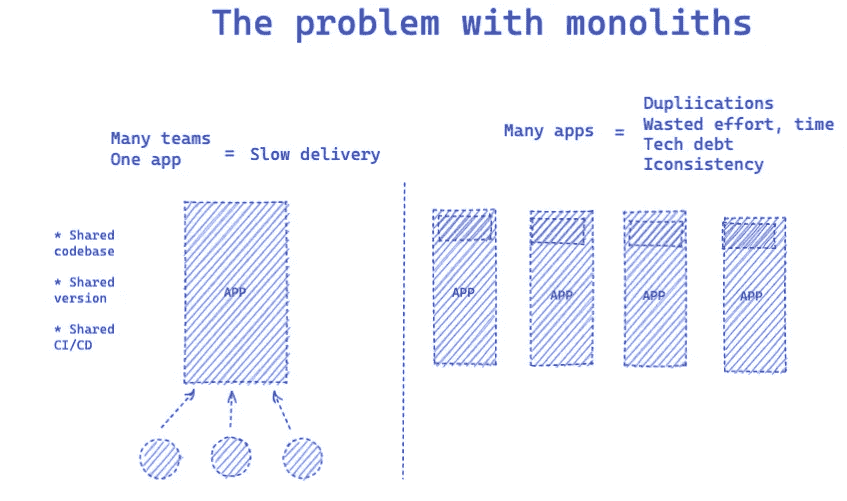
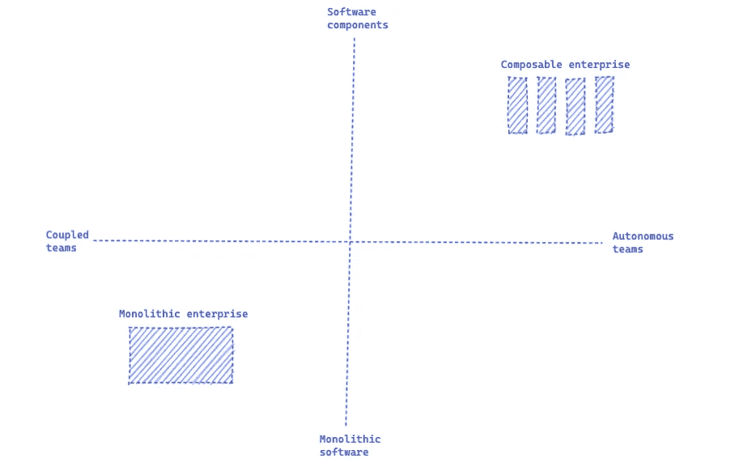
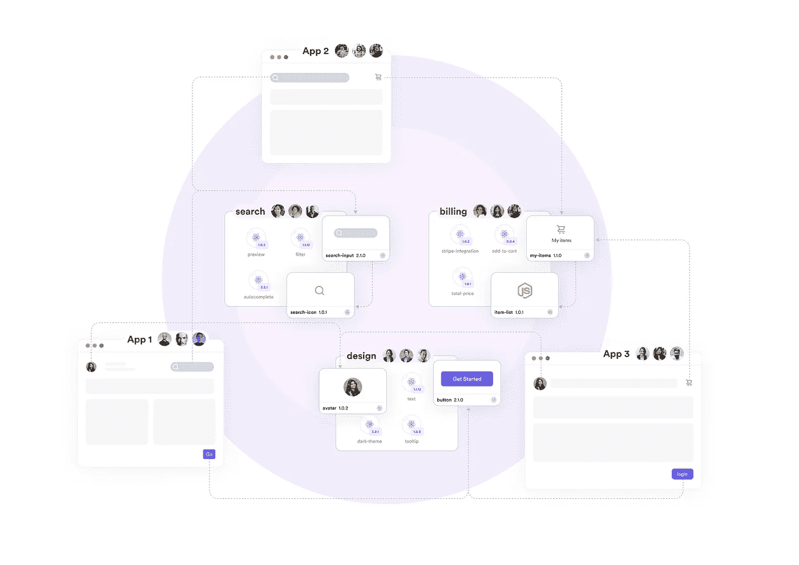

# 自治团队和可组合企业

> 原文：<https://javascript.plainenglish.io/autonomous-teams-and-the-composable-enterprise-66844e6101b1?source=collection_archive---------10----------------------->

## 如何通过自治团队和组件驱动的软件成为可组合的企业

自治团队的吸引力来自于他们更敏捷、更有创造力、反应更敏捷的能力——因此也更具竞争力和创新性。

通过让团队独立拥有特定的业务职责，一个[企业变得更加可组合](https://blog.bitsrc.io/the-composable-enterprise-a-guide-609443ae1282)。在可组合的企业中，软件架构支持使用模块化组件快速组合定制的应用程序，这些组件由自治团队构建和发布。

[Gartner](https://www.gartner.com/smarterwithgartner/adapt-business-applications-to-deliver-agility-and-innovation) 预测，这种架构的演变将逐渐成为新的标准，在提高性能和降低成本的同时实现持续交付:

> “可组合业务的动态体验将成为软件创新的主流架构、集成和交付模型”

这篇文章探讨了为什么赋予团队更大的自主性具有挑战性，以及组件驱动的软件如何成为可组合企业转型中的强大工具。

# 自治团队对商业有益

如今，企业希望他们的团队拥有越来越大的自主权，通过以下方式推动创新和业务成果:

1.  **更快的交付**——自治团队通过去除不必要的过程、依赖和对其他团队和共享资源的依赖来更快地交付，使他们更加高效和有效。
2.  **市场亲密度** —一个拥有非常具体的业务职责的自治团队对其客户和用户了如指掌，使其能够更好地提供量身定制的体验。
3.  **更好的响应—** 一个自主的团队可以更早地发现市场的微妙变化，并更快地做出反应，做出必要的改变以保持竞争优势。
4.  **更强的弹性** —相互依赖可能会引入失败点，其中单个团队可能会损害组织实现其目标的能力。自主团队像独立细胞一样工作，使系统更有弹性。
5.  **更大的可伸缩性**——拥有松散耦合的自治团队，拥有特定的业务职责，这使得添加额外的团队并管理它们变得更加容易。就像软件系统一样，模块化和分布式组织更容易扩展。

由于团队结构和软件架构的原因，企业通常难以加速开发。因此，当自主性较低时，业务价值的持续[交付受到限制。](https://www.oreilly.com/library/view/designing-autonomous-teams/9781491994320/ch01.html)

根据[康威定律](https://en.wikipedia.org/wiki/Conway%27s_law)，软件架构反映了构建它的组织的架构。可组合的企业将开发可组合的应用程序。单一的软件和自治的团队是不相容的。

# 为什么企业与自治团队斗争

一个成功的自治团队需要能够快速行动，而不需要等待其他团队或共享资源。您可以使用以下指标来考虑这一点:

> 一个团队要花多少时间等待资源或其他团队？

理想情况下，我们希望它为零。然而，一些相互依赖是必要的，并且服务于一个目的，所以我们希望团队没有时间浪费，但是只要满足组织的标准。

Waiting for other teams is an indication that the team is not autonomous

我们可以将团队的相互依赖分成两部分:**水平**和**垂直**:

*   横向耦合发生在不同的开发团队之间，作为他们在特定项目上合作的一部分:共享代码库、版本和 CI/CD 管道。遗留工具通过共享资源来耦合团队，创建了一个 web 整体，限制了每个团队独立构建和发布的能力。
*   **垂直耦合**发生在开发团队和作为控制功能的中央企业团队之间，例如安全、合规、质量保证或设计。现有的过程保持企业软件的一致性，但是消耗时间和资源作为开销。

让许多不同的团队在同一个应用程序上工作意味着他们在争夺资源(代码库、版本、管道)，减缓了交付。

拥有许多不同的应用程序构成了另一个挑战，因为团队会产生重叠的工作和重复的代码。在多个应用程序中开发相同的特性在短期内会浪费时间和资源，在长期内会产生越来越多的技术债务和不一致性。

那么我们如何在同一个应用程序中从高度耦合的团队转移到松散耦合的团队呢？团队如何在保持标准和一致性的同时独立承担业务责任？

这就是解耦软件组件的不同之处——它们使团队能够独立地构建和发布代码，并将每个组件集成到多个应用程序中以保持一致性。

使用组件，老化的整体可以被合成的应用程序所取代。

**再见独石，你好可组合企业。**

# 从自治团队到可组合企业

> “我们希望我们的团队和服务紧密结合，但松散耦合”——Dianne Marsh，网飞云工具工程总监

组件本质上成为组成企业应用程序的构建块，因为它们每个都服务于特定的业务职责。拥有能够独立构建和发布这些组件的团队是最终实现可组合企业的关键。

Transitioning to the Composable Enterprise requires autonomous teams and software component

利用[组件驱动的软件](https://bit.dev/)过渡到可组合企业需要几个因素:

1.  **独立的代码库、版本和管道** —以可扩展、高效和一致的方式组合应用取决于组件的解耦和集成。为了实现这一点，每个组件都必须在自己的代码库中独立开发，然后独立构建、测试、版本化并发布到产品中。
2.  **协作和集成**——为了有效地编写应用程序，团队必须能够在彼此的组件上协作，并不断地集成它们。这包括发现现有的组件、它们的文档，以及可视化依赖关系的能力，以理解和公司范围的组件流。
3.  **治理的民主化** —组件为企业提供了一种标准化开发的方式，例如可定制的开发模板、开发环境和构建管道。这些可以用来定义和控制跨项目的每个团队单独开发、测试、发布、共享、集成和记录组件的方式。

As autonomous teams build components, they can serve them to the organization to build apps together

使用一个组件驱动软件的平台，比如 [Bit](https://bit.dev) ，对可组合企业有很大的帮助。借助 Bit，自主团队可以构建组件并为组织的软件“生产线”提供服务，帮助开发人员创建、组合组件并进行协作，共同构建应用程序，同时为企业提供管理和标准化开发的工具。

转向组件驱动的软件在整个企业中创造了组件经济。这不仅仅是拥有一个[组件市场](https://blog.bitsrc.io/building-a-component-marketplace-for-your-team-31257314c56c)供开发和产品团队发现组件并推动采用。

在**组件经济**中，每个组件服务于整个企业，并创造指数复合价值——重用组件节省开发时间和资源，防止代码重复，加快交付速度，减少代码库的维护，提高性能，增强一致性，并加快新开发人员的入职速度

此外，重用组件使企业能够以隔离的方式查看每个业务职责，并做出更明智的“构建还是购买”决策:我们应该为消息传递构建组件，还是使用 Twilio 作为组件？我们应该构建一个支付组件，还是使用 Stripe？

这使组织能够只使用它需要的来自第三方的组件，并将它们无缝集成到其应用程序中。每一个软件都变得可以互换——如果需要的话，还可以外包。

# 结论

自主团队通过更快地行动，更接近市场，更好地响应市场动态的变化，推动更好的业务成果。

但是团队自治不仅仅是一种结构或文化特征。它与企业软件架构紧密相关:模块化架构使自治团队能够独立开发和发布组件。单一架构限制了他们提供商业价值。

降低团队之间的相互依赖性——无论是纵向的还是横向的——是实现可组合企业优势的关键，用快速组合的应用程序取代老化的整体。

[组件驱动的软件](https://bit.dev)可以帮助企业实现向可组合的转变:让自治团队在他们自己的代码库中独立地创建版本化的组件，共同协作和组合应用——同时标准化开发流程。

请随意评论并提出您自己的想法，告诉我们如何过渡到一个可组合的企业，并为您的组织带来组件经济。

## 了解更多信息

 [## 我们如何构建微前端

### 构建微前端来加速和扩展我们的 web 开发过程。

blog.bitsrc.io](https://blog.bitsrc.io/how-we-build-micro-front-ends-d3eeeac0acfc)  [## 我们如何构建一个组件设计系统

### 用组件构建一个设计系统来标准化和扩展我们的 UI 开发过程。

blog.bitsrc.io](https://blog.bitsrc.io/how-we-build-our-design-system-15713a1f1833)