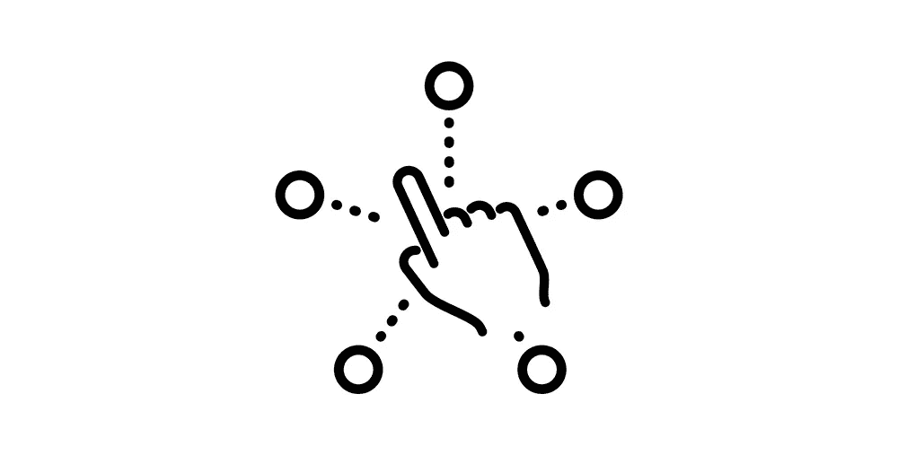

# 如何解决平均配对问题

> 原文：<https://javascript.plainenglish.io/average-pair-a0f481e2f8ed?source=collection_archive---------10----------------------->

## 使用多指针方法解决平均配对问题指南。

又见面了！

所以，今天我想看看一种叫做多指针的解决问题的模式。

我要举例说明的问题叫做平均配对。在这个问题中，我们将得到两个参数——一个是数组，另一个是目标值。任务是识别目标值是否是数组中任意两个数字的平均值。

所以…如果我们传入([1，2，3]，1.5)，我们将返回 true，因为 1.5 是数组中前两个数字 1 和 2 的平均值。

多指针可以很好地工作有几个原因，但我最感兴趣的是它能够系统地分析我们的(排序)数组的所有组合，只需一次迭代。

这意味着我们可以避免 O(n)时间复杂度或相当大的递归堆栈。

我们怎么做呢？

超级简单…

## ***细目:***

**第 3–4 行**:我们将在数组的开头和结尾设置两个指针

**第 6 行**:我们使用 while 循环作为一种在数组内迭代的方式，而不依赖于数组长度。在起点仍小于终点的情况下，这很容易做到(因为，如果找不到平均的配对，它们会相互重叠)。

**第 7–14 行**(循环内):我们将计算当前指向的两个数字的平均值。如果我们匹配了目标—我们就完成了，并返回 true。

如果不是，并且目标平均值比当前平均值少*，我们可以将结束指针向左移动。如果 ***比当前平均值*** 大，这意味着我们需要通过向右移动开始指针向另一个方向移动。*

*这样，一次又一次地，我们将排序后的值缩小到两个，这两个值可以平均到我们的目标值。*

*我对多指针模式的简单和有效感到惊讶。在其他场景中，它也变得有用，我可能会在以后的帖子中访问一两个。*

*这个题目到此为止。感谢您的阅读。*

**更多内容请看*[***plain English . io***](https://plainenglish.io/)*。报名参加我们的* [***免费周报***](http://newsletter.plainenglish.io/) *。关注我们关于*[***Twitter***](https://twitter.com/inPlainEngHQ)*和*[***LinkedIn***](https://www.linkedin.com/company/inplainenglish/)*。加入我们的* [***社区不和谐***](https://discord.gg/GtDtUAvyhW) *。**