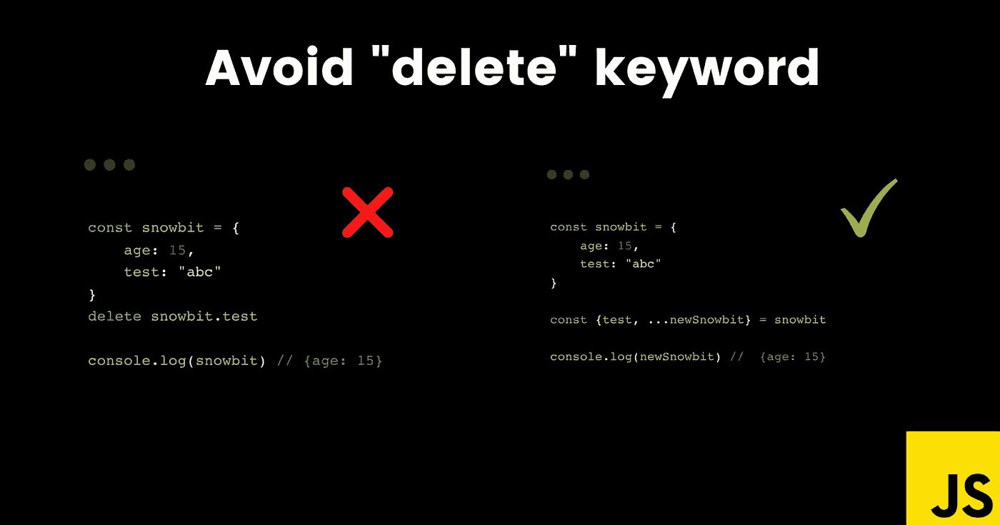

# 在 JavaScript 中避免使用“delete”关键字

> 原文：<https://javascript.plainenglish.io/avoid-the-delete-keyword-in-javascript-87ff2a47f26c?source=collection_archive---------15----------------------->



## 大家好👋

怎么了，朋友们？这是雪球。我是一名年轻、热情、自学成才的前端 web 开发人员，并打算成为一名成功的开发人员。

今天，我带着一个有趣而重要的话题来到这里。所以，让我们准备好进入主题。快乐阅读！


```
const snowbit = {
    age: 15,
    test: "abc"
}
delete snowbit.test

console.log(snowbit) // {age: 15}
```

在这里，最好不要使用`delete`从对象`snowbit`中移除属性。

让我解释一下，你不应该使用`delete`从对象中移除属性，因为这改变了原来的属性，会导致不可预测的行为，并且变得难以调试。

相反，使用 spread 运算符创建一个新副本。

```
const snowbit = {
    age: 15,
    test: "abc"
}

const {test, ...newSnowbit} = snowbit

console.log(newSnowbit) //  {age: 15}
```

请继续关注下一篇文章，如果您还没有阅读，请确保继续阅读。

感谢您的阅读，祝您愉快！你的欣赏是我的动力。😊

*   在推特上关注我— [@codewithsnowbit](https://twitter.com/codewithsnowbit)
*   在 YouTube 上订阅我— [用雪球编码](https://www.youtube.com/channel/UCNTKqF1vhFYX_v0ERnUa1RQ?view_as=subscriber&sub_confirmation=1)

*更多内容看* [***说白了。报名参加我们的***](http://plainenglish.io/) **[***免费周报***](http://newsletter.plainenglish.io/) *。在我们的* [***社区不和谐***](https://discord.gg/GtDtUAvyhW) *获得独家获取写作机会和建议。***