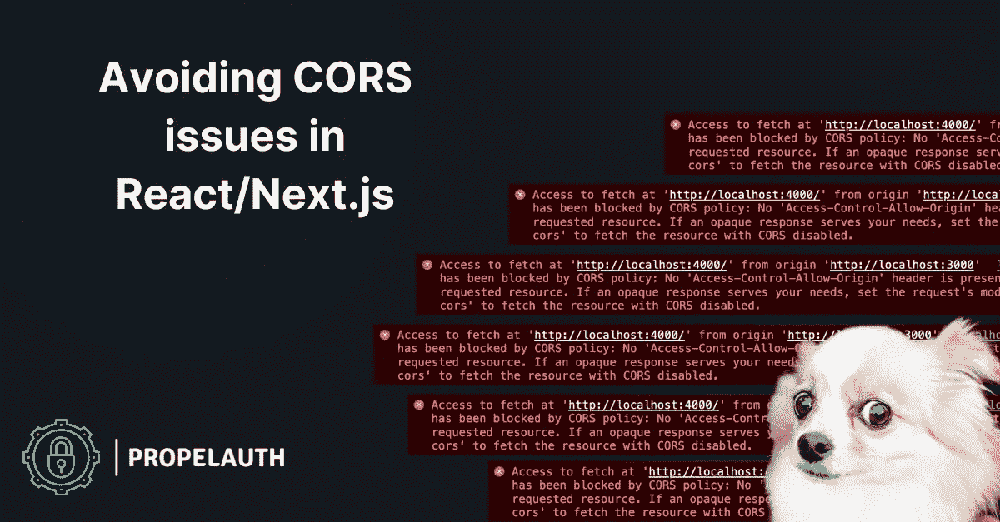

# React/Next.js 中如何避免 CORS 问题

> 原文：<https://javascript.plainenglish.io/avoiding-cors-issues-in-react-next-js-6a50c3f94653?source=collection_archive---------4----------------------->

## 如果你编写过任何前端代码，你可能以前遇到过 CORS 错误。在这篇文章中，我们将看看如何修复它们。



如果您编写过任何前端代码，您可能以前遇到过 CORS 错误，就像这样:

**访问 _** **已被 CORS 政策封锁**

跨源资源共享(CORS)是一种协议，它定义了当 web 请求跨越不同的 URL 时应该如何处理它们。

# 为什么跨来源请求是一个问题？

你的浏览器保存了你访问的每个网站的很多状态。假设您登录到 mybank.com 的**，并且您有一个设置有**mybank.com**的 cookie，表明您已经登录。**

**当您正在浏览时，您意外地访问了**恶意站点**，它向**mybank.com**发出了如下请求:**

```
// Fetch request made from https://malicious.site
fetch("https://api.mybank.com/account_details", {
    method: "GET",
    credentials: "include",
})
```

**如果该请求被允许，并且您的 cookie 被包含在内，**恶意站点**的所有者将能够代表您发出请求并读取您的帐户详细信息。**

**使用 CORS，服务器可以指定接受或拒绝哪些跨源请求。它可以拒绝需要 cookies 的请求。它可以拒绝来自**untrusted.mybank.com**的请求，但接受来自**app.mybank.com**的请求。它可以拒绝所有 POST 请求，但允许 get 和 put。**

**关于 CORS 需要注意的重要一点是，配置/设置是在**服务器**上完成的，并且由服务器和你的浏览器强制执行。大多数服务器框架都有一个库来配置你的 CORS 头文件，但是如果你想看到底层头文件本身，[这里有一个很好的资源](https://developer.mozilla.org/en-US/docs/Web/HTTP/CORS)。**

# **实际例子**

**假设我们有一个带有快速后端的 React 应用程序。我们的前端运行在端口 3000 上——这是 React 常见的默认端口。**

**由于我们的后端不能在本地端口 3000 上运行，我们将设置 Express 在端口 4000 上运行。**

```
const express = require('express')
const app = express()
const port = 4000app.get('/whoami', (req, res) => {
    res.send('Who is anybody?')
})app.listen(port, () => {
    console.log(`Example app listening on port ${port}`)
})
```

**如果我们的 React 应用程序像这样向我们的后端发出一个获取请求:**

```
// Fetch request made from http://127.0.0.1:3000
fetch("http://127.0.0.1:4000/whoami")
```

**我们应该预料到 CORS 误差。就像我们之前的例子一样，127.0.0.1: **3000** 和 127.0.0.1: **4000** 被视为两个独立的域，因此您还不能跨它们发出请求。让我们来看看解决这个问题的几种方法。**

## **修复 1:修复服务器**

**一种方法是修复我们的服务器。我们可以通过安装一个 CORS 库([https://www.npmjs.com/package/cors](https://www.npmjs.com/package/cors))并告诉服务器期待来自 127.0.0.1:3000 的请求来做到这一点**

```
app.use(cors({
    origin: 'http://127.0.0.1:3000',
}))
```

**我们的请求将会成功。这种方法非常简单，通常也是很好的实践。如果我们的前端和后端托管在两个不同的子域上，我们可以在生产中使用同样的方法。**

# **修复 2:添加代理**

**在生产中，在某些情况下，您将从同一来源托管您的前端和后端。在这些情况下，您通常希望编写如下所示的获取代码:**

```
fetch("/whoami")
```

**而不是像这样:**

```
const url;
if (process.env.NODE_ENV === "production") {
    url = "https://www.example.com/whoami"
} else {
    url = "http://127.0.0.1:4000/whoami"
}
fetch(url)
```

**为此， **create-react-app** 实际上自带了设置一个[简单代理](https://create-react-app.dev/docs/proxying-api-requests-in-development/)的能力。将以下内容添加到 package.json 中:**

```
"proxy": "http://localhost:4000",
```

**然后，任何看起来像 API 请求的请求(例如，内容类型为 application/json)将被自动转发到[**http://localhost:4000**。](http://localhost:4000.)**

**绕过 CORS 问题的原因是，对于浏览器来说，请求*是*去往[**http://localhost:3000**](http://localhost:3000)，因此看起来不像是跨来源的请求。位于[**http://localhost:3000**](http://localhost:3000)的服务器会将请求转发给[**http://localhost:4000**](http://localhost:4000,)，但浏览器不知道。‍**

**如果您使用的是 **Next.js** 而不是 **create-react-app，**您可以在 **next.config.js** 中设置一个重定向，它将转发所有匹配的流量:**

```
module.exports = {
  async rewrites() {
    return [
      {
        source: '/api/:path*',
        destination: 'http://localhost:4000/:path*'
      }
    ]
  }
}
```

# **摘要**

**修复 React 和 Next.js 中任何 CORS 问题的最简单方法实际上是不要在 React 或 Next.js 中做任何更改，而是修复您的服务器以允许来自它们的请求。**

**如果您不能更改服务器，React 和 Next.js 都有办法让您将它们转换为代理，并代表您向后端发送代理请求。这通过使您的浏览器认为请求不再是跨来源请求而避免了任何 CORS 问题。**

***更多内容请看*[***plain English . io***](https://plainenglish.io/)*。报名参加我们的* [***免费周报***](http://newsletter.plainenglish.io/) *。关注我们关于*[***Twitter***](https://twitter.com/inPlainEngHQ)[***LinkedIn***](https://www.linkedin.com/company/inplainenglish/)*，以及* [***不和***](https://discord.gg/GtDtUAvyhW) *。***