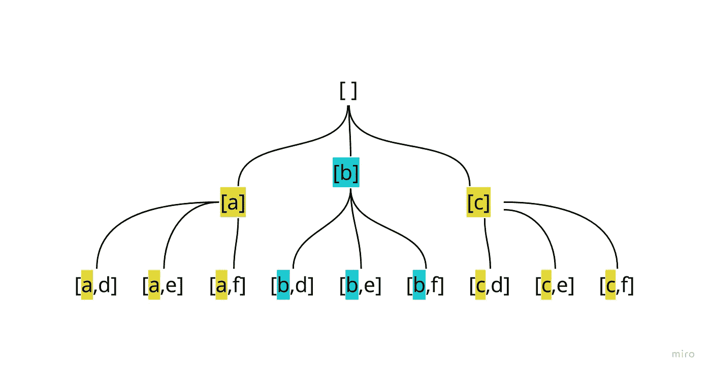

# 返回可以使用电话键盘上的 2 位数字组成的所有字母组合

> 原文：<https://javascript.plainenglish.io/backtracking-ii-letter-combinations-of-a-phone-number-af52fc22c6d1?source=collection_archive---------11----------------------->

## 回溯 II——通过 JavaScript 使用手机键盘上的两位数字进行字母组合


这篇文章可以被认为是上一篇递归回溯文章的后续。我很高兴连续做这些来强化这个概念。

在 [Leetcode #17 —电话号码的字母组合](https://leetcode.com/problems/letter-combinations-of-a-phone-number/)中，我们的输入是一个最多包含 4 个数字的字符串。

我们选 23 号吧

使用电话键盘上的字符，目标是返回使用这两个数字组成的所有可能的字母组合。因此，“23”可以是“ad”、“ae”、“af”、“bd”、“be”、“bf”、“cd”、“ce”或“cf”。

我的想法是——“每个‘2’字母对应一个可能的‘3’字母”。

当我开始这个问题的时候，我刚刚完成了[组合](https://leetcode.com/problems/combinations/)的问题，它立刻看起来像是回溯模板有意义的另一个地方。

首先，我需要一个对象将输入字符串中的数字与它们各自的字符组关联起来。

为了与 Leetcode 的约束保持一致，我们省略了 0 和 1，因为这些键上没有字符。

现在来看主体的主要功能:

首先，基础知识…

我们将讨论空输入字符串的边缘情况。然后，我们可以快速生成一个字符簇数组，每个字符簇对应一个数字输入。

对于我们的“23”示例，possibleValues = [ 'abc '，' def' ]

现在是回溯模板-

这和组合问题几乎一样。只是现在，因为在被迭代的数组的每个索引处有多个值([ 'abc '，' def' ]而不是[ 'a '，' b' ])，所以添加了一个内部循环来给出每个索引的每个索引。

因此，如果我在第 19 行使用 console.log(result ),它看起来会像这样

```
[ 'a' ]
[ 'a', 'd' ]
[ 'a', 'e' ]
[ 'a', 'f' ]
[ 'b' ]
[ 'b', 'd' ]
[ 'b', 'e' ]
[ 'b', 'f' ]
[ 'c' ]
[ 'c', 'd' ]
[ 'c', 'e' ]
[ 'c', 'f' ]
[ 'd' ]
[ 'e' ]
[ 'f' ]
```

就像组合一样，我们的结果包括所有满足条件的组合

结果.长度===位数.长度

```
[ 'ad', 'ae', 'af', 'bd', 'be', 'bf', 'cd', 'ce', 'cf' ]
```

也以树形可视化:



**完整解决方案:**

再一次非常类似于之前的回溯帖子。我真的很兴奋能进一步了解这些问题类型，并(慢慢地)增加复杂性。

*更多内容请看*[***plain English . io***](https://plainenglish.io/)*。报名参加我们的* [***免费周报***](http://newsletter.plainenglish.io/) *。关注我们关于*[***Twitter***](https://twitter.com/inPlainEngHQ)*和**[***LinkedIn***](https://www.linkedin.com/company/inplainenglish/)*。加入我们的* [***社区***](https://discord.gg/GtDtUAvyhW) *。**