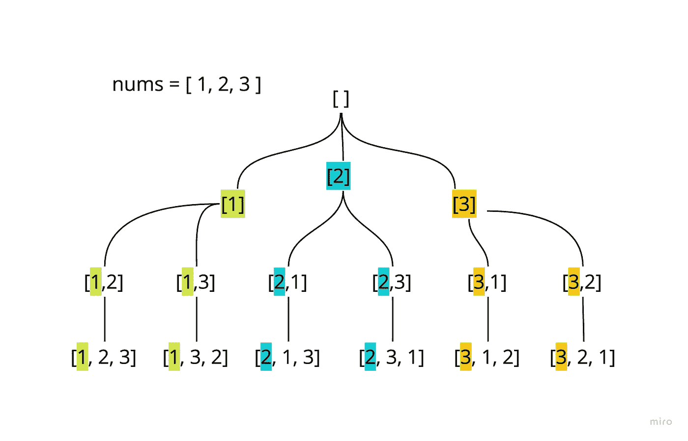
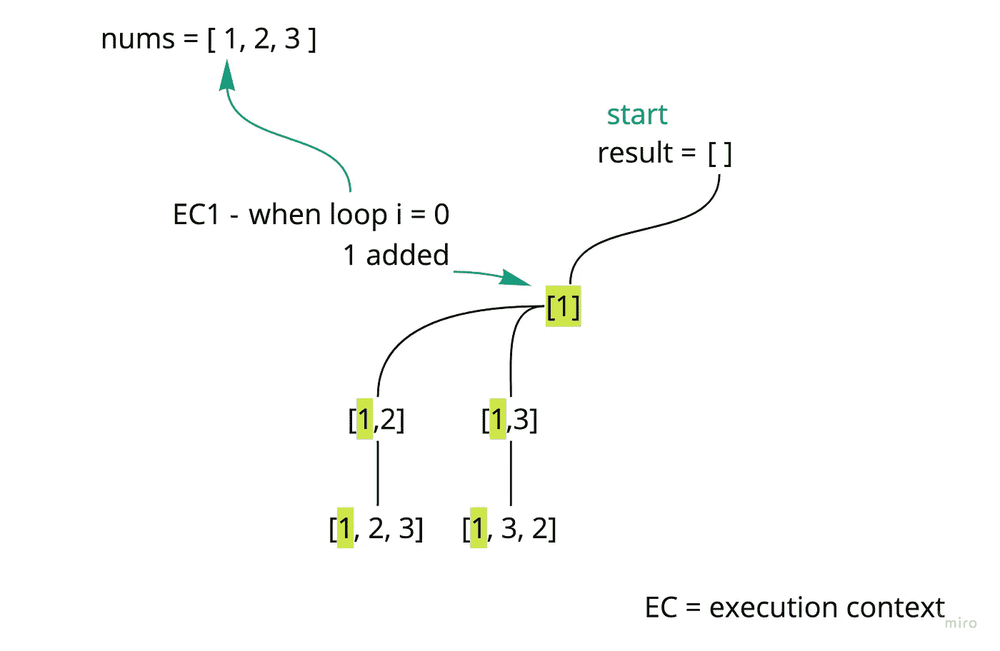
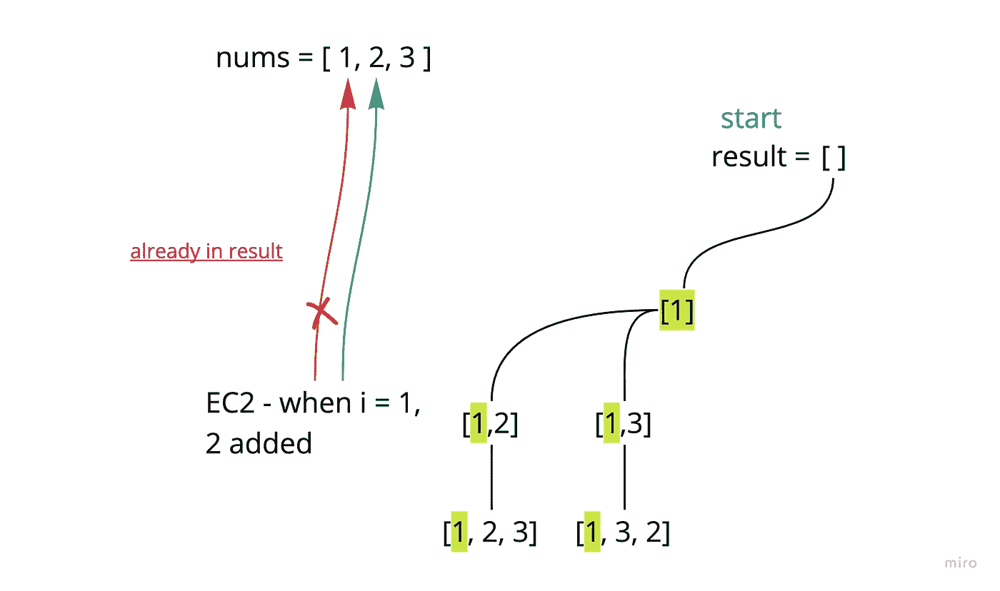
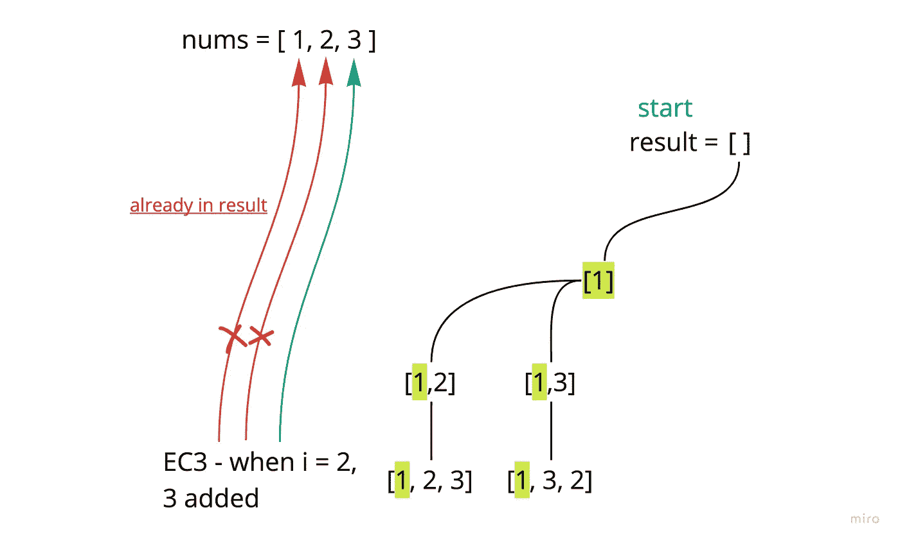
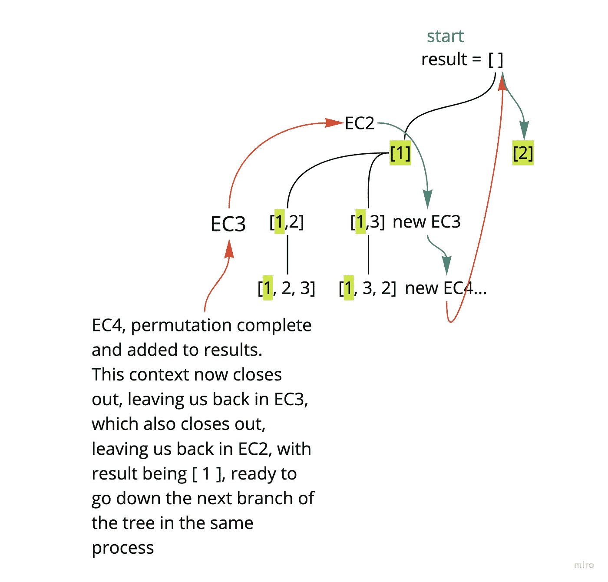

# JavaScript 中的排列

> 原文：<https://javascript.plainenglish.io/backtracking-iii-permutations-834bfb5bd9d0?source=collection_archive---------9----------------------->

## 回溯 III—JavaScript 中的排列

现在来看回溯的另一个用例…

[Leetcode #46 —排列。](https://leetcode.com/problems/permutations/)

首先，组合与排列。我读过很多关于这种区别的解释，为了解决这些问题，我认为最直观的表达方式是这样的:

如果被要求给出长度为 3 的数字数组的所有组合，由数字 1 到 3(包括 1 和 3)组成，那么实际上只有一个解决方案— [1，2，3]。换句话说，所有其他的(没有重复，例如[3，2，1]或[2，1，3])都不会被认为是不同的——也就是说，*排序不会使它们成为唯一的*。

另一方面，对于排列，排序很重要。我们需要呈现这三个数字的每一种可能的*定位*

考虑到 Leetcode 的限制，我们将接受一个最多包含 6 个整数的数组输入，但是对于这个例子，让我们保持简短，保持[1，2，3]。

我们从以前的回溯工作中知道，这些类型的问题可以使用树形结构来可视化，所以让我们从这里开始:

现在，当我看到这个结构时，它看起来非常直观和简单。但我容易感到困惑的是如何将这与递归联系起来，并在递归调用期间可视化这棵树的移动。

首先，让我们直接进入代码:

很快你就会发现它与组合解决方案非常相似。我们在第 3 行设置了结果数组，在第 5 行设置了递归内部函数。

我们将传递每个递归调用的结果(从[ ])并检查其长度(第 7 行)。如果它符合我们的排列标准，我们将把它包含在结果数组中，并以返回结束当前的函数调用。

然后，对输入的迭代从第 12 行开始。

那么这种递归逻辑会是什么样子呢？每当我们进入这个循环时，我们需要:

*   给我们当前的排列加上一个数字(并且不能重复)
*   在我们新修改的排列上再次调用递归函数
*   移除添加到排列中的最后一个值(回溯)

**解决方案:**

现在是有趣的部分——将一些递归过程叠加到树形结构上。我将关注最左边的子树。

*在下图中，您会注意到‘EC’被重复使用——这代表‘执行上下文’。如果您对这个术语有点模糊，它指的是由函数调用(在我们的例子中，是递归函数)创建的新环境。当一个函数调用在另一个函数调用内部打开时，在内部函数调用返回之前，外部函数调用中的代码不会恢复。

有很多东西需要遵循，但是每一个都让我对递归有了更好的理解和直觉。我的目标是达到一定的熟悉程度，让这些操作感觉像 for 循环一样熟悉。

对大多数人来说，回溯的递归性使它看起来如此违反直觉。能够重写我们所知道的可行的递归解决方案是一回事，而查看一个解决方案并直观地掌握正在发生的事情则完全是另一回事。

*更多内容请看*[***plain English . io***](https://plainenglish.io/)*。报名参加我们的* [***免费周报***](http://newsletter.plainenglish.io/) *。关注我们关于*[***Twitter***](https://twitter.com/inPlainEngHQ)*和**[***LinkedIn***](https://www.linkedin.com/company/inplainenglish/)*。加入我们的* [***社区***](https://discord.gg/GtDtUAvyhW) *。**