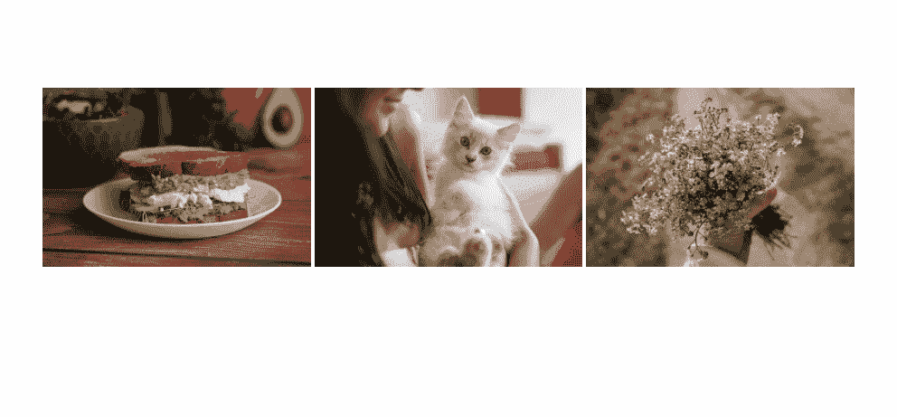
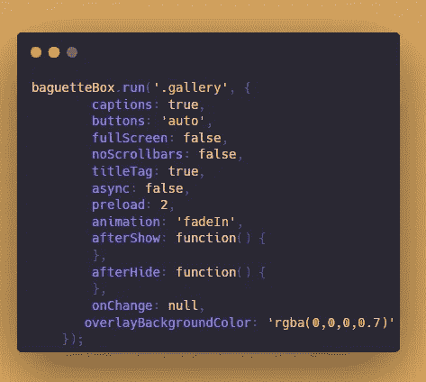
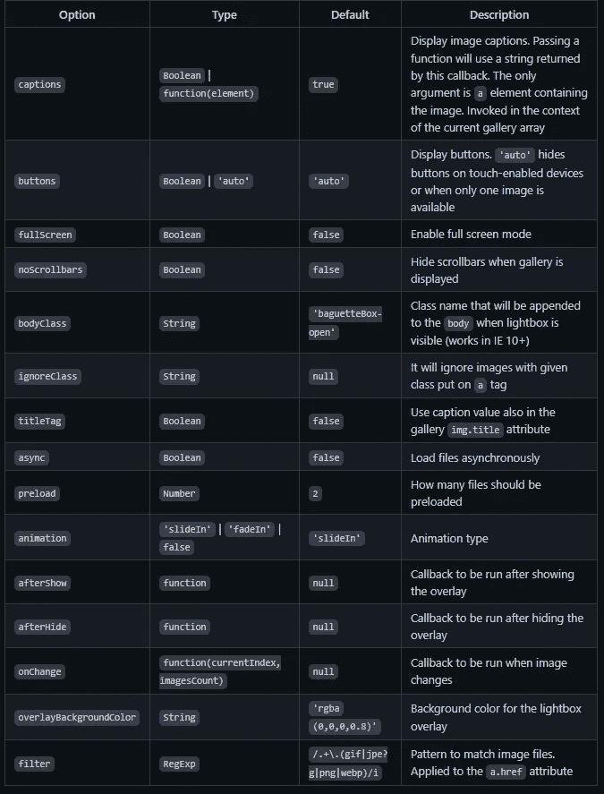

# 认识一下 baguettebox . js——一个用于生成动画图像的 Lightbox 脚本

> 原文：<https://javascript.plainenglish.io/baguettebox-js-simple-and-easy-to-use-lightbox-77c81504457a?source=collection_archive---------13----------------------->

## 使用这个 JavaScript 库生成一个带有动画和响应图像的 lightbox。



BaguetteBox 是一个 JavaScript 库，它生成一个带有动画和响应图像的 lightbox。它还支持触摸屏设备上的滑动手势。

## **官方网站:**

[](https://github.com/feimosi/baguetteBox.js) [## GitHub - feimosi/baguetteBox.js:用纯 JavaScript 编写的简单易用的 lightbox 脚本

### zap:用纯 JavaScript 编写的简单易用的 lightbox 脚本- GitHub - feimosi/baguetteBox.js:简单并且…

github.com](https://github.com/feimosi/baguetteBox.js) 

# 怎么用？

## **第一步:**

与 npm、yarn、bower 或 CDN 一起安装

```
npm install baguettebox.js --saveyarn add baguettebox.jsbower install baguettebox.js --save
```

或者，

```
<link rel="stylesheet" href="[https://cdnjs.cloudflare.com/ajax/libs/baguettebox.js/1.8.2/baguetteBox.min.css](https://cdnjs.cloudflare.com/ajax/libs/baguettebox.js/1.8.2/baguetteBox.min.css)"><script src=[https://cdnjs.cloudflare.com/ajax/libs/baguettebox.js/1.8.2/baguetteBox.min.js](https://cdnjs.cloudflare.com/ajax/libs/baguettebox.js/1.8.2/baguetteBox.min.js)" async></script>
```

## **第二步:**

超文本标记语言


内容在*图库*里面。

每个图像都在*和<的>标签*中，与更大的图像链接。图像是缩略图大小。

**数据标题**用于每个图像下的标题。

## **第三步:**

JavaScript:



用`baguetteBox.run(‘id’,{options})`点火。

## 定制选项:



## **事件:**

run()| show()| showoNext | show previous | hide | destory

对于**响应图像**，您可以设置不同屏幕尺寸的不同图像，如下所示:

```
<a href="img/2-1.jpg"
  data-at-450="img/thumbs/2-1.jpg"
  data-at-800="img/small/2-1.jpg"
  data-at-1366="img/medium/2-1.jpg"
  data-at-1920="img/big/2-1.jpg">
    
</a>
```

## **我的演示在这里**

👉关注我，了解更多有用的 web 开发内容！爱 sharing🥰

*更多内容请看* [***说白了就是***](https://plainenglish.io/) *。报名参加我们的* [***免费每周简讯***](http://newsletter.plainenglish.io/) *。关注我们*[***Twitter***](https://twitter.com/inPlainEngHQ)*和*[***LinkedIn***](https://www.linkedin.com/company/inplainenglish/)*。加入我们的* [***社区不和谐***](https://discord.gg/GtDtUAvyhW) *。*