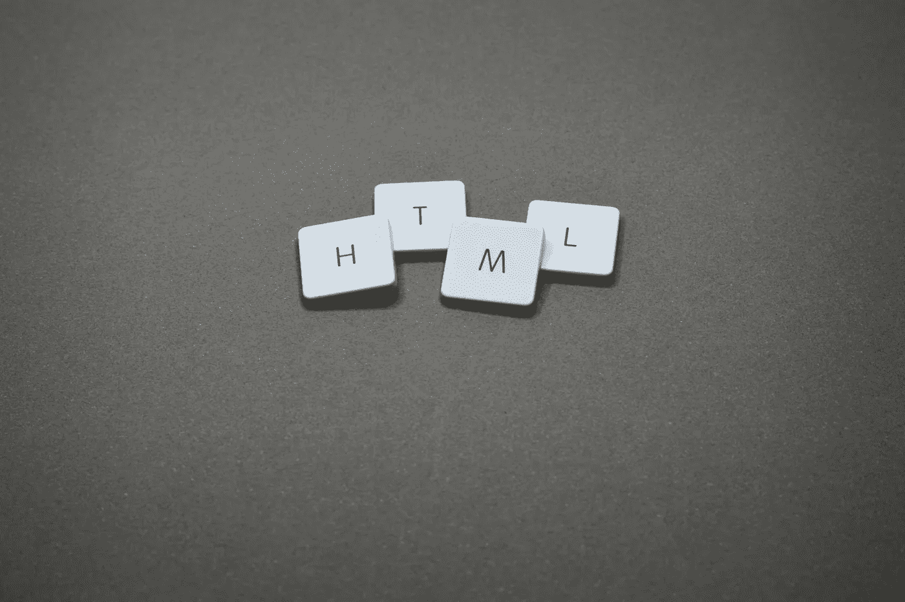
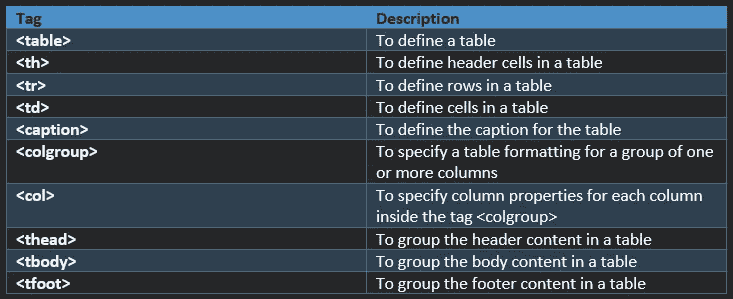
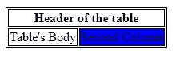
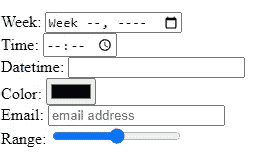
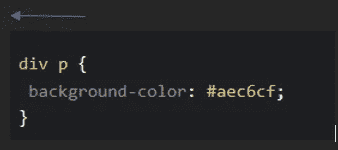
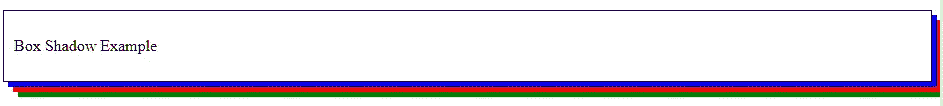
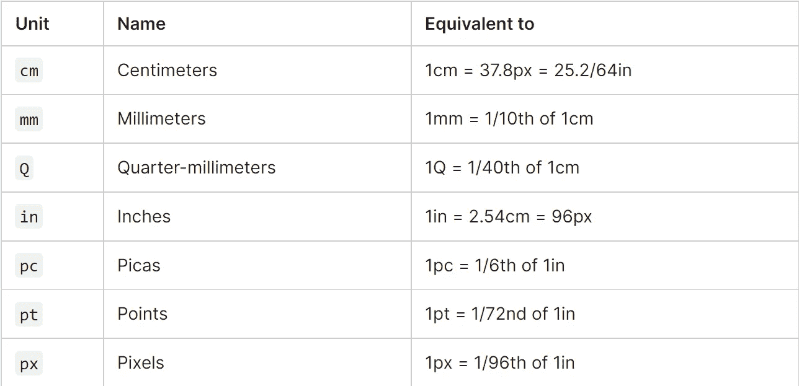
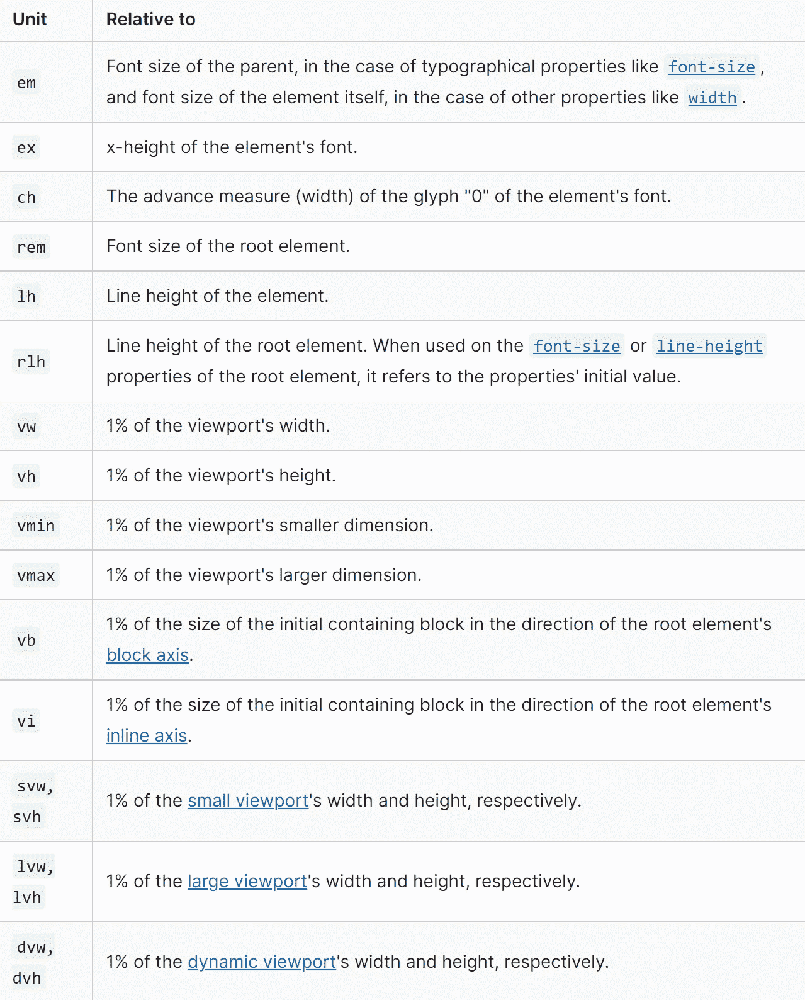

# 2023 年前端开发人员的基本 HTML 和 CSS 主题

> 原文：<https://javascript.plainenglish.io/basic-html-and-css-topics-for-frontend-developers-in-2022-e38457f53361?source=collection_archive---------10----------------------->

## 本文涵盖了 2023 年前端开发人员必须了解的 HTML 和 CSS 的基本概念。

本文涵盖了 2023 年前端开发人员必须了解的 HTML 和 CSS 的基本概念。

我们将在本文中讨论的主题列表:

*   基本 HTML 页面结构
*   文档类型定义(DTD)、HTML、XHTML
*   [计]元数据
*   样式和脚本
*   文本格式化标签和 CSS 文本格式化
*   表格、表单、输入标签
*   CSS 规则，选择器
*   CSS 装饰
*   框和文本阴影
*   CSS 单位



[Photo by Miguel Á. Padriñán](https://www.pexels.com/photo/four-letter-tiles-1591061/)

## 基本 HTML 页面结构

我们可以用 HTML 来定义网页的结构。它告诉浏览器如何使用元素显示以及显示什么。然后，web 浏览器读取并解析 HTML 文档，并向用户显示输出。

例子—

```
<!DOCTYPE html>
<html lang="en">

**<head>**
 **<title>**This is a title for the HTML Page**</title>** <**link** rel="icon" type="image/x-icon" href="/assets/favicon.ico">   <**meta** content='text/html';charset=utf-8 />
 <**meta** name='description' content='description about the page'/> **<script>**
   document.getElementById("script").innerHTML = "This is script"
 **</script>**
 <script src="scriptfile.js"></script> **<style>** #internal { font-size:16px; color:red; } **</style>****</head>**

**<body>**
  <p id="internal">The content of a page goes in the Body</p>
**</body>**

</html>
```

**！Doctype HTML >** 是网络浏览器用来理解 HTML 的版本。上面的例子定义了最新的版本，它的声明不区分大小写。

为了更好地理解，旧版本的声明要复杂得多。例如— HTML 4.05 —

```
<!Doctype HTML PUBLIC "-//W3C//DTD HTML 4.05 Transitional//EN" "http://www.w3.org/TR/html4/loose.dtd">
```

在上面的代码中，DTD =文档类型定义*(在下面的章节中有更多的介绍)*

1.  **< html >** **—** 被称为 html 的根元素。我们可以使用属性`lang`来定义页面的语言。
2.  **< head > —** 指关于页面的重要信息，如元数据、脚本、样式等。
3.  **< body > —** 用于定义 HTML 页面的实际内容，使用其他元素标签，如< p >、< h1 >、< div >、< header >、< nav >等。

**头部<内使用的标签> —**

*   **<链接>标签** —用于定义到 CSS(样式表)、自定义图标和元数据的链接。
*   **< meta > tag** —用于向 web 浏览器提供关于页面的信息。
*   **<标题>标签** —用于网页浏览器标题栏中显示的标题。
*   **<样式>标签** —用于描述网页的样式信息。
*   **<脚本>标签** —指的是 [JavaScript](https://developer.mozilla.org/en-US/docs/Learn/JavaScript/First_steps/What_is_JavaScript) 文件，将用于在我们的页面上显示动态数据。

> 对于 HTML 初学者，可以使用这个[有帮助的参考](https://developer.mozilla.org/en-US/docs/Learn/HTML/Introduction_to_HTML)，最后尝试完成它的[评估](https://developer.mozilla.org/en-US/docs/Learn/HTML/Introduction_to_HTML/Structuring_a_page_of_content)。

## 文档类型定义又称 DTD

*   它是一组标记声明，定义了 HTML、XHTML 等的文档类型。
*   它定义了网页的有效构建块和结构。它验证其元素和属性。

**示例—**

```
**HTML**
<!DOCTYPE HTML PUBLIC "-//W3C//DTD HTML 4.05 Transitional//EN" "http://www.w3.org/TR/html4/loose.dtd">**XHTML**
<!DOCTYPE html PUBLIC "-//W3C//DTD XHTML 2.0 Transitional//FR"
"http://www.w3.org/TR/xhtml1/DTD/xhtml1-transitional.dtd">
```

## HTML 与 XHTML

*   HTML —是一种用于创建网页的标准标记语言。
*   XHTML——是 HTML 的一个更严格、更标准化的版本。(例如，元素必须正确结束，应该是小写的，等等。)

> 详细差异参考— [面试位](https://www.interviewbit.com/blog/difference-between-html-and-xhtml/)。

## [计]元数据

*   如以上章节所述，在 head 部分中使用标签来引用页面的元数据。它是一个空标签，也就是说，它没有结束标签。
*   它提供附加信息，如关键字、页面描述或元数据。
*   一个网页可以有多个元标签。
*   以下是其属性的一些示例—
    i. `name` —定义属性的名称
    ii。`http-equiv` —用于获取 HTTP 响应消息头
    iii。`content` —用于指定属性
    iv 的值。`charset` —用于指定字符编码

**示例—**

**1。让浏览器知道 HTML 文档是用 UTC-8 (Unicode)字符集编码的。**

```
<meta http-equiv="Content-Type" content="text/html;charset=UTF-8"/>
```

**2。**定义附加信息，如描述、关键字等。

```
<meta name="description" content="Basic HTML, CSS Concepts">
<meta name="keywords" content="HTML, CSS">
<meta name="author" content="Mansi">
```

上述元标签将有助于我们的网页在搜索引擎结果(SEO)中显示得更靠前。

**3。**设置 viewport(网页的用户可见区域)，确保网页在所有设备上都好看。

```
<meta name="viewport" content="width=device-height, initial-scale=1.0">
```

**4。**每 60 秒刷新一次网页:

```
<meta http-equiv="refresh" content="60">
```

**5。**10 秒钟后将用户重定向到另一个页面:

```
<meta http-equiv="refresh" content="10;url=http://www.mywebpage.com" />
```

**6。**设置文件的最后修订日期:

```
<meta name = "revised" content = "MyWebPage, 15/7/2023" />
```

## 风格

我们可以将各种样式与我们的 HTML 内容关联起来。为此，我们可以使用 CSS(层叠样式表)来控制和格式化网页的布局和内容。

级联—意味着应用于父元素的样式也会应用于其子元素。

CSS 样式属性示例— `color`、`font-family`、`font-size`、`border`、`padding`、`margin`等。

*   **<样式>标签** **—** 是指将应用于网页内容的 CSS。
*   **<链接>标签—** 指网页的外部样式表。

**注意—** 如果我们在文档中包含多个`<style>`和`<link>`元素，它们将按照包含的顺序应用于这些元素。因此，我们必须对它们进行正确排序，以避免任何意外的级联问题。

**在—** 中有三种方式可以指定 CSS 样式

*   **内联—** 在 HTML 元素中使用`style`属性。
*   **内部—** 使用头部内的`<style>`标签。这里，我们使用`id`或`class`属性绑定元素。
*   **External —** 在 head 部分使用`<link>`标签，它引用 CSS 文件并使用`id`或`class`属性与 HTML 元素绑定。

**注意—** 内联样式总是会覆盖内部或外部 CSS。

```
**<!--Inline Example-->**
<div style="font-size:16px; color:blue; width:50%"> ... </div>**<!--Internal Example-->**
<html>
 <head>
  <style> 
    **#internalstyle** { color: red; margin: auto; width: 10% }
  </style>
 </head>
 <body>
  <div id="**internalstyle**"> .. </div>
 </body>
</html>**<!--External Example-->**
<html>
 <head>
  **<link href="sample.css" rel="stylesheet" />**
 </head>
 <body>
  <div class="**externalstyle**"> .. </div>
 </body>
</html>**//sample.css
.**externalstyle { color: red; margin: auto; width: 10% }
```

> 你可以在这里找到更多关于款式[的细节。](https://developer.mozilla.org/en-US/docs/Web/HTML/Element/style)

## 剧本

脚本创建动态或交互式网页(例如，将 JavaScript 添加到 HTML 中)。可以使用`<script>`标签加载和执行 JavaScript 代码。

我们可以在脚本标记中内嵌代码，或者下载一个链接到脚本元素的单独文件。例子—

```
**<!-- Inline JavaScript -->** <script>
   document.getElementById("elementId").innerHTML = "Testing Inline Script"
</script>**OR****<!-- Loading JavaScript from Separate File -->** <script src="small.js"></script>
<script src="large.js" defer></script>
```

建议从单独的文件中加载脚本，因为这有助于以模块化的方式组织代码&也使文件的维护更容易(即 HTML 和 JavaScript 代码是分开的)。

这些 JavaScript 文件也可以被缓存，这可以帮助提高网页性能，使页面的加载速度更快。

根据我们项目的需求，我们可以将脚本标签放在头部分，即在加载 HTML 之前，或者放在正文部分，即在 HTML 解析之后。然而，它的位置很重要，因为—

*   如果脚本包含一些事件触发的函数或库。然后，我们必须把它放在头部。
*   如果脚本在页面上写内容。然后，它应该放在正文部分的内部。

**重要<脚本>属性**

*   `async`—在解析 HTML 文档的同时下载脚本。一旦脚本下载完成，它会立即执行，也就是说，它的执行不会等待解析 HTML。
*   `defer` —在解析 HTML 的同时下载脚本。然而，一旦页面完成解析，脚本就会执行(即，在触发 [DOMContentLoaded](https://developer.mozilla.org/en-US/docs/Web/API/Document/DOMContentLoaded_event) 之前)
*   `referrerpolicy` —指定获取脚本时的引用信息*(示例—无引用、起源、跨起源时起源、同源、严格起源、不安全 url 等。)*
*   `**crossorigin**` —将请求模式设置为 HTTP CORS 请求*(示例—匿名、使用凭据)*
*   `**integrity**` —检查获取的脚本，并确保如果源代码受到某人的影响，代码不会被加载。*(例如——文件散列)*
*   `**fetchpriority**` —在获取外部脚本时提供相对优先级的提示。*(示例—高、低、自动)*

> 要了解更多关于`*fetchpriority*`属性的信息，请参考这篇[文章](https://web.dev/priority-hints/)。

*   `**nomodule**` —指定不应在支持(ES2015) [模块](https://developer.mozilla.org/en-US/docs/Web/JavaScript/Guide/Modules)的浏览器中执行脚本(即，不支持模块化 JavaScript 代码的旧浏览器的备份脚本，`type=module`)

```
**<!--async-->**
<script src="async_load_file.js" **async**></script>**<!--defer-->** <script src="defer_file.js" **defer**></script>**<!--referrerpolicy-->**
<script src="myscripts.js" **referrerpolicy="origin"**></script>**<!--crossorigin--><!--integrity-->**
<script src="myscript.js" **integrity="sha384-code"** **crossorigin="anonymous"**>**<!--fetchpriority-->**
<!-- We want to deprioritize it -->
<link href="/scripts/myapp.js" as="script" **fetchpriority="low"**>
<!--OR-->
<script>
  fetch('https://www.mywebsite.com/', **{priority: 'low'}**)
  .then(data => {
    //Trigger fetch
  });
</script>**<!--nomodule-->**
<script type="module" src="myapp.js"></script>
<script **nomodule** src="classic_myapp.js"></script>
```

**< noscript >标签** 该标签在用户系统不支持 JavaScript 时显示替代内容。

```
<noscript>Your browser does not support JavaScript!</noscript>
```

**HTML 文本格式化标签** 有多种 HTML 格式化元素可以用来格式化文本而不使用 CSS。

*   `<b>, <strong>`—用于显示粗体或重要文本。
*   `<i>, <em>`—用于显示斜体或强调文本。
*   `<mark>`—用于显示标记文本。
*   `<small>, <big>`—用于显示减小的&增大的字体大小的文本。
*   `<ins>, <del>` —用于高亮显示插入的&删除的文本。
*   `<sub>, <sup>` —用于显示下标&上标文本。
*   `<dl>, <dt>, <dd>` —用于实现描述列表。例子——项目列表，如术语&定义，或问题&答案。我们也可以为一个术语实现多个描述。
*   `<blockquote>` —用于高亮引用文本&也可以包含一个指向引用文本来源的 URL(使用`cite`属性)。
*   `<q>` —用于显示文本间的引用文本&还包括一个指向引用文本来源的 URL(使用`cite`属性)。
*   `<cite>` —用于包含引用资源的标题，如图书名称。默认情况下，这些引用以斜体显示。不幸的是，没有办法在 UI 中引用引用 URL。因此，我们需要将它包含在锚元素中。
*   `<abbr>` —用于将缩写或首字母缩略词括起来。
*   `<address>` —用于环绕联系人详细信息。可以在网站的页脚使用这个标签来包含整个网站的联系信息，或者在一篇文章中包含作者的联系信息，但不能作为与页面内容无关的地址列表。
*   `<code>, <pre>, <var>, <kbd>, <samp>` —这些标签用于标记内容内部的计算机代码。例如— `<code>`用于标记通用代码。`<pre>`保留空白、缩进等。*(所以，我们一般会把它包在* `*<code>*` *)。*`<var>`包装变量名，`<kbd>`包装使用键盘输入的命令行代码，`<samp>`用于包装计算机程序的输出。
*   `<time>`用于以机器可读的格式标记时间和日期。

```
**<!--Definition Lists-->** <dl>
  <dt>Term</dt>
  <dd>Definition Part 1</dd>
  <dd>Definition Part 2</dd>
</dl>**<!--Quotations & Cite-->**
<blockquote cite="URI_PATH">
  <p> This is a block quote </p>
</blockquote>
<p> 
  This is a  - <q cite="URI_PATH"> Quoted text </q>.
</p>
<p> 
  As per
  <a href="URI_PATH">
   <cite>Resource Name</cite>
  </a> 
</p>**<!--Abbreviations-->** <abbr title="National Aeronautics & Space Administration">
  NASA
</abbr>**<!--Contact Information-->** <address>
  Page written by <a href="../authors/mansi/">Mansi</a>.
</address>**<!--Code-->** <pre>
  <code>
    var para = document.querySelector('p');
    para.onclick = function() {
      alert('Alert Triggered');
    }
  </code>
</pre>
<p>
  In the above example code, 
  <var>para</var> 
  represents a variable
</p>
<p>
  We can select the content using 
  <kbd>Ctrl</kbd>/<kbd>Cmd</kbd> + <kbd>A</kbd>.
</p> **<!--Date Time-->** <time datetime="2023-07-15">15 July 2023</time>
```

## CSS 文本格式

CSS 允许使用各种属性来格式化文本，例如:
`color`、
`background-color`、
、`text-align *(left, right, center, justify)*`、
、`text-decoration *(underline, overline, line-through, none)*`、
、`text-indent (size in px, cm, pt)`、
、`letter-spacing (size in px)`、
、`line-height`、
、`text-shadow <horizontal size, vertical size, color>`、
、`word-spacing (size in px)`

> 更多属性请参考本[文档](https://developer.mozilla.org/en-US/docs/Learn/CSS/Styling_text/Fundamentals#other_properties_worth_looking_at)。
> - [CSS 文本属性参考](https://developer.mozilla.org/en-US/docs/Web/CSS/CSS_Text)

```
body, h1 {
  color: blue;
  background-color: grey;
  text-align: center;
  text-decoration: underline;
  text-transform: lowercase;
  text-indent: 80px;
  letter-spacing: 4px;
  line-height: 40px;
  direction: rtl;
  text-shadow: 3px 1px blue;
  word-spacing: 15px;
}
```

## HTML 表格

`<table>`是一个语义元素，表示 HTML 页面中的表格数据。



HTML tags that can be used to define tables

两个表格属性`rowspan`和`colspan`分别用于使单元格跨越多行和多列(即，在 HTML 表格中将两行或多行/列合并成一行/列)

> 参考[在小空间显示大表格的问题](https://developer.mozilla.org/en-US/docs/Web/HTML/Element/table#displaying_large_tables_in_small_spaces)

```
**<!--HTML-->**
<table>
    **<colgroup>**
      **<col>** <!-- No styles applied for the first column-->
      **<col** style="background-color:blue">
   ** </colgroup>** **<!-- OR styling both columns as same -->** <colgroup>
     <col style="background-color:blue" span="2">
   </colgroup> **<thead> <!-- Table header -->**
        <tr>
            <th colspan="2">Header of the table</th>
        </tr>
    **</thead>**
    **<tbody> <!-- Table Body -->**
        <tr>
            <td>Table's Body</td>
            <td>Second Column</td>
        </tr>
    **</tbody>** **<tfoot> <!-- Table Footer -->**
       Contact Details Here
    **</tfoot>****</table>****<!--CSS-->**
table, td {
    border: 1px solid #000;
}thead, tfoot {
    background-color: #000;
    color: #fff;
}
```



Sample Output for HTML Table

## HTML 表单和输入类型

HTML 表单从用户那里收集数据，显示用于提交信息的交互控件列表。

我们可以在`<form>`中使用`<input>`标签，并将收集到的数据发送到服务器进行处理。输入类型的示例—按钮、复选框、数字、文本、密码、提交等。

HTML5 为表单提供了多种输入类型，如日期、周、月、时间、日期时间、本地日期时间、颜色、电子邮件、数字、搜索、电话、占位符、范围、url 等。

**少数属性—**

*   `autocomplete` —用于指示默认情况下，输入元素的值是否可以由浏览器完成。
*   `name` —用于表示表单的名称。
*   `method` —使用 HTTP 方法提交表单。这些值可以是`post`、`get`或`dialog *(when the form is inside a <dialog>, closes the dialog and throws a submit event on submission)*`。
*   在表单中，我们有一个属性，`novalidate`，这是一个布尔类型，用于指示数据是否被预先验证。通过将该属性设为 false，表单无需验证即可提交，这有助于用户稍后继续。
*   `target` —用于指示提交表单后在何处显示响应。例子— `_self`、`_blank`、`_parent`、`_top`。

> [详细了解表单属性](https://developer.mozilla.org/en-US/docs/Web/HTML/Element/form)
> [输入属性](https://developer.mozilla.org/en-US/docs/Web/HTML/Element/input)

```
<form>
   <label>Name: </label>
   <input type="text" name="name" />    <label>Contact Number: </label>
   <input type="number" name="contact_no"/> <input type="submit" value="Submit"/>
</form>
<form>
   <div>
      <label>Week:</label>
      <input type="week" id="week" />

      <label>Time:</label>
      <input type="time" id="time" />

      <label>Datetime:</label>
      <input type="datetime" id="datetime" />

      <label>Color:</label>
      <input type="color" id="color"/>

      <label>Email:</label>
      <input type="email" id="email" placeholder="email address" />

      <label>Range:</label>
      <input type="range" id="range" />
    </div>
</form>
```



Sample Form with different Input Types

## CSS 规则和选择器

CSS 规则=将可应用于一个或多个目标 HTML 元素的多个 CSS 属性分组。

它由一个 CSS 选择器和一组 CSS 属性*(指定样式)*组成。它确定 CSS 规则的目标 HTML 元素。

示例—创建一个针对所有`div`元素和 CSS 属性集的 CSS 规则，如针对`div`(目标)元素的`border`、`font-size`。

```
div {
      border    : 2px solid blue;
      font-size : 20px;
  }
```

这里，`div`被称为 CSS 选择器，即 CSS 规则的第一部分。它是一种元素模式，告诉浏览器应该选择哪些元素来应用这条规则。

**不同类型的选择器—**

*   **通用选择器—** 像通配符一样工作，目标是页面上的所有元素。
*   **元素类型选择器—** 以元素类型为目标。示例— `div`、`h1`
*   **类选择器—** 包括以类为目标的选择器，类名用`period (.)`标识。类名示例— `.box`
*   **id 选择器—** 包括使用 ID 定位元素的选择器，ID 使用`#`识别。

```
**/* Universal Selector */**
* {
  color: "blue";
  font-size: 20px;
  line-height: 20px;
}**/* Element Type Selector */**
h1 {
  line-style: none;
  border: solid 1px #fff;
}**/* ID Selector */**
#containerId {
  width: 1000px;
  margin: 0 auto;
}<div id="containerId"></div>**/* Class Selector */**
.containerClass {
  padding: 10px;
  margin: 10px;
  width: 240px;
}<div class="containerClass"></div>
```

*   **属性选择器—** 根据元素上某个属性的存在来定位元素。示例— `a[title]`、`a[href="https://example.com"]`
*   **伪类选择器—** 基于某些状态定位元素。例子— `:hover`，`anotherexample`
*   **伪元素选择器—** 基于元素的某个部分定位元素。示例— `::first-line`

```
**/* Attribute Selector */**
input [type='text'] {
 background-color: #000;
 width: 100px;
}<input type="text"/>**/*** **Pseudo-classes selector */** a:hover {
    color: blue;
}**/*** **Pseudo-elements selector */**
p::first-line {
  color: #fff;
}
```

*   **组合选择器—** 组合其他选择器，以定位 HTML 文档中的元素。
    **示例—** `descendant` *(让我们组合两个或多个选择器)、*
    `child` *(目标直接子元素)、*
    `general sibling` *(基于同级关系匹配元素)、* `adjacent sibling` *(与一般同级组合符几乎相同，在这个目标元素中，必须是直接同级，而不只是一般同级)*

```
**/* descendant */**
#container .className1 {
 float: left;
 padding-bottom: 15px;
}<div id="container">
 <div class="className1"></div> *<!-- applies to this -->*

 <div class="className2"></div>
</div>**/* child */**
#container > .className1 {
 float: left;
 padding-bottom: 15px;
}<div id="container">
 <div class="className1"></div> *<!-- applies to this -->*

 <div>
  <div class="className1"></div> 
  *<!-- does not applies to this, since not a direct child-->*
 </div>
</div> **/* general sibling */**
h2 ~ p {
 margin-bottom: 20px;
}<h2>Title</h2>
<p>Paragraph example.</p> *<!-- applies to this -->*
<p>Paragraph example.</p> *<!-- applies to this -->*
<p>Paragraph example.</p> *<!-- applies to this -->*
<div class="box">
 <p>Paragraph example.</p>
</div>**/* adjacent sibling */**
p + p {
 text-indent: 1.Sem;
 margin-bottom: 0;
}<h2>Title</h2>
<p>Paragraph example.</p>
<p>Paragraph example.</p> *<!-- applies to this -->*
<p>Paragraph example.</p> *<!-- applies to this -->*<div class="box">
 <p>Paragraph example.</p>
 <p>Paragraph example.</p> *<!-- applies to this -->*
</div>
```

> [CSS 子代与后代选择器](https://www.geeksforgeeks.org/css-child-vs-descendant-selectors/)
> [CSS 普通同级与相邻同级选择器](https://blog.kevinchisholm.com/css/combinators/general-sibling-vs-adjacent-sibling/)

**CSS 选择器如何匹配元素？** 选择器按照**右**到**左的顺序匹配。**浏览器根据**键选择器**过滤 DOM 元素，然后遍历到**父元素**进行精确匹配。

CSS 选择器链的长度决定了遍历和匹配元素的速度。



In this piece of code, the browser will first identify all p elements and then it goes to each of its parent elements to check if they are div elements. Once the browser finds all the matching cases, it applies the rules to the content.

**特性—**
这是一个确定哪个 CSS 规则优先于其他规则的过程。

*   内联样式>> Id 选择器> >类选择器*(伪类或属性选择器)*
*   通用选择器没有特异性
*   Id 选择器>>属性选择器

## CSS 装饰

几个例子包括`border`、`background`、`text-decoration`、`text-transform`。

`text-decoration`的例子——

```
text-decoration: underline;
text-decoration: overline red;
text-decoration: none;/* Global values */
text-decoration: inherit;
text-decoration: initial;
text-decoration: revert;
text-decoration: revert-layer;
text-decoration: unset;
```

**以上属性是以下属性的简写表达式:**

*   `text-decoration-line` —用于给文本添加装饰线。示例—上划线、划线、下划线等。
*   `text-decoration-color` —用于设置装饰线的颜色。示例—任何颜色或颜色代码。
*   `text-decoration-style` —用于设置装饰线的样式。示例—实线、双线、点线、虚线、波浪线等。
*   `text-decoration-thickness` —用于设定装饰线的粗细。示例—自动、5px、25%等。*(即以像素、百分比、点等为单位的尺寸。)*

## 框和文本阴影

*   属性用于给一个元素添加一个或多个阴影。示例—属性值如`h-offset`和`v-offset`指定元素的水平和垂直阴影。完整的语法请参考下面的代码。
*   属性用于给文本添加阴影。完整的语法请参考下面的代码。

```
**Syntax-**
box-shadow: none|h-offset v-offset blur spread color |inset|initial|inherit;**Example-**
#example1 {
  border: 1px solid;
  padding: 10px;
  box-shadow: 5px 5px blue, 10px 10px red, 15px 15px green;
}**Syntax-**
text-shadow: *h-shadow v-shadow blur-radius color*|none|initial|inherit;**Example-**
h1 {
  text-shadow: 0 0 3px #FF0000, 0 0 5px #0000FF;
}
```


Example for Text Shadow Property



Example for Box Shadow Property

## CSS 单位

在 CSS 中有多种方式来指定单位，如 px、em、pt 和 percent。

*   **px(pixel)** 值提供细粒度控制并保持对齐，因为 1px 或 1px 的倍数保证看起来清晰。它不会级联。
*   **em** 保持相对尺寸。它将层叠到元素的当前字体大小或浏览器默认字体大小。**示例—** 如果字体大小为 20px，则 1em=20px。
*   建议将默认正文字体大小设置为 62.5% (=10px)。
*   **pt(point)** 传统上用于印刷。1pt=1/72 英寸。它是一个固定大小的单位。
*   **%(百分比)**相对于正文字体大小设置字体大小。
*   **视口(VH/VW)** 也是一个 CSS 单位，用于计算视口的高度和宽度百分比。它通常用于响应式设计技术。VH=视口高度的 1/100。示例—如果浏览器的高度= 1000 像素，则 1vh = 10px 像素。



Absolute length units (Source: [MDN Docs](https://developer.mozilla.org/en-US/docs/Learn/CSS/Building_blocks/Values_and_units))



Relative length units (Source: [MDN Docs](https://developer.mozilla.org/en-US/docs/Learn/CSS/Building_blocks/Values_and_units))

## 结论

仅此而已。如果你喜欢这篇文章，请告诉我&你还想让我报道什么话题。

我将很快发表另一篇关于 HTML 和 CSS 中级和高级主题的文章，其中我们将讨论 HTML5 标签、CSS 盒子模型、定位、CSS 转换、过渡、盒子模型、响应式设计、less、sass、可访问性等等。

[](https://www.buymeacoffee.com/mansimanhas)

Thanks for your support!

*更多内容请看*[***plain English . io***](https://plainenglish.io/)*。报名参加我们的* [***免费周报***](http://newsletter.plainenglish.io/) *。关注我们关于*[***Twitter***](https://twitter.com/inPlainEngHQ)[***LinkedIn***](https://www.linkedin.com/company/inplainenglish/)*[***YouTube***](https://www.youtube.com/channel/UCtipWUghju290NWcn8jhyAw)*[***不和***](https://discord.gg/GtDtUAvyhW) *。***