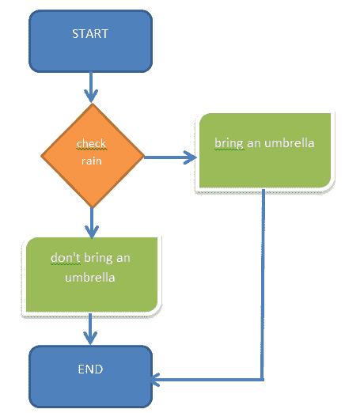

# 基本 JavaScript:“if…else”语句

> 原文：<https://javascript.plainenglish.io/basic-javascript-part-6-if-else-javascript-e9ff21cac4a3?source=collection_archive---------10----------------------->

## 第 6 部分:探索 JavaScript 中的“if…else”语句


你好，你们都是朋友吗？我希望你永远健康和成功。我们将继续 JavaScript 教程。之前我们讨论了 JavaScript 中的操作符。这次我们将看看 JavaScript 中运算符的实现。

当我们在日常生活中决定一些事情时,“if…else”经常出现。比如你出门看天气，到底带不带伞？今天到底会不会下雨？如果天气要下雨，你就带把伞，如果天气晴朗，你就不带伞。我们在下面的流程图中对此进行了说明:



您之前以编码的形式实现了流程图。

```
var rain = true;if(rain == true){
  console.log("bring an umbrella");
}else{
  console.log("don't bring an umbrella");
}
```

请注意上面的代码，因为我们创建了值为 true 的变量 rain，那么我们将得到*“带把伞”*，如果我们用 false 值替换它，将得到*“不要带伞”*。

我们将介绍几个例子:

1.  “if”语句
2.  if…else 语句
3.  “if…else if”语句

# if…else 语句

“if…else”语句是一个常用于在代码中创建条件的函数。

```
if( condition )
   statement;
```

使用了 5 种陈述:

1.  “if”语句
2.  if…else 语句
3.  “if…else if”语句
4.  真理
5.  福尔西

另外，学习以前的教程:

[基础 JavaScript 第三部分:变量](https://temanngoding.com/en/basic-javascript-part-3-variables/)

[基础 JavaScript 第 4 部分:JavaScript 数据类型](https://temanngoding.com/en/basic-javascript-part-4-javascript-data-types/)

[基础 JavaScript 第 5 部分:JavaScript 运算符](https://temanngoding.com/en/basic-javascript-part-5-javascript-operators/)

# “if”语句

if 语句是一个基本的控制语句，允许 JavaScript 做出决定并有条件地执行语句。下面是一个 If 语句的例子。

```
if (condition) {
   code execution;
}
```

这个条件将给出一个选择，如果条件为真，那么代码将被执行，否则，代码将不被执行。

我们尝试使用数学运算符对这种情况进行编码。

```
var nilai = 75;
 if( nilai > 60 ) {
    console.log("Good");
 }
```

# If Else 语句

此语句允许您对条件执行的结果有更多的控制。并且如果条件评估为假，则给出输出。

```
if (condition) {
   true;
} else {
   false;
}
```

在上面的例子中，我们将得到值为 true 和 false 的结果。我举了一个在 JavaScript 中使用数学运算符的例子。

```
var nilai = 75;
 if( nilai > 60 ) {
    console.log("Good");
 }else{
    console.log("Not Good");
}
```

# If Else If 语句

该功能旨在为给定条件提供多个选项。这里我举一个例子:

```
if (condition_1) {
   condition 1
} else if (condition_2) {
   condition 2
} else if (condition_3) {
   Condition 3
} else {
   False;
}
```

上面的代码是一系列 if else if 语句函数。也就是根据期望的条件给出几条语句，当根据现有条件没有更多语句时，就会给出一个假值。

```
var Student = "ari";
 if( student == "ari" ) {
     console.log("This is Ari");
 } else if( student == "budi" ) {
     console.log("This is budi");
 } else if( siswa == "andi" ) {
     console.log("This is Andi");
 } else {
     console.log("no students");
 }
```

# 真实与虚假

当我们使用 if 条件函数和循环时，真值和假值是非常重要的。

让我们用一个例子*条件语句*来找出我们为什么需要知道真值和假值的原因。

```
if ('') {
  console.log('hello world');
}
```

在上面的例子中，我们没有输入布尔值，而是输入了一个空字符串。

那么，如果把一个空字符串转换成布尔值，结果是什么呢？`true`还是`false`？

这就是我们需要知道真假值的地方。

转换为布尔值的空字符串将是`false`，因此上面例子中的代码`{ ... }`不会被执行。

将值转换为布尔值

JavaScript 中的每个值也继承一个布尔属性。这个值被称为*真值*或*假值*。真值是指计算后将返回 true 的值，false 则为 false。那么哪些是真的，哪些是假的呢？除了布尔值 false 之外，被视为 false 的数据类型或值还包括:

*   数字 0
*   BigInt 0n
*   空字符串，如""或""
*   空
*   不明确的
*   楠，还是不是一个数字

示例，未经转换:

```
console.log(''); // ''
```

上面的代码将返回一个空字符串，而不是布尔值。

但是如果我们转换，它将返回一个布尔值。

```
console.log(!!''); // false
// or
console.log(Boolean('')); // false
```

# 真理

Truthy 是一个当它获得一个布尔值时具有真值的值。

这是一个列表，如果我们将其转换为布尔值，它将返回 true:

ValueDescription `'hello'`字符串包含包含`'hello'`、`"hello"`、`hello1`以外的正数或负数`0`和`-0`整数或分数`1n` BigInt 除了`0ntrue`布尔`true{}`对象包含或不包含`[]`数组包含或不包含`Infinity`值`Infinity-Infinity`值`-Infinity`

# 福尔西

与 truthy 相反，falsy 是在布尔上下文中遇到时要转换为`false`的值。

下面是一个值列表，当转换为布尔值时，这些值将是`false`:

ValueDescription `''`，空字符串("，"，")，数字`0`，包括`0.0`，和`0x0`，负数或正数`0n`，BigInt `0`，布尔`false`，`null`值，`nullundefined`值，`undefinedNaN`值，`NaN`。

本教程就到这里，希望有用。

***感谢。***

*更多内容看* [***说白了就是***](https://plainenglish.io/) *。报名参加我们的* [***免费每周简讯***](http://newsletter.plainenglish.io/) *。关注我们* [***推特***](https://twitter.com/inPlainEngHQ) ， [***领英***](https://www.linkedin.com/company/inplainenglish/) *，*[***YouTube***](https://www.youtube.com/channel/UCtipWUghju290NWcn8jhyAw)*，* [***不和***](https://discord.gg/GtDtUAvyhW) *。对增长黑客感兴趣？检查出* [***电路***](https://circuit.ooo/) *。*