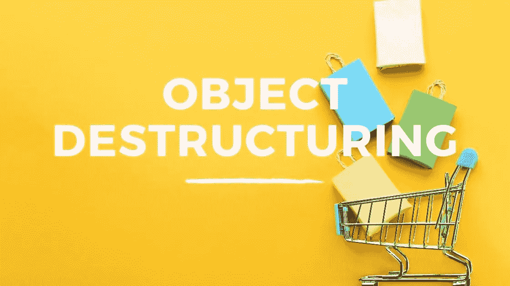

# JavaScript 中对象析构的介绍

> 原文：<https://javascript.plainenglish.io/basic-object-destructuring-in-javascript-7c4538ec70ec?source=collection_archive---------7----------------------->

## JavaScript 中对象析构的初学者指南。



## 什么是解构？

想象一下，你去一家超市，你挑选一些商品，然后把它们装进袋子里。当你一个接一个回家时，你打开这些东西并把它们放好。

当我们编写代码时，我们可以使用析构作为一种方法，从数据结构(如对象和数组)中解包或挑选出某些元素项，然后将这些值放入它们自己的独立变量中。

## 解构对象

当对对象使用析构时，为其分配对象值的变量的名称基于对象属性的名称，而不是数组析构时的元素索引。

当我们析构一个数组时，我们用方括号，当我们析构一个对象时，我们用花括号。下面是一个语法的基本例子。

```
const ourObject = {
  one: 1,
  two: 2
};const {one, two} = ourObject;
```

当您选择想要挑选的对象属性时，顺序并不重要。如果在对象中找到属性名，那么具有该值的变量将使用相同的名称存储在内存中。让我们看一个更具体的例子。

```
const cat = {
  name: "Molly",
  owner: "Fred Larkin",
  color: "Brown",
  age: 10,
  kittens: 0
};const { name, owner } = cat;console.log(name);
//Returns ---> Mollyconsole.log(owner);
//Returns ---> Fred Larkin
```

在上面的例子中，我们创建了一个对象文字，分配给一个名为 *cat* 的变量。该对象包含一些关于猫的属性。然后我们使用析构从*猫*对象中挑选出*名字*和*所有者*属性。当我们从控制台注销这些新变量时，我们可以看到来自对象属性的值已被存储。

## 未定义的属性

如果您试图选择一个在原始对象中不存在的属性，将创建一个具有该名称的变量，但是该变量的值将是未定义的，但是不会抛出任何错误。让我们扩展上面的例子来说明这一点。

```
const cat = {
  name: "Molly",
  owner: "Fred Larkin",
  color: "Brown",
  age: 10,
  kittens: 0
};const { feet } = cat;console.log(feet);
//Returns ---> undefined
```

在上面的例子中，我们试图挑选出属性*foots*，然后将其存储在同名的变量中。当我们控制台注销*英尺*变量时，它返回未定义。在 *cat* 对象中没有*foots*属性，所以没有值分配给变量。

## 重命名属性

如果你想给变量起一个不同于对象中属性的名字，你需要在你从对象中析构属性时设置这个名字。为此，您可以使用希望从对象中选取的属性的名称、一个冒号和希望存储该值的变量的名称。让我们看一个例子。

```
const cat = {
  name: "Molly",
  owner: "Fred Larkin",
  color: "Brown",
  age: 10,
  kittens: 0
};const { kittens: children } = cat;console.log(children);
//Returns ---> 0
```

在上面的例子中，我们挑选出了*小猫*属性。我们将它存储在一个名为 *children* 的变量中。当我们从控制台注销*子*变量时，我们可以看到值为 0，因为它现在包含了来自*猫*对象中*小猫*属性的值。

## 使用 rest 运算符

就像我们进行数组析构时一样，我们可以使用 rest 操作符将剩余的所有内容收集到一个新变量中。我们将扩展上面的示例，将所有剩余的属性收集到一个名为 remaining 的变量中。

```
const cat = {
  name: "Molly",
  owner: "Fred Larkin",
  color: "Brown",
  age: 10,
  kittens: 0
};const { kittens: children, ...remaining } = cat;console.log(children);
//Returns ---> 0console.log(remaining);
//Returns ---> 
{name: 'Molly', owner: 'Fred Larkin', color: 'Brown', age: 10}
```

在上面的例子中，我们可以看到当我们控制台记录剩余的变量。除了*小猫*属性之外，*猫*对象的所有属性和值都打印到我们的屏幕上。

我希望你喜欢这篇文章，请随时发表任何意见，问题或反馈，并关注我的更多内容！

*更多内容看* [***说白了就是***](https://plainenglish.io/) *。报名参加我们的* [***免费周报***](http://newsletter.plainenglish.io/) *。关注我们关于*[***Twitter***](https://twitter.com/inPlainEngHQ)*和*[***LinkedIn***](https://www.linkedin.com/company/inplainenglish/)*。加入我们的* [***社区***](https://discord.gg/GtDtUAvyhW) *。*