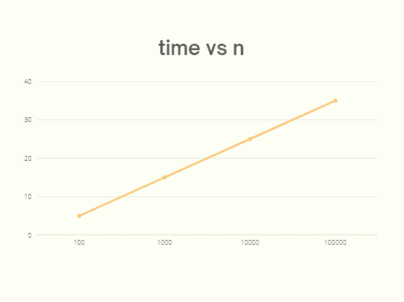
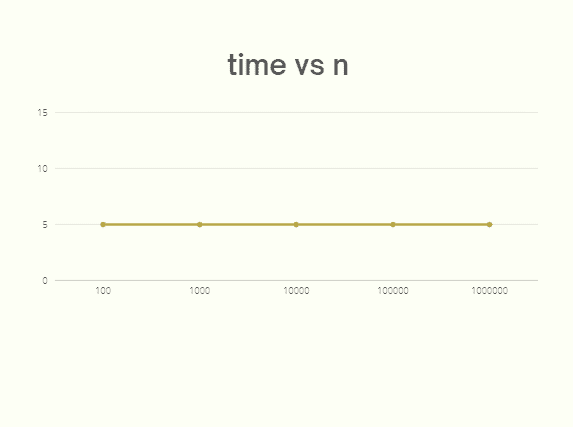

# JavaScript 算法入门

> 原文：<https://javascript.plainenglish.io/basics-of-javascript-algorithms-bbc0ddb785c2?source=collection_archive---------10----------------------->

## JavaScript 算法基础第 1 部分:什么是算法？*一个* ***解决一个* ***特定问题*** *时必须遵循的一套规则*** *。*


Photo by [Markus Spiske](https://unsplash.com/@markusspiske?utm_source=medium&utm_medium=referral) on [Unsplash](https://unsplash.com?utm_source=medium&utm_medium=referral)

这是理解 **JavaScript** 中**算法**的系列作文的入门文章。以下是迄今为止发表的关于这一主题的文章的综合列表，每当有新的帖子发表时，该列表就会更新。我建议，按顺序读这个。

**第 1 部分**:JavaScript 算法入门

**第二部分** : [推导算法的时间复杂度/大 O](https://medium.com/p/a1b5a3ffcb71)

**第三部分** : [利用渐近分析导出常数时间复杂度 O(1)](https://medium.com/p/e786df20fc7b)

**第四部分** : [递归算法及其时间复杂度 O(n) vs O(2^n)](https://medium.com/p/713856ad4e2)

**第 5 部分** : [使用记忆技术的动态搜索](/dynamic-programming-using-memoization-e1fd31bc9a55)

**第六部分** : [二分搜索法及其时间复杂度](/binary-search-and-its-time-complexity-in-javascript-d3f6e79fe84e)

**第七部分** : [利用主定理导出递归二分搜索法的大 O](/use-master-theorem-to-derive-big-o-of-a-recursive-binary-search-algorithm-7f32249f3f03)

此外，**建议**浏览**这篇介绍性文章**，因为它讲述了**非常基础的算法**，这是**在继续之前了解**的必要条件。

所以，让我们从一个关于算法的最基本的问题开始。

# **什么是算法？**

*一套* ***解决一个* ***特定问题*** *时必须遵循的规则*** *。*

这是你在谷歌上搜索“**算法**就会看到的基本定义。我们来理解一下，这里的“**规则集**指的是解决一个**特定问题**所必须遵循的**系列指令**。这意味着，如果我们对一个问题遵循同样的规则和同样的输入，那么它将总是导致同样的解决方案。这是算法背后的核心思想。

作为一名程序员，我们编写的任何程序都被认为是一个**算法**，因为它遵循上面提到的同样的**基本规则**。例如，如果我们创建一个函数，将一个数与另一个数相加，我们也有一个算法。作为一名程序员，我们的目标是找到解决问题的最有效的方法。这意味着我们将总是寻找**最佳可用解决方案**来解决特定问题，因为有多种方法来解决它。我们现在面临的问题是，我们如何找到最佳解决方案？

## **如何找到可能的最佳算法？**

当我们谈论找到给定问题的最佳解决方案时，我们可以考虑以下事情:

*   ***是消耗内存最少的算法吗？***
*   ***是代码量最少的算法吗？***
*   ***是耗时最少的算法吗？***

最佳解决方案很可能取决于我们工作的条件。**但通常它是执行**所需时间最少的一个。因此，我们应该寻找执行时间最少的算法。但是，我们如何测量一个算法的时间呢？

## **测量算法的时间复杂度(使用时间差)**

让我们用一个例子来看看我们如何测量一个算法的时间复杂度。

## **例题**

编写一个函数，将数字作为输入，然后返回所有数字的总和。

**函数:**这个函数可以用 JavaScript 实现如下。

```
const n = [1, 2, 3, 4, 5];    // Input**function sum(n) {
  let total = 0;
  for (let index = 0; index < n.length; index++) {
    total += n[index];
  }
  return total;
}**console.log(sum(n));         // 15 
```

上面的函数以一个数字数组作为参数，用 0 初始化总数，然后在 for 循环中我们遍历数组中的所有数字，加到总数中，最后返回总数。

例如，如果我们用数组[1，2，3，4，5]调用函数，那么我们得到的结果是 15 ( *i* )。e 1 + 2 + 3 + 4 + 5)。所以这是我们解决上述问题的第一个算法。

***现在，让我们来看看如何测量它所花费的时间。***

为此，**一个简单的方法是通过计算函数**开始和结束时间的差值来测量时间。这可以通过 JavaScript 实现，如下所示。

```
let startTime = 0;
let endTime = 0;
let timeToExecute = 0;**startTime = performance.now();**
sum([1, 2, 3, 4, 5]);
**endTime = performance.now();**
**timeToExecute = endTime - startTime;**
```

`**timeToExecute**` 会给我们函数的**执行时间**。让我们试着找出几个**不同参数**的函数所用的时间。我们将在两个独立的设备上执行此操作，一个在较慢的设备上执行，另一个在较快的设备上执行。

**在较慢的设备上执行上述功能:**

```
sum([1,2,3,4,5,6,7,8,9,10]);
**// 0.19999980926513672 -> Time**sum([1,2,3,4,5,6,7,8,9,10,11,12,13,14,15,16,17,18,19,20,21,22,23,24,25,26,27,28,29,30]);
**// 0.2999999523162842  -> Time**sum([1,2,3,4,5,6,7,8,9,10,11,12,13,14,15,16,17,18,19,20,21,22,23,24,25,26,27,28,29,30,31,32,33,34,35,36,37,38,39,40]);    
**// 0.40000009536743164  -> Time**
```

**在更快的设备上执行上述功能:**

```
sum([1,2,3,4,5,6,7,8,9,10]);  
**// 0  -> Time**sum([1,2,3,4,5,6,7,8,9,10,11,12,13,14,15,16,17,18,19,20,21,22,23,24,25,26,27,28,29,30]);
**// 0  -> Time**sum([1,2,3,4,5,6,7,8,9,10,11,12,13,14,15,16,17,18,19,20,21,22,23,24,25,26,27,28,29,30,31,32,33,34,35,36,37,38,39,40]);
**// 0  -> Time**
```

现在，如果我们在速度较慢的设备和速度较快的设备上查看结果输出，您会发现时间并不总是相同。**在慢速设备上，它随着数组大小的增加而逐渐增加**。但是，在更快的设备上，它是常数。

同样，如果我们对同一问题有另一种解决方案，我们认为这种解决方案比上面的实现更快，但在同样的时间内，即在更快的设备上 **0** ，那么我们就很难在这两种解决方案中找出最佳解决方案。**所以，根据这些具体的数字来测量时间并不是正确的方法。因为它有很多与我们算法无关的**影响因素**。比如我们正在运行的**设备硬件**上的事项。**

在旧设备上，正如我们上面看到的，我们看到不同的数字。可能还有其他影响因素，如后台运行的进程数量、可用内存量减少等。那么，我们应该如何测量功能时间呢？

## 衡量算法的时间复杂度(使用模式)

答案在于我们在不同输入下看到的模式，我们将在这里参考来自**较慢设备**的结果，这里**倾向于花费更长的时间用于数组**中传递的更多数字。

一般来说，我们可以说，数组中的数字越多，花费的时间就越长。此外，该模式中有一点似乎很常见，那就是随着数组大小的增加**时间也会增加**。事实上，我们应该这样看待它。

我们不应该太在意具体的数字，因为这些数字取决于如上所述的环境中的许多因素。但是我们应该一直寻找这种和类似的**一般**模式。对于这个函数，如果你想画一个图，大概是这样的。



这是一个**线性图**，因为我们在上面的函数中看到的**模式**是线性的。我们看到，函数所花费的时间随着数组大小的增加而增加。并且，这个**时间的增加与数组大小的增加**成比例。所以我们可以说增长是线性的，因此这里有一个线性增长函数。

*我们增加输入的因子，在我们的例子中是****【n】****(即数组中的数字)，是时间函数增加的因子。*

当我们谈论算法时，这就是我们如何判断一个性能的。我们着眼于时间的功能，即**我们看到的**模式，而不是实际时间，以便能够通过算法对输入的反应时间来评估算法的性能。并且，我们也称这种**为时间复杂度**。在这种情况下，我们可以说`**sum**` 函数和算法具有**线性时间复杂度**。

**上述问题的另一种解决方案(线性 vs 恒定时间)**

在 JavaScript 中，并不是所有的算法都需要线性时间。有时候我们有算法需要**常数时间**。在这种情况下，**的输入数量**不会影响该算法所花费的时间。我们可以通过如下所示修改前面的示例来看到这一点，以接受数字作为不同的参数，而不是一个数组。

```
**function sum(n1, n2, n3, n4, n5) {
  return n1 + n2 + n3 +n4 +n5;
}**sum(1, 2, 3, 4, 5)   // 15
```

在这种情况下，该函数接受五个参数，并返回所有参数的总和。这也是解决上述问题的另一种方法，我同意这不是最优的解决方案，因为参数的数量是固定的，如果我们需要更多的数字来传递参数，那么我们将不得不为它建立另一个函数。

但是，它仍然解决了问题，即计算所有通过的数字的总和。但是，当我们比较这两种功能时，这里有一个重要的区别需要注意。**修改后的函数没有循环，而是有一个单独的数学公式**。

现在，如果我们尝试通过使用与我们应用于前一个循环函数相同的参数执行上述函数来**测量时间**，您将会看到这里的结果是**常数**。

```
sum(1,2,3,4,5,6,7,8,9,10);
**// 0  -> Time**sum(1,2,3,4,5,6,7,8,9,10,11,12,13,14,15,16,17,18,19,20,21,22,23,24,25,26,27,28,29,30);
**// 0  -> Time**sum(1,2,3,4,5,6,7,8,9,10,11,12,13,14,15,16,17,18,19,20,21,22,23,24,25,26,27,28,29,30,31,32,33,34,35,36,37,38,39,40);
**// 0  -> Time**
```

而且，不管我们给它传递多少参数，它都保持不变。我们在这里也没有任何模式，因为我们以前有不同的阵列大小。我们可以将此视为恒定时间的**例子。时间复杂度不变的图看起来像这样。**



因此，通过比较上述两种算法的时间复杂度，即带有循环的**函数** ( ***参考较慢设备*** 的结果)和带有数学公式的**函数，我们可以说一个具有**线性**时间复杂度，另一个具有**常数**时间复杂度。**

## 模式方法可靠吗？

然而，这里有一个问题，**如果我们在一个非常快速的设备上执行这两个函数，从而产生恒定的时间值，会怎么样？我们在这里做什么？因为我们刚刚遵循的模式方法不能被应用，因为那里没有模式，因为结果是恒定的。**

在这种情况下，我们可能会做出**不正确的判断**，并将两个函数的**时间复杂度**视为**常数**，这与我们刚刚看到的较慢设备示例不同。因此，**即使这种通过识别基于时间的模式来识别函数的时间复杂度的技术也是不可靠的，因为它受到许多因素的影响**。但是，我们确实有一个可靠的方法来评估算法，我们将在以后的帖子中关注它。

[**下一步- >推导一个算法的时间复杂度/大 O(渐近分析)**](https://medium.com/@code.ceeker/basics-of-javascript-algorithms-part-2-a1b5a3ffcb71)

感谢您的阅读。

*更多内容请看*[***plain English . io***](https://plainenglish.io/)*。报名参加我们的* [***免费周报***](http://newsletter.plainenglish.io/) *。关注我们关于*[***Twitter***](https://twitter.com/inPlainEngHQ)[***LinkedIn***](https://www.linkedin.com/company/inplainenglish/)*[***YouTube***](https://www.youtube.com/channel/UCtipWUghju290NWcn8jhyAw)*[***不和***](https://discord.gg/GtDtUAvyhW) *。对增长黑客感兴趣？检查* [***电路***](https://circuit.ooo/) *。***