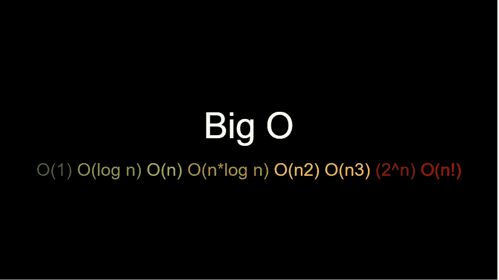
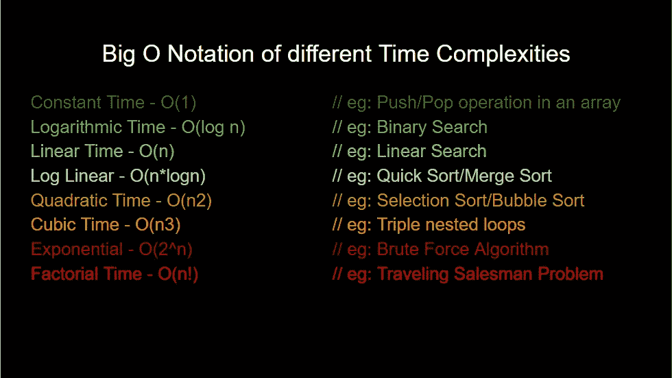
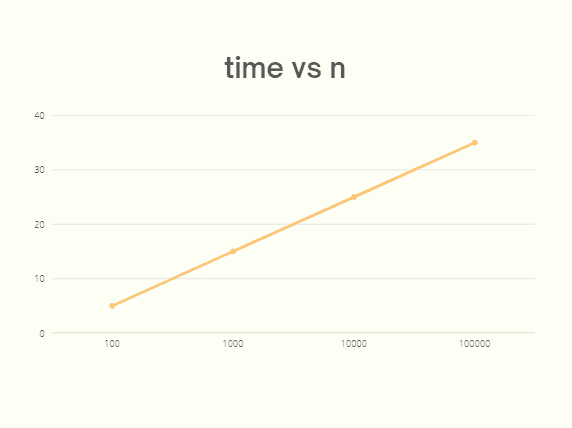
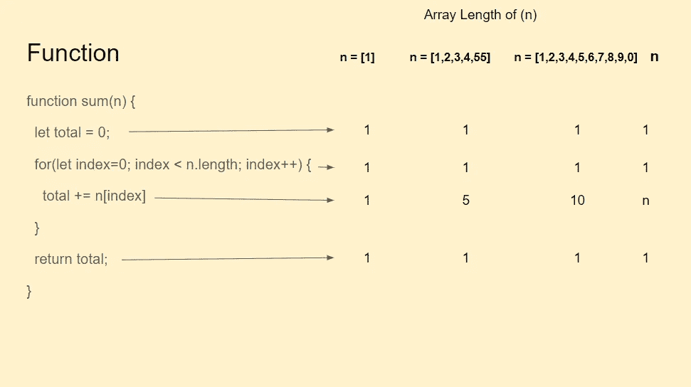

# 推导算法的时间复杂度/大 O

> 原文：<https://javascript.plainenglish.io/basics-of-javascript-algorithms-part-2-a1b5a3ffcb71?source=collection_archive---------4----------------------->

## JavaScript 算法基础第 2 部分:探索一种更好的机制来推导算法的时间复杂度。


Photo by [Markus Spiske](https://unsplash.com/@markusspiske?utm_source=medium&utm_medium=referral) on [Unsplash](https://unsplash.com?utm_source=medium&utm_medium=referral)

本文是上一篇文章的延续，在上一篇文章中，我们研究了**算法**和**时间复杂度**的基础知识。如果你还没看过，这里有上一篇文章的链接。

[*JavaScript 算法基础—第一部分*](https://medium.com/@code.ceeker/basics-of-javascript-algorithms-bbc0ddb785c2)

我们还看到了如何通过识别函数在**不同输入**下的**模式来**评估算法**的时间复杂度。但是，如前一篇文章所述，这种基于时间模式评估时间复杂度的方法**并不可靠**，因为它还依赖于**其他因素**。**

因此，我们需要一个**更好的机制来推导算法**的时间复杂度，它独立于任何其他因素。我们将在本文中探讨这种机制。

但是，在开始之前，让我们先了解一下**大 O 符号**。

# 大 O 符号



除了**线性**和**常数**时间，我们还发现有**对数**时间、**二次**时间，甚至**三次**时间的算法。还有很多其他的时间复杂性。不过这些都是**常见的**。

在我们之前的文章中，我们能够得出结论，具有循环解的函数具有线性时间复杂度，而具有数学解的函数具有恒定时间复杂度。但是如果我们必须用一种标准的方式来表现它或传达它，那我们该怎么做呢？

在编程中，我们用叫做**大 O 符号**的东西来表示这一点。这让我们更容易表达给定算法的**时间复杂度。一个**大 O 符号**长这样，按照**性能**从**好到最差**的顺序排列。**



大 O 符号是比较的**标准方式**和代表算法性能的**。我们推导出一个算法的**大 O** ，然后我们知道 **O(n)** 是线性的， **O(1)** 是常数。这里的 **(O)** 表示**功能的**顺序。此外，我们使用这个符号来表达任何算法的复杂性。**

现在，既然我们已经清楚了大 O 符号，让我们看看推导算法的**大 O 的实际方法。**

# **推导时间复杂度/大 O(渐近分析)**

在前一篇文章中，我们了解到我们应该关心**功能模式**，而不是具体的时间数。因此，对于一个循环函数，我们可以说它有一个时间复杂度为 O(n) 的解，这仅仅意味着它具有线性时间复杂度。

但是，这是通过**比较函数**的时间值来完成的，我们已经知道**不是一个可靠的解决方案，因为它取决于其他因素**。那么，**我们怎样才能导出这个呢？**

> 为此，我们使用一种叫做渐近分析的技术。

它包括几个简单的步骤。首先，对于给定的算法，我们**定义它的函数**。这里我指的是我们写给**的**数学函数**得到一个图形**，就像我们在线性函数中看到的一样。因此，我们需要推导出数学函数，最终**将导致如下**所示的线性图。让我们看看如何推导它。



这听起来可能很吓人，但并不难。**我们需要做的就是计算函数**中表达式执行的次数。大致来说，**函数中的每一行代码**，我们**计算它被执行的频率**。

*请注意，用这种方法，我们不会得到真实的、* ***毫秒或秒的时间*** *。理解这一点很重要，因为现在我们对***不再感兴趣，因为它不可靠，受太多方面的影响。**

*事实上，我们简单地**假设 JavaScript 中的每个表达式花费大致相同的时间**。 ***然后可以对表达式执行的次数进行计数，然后可以简单地将该次数与另一个替代函数*** 的次数进行比较。*

*这就是我们在这里要采取的方法。让我们来看看循环函数的几个场景。*

**

*我们将数组输入的**长度定义为 **n 因子**。我们将发现具有不同长度数组的函数的行为***

```
***n = [1]****n = [1,2,3,4,5]****n = [1,2,3,4,5,6,7,8,9,0]***
```

*在所有情况下，我们遍历函数中的每一行表达式，看看它执行了多少次。*

1.  ***第一个表达式，***

*`**let total = 0;**`*

**这是* ***只执行一次*** *在所有情况下都当作只是一次赋值。**

*2.**for 循环初始化的下一个表达式，***

*`**for(let index = 0; index < n.length; index++)**`*

**由于这也是一次初始化，在所有三种情况下，它只执行一次***。***

**3.**接下来，我们有 for 循环的主体，****

**`**total += n[index];**`**

***在这里你会看到* ***的结果是不同的*** *，对于* ***数组长度为 1 的*** *，它只执行一次****但是对于* ***数组长度为 5 的*** *，* **而且，这是 ***重要要注意的*** *。*******

****4.**然后我们有一个返回语句，******

****`**return total;**`****

*****也是在所有情况下只执行一次。*****

****如果我们看到所有三种情况下表达式的代码执行，我们再次看到这里的**模式**。对于这个算法，我们可以说函数**唯一的**动态部分**就是循环中的体(** `**total += n[index];**` **)** 。而这个体被执行的次数**就是我们给这个函数的数组**的**长度。******

****因此，对于 **n = n(数组的 n 长度)**，其他三个表达式将只运行一次，而**循环中的代码(** `**total += n[index];**` **)** 将执行 **n 次**。这样，我们现在可以从**导出一个函数**。****

****如果我们想用 **T** 来表示这里的时间复杂度，那么我们可以说，对于 **n** = n 的情况，我们得到的这个函数的代码执行次数是(1 + 1 + **n** + 1)，即****

```
****n=[1]                   -> **T** = 1 + 1 + **1** + 1
n=[1,2,3,4,5]           -> **T** = 1 + 1 + **5** + 1
n=[1,2,3,4,5,6,7,8,9,0] -> **T** = 1 + 1 + **10** + 1
**n=[n]                   -> T = 1 + 1 + n + 1******
```

****因此，****

****`**T = 1 + 1 + n + 1**`****

****我们可以总结为，****

****`**T = n + 3**`****

****这也可以写成，****

****`**T = 1*n + 3**`****

****这是**数学函数方程**，它将**描述**我们对上述 JavaScript 函数的**代码执行次数**。****

****它没有描述这个函数需要多少毫秒或多少秒，因为这很难量化。但是，**如果我们假设每一行代码执行**花费的时间大致相同，那么我们可以使用这样一个等式**将这个算法与其他算法**进行比较。****

****因此，我们可以将其一般化，并将等式写成:****

```
******T = a*n + b            (1 is replaced by 'a' & 3 is replaced by 'b')******
```

****现在，为了让**得到大 O 符号**，我们需要**找到函数**中增长最快的项。这很简单，真的，****

****`**a*n**`****

****因为 **b** 是一个**常数系数**那个**根本不增长**。总是一模一样的数字。因此我们可以忽略它。另一方面，`**a*n**`实际上取决于 **n** 并且对于更大的 **n** ，该项也更大。****

****既然我们找到了增长最快的项，`**i.e a*n**` 把系数`**a**` 从那个项中去掉是因为我们**不关心现在**的确切数字，我们关心的是概貌。**这个过程在这里叫做渐近分析**。****

****现在，我们可以把它缩小到下面的函数方程。****

****`**T = n**`****

****这清楚的告诉我们，这个函数的**时间复杂度**取决于 **n** 。并且，那个 **n** 就是我们放在**大 O 符号**的括号之间的东西，即****

******O(n)******

****因此，****

******T = O(n)******

******这就是为什么我们称之为 n 的大 O，对于一个线性函数表示为 T = O(n)。******

****同样，我们可以用上面的**渐近分析的方法来推导任何算法的大 O。与我们之前使用的时间函数方法相比，它不依赖于任何其他因素，更加可靠。******

****[*下一步- >利用*渐近分析*导出常数时间复杂度的大 O。*](https://medium.com/@code.ceeker/derive-constant-time-complexity-o-1-using-asymptotic-analysis-e786df20fc7b)****

****感谢您的阅读。****

*****更多内容请看*[***plain English . io***](https://plainenglish.io/)*。报名参加我们的* [***免费周报***](http://newsletter.plainenglish.io/) *。关注我们关于*[***Twitter***](https://twitter.com/inPlainEngHQ)[***LinkedIn***](https://www.linkedin.com/company/inplainenglish/)*[***YouTube***](https://www.youtube.com/channel/UCtipWUghju290NWcn8jhyAw)*[***不和***](https://discord.gg/GtDtUAvyhW) *。对增长黑客感兴趣？检查* [***电路***](https://circuit.ooo/) *。*******