# React 17 或更早版本中的批量更新

> 原文：<https://javascript.plainenglish.io/batch-updates-in-react-17-or-earlier-versions-5f76d58e3af1?source=collection_archive---------2----------------------->

## 对 setTimeout、promises 和本机事件处理程序中的多个 setState()调用进行批量更新


Photo by [Julian Hochgesang](https://unsplash.com/@julianhochgesang?utm_source=unsplash&utm_medium=referral&utm_content=creditCopyText) on [Unsplash](https://unsplash.com/s/photos/batch?utm_source=unsplash&utm_medium=referral&utm_content=creditCopyText)

TLDR；如果你在 React 18 上，那么你不需要担心批量更新，因为 React 18 的批量更新功能是内置的。但是如果你使用 React 17 或者更早的版本，你可能需要看到这个。

话虽如此，让我们深入了解批量更新。

# 什么是批量更新？

React 的一个特性或功能，它将多个状态更新调用批处理到一个更新中，并且只使用更新的数据呈现一次 UI。

在合成事件和钩子的情况下，React 会为我们做这件事，除非我们不在任何异步函数中调用状态更新。

下面是它的演示:

# 合成事件下的批量更新

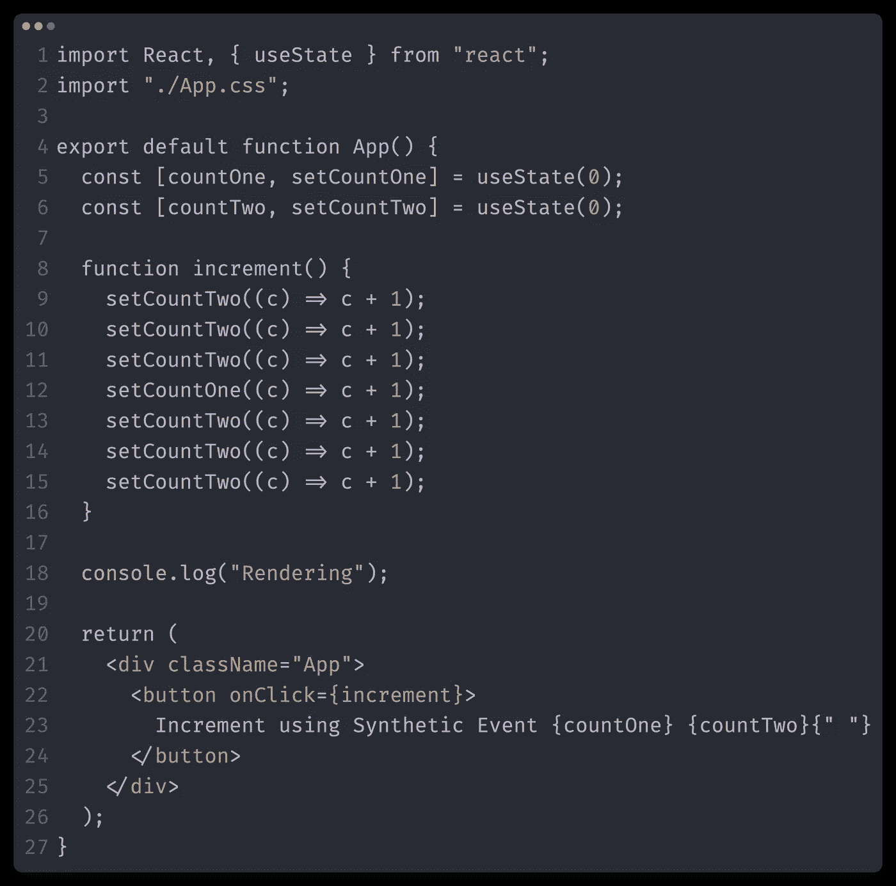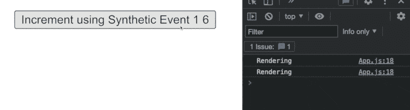

# 挂钩下的批量更新:

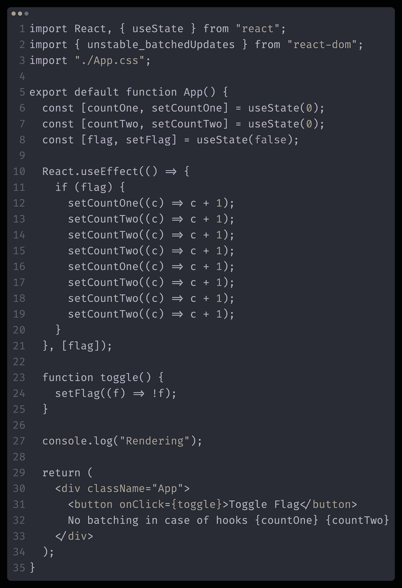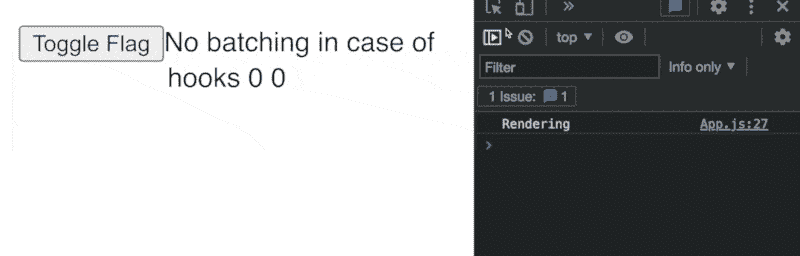

# 但是，当在任何异步方法或任何本机事件处理程序中进行 setState 调用时，React 不会批量更新

本地事件处理程序是指使用`addEventListener`方法添加的任何事件。

# 1.setTimeOut 下没有批量更新

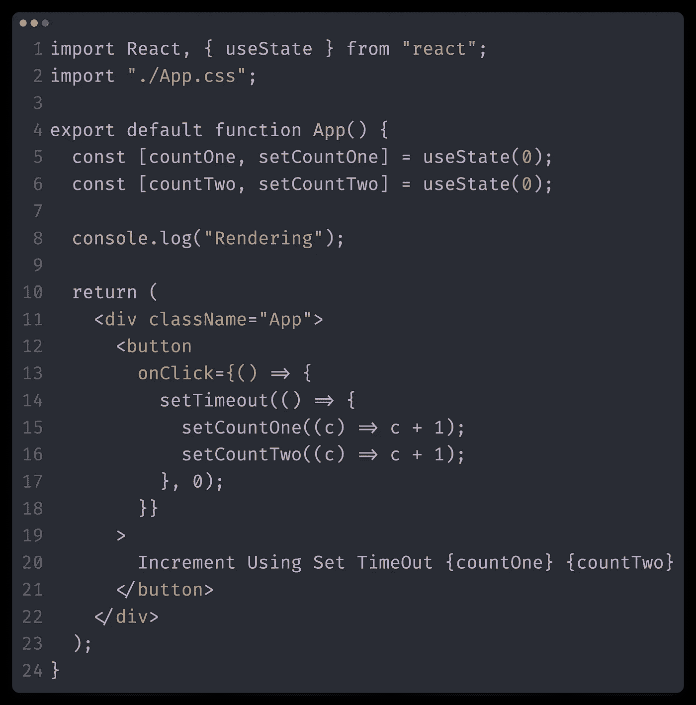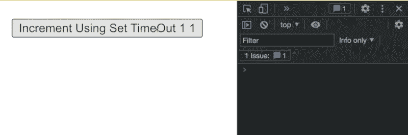

each setState will render the component

# 2.承诺下没有批量更新

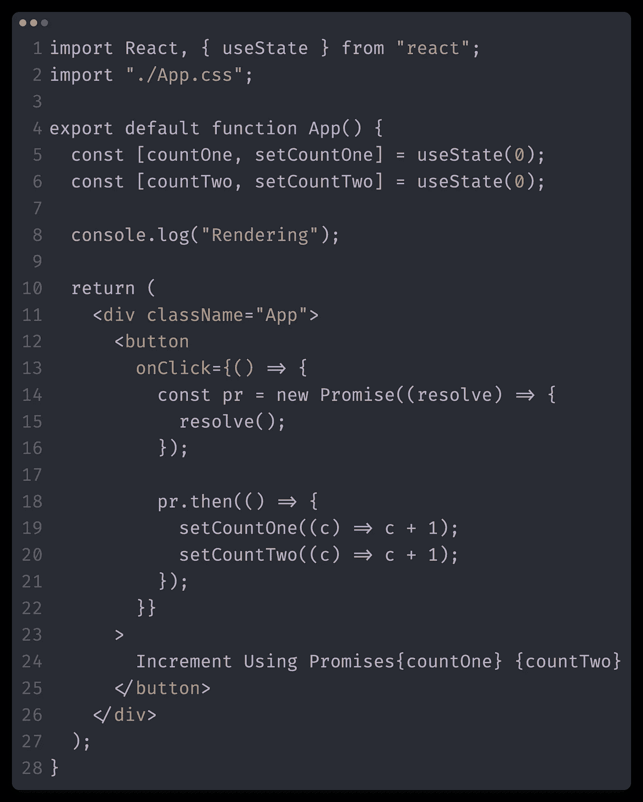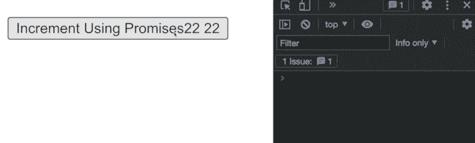

each setState will render the component

# 3.本机事件处理程序中没有批量更新

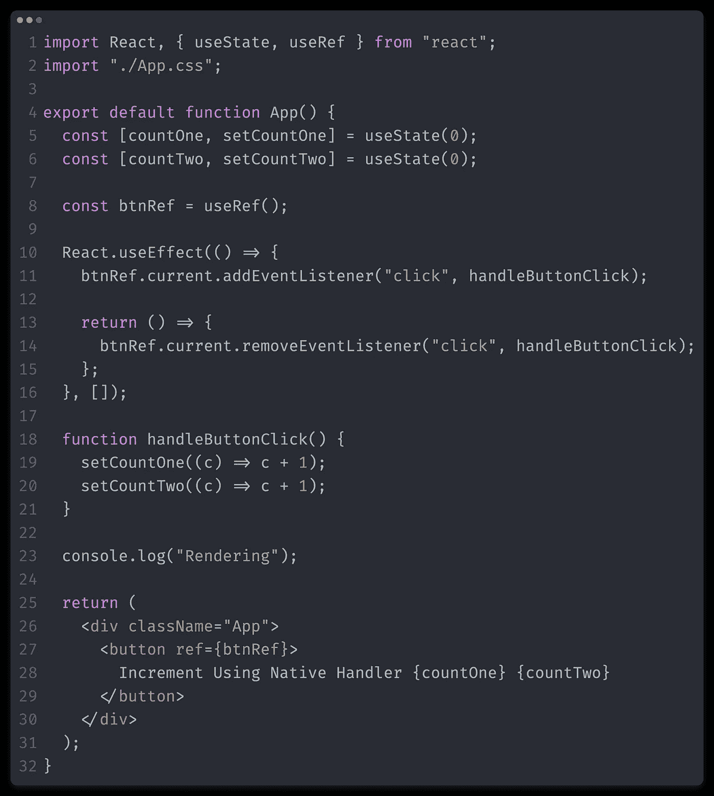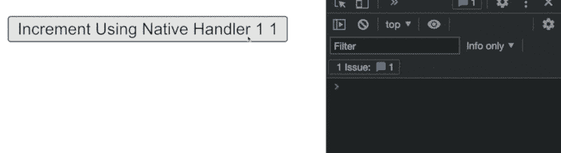

each setState will render the component

# 那么，在上述所有情况下，我们如何实现批量更新呢？

在这种情况下,`unstable_batchedUpdates`会出手相救。这是作为实验特性添加的。但它确实起作用了。

**unstable_batchedUpdates** 是一个函数，可以从`react-dom`导入，并带有一个回调函数。在回调函数中，我们可以调用多个状态更新，这些状态更新在最后被批处理。

而在`setTimeout,` `promises,` `native event handles`和`inside hooks`里面简单的调用这个函数

```
import { unstable_batchedUpdates } from "react-dom";setTimeout(()=> { unstable_batchedUpdates(*()* => { setCountOne(*(c)* => c + 1); setCountTwo(*(c)* => c + 1); // All other state updates, which will be clubbed into   one. });
},0)
```

# 在 setTimeout 内批处理多个设置状态调用

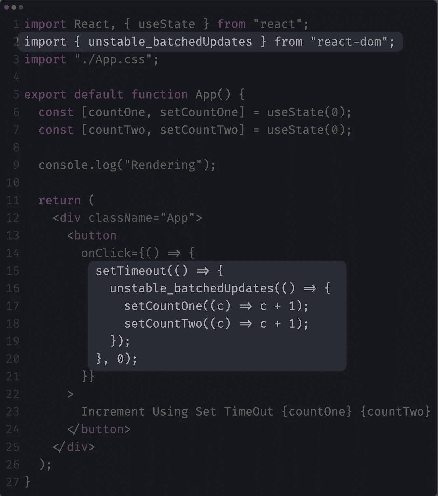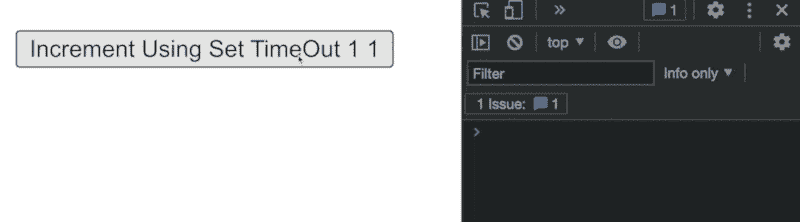

# **在承诺内批处理多个 setState 调用**

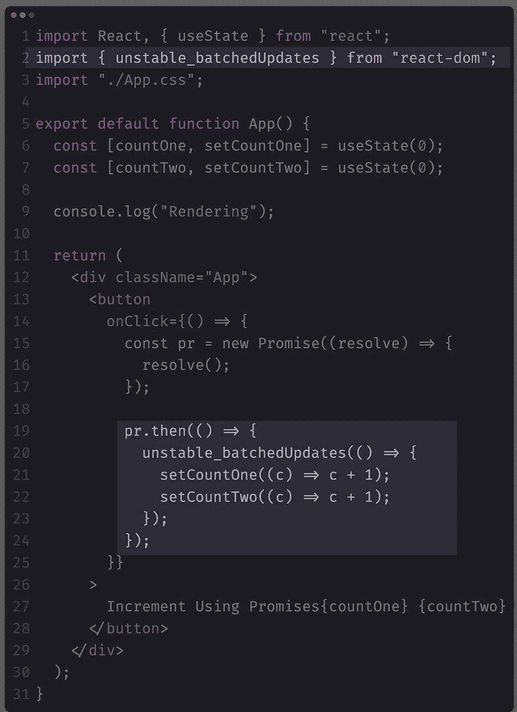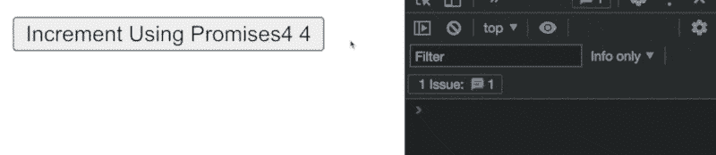

# 在本机事件处理程序中批处理多个设置状态调用

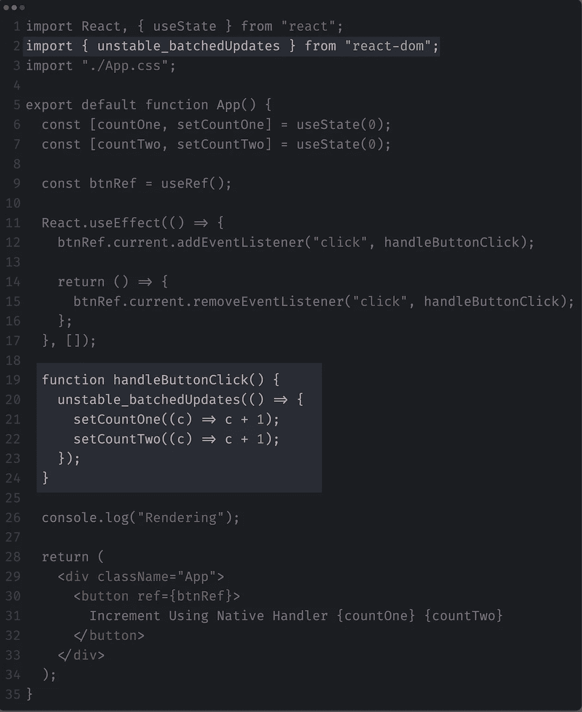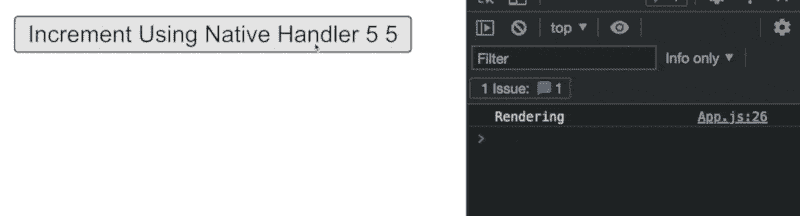

明智地使用`unstable_batchedUpdates`，因为按照 Dan Abramov 的说法，这是一个不稳定的 API。
但是 IMO 对于某些情况，我们可以像这样暴露使用一样使用这个，那么我认为不会造成太大的麻烦。

*更多内容请看*[***plain English . io***](https://plainenglish.io/)*。报名参加我们的* [***免费周报***](http://newsletter.plainenglish.io/) *。关注我们关于*[***Twitter***](https://twitter.com/inPlainEngHQ)[***LinkedIn***](https://www.linkedin.com/company/inplainenglish/)*[***YouTube***](https://www.youtube.com/channel/UCtipWUghju290NWcn8jhyAw)*[***不和***](https://discord.gg/GtDtUAvyhW) *。对增长黑客感兴趣？检查* [***电路***](https://circuit.ooo/) *。***