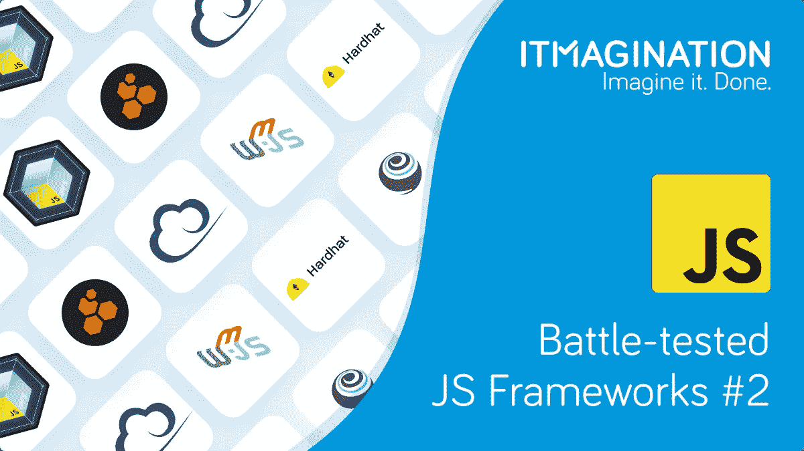
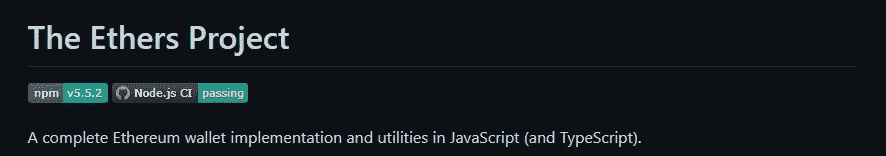
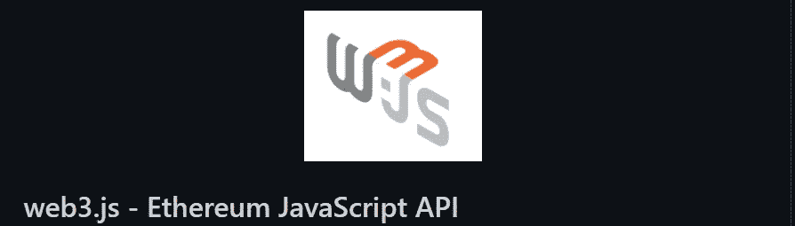
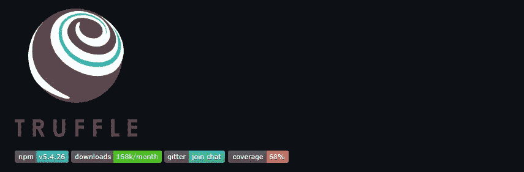
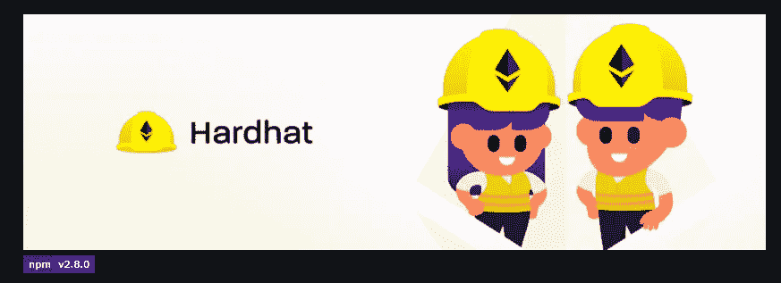

# 久经考验的 JavaScript 框架:框架和库简介

> 原文：<https://javascript.plainenglish.io/battle-tested-javascript-frameworks-introduction-to-frameworks-and-libraries-e9cf6dc10d1c?source=collection_archive---------17----------------------->

## 久经考验的 JavaScript 框架第 2 部分:介绍用于开发 dApps 的框架和库。

[由于 Web3 开发可能会在 2022 年起飞](https://www.itmagination.com/blog/4-tech-trends-for-2022)，我们花了一点时间来准备这份用于未来 dApp 开发的 Web3 专用工具列表。也就是说，没有多少库和框架专门用于这个目的。从概念上来说，Web2 前端和 Web3 的开发并没有太大的不同，尽管有这些明显的差异。仍然需要开发一个前端。我们仍然需要一个后端，它也有同样的目的。数据库仍然是必需品，因为如果你把所有东西都存储在主链上，你很容易在 Eth2 之前破产。

有了这个简短的介绍，我们现在可以开始向您介绍所有特定的框架和库。

# 与以太坊的区块链互动

## Ethers.js

这个包的目标是成为[“一个简单、紧凑、完整的库，满足你所有以太坊的需求。”从技术上来说，它也不是一个单独的库，而是一组库。有四个:Ethers.provider、Ethers.contract、Ethers.utils 和 Ethers.wallets](https://ethers.org)

**ethers . js pro**

*   完全用打字稿写的
*   相对较小
*   连接以太坊节点的多种方式
*   与 Web3 不同，它没有以太坊基金会的支持(尽管它仍然可以工作)
*   只有一个维护者

## GitHub 知识库

[https://github.com/ethers-io/ethers.js](https://github.com/ethers-io/ethers.js)

## Web3.js

这是第一个出现在现场与以太坊连锁店互动的包。因此，它具有明显的先发优势；由于它可以使用的时间更长，开发者有更多的时间来准备教育材料。

**Web3.js 优点**

*   由以太坊基金会建造
*   第一个出场的人

**Web3.js 缺点**

*   笨重。近 600 kB，而缩小，并压缩。
*   只有一小部分是用 TypeScript 编写的
*   需要运行本地以太坊节点
*   当使用角度大于 11°时，您会遇到问题(尽管这些问题很容易解决)
*   它使用旧的“要求”语句

**GitHub 库**

[https://github.com/ChainSafe/web3.js](https://github.com/ChainSafe/web3.js)

# 开发环境

## 松露

为开发人员提供完整的开发环境，让他们尽可能舒适地从[“从 idea 到 d[A]pp”对于开发者来说，这是两个环境中最受欢迎的，另一个是 Hardhat。即使 GitHub 上的星星没有多大意义，它们也是一个很好的指标，表明一个人可以期望找到多少资源。](https://trufflesuite.com/)

**松露的优点**

*   Mocha 和 Chai 的自动化合约测试。
*   在许可的 MIT 许可下获得许可
*   有一套有用的样板文件(“盒子”)
*   使用 Hyperledger
*   没有 GUI
*   支持智能合约的 [EthPM 包管理器](https://www.ethpm.com/)

**松露 Cons**

*   盒子不太灵活
*   没有 GUI
*   测试不是最容易的

**GitHub 库**

[https://github.com/trufflesuite/truffle](https://github.com/trufflesuite/truffle)

# 建筑工人

Hardhat 是可供 dApp 开发者使用的两个主要开发环境中的第二个。

**安全帽优点**

*   用打字稿写的
*   可以通过插件使用 Truffle 进行测试(@nomiclabs/hardhat-truffle4 和@nomiclabs/hardhat-truffle5)
*   插件的完整生态系统
*   迎合更有经验的 Web3 开发者
*   由以太坊基金会资助

**安全帽缺点** **GitHub 库**[https://github.com/nomiclabs/hardhat](https://github.com/nomiclabs/hardhat)

# 部署

特定于 Web3 的部署选项尚未经过实战检验。ipfs.js 处于 alpha，而 Bee-js(连接到 Swarm)处于 beta。这是肯定的，他们会成熟，虽然不清楚什么时候会发生。正因为如此，我们不会谈论他们。在这里，您可以使用老式的 Vercel 进行部署，就像在终端中键入命令一样简单。自然，AWS、Azure 和 Firebase 也非常适合这项工作。

如果你想尝试一下 Web3 特有的选项，ifps.js 的 GitHub repo 可以在这里[找到，而](https://github.com/ipfs/js-ipfs) [Bee-js](https://github.com/ethersphere/bee-js) 的源代码可以在[这个链接](https://github.com/ethersphere/bee-js)下找到。

# 用户界面

就 UI 而言，你可以使用你最喜欢的框架。React，Vue，或者 Angular，在这里都可以。苗条，地狱，或固体也是可行的，虽然目前默认的选择是反应。该库有很多用途，但也有许多预建的选项，可以减轻你的认知负担。一个例子就是 [useDApp](https://usedapp.io/) 。

# 结论

正如我们提到的:仅支持 Web3 的库的列表比预期的要短。这是更可取的，因为跳上 dApp 宣传列车并不需要太多。唯一的障碍，如果真的有障碍的话，就是学习稳固性。尽管如此，由于这篇文章的大多数读者都是 JavaScript 开发人员，我们还是建议学习 [Solidity](https://soliditylang.org/) 。

如果你想和我们的专家讨论如何开发你的下一个 Web3 应用，请随时[联系我们的首席创新官马尔钦·dąbrowski](https://www.linkedin.com/in/marcin-dabrowski-itm/)。

*原载于*[*https://www.itmagination.com*](https://www.itmagination.com/blog/javascript-frameworks-part-2)*。*

*更多内容看* [***说白了就是***](http://plainenglish.io/) *。报名参加我们的* [***免费周报***](http://newsletter.plainenglish.io/) *。在我们的* [***社区不和谐***](https://discord.gg/GtDtUAvyhW) *获得独家获取写作机会和建议。*