# 久经考验的 JavaScript 框架——数据科学

> 原文：<https://javascript.plainenglish.io/battle-tested-javascript-frameworks-part-3-data-science-f1976db9338d?source=collection_archive---------16----------------------->

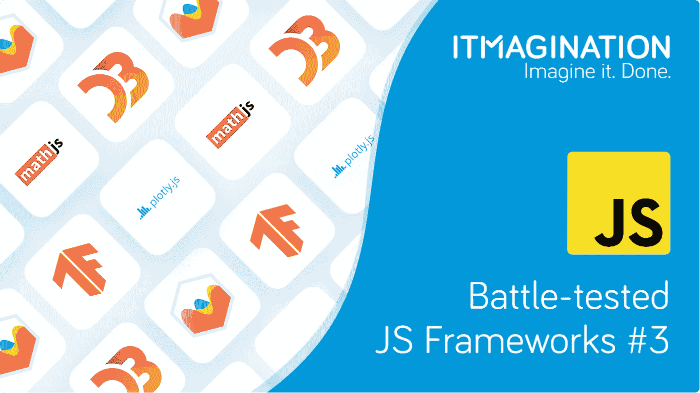

**总结**

*   JavaScript 不是数据科学的通常选择，尽管没有理由说它不工作，特别是对于 TypeScript
*   下面，您可能会发现一些用于数据分析、可视化和复杂数学运算的最可靠的 JavaScript 包；
*   如果没有自己喜欢的 Python 库无法工作，有一个解决方案适合你。Pyodide 让你运行你的。浏览器中的 py 库。

数据科学传统上是 Python 的领域；也许是 R，斯威夫特，或者朱莉娅。在这种情况下想要使用 JavaScript 通常被认为是穿着泥泞的鞋子走进别人的房子。然而，用于数据科学的 JavaScript 是有效的，正如人们所说的“如果它有效，但看起来很愚蠢——它并不愚蠢。”

下面，我们展示了开发人员可以使用 JavaScript 处理、分析和可视化数据的工具。

# 人工智能

## TensorFlow.js

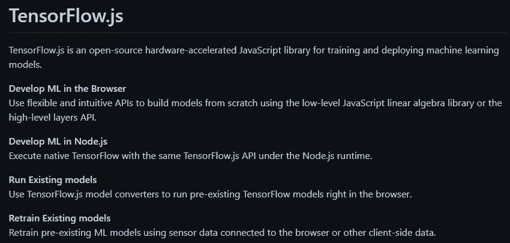

*Source:* [*https://github.com/tensorflow/tfjs*](https://github.com/tensorflow/tfjs)

著名的 TensorFlow 的 JavaScript 版本，这是将满足您的机器学习和深度学习需求的库。在 2018 年宣布，对许多人来说，这甚至是构建智能服务的真正实现。更好的是，这解决了应用程序分发以及与操作系统兼容的问题。为什么要担心平台特有的处理方式呢？让浏览器来帮你处理吧！

如果你想要更多的证据，证明这个库确实是有用的，而不是一个噱头，那么我们有一个视频给你。这是其中一个项目 TeamSportz 的简要概述。Pro，带有用 tf.js 构建的功能。

如果这个视频还不足以说服你，还有很多其他的例子可以让你看看。团队确保你能看到它们，并且[在他们的 GitHub 库中与每个人分享它们](https://github.com/tensorflow/tfjs/blob/master/GALLERY.md#gallery)。

**判决结果**

随着频繁的更新、大公司的支持以及使用 TypeScript 来提供类型安全，我们别无选择，只能告诉您:**开始吧**。没有什么好说的了。

**储存库**[https://github.com/tensorflow/tfjs](https://github.com/tensorflow/tfjs)

# 形象化

## Plotly.js

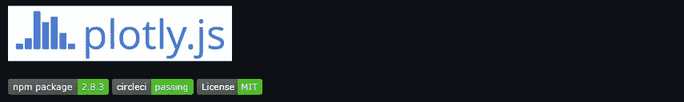

*Source:* [*https://github.com/plotly/plotly.js/*](https://github.com/plotly/plotly.js/)

作为流行的 *plotly* Python 包(通常称为 Plotly.py)的兄弟，“[可用于制作数十种图表类型和可视化，包括统计图、3D 图、科学图表、SVG 和平铺图、金融图表等。](https://github.com/plotly/plotly.js/)

有趣的是，该库还支持更流行的 Plotly.py 包。

**判决结果**

虽然它在 Python 生态系统中非常受欢迎，但在 JavaScript 世界中却不那么受欢迎；部分原因是由于两种语言的不同用法。尽管如此，Plotly.js 对于您未来的任何项目都是一个可靠的选择。

**https://github.com/plotly/plotly.js/回购**T2

## Chart.js

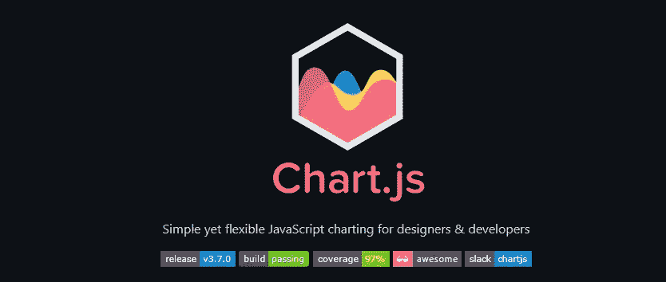

*Source:* [*https://github.com/chartjs/Chart.js*](https://github.com/chartjs/Chart.js)

Chart.js 是一个“简单而灵活”的 JavaScript 图表库，适用于那些想要可视化一些数据的人。

开始真的很简单:下面你可以找到一个基本的设置，它提供了一个样本图表。

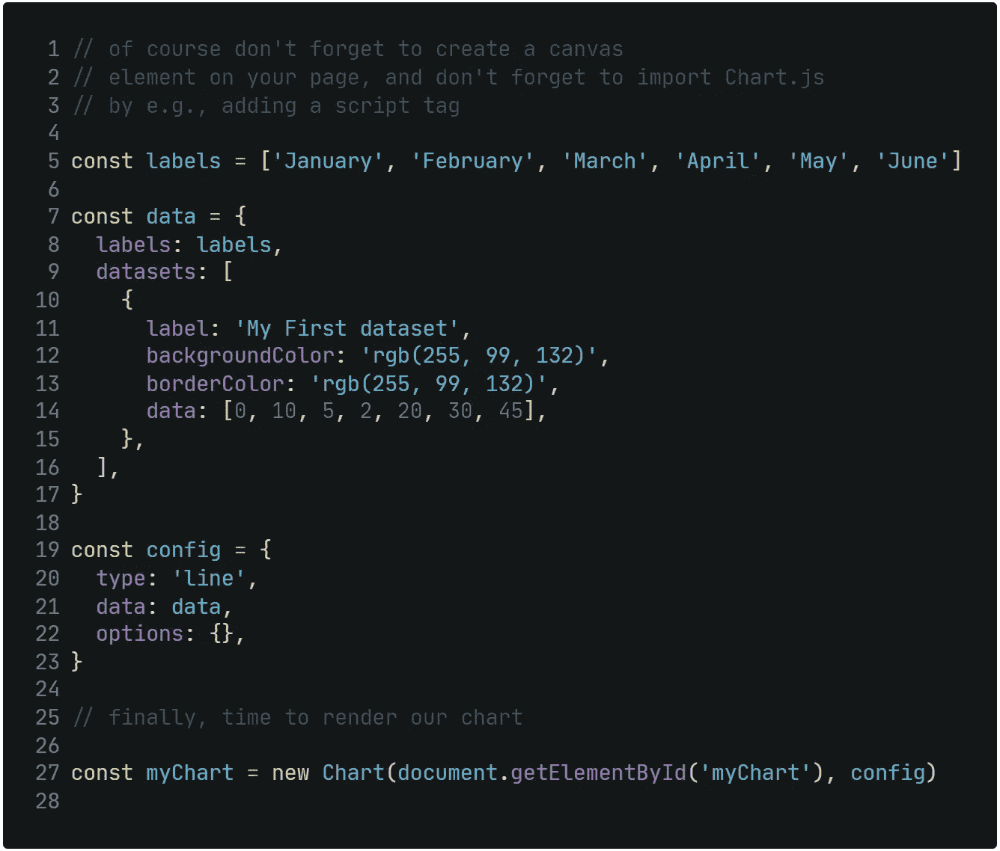

Code Source: [https://www.chartjs.org/docs/latest/getting-started/](https://www.chartjs.org/docs/latest/getting-started/)

‍ **判决结果**

由于设置简单，而且在 GitHub 上有相当多的 starts，所以它非常受欢迎，这是一个可靠的选择。唯一令人担心的是它的大小:根据 bundlephobia 的说法，它有…~ 64 kB (minified + gzipped)。

**回购**[https://github.com/chartjs/Chart.js](https://github.com/chartjs/Chart.js)

## D3.js

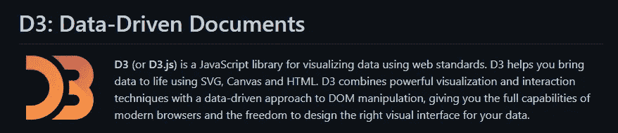

*Source:* [*https://github.com/d3/d3*](https://github.com/d3/d3)

对于许多人来说，它被认为是可视化数据的标准。当然是属于比较厉害的。一个人可以创建的图表和图形是非常令人印象深刻的。尤其是可以使用强大的集成。

其中之一是与 Three.js 的集成。它允许你创建一些壮观的图表，让你沉浸在数据中并抓住它。[字面](https://bl.ocks.org/vasturiano/raw/972ca4f3e8e074dacf14d7071aad8ef9/?raw=true)。在 VR 中。

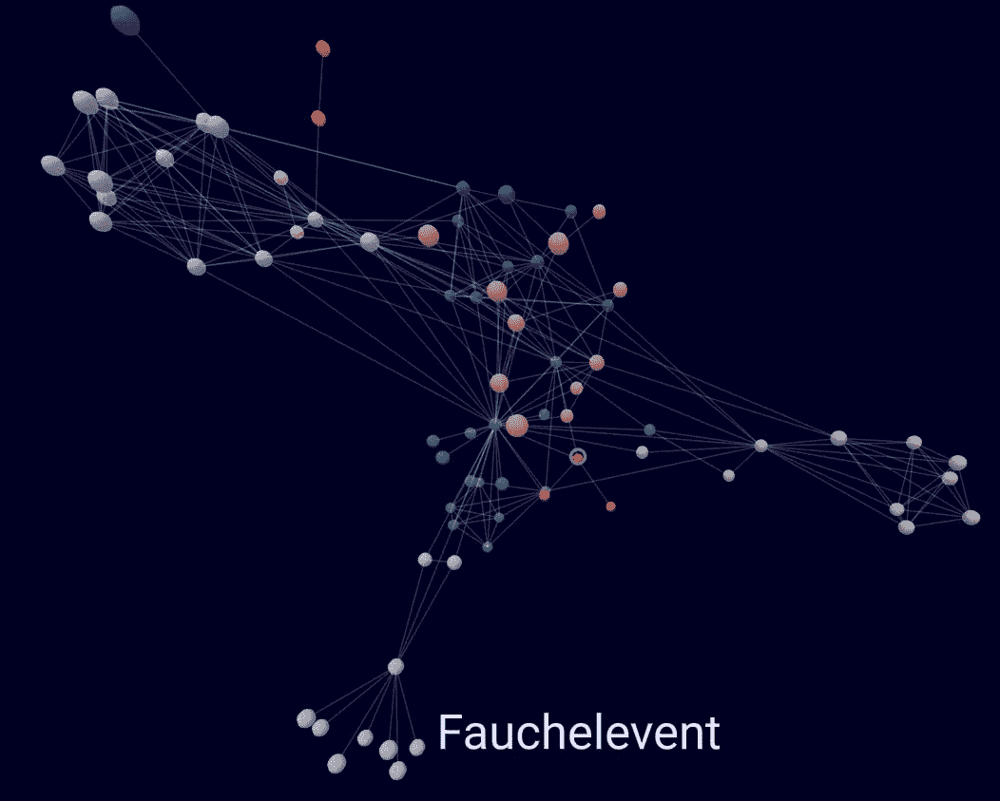

*Screenshot of an interactive graph representing how close each character of “Les Misérables” was. Source:* [*https://bl.ocks.org/vasturiano/raw/972ca4f3e8e074dacf14d7071aad8ef9/?raw=true*](https://bl.ocks.org/vasturiano/raw/972ca4f3e8e074dacf14d7071aad8ef9/?raw=true)

‍ **判决结果**

这里除了“绝对可以”还有什么要说的吗？但是，要注意包的大小。它是 89 kB，虽然你可以减少它超过。

**回购**

# 处理数据

## 数学. js

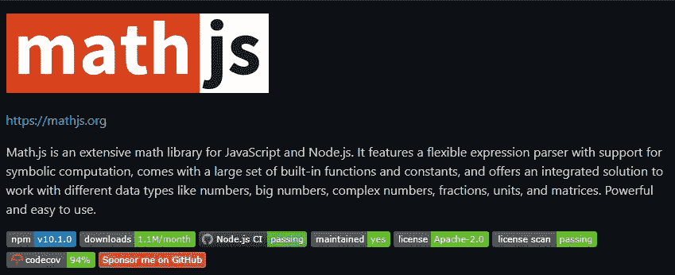

Math.js 是一个非常受欢迎的 JavaScript 科学库，Node.js 每月有 110 万次下载，你不能说它是一个小众解决方案。支持的科学运算数量惊人，同时也为您提供了一种处理复数、分数、单位和矩阵的简单方法。

**判决结果**

尽管“只有”普通的 JavaScript 控制着这个库，但是您可以使用内置的类型声明。有了过多的功能、流行和完整的 TypeScript 支持，我们别无选择——去做吧！我们提到过测试覆盖了 94%的代码吗？

**回购**https://github.com/josdejong/mathjs

## 标准库

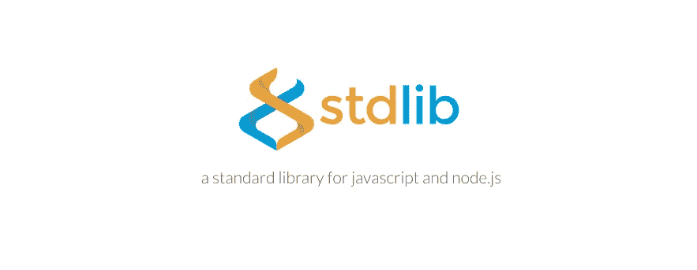

*Source:* [*https://github.com/stdlib-js/stdlib*](https://github.com/stdlib-js/stdlib)

这是一项开源工作，旨在创建一组可以在 JavaScript 中使用的基本功能。包的名字也许应该是 *stdlib，*而不是*。这将*表明作者的重点是开发一个通用的、更高级的数学运算包……事实上作者似乎做得很好！内置函数的数量相当可观。唯一令人关切的是目前有大量问题悬而未决。我们会说去吧，尽管要小心。

**判决结果**

这个项目很好，非常活跃。GitHub 上有超过几千颗星星，向我们展示了有很多人喜欢这个项目。

**回购**

[https://github.com/stdlib-js/stdlib](https://github.com/stdlib-js/stdlib)

## 费马网

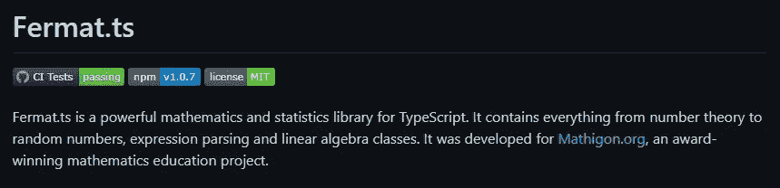

*Source:* [*https://github.com/mathigon/fermat.js*](https://github.com/mathigon/fermat.js)

一个“强大的数学和统计库”,有很多有用的函数供你在下一个项目中使用。

**判决结果**

总的来说，维护人员在处理传入的拉取请求方面做得相当不错。该库也是一个更大的生态系统的一部分，所以我们看到它会进一步发展，为开发者提供越来越多的功能。

**回购**

[https://github.com/mathigon/fermat.js](https://github.com/mathigon/fermat.js)

# 奖金

*注意:下面所有的库可能会也可能不会运行你的代码。我们建议不要在生产应用中使用它们，尽管最终这是你的选择。*

无法告别您最喜欢的数据科学库，但需要在 web 浏览器中运行它们？尽管我们不能说我们在使用 JavaScript，但我们确实生活在同一个世界里。

但是，请记住，您最喜欢的一些项目可能无法在浏览器中运行。这是由于所有与 C/C++的绑定和其他特性。虽然也许在未来我们会有 JavaScript 库使用你的 GPU 来完成繁重的工作:开发者正在探索什么是可能的。

# python-Pyodide

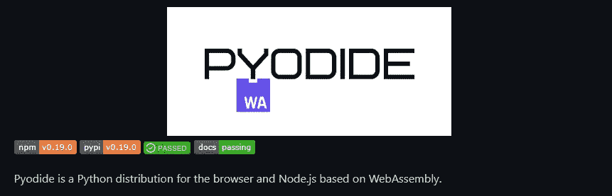

*Source:* [*https://github.com/pyodide/pyodide*](https://github.com/pyodide/pyodide)

Pyodide 允许您在浏览器中运行 Python run。最好的方面？

Pyodide 使得在带有 micropip 的浏览器中安装和运行 Python 包成为可能。PyPi 支持任何带有轮子的纯 Python 包。许多带有 C 扩展名的包也被移植到 Pyodide 上使用。其中包括许多通用包，如 regex、PyYAML、lxml 和科学 Python 包，包括 NumPy、pandas、SciPy、Matplotlib 和 scikit-learn。

如果你不是 Pyodide 的粉丝，还有另外一个解决方案给你。RustPython 允许你运行构建一个运行 Python 代码的 web 应用。你甚至可以向你的用户提供一个完整的 Python 编译器(无论出于什么原因，你都需要这样做)。

# 朱莉娅——夏洛特

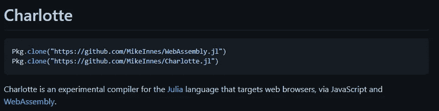

*Source:* [*https://github.com/MikeInnes/Charlotte.jl*](https://github.com/MikeInnes/Charlotte.jl)

虽然你可以用 Julia 写任何你想写的应用程序，但一致的意见是，它是为科学计算量身定制的。所以，如果你离不开某个库，或者只是那么热爱这门语言，你应该让 Charlotte 试试。

# Swift — SwiftWasm

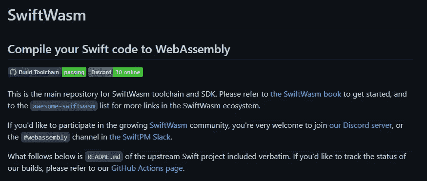

*Source:* [*https://github.com/swiftwasm/swift*](https://github.com/swiftwasm/swift)

Swift 清晰的语法和高性能使该语言对数据社区具有吸引力。需要您的代码在 Chrome 或 Firefox 中运行吗？转到[https://github.com/swiftwasm/swift](https://github.com/swiftwasm/swift)，并按照说明进行操作。

*最初发表于*[T5【https://www.itmagination.com】](https://www.itmagination.com/blog/javascript-frameworks-part-3-data-science)*。*

*更多内容看* [***说白了。报名参加我们的***](http://plainenglish.io/) **[***免费周报***](http://newsletter.plainenglish.io/) *。在我们的* [***社区不和谐***](https://discord.gg/GtDtUAvyhW) *获得独家获取写作机会和建议。***