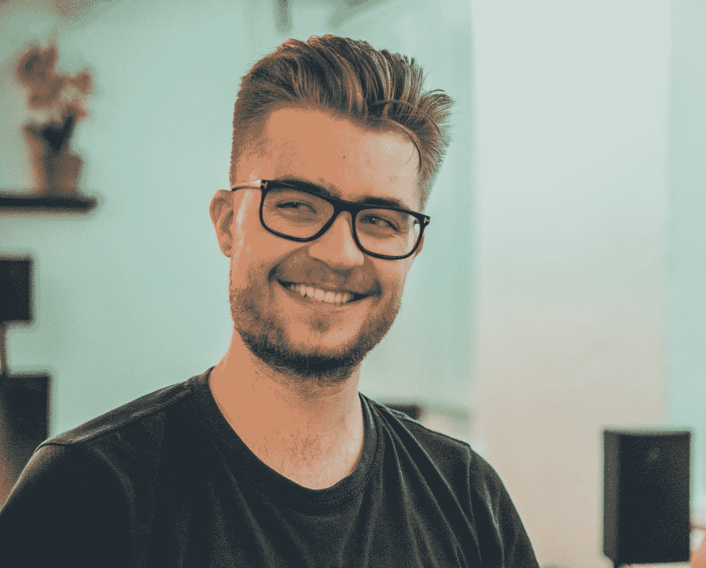

# 做一个自私的人，这是最好的时候

> 原文：<https://javascript.plainenglish.io/be-a-selfish-person-its-the-best-time-to-be-one-38ec8112dd6b?source=collection_archive---------9----------------------->

## 保持自私是开发人员生活中真正重要的事情。

Photo by [Samuel Raita](https://unsplash.com/@samufoto?utm_source=medium&utm_medium=referral) on [Unsplash](https://unsplash.com?utm_source=medium&utm_medium=referral)

想想你朋友的一个弱点。如果你的朋友有 10 个缺点，告诉他改进它们。在你这么做之前让我告诉你结果。

你的朋友会把你的建议当成批评，你们的友谊就毁了。你的朋友也可以忽略你的反馈，不再听你说话。

你还能做什么？

在分析你自己之前，停止分析别人。我什么意思？ [*写下你所有的弱点*](/i-managed-to-change-my-3-biggest-weaknesses-as-a-developer-629b51bbd3a0) 简单的抹去那些无法控制的弱点。

在抹去了不可控的弱点后，剩下的部分对你来说就是纯粹的天堂了。努力改进它们。自己努力吧。做一个自私的人。这才是真正重要的。

## 停止内疚

我和我的一个朋友在度假。这位朋友因为向公司请假而感到内疚。树叶在年底会被耗尽，如果你使用它们会更好。

我们去度假是为了从工作中得到精神上的放松。我喜欢这次旅行，他不喜欢。我只是告诉他要自私，不要担心，享受剩下的假期。

自私是一门艺术:“如果你从自私中受益，并且没有人因为你的自私而失去任何东西，那么你是不可阻挡的”。

## 学会说“不”

我是不能说“不”的最大病人。当你不说“不”时，真正发生的是人们会误用这个。这是人之常情。

如果你不想做你朋友的工作，简单地说“*我现在不能做*”。

如果你不想做，那就不要做。遵循规则。

如果你不想在需要的时候说“不”，那么人们会认为你是理所当然的。*事在人为*。

## 开始致力于你的自我成长

自私背后的唯一动机是 [*专注于自我成长*](/i-tend-to-focus-more-on-self-growth-as-a-developer-f953ec2dba09) 。做一个自私的人从长远来看会对你有好处，因此你需要努力自我成长。

提高你的技能，改善你的个性，改善需要改善的地方。

自私不代表停滞不前。自私就是分析什么让我们快乐，分析我们的弱点，分析我们缺少什么，专注于提升自己。

关于我——我是*科技*和*自我提升* [*的顶级作家点击这里*](https://aniketz.medium.com/) *阅读更多我的文章。*

就这样，这是文章的结尾。希望它对你有价值。如果你喜欢这篇文章，点击这里订阅我的邮件列表。我会通过电子邮件给您发送技术相关的文章。

[**通过电子邮件获取我的文章点击这里**](https://aniketz.medium.com/subscribe) **|** [**购买 5 美元中等会员资格**](https://aniketz.medium.com/membership)

 [## 通过我的推荐链接加入 Medium-Aniket

### 作为一个媒体会员，你的会员费的一部分会给你阅读的作家，你可以完全接触到每一个故事…

aniketz.medium.com](https://aniketz.medium.com/membership) 

*更多内容看* [***说白了。报名参加我们的***](http://plainenglish.io/) **[***免费周报***](http://newsletter.plainenglish.io/) *。在我们的* [***社区不和谐***](https://discord.gg/GtDtUAvyhW) *获得独家获取写作机会和建议。***