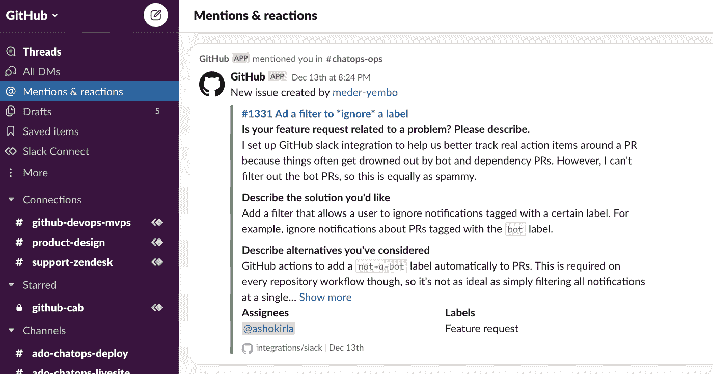
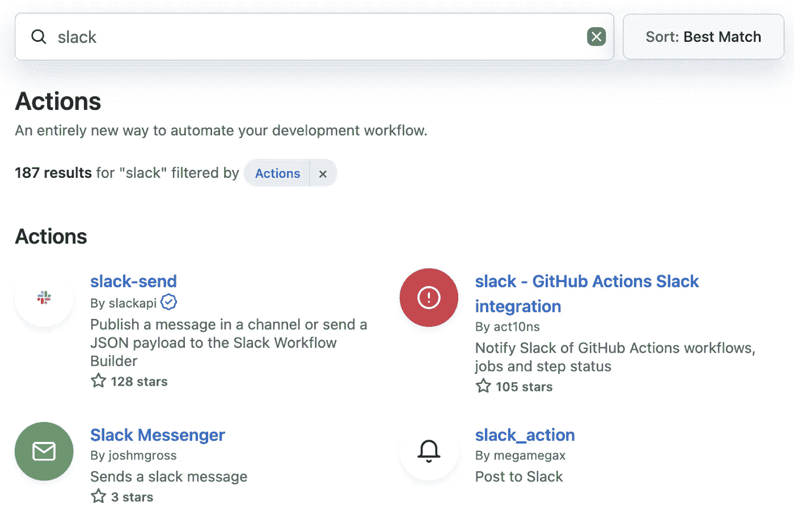
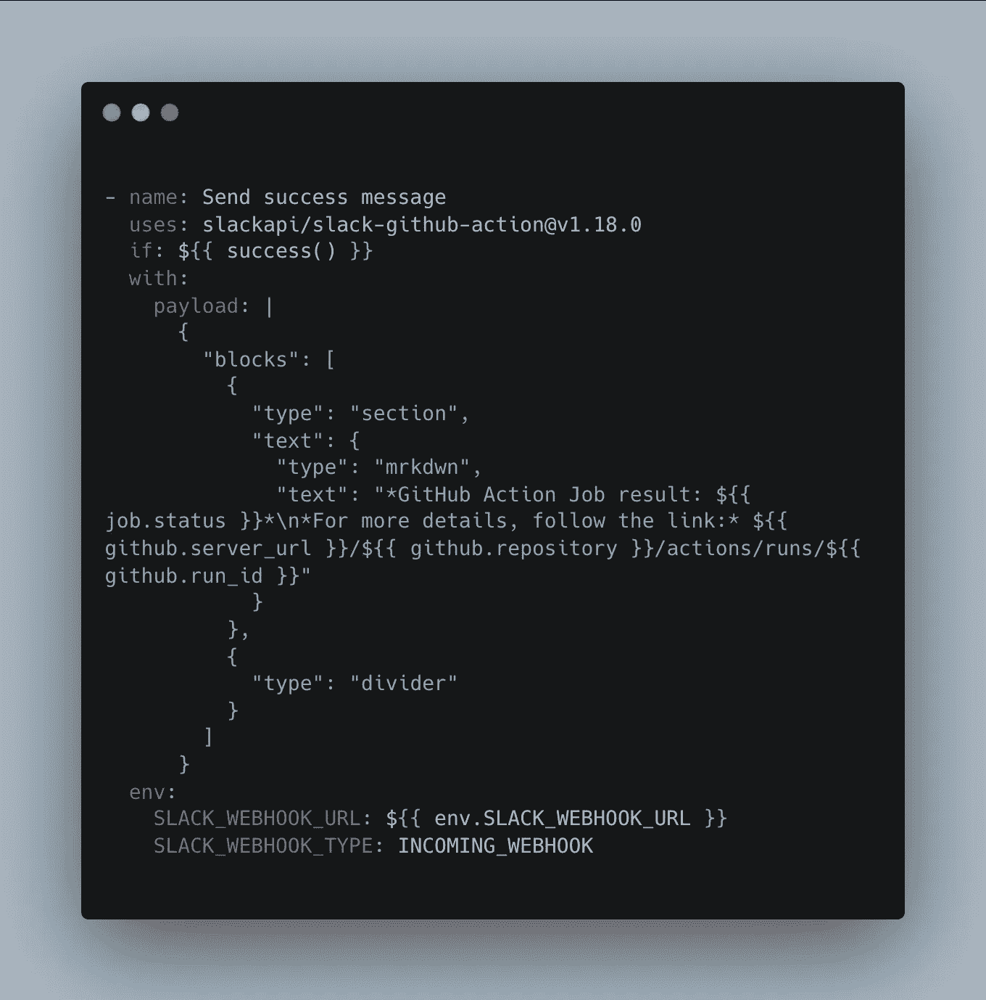
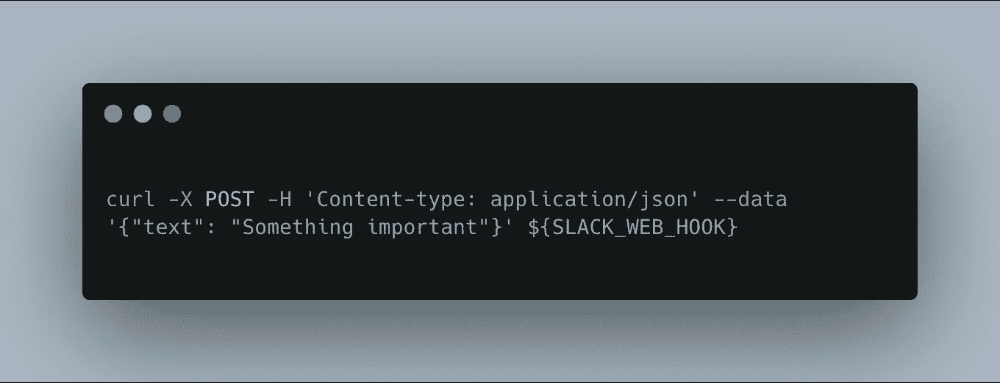

# 注意你的 GitHub 动作工作流程和 Slack

> 原文：<https://javascript.plainenglish.io/be-aware-of-your-github-actions-workflow-with-slack-35d1f46821cf?source=collection_archive---------2----------------------->

几个月前，在享受和平与宁静的时候，我们从支持部门得到一个消息，我们的一个部署突然失败了。当一个人过了一段时间才知道失败的时候，这真的不合适。当然，我们收到了一封电子邮件，但究竟谁会看呢？显然，当出现问题时，我们希望立即知道，因为这可能会对我们的最终用户产生巨大影响。

由于我们的项目和团队使用 **Slack** 作为主要的通知和消息应用程序，使用 **GitHub Actions** 作为 CI 工具，我们想到了将 Slack 通知集成到 CI 工作流中的想法。

# 先决条件:

*   我们的应用程序是多区域的，每个区域都有单独的部署工作流；
*   **GitHub Actions** 作为 CI/CD 工具应用；
*   一个团队使用 **Slack** 作为信使。

因此，让我们来看看 Slack 和 GitHub 可以为我们提供的选项，并看看如何在基本场景中使用它们。

# 1.与 Slack 的集成。

最简单的方法是使用[松弛集成](https://github.com/integrations/slack)。只需打开[链接](https://slack.com/apps/A01BP7R4KNY-github)，给予应用程序权限并使用 **/invite** 命令将 GitHub 集成添加到您需要的频道。之后，您应该使用[登录、订阅、取消订阅](https://github.com/integrations/slack#getting-started)等命令将您的帐户/组织与其关联。

如果只是需要获得关于标准流程的通知，比如拉请求、提交、分支、问题、发布等等，那么在 5 分钟内实现这种集成会更好、更简单。

在我看来，任何项目都应该默认启用集成。同时，它不应该包括你 GitHub 帐户中的每个喷嚏，而被你的队友忽略(商定规则，每天在特定时间检查 1-2 次)。

GitHub 和 Slack 集成

**来看看:**[https://github.com/integrations/slack](https://github.com/integrations/slack)

*注意:接下来的选项是集成无法覆盖的自定义通知。*

# 2.来自市场的 GitHub 行动。

首先，在 GitHub Actions Marketplace 找到一些东西。人们经常在那里分享定制开发的动作，你可以检查并尝试一个。但是我更喜欢使用由可信的供应商首先提供的官方的东西，而不是尝试外来的、可能不稳定的东西。

我们来看看 slack 自己开发的 **slack-send** **action** 的使用例子。使用此操作发送通知有几个选项:Slack workflow、Slack app 和 incoming webhook。最后两个是将原始有效载荷作为消息发送，所以你可以通过[模块套件](https://api.slack.com/block-kit)给消息添加一些交互性和表现力，或者只是发送几行纯文本。

下面的示例演示了作业成功时发送的通知(请参见“if”语句)，以及其状态和特定运行的链接，以了解更多详细信息。

通过 Slack API GitHub 操作的 Slack 通知示例

市场上有许多现成的动作，它们具有一组特定的属性和清晰的文档。试试它们，找到完美的搭配。

**有用链接:**

*   [https://github.com/slackapi/slack-github-action](https://github.com/slackapi/slack-github-action)
*   [https://api.slack.com/block-kit](https://api.slack.com/block-kit)
*   [https://docs . github . com/en/actions/learn-github-actions/contexts](https://docs.github.com/en/actions/learn-github-actions/contexts)

# 3.自定义 GitHub 操作。

如果上述选项都不适合您的具体情况，那么您别无选择，只能编写自己的操作。甚至可能有一个 bash 脚本通过 curl 向 webhook 发送消息。

通过 curl 的松弛通知

自定义操作的创建超出了本文的范围，但是我将在下面留下一个文档的链接。这种选择既简单又复杂，所以在重新发明轮子之前，尝试找到一个盒子解决方案。

**有用阅读:**

*   [https://API . slack . com/tutorials/tracks/posting-messages-with-curl](https://api.slack.com/tutorials/tracks/posting-messages-with-curl)
*   [https://docs.github.com/en/actions/creating-actions](https://docs.github.com/en/actions/creating-actions)

# 结论。

时差通知可以通知您和其他相关方有关项目活动的信息。它可以是部署、发布、拉取请求或其他什么，当然，可能会很烦人。然而，它的真正好处是立即得到通知，而不是过一会儿才意识到事情发生了。

感谢阅读！

*更多内容请看*[***plain English . io***](https://plainenglish.io/)*。报名参加我们的* [***免费周报***](http://newsletter.plainenglish.io/) *。关注我们关于*[***Twitter***](https://twitter.com/inPlainEngHQ)*和*[***LinkedIn***](https://www.linkedin.com/company/inplainenglish/)*。查看我们的* [***社区不和谐***](https://discord.gg/GtDtUAvyhW) *加入我们的* [***人才集体***](https://inplainenglish.pallet.com/talent/welcome) *。*