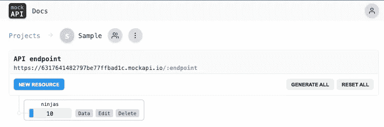

# 成为你自己的伪 JSON API 的主人

> 原文：<https://javascript.plainenglish.io/be-the-master-of-your-very-own-fake-json-api-or-learn-kung-fu-bd0c1fd2b43c?source=collection_archive---------10----------------------->

## 在没有实际 API 的情况下，模拟 API 可以成为开发人员的救星。

[Image Source](https://www.youtube.com/watch?v=fhrNgXJ__n8)

你认为你能在几秒钟内学到东西吗？

显然，有些人可以。如果你想知道我指的是谁，那就来看看卖座电影《黑客帝国》中令人兴奋的场景吧。

也许，我们在未来会拥有这种尖端技术，就像主角**Neo 的情况一样，我们可以将无数技能下载到我们的大脑中，这样，我们的物种将进化成一个完全不同的存在。**

**这样，我们可以通过我们大脑的潜在力量做任何事情，这也是著名的未来学家和物理学家加来道雄在他的书[大脑的未来](https://www.amazon.com/Future-Mind-Scientific-Understand-Enhance/dp/038553082X)中暗示的。他表示，权力只是暂时处于休眠状态，但它肯定是存在的。**

****

**[Image Source](https://www.learning-mind.com/neuroscience-reveals-the-secrets-to-unlocking-your-brains-potential/)**

# **我们要学什么？**

**我不想让你失望。不幸的是，我们还没有那种技术。不过不用担心。这篇文章(或场景选择)并不是说‘嘿，伙计们，坚持住！总有一天，你会轻松学会一切。"**

**为了能够解释我的目的，我只是想让你注意到在那个特定场景中的中心人物之间的以下对话。让我们仔细检查一下。**

****

**[Image Source](https://graceworks.com.sg/i-know-kung-fu/)**

*****Morpheus:*** *我是怎么打败你的？***

*****尼奥:*** *你太快了。***

*****语素:*** *你比这个快。不要以为你是。知道你是！别打我了，打我吧！”***

**今天，我们将学习(击中)一个新的可怕的概念，称为 API，又名“应用程序编程接口”，并停止假设它很难。**

# **阿皮斯魔鬼般的微笑**

**说实话，我刚开始学编程的时候，这个缩写就成了我的噩梦。就像魔鬼在取笑我。我知道我必须尽快掌握这个概念，但由于某种原因，甚至它的名字一开始对我来说都很陌生，所以我有一段时间没有那么喜欢它。**

****

**[Image Source](https://www.istockphoto.com/tr/foto%C4%9Fraflar/devilish-smile)**

**随着时间的推移，我能够接受这个概念，并决定学习 API 的来龙去脉。不过，我是怎么走到这一步的呢？**

**我想我只是听从了墨菲斯的建议，不再视其为我的复仇女神，并决定照此行事。然后，一切都变了。**

**我真诚地相信，这一定是学习艰难事物时的态度。我们需要一劳永逸地停止在头脑中妖魔化事物。**

**也许，那些事情并不可怕，只是我们的思想在捉弄我们，让问题变得比想象的更大。**

**如果我们能做到这一点，我们很快就能经历像这样的非凡时刻。好吧，我可能有点夸张，但你明白了。**

****

**[Gif Source](https://gfycat.com/discover/the-matrix-gifs)**

**你不需要接住空中的子弹。然而，你可以摆脱阻止你采取行动的心理障碍。**

# **什么是 API，为什么它们很重要？**

**让我们首先给出一个 API 的基本定义。缩写“API”代表应用程序编程接口。**

**但这说明不了什么，不是吗？让我这么说吧。它是一种软件协商者(中介)，帮助两个应用程序相互通信。**

****

**[Illustration Source](https://www.cleveroad.com/blog/what-is-an-api/)**

# **一个 API 示例**

**与其提供一个无聊的解释，不如让我们把它放在上下文中，想出一个故事。**

**假设你是 80 后，没有互联网。听起来像个噩梦，不是吗？然而，曾经有一段时间，我们必须亲自处理一切。**

****

**[Illustration Source](https://www.freepik.com/vectors/80s-background)**

**总之，你想在我们想象的场景中去马尔代夫度假。要做到这一点，你需要去一家旅行社，提前预定一切，因为你不能简单地出现在一家豪华酒店，然后说，'嘿，我在这里！给我一个房间。嗯，你最终可能会得到一个房间，但质量和舒适度可能无法保证。**

**旅行社正在通过与马尔代夫的酒店取得联系来帮助您完成预订，并确保整个过程的顺利进行。嗯，这有点像你的 API。**

****

**[Image Source](https://www.dailysabah.com/life/travel/maldives-offers-a-slice-of-tropic-paradise-for-all-tastes)**

**最后，你的中介在得到对方同意后，给你预定的文件。记得 80 年代没有互联网。所以如果没有旅行社，你不可能独自处理所有这些事情。谢天谢地，我们当时有旅行社，现在也有 API 了！**

# **今天的场景**

**问题是，如今我们有各种各样的在线代理，他们肯定是在处理真正的 API。**

**假设你饥肠辘辘，但是太累了，不想去快餐店。结果，你决定只需点击一下鼠标就能从网上订餐，然后舒舒服服地待在家里，等待美味的汉堡菜单出现在你的屏幕上。**

****

**[Image Source](https://limetray.com/blog/online-food-ordering-apps-restaurant/)**

**这是当你下单时另一边发生的事情。你使用的应用程序会代表你与餐厅的 API 取得联系，并检查数据库，看看是否有足够的库存，以及送货员是否有空。如果其他东西都在，那么你的订单就被系统确认了。**

# **什么是 Rest API？**

**这些年来，API 也发生了变化。毕竟，那些是软件产品，应该是最先受到尖端技术进步影响的。**

****

**[Illustration Source](https://www.codecademy.com/article/what-is-rest)**

**像 REST 这样的现代 API 对开发人员来说是没有负担的，因为它们很容易访问。这些新版本的 API 是标准化的，并根据受众的需求进行定制。**

**长话短说，无论是哪种类型，开发人员都无法想象当今世界没有 API 的生活。这就是为什么它们对编程社区来说是一件大事。**

# **为什么我们需要模拟 API？**

**问得好！让我们开始吧。开发人员必须检查流程并测试他们的产品，看是否所有部分都协调工作。**

****

**[Illustration Source](https://www.soapui.org/learn/mocking/what-is-api-mocking/)**

**要测试这样的功能，您必须遵循某些步骤，并且 API 最终版本的实现可能需要一些时间。同时我们要做什么？坐着等？这听起来不是个好主意。简单地说，我们不能等待实际的 API 立即发挥它们的作用。他们可能还没准备好。**

**在相关的 API 可以使用之前，我们需要一种方法来模拟真正的 API。因此，模拟 API 为我们提供了一个很好的机会来见证几乎与真实版本一样的功能响应。**

**简而言之，在发布最终产品之前，模拟 API 将让您了解可能的场景。有了它们，您可以修复有问题的部分，甚至开发更好的 API 来获得可靠的用户体验。**

# **模拟 API 是如何工作的？**

**当您使用模拟 API 时，模拟服务器可以确保平稳的转换过程。因此，模拟端点可以奇迹般地工作。您在生成它们的过程中不需要太多的后端过程。**

# **存在多少模拟 API？**

**嗯，有太多的模拟 API，这对新开发人员来说有点吓人。Jest 和 Postman 是你可能经常听到的两个流行词。**

**不过，它们的功能或多或少有些相似。依我拙见，只要他们做好工作，其余的都不重要。**

****

**[Illustration Source](https://www.mocks-server.org/docs/overview/)**

# **什么是 [Mockapi.io](http://mockapi.io/) ？**

**这就是我们要通过这篇文章详细探讨的问题。当你学会了这一个，我相信你可以很容易地应付其他的，因为每一个本质上都是相似的。**

****

**[Mockapi.io](http://mockapi.io/) 为我们建立了一个坚实的 api 基础设施，这样我们就可以通过给定的端点创建我们的模型。这有助于我们测试实际项目中实际 API 的存在。**

# **免费吗？**

**通过 [Mockapi.io](http://mockapi.io/) ，可以免费生成一个项目。换言之，它是部分免费的。但是它非常用户友好，所以你可能最终也要注册付费版本。**

# **如何设置项目**

**这确实是小菜一碟。像所有其他平台一样，它从注册过程开始。一旦你这样做了，你会看到一个空的屏幕，通过它你可以生成一个新的项目。**

****

**只要你点击“+”号，你就会被要求为你的项目命名。如果有合作者，您也可以输入他们的姓名或电子邮件。如果没有，就跳过这一部分。**

****

**出于测试目的，我们姑且称这个项目为“示例”,并使用“api”作为前缀。只需点击“创建”即可完成该流程。常规端点地址如下:**

**[*https://主机名/API/端点*](https://hostname/api/endpoint)**

**然而，这不是你将要使用的。如果您访问项目部分，您会看到一个长网址，如下所示:**

****

**坚持住。我们还没完呢。**

# **确定终点**

**让我们假设我们正在设计一个关于忍者的基本游戏。你可以猜到，项目的实际 API 还没有准备好。我们应该等到它出现吗？或者做点什么？**

**作为游戏的开发者，你可能对忍者的基本功能有所了解。为了用模拟 API 测试我们的应用程序，我们需要一些端点。**

****

**[Image Source](https://www.trendyol.com/my-kostum/ninja-kostumu-yetiskin-p-52678505)**

# **我们的游戏需要什么？**

**端点帮助我们组成一个新的忍者，列出所有的忍者战士，获得他们的信息，并在需要时从列表中删除一个或多个战士。让我们来看看所有这些东西。**

**首先，点击新建资源按钮。现在，我们需要为我们的端点取一个名字。记住“样本”这个词只是项目的名称。这个有不同的目的。“忍者”作为资源部分的名称怎么样？**

****

**这意味着我们提出的所有请求都将被发送到以下地址。在某种程度上，这个资源名称代表端点，这将帮助我们检索一些模拟数据。**

**【https://5cb4a738bbf7b50014cabbfd.mockapi.io/api/ninjas **

# **请求类型**

**确定资源/端点的名称后，系统将自动列出请求类型。只需点击请求类型(GET、POST、DELETE、PUT)旁边的按钮，根据您自己项目的需要打开或关闭它们。**

****

# **图式建构**

**现在让我们向下滚动一点，仔细看看这个模式。这是我们决定模拟数据的某些属性/细节的地方。**

**在我们的忍者战士游戏中，我们将使用以下属性: **Id，名称，图像，来源，颜色，经验丰富**。**

**你看到下面的第一列了吗？它就是为此目的而设计的。“id”属性尤其重要，因为当我们在项目中测试时，我们将能够通过他们的 id 删除战士或执行类似的操作。**

****

**第二列是你需要选择 **Faker.js** 选项的地方。通过这种设置，系统将尽可能真实地形成数据。**

**最后一列是数据类型。它将是一个布尔值(是/否模型)，还是一个数字？例如，如果你需要一个假图片，并在最后一栏选择“**头像**，那么系统会给你分配一个模拟图片。多棒啊！**

**还有对象模板部分，它将向您展示一个示例 JSON 模式。**

****

# **一群忍者战士**

**一旦你完成了资源部分，你就可以开始了。这意味着您可以处理收尾工作。**

****

**现在，你可以在屏幕上看到你的项目。在标题“忍者”下，你会看到一个范围字段，在这里你可以决定模拟物品的数量。在我们的例子中，这是忍者的数量。假设我们急需 10 名强壮的战士。**

# **我们要把那些忍者变成我们自己的吗？**

**要修改模拟值中的某些部分，只需点击“数据”按钮。这样，您可以按照自己的意愿修改它们。**

**例如，我想要一个红色象征的日本忍者。我知道我知道这种颜色在那一行不常见。但是如果你碰巧读了[我之前的文章](https://www.freecodecamp.org/news/javascript-coding-interview-practice/)，你会发现记忆宫殿法又在起作用了。所以细节越古怪，长此以往就越容易记住上下文。**

****

**我也想要一个牙买加忍者战士。谁说忍者是日本人的专利？我也可以要一个德国忍者，名字叫“汉斯”，颜色是“兰花”吗？为什么不呢？好吧，在我们的另一个世界里，所有的规则都是可以改变的，所以尽情发挥吧！**

**玩笑归玩笑，在这一节中，我只是在摆弄我的模拟数据。你当然不需要改变数据，但是如果你是一个初学者并且有一些时间，拥有自己独特的物品/角色比使用一些预定义的 JSON 数据更有趣。**

# **小小的提醒**

**单击 update 按钮后，现在让我们看一下模拟数据的最终版本。悬停在标题(忍者)，右键单击并复制链接。**

****

**这就是你获得模拟数据地址的方法。但是，当复制屏幕上提供的地址时，请跳过“端点”一词。不然就不行了。**

****

# **包扎**

**在没有实际 API 的情况下，模拟 API 可以成为开发人员的救星。在项目开始时，真实的数据可能还没有准备好供使用。因此，通过创建一些模拟数据来获得一些帮助是一个好主意。**

**通过它们有用的存在，程序员不必等到真正的 API 到来和后端可用时才测试他们产品的功能。**

**相反，他们可以利用模拟版本达到同样的目的。在这篇文章中，我与你分享了一个模拟 API。尽管市场上有许多其他的软件，但就我而言， *mockapi.io* 非常容易使用。**

****

**[Illustration Source](https://www.skovian.com/web-design-and-development/wordpress-the-saviour-can-it-be-used-for-web-development/)**

**如果你有兴趣深入研究并通过编写一些后端代码来生成你的模拟 API，我推荐你观看 [Ania Kubow 的关于这个主题的 YouTube 教程](https://www.youtube.com/watch?v=FLnxgSZ0DG4)。像往常一样，她什么都解释得那么干净利落，没有你学不会的。试一试。你不会后悔的。**

**请记住，如果在那个特定的场景中有事情像墨菲斯挑战尼奥一样挑战你，这一点都不是坏事。这是为了帮助你创造最好的自己。**

**现在，你可以把“学习模拟 API”从你的挑战任务清单中划掉，然后对着宇宙大喊，“那么，下一步是什么？”**

****

**[Image Source](https://www.illustratedfiction.com/scenes/fight-scenes/the-matrix-everybody-was-kung-fu-fighting/)**

**编码快乐！**

**“知识就是力量。”—弗朗西斯·培根**

***更多内容看* [***说白了。报名参加我们的***](https://plainenglish.io/) **[***免费周报***](http://newsletter.plainenglish.io/) *。关注我们关于* [***推特***](https://twitter.com/inPlainEngHQ) ，[***LinkedIn***](https://www.linkedin.com/company/inplainenglish/)*，*[***YouTube***](https://www.youtube.com/channel/UCtipWUghju290NWcn8jhyAw)*，以及* [***不和***](https://discord.gg/GtDtUAvyhW) *。对增长黑客感兴趣？检查* [***电路***](https://circuit.ooo/) *。*****