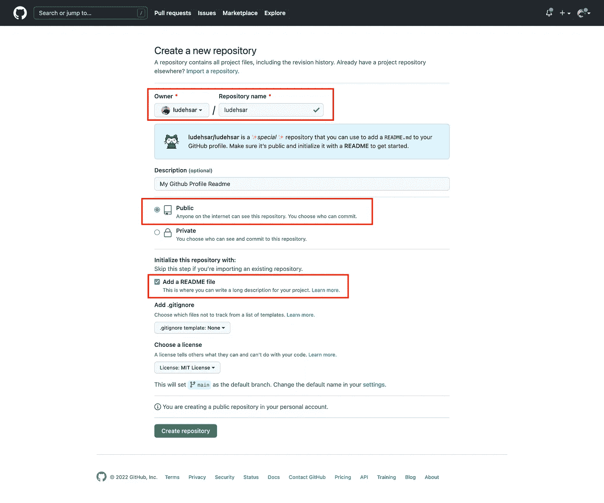
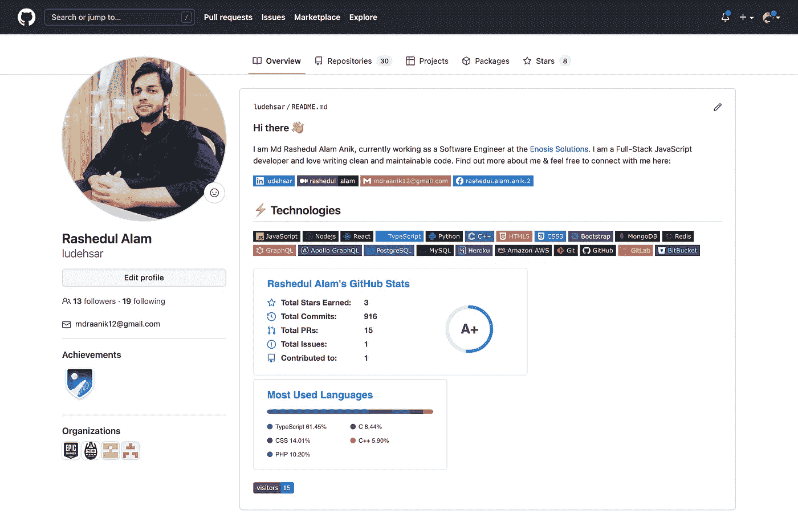
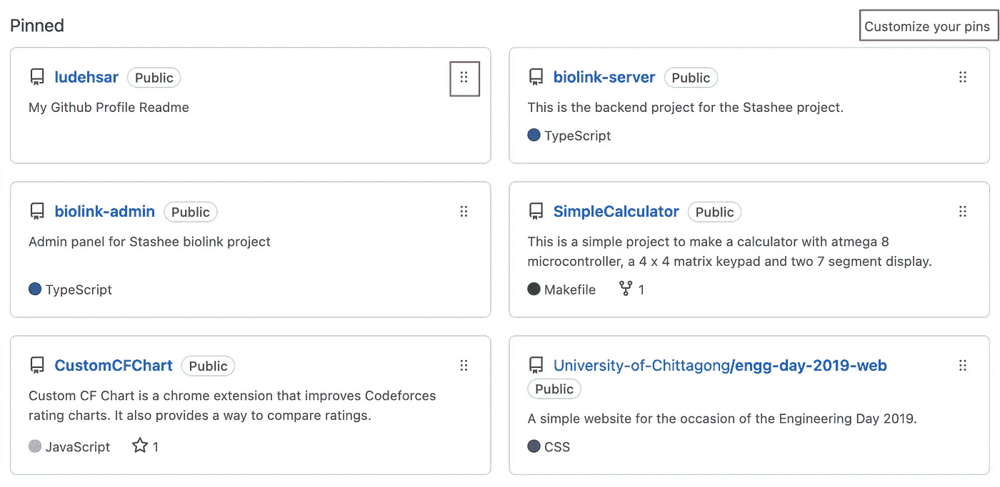
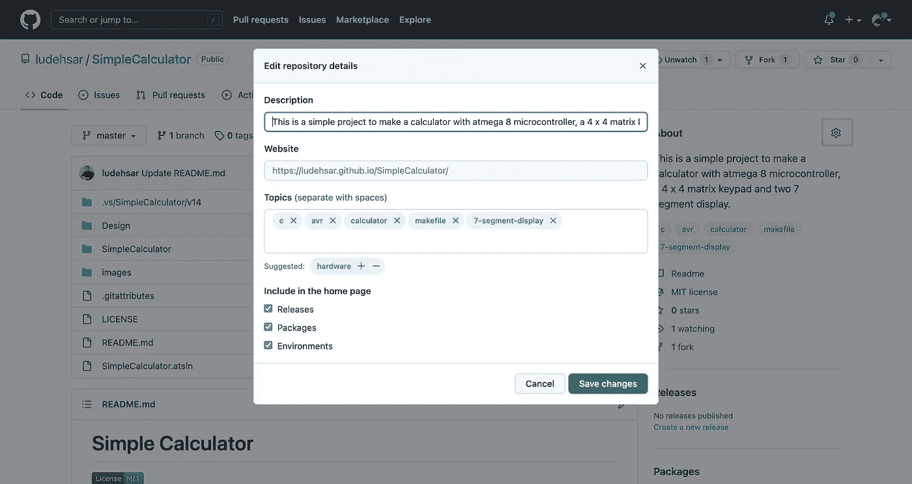

# 像专业人士一样美化您的 GitHub 个人资料

> 原文：<https://javascript.plainenglish.io/beautify-your-github-profile-like-a-pro-71fbdc6abfd3?source=collection_archive---------2----------------------->

## 遵循这些简单易行的步骤，让你的 GitHub 简介看起来更专业。


Photo by [Mohammad Rahmani](https://unsplash.com/@afgprogrammer?utm_source=medium&utm_medium=referral) on [Unsplash](https://unsplash.com?utm_source=medium&utm_medium=referral)

制作一个很棒的 GitHub 作品集对任何开发者都是很有帮助的。这有助于给人留下深刻的印象，也是让你的技能脱颖而出的最佳方式之一。

这个教程会让你枯燥的 GitHub 简介变成一个看起来超级专业的作品集。所以事不宜迟，让我们直接进入正题。

## 步骤 1:创建新的公共存储库

第一步是创建一个与您的 GitHub 用户名同名的新公共存储库。在我的例子中，我的 GitHub 用户名是`ludehsar`，所以我正在启动一个名为`ludehsar`的新公共存储库。



确保项目是公共的，并且选中了“添加自述文件”。

之后，单击“创建存储库”按钮。

## 第二步:编辑`README.md`文件

现在，创建新的存储库后，单击 README.md 文件中的编辑图标，并粘贴以下代码:

```
### Hi there 👋

I am Md Rashedul Alam Anik, currently working as a Software Engineer at the [Enosis Solutions](https://www.enosisbd.com/). I am a Full-Stack JavaScript developer and love writing clean and maintainable code. Find out more about me & feel free to connect with me here:

[](https://www.linkedin.com/in/ludehsar/)
[](https://rashedul-alam.medium.com/)
[](mailto:mdraanik12@gmail.com)
[](https://www.facebook.com/rashedul.alam.anik.2/)

## ⚡ Technologies


```

此处，本简介自述文件分为四个部分。第一部分是概述，第二部分是社交图标徽章，第三部分是技术徽章，最后一部分是统计数据。

我们先根据个人喜好改变一下概述。

更改个人资料后，让我们更改社交图标徽章的链接和标签。你可以从[这个库](https://github.com/Ileriayo/markdown-badges)添加所有的社交图标。

以下是一个社交链接徽章示例:

```
[](https://www.linkedin.com/in/ludehsar/)
```

这里，我们应该根据我们的社交网址来改变链接。此外，要更改标签，您可以在此处将 ludehsar 标签重命名为您喜欢的名称。

之后就可以根据自己的技能定制技能徽章了。你可以在[这个资源库](https://github.com/Ileriayo/markdown-badges)中找到那些徽章。

最后一部分是统计数据。您可以通过将用户名更改为您的用户名来生成您的统计数据。

经过所有这些更改后，您的个人资料应该如下所示:



## 步骤 3:管理您的固定存储库

您可以通过单击“自定义您的 pin”链接来添加您的 pin 存储库。在您的个人资料主页上，您最多可以添加六个固定存储库。



您还可以使用拖动图标对固定的存储库进行排序。

## 步骤 4:组织您的存储库

当涉及到组织您的存储库时，有不同的步骤。

首先，您的存储库需要在 about 部分有一个漂亮的简短描述。要在“关于”部分添加描述，请单击“关于”部分旁边的目录按钮，如下所示:



包含网站 URL 和与该存储库相关的主题也很好。

您还可以通过选中或取消选中“关于”设置中的底部部分来管理在存储库中包含不同的组件。

接下来，您可以在项目中添加一个不错的自述文件。要添加引人注目的美丽自述文件，您可以遵循我的以下教程:

[](/how-to-write-a-stunning-readme-for-your-projects-2303bf6827b8) [## 如何为您的项目撰写精彩的自述文件

### 让你的 GitHub 库变得专业

javascript.plainenglish.io](/how-to-write-a-stunning-readme-for-your-projects-2303bf6827b8) 

您还可以添加其他降价文件，如`CONTRIBUTING.md`、`CODE_OF_CONDUCT.md`、`SECURITY.md`等。您可以从存储库的设置中生成所有这些降价文件。这些很好，因为它们告诉其他开发人员他们可以如何为您的项目做出贡献。

## 步骤 5:为开源项目做贡献

让你的 GitHub 档案看起来不错的最后一个技巧是每天为开源项目做贡献。这将有助于在你的贡献热图中增加你的绿色标记。

即使您不能为开源项目做出贡献，您也可以参与您的项目。这将增加您的热图中的绿色贡献列表。

## 结论

差不多就是这样。如果你遵循这些简单易行的步骤，你的 GitHub 个人资料会看起来超级专业。

让你的 GitHub 个人资料看起来专业一点，有助于你作为开发者给人留下更好的印象。这将增加你获得任何编程工作的机会。

此外，它将建立您的编程档案个性，甚至可以帮助您作为软件开发人员接触更多的客户。

如果你喜欢阅读这样的故事，并且想支持我成为一名作家，考虑[成为](https://rashedul-alam.medium.com/membership)的媒体成员。每月 5 美元，你可以无限制地阅读媒体上的故事。此外，如果你[使用我的链接](https://rashedul-alam.medium.com/membership)注册，我会赚一小笔佣金。

*更多内容请看*[***plain English . io***](https://plainenglish.io/)*。报名参加我们的* [***免费周报***](http://newsletter.plainenglish.io/) *。关注我们关于*[***Twitter***](https://twitter.com/inPlainEngHQ)*和*[***LinkedIn***](https://www.linkedin.com/company/inplainenglish/)*。查看我们的* [***社区不和谐***](https://discord.gg/GtDtUAvyhW) *加入我们的* [***人才集体***](https://inplainenglish.pallet.com/talent/welcome) *。*