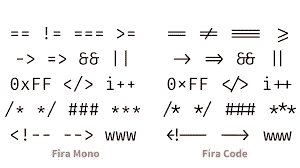
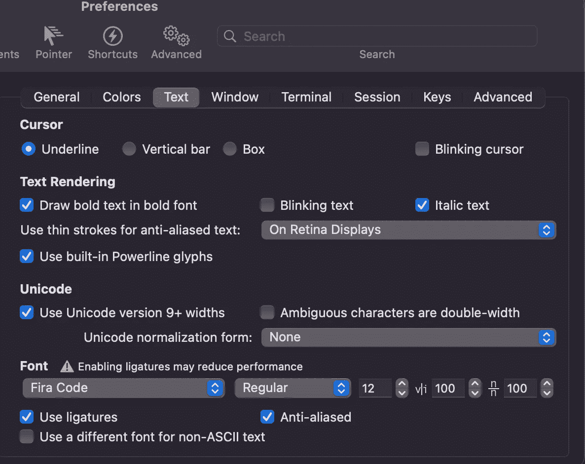

# 使用这些工具美化你的终端

> 原文：<https://javascript.plainenglish.io/beautify-your-terminal-using-these-tools-649ff228547d?source=collection_archive---------1----------------------->

## 设置高效终端环境的有用提示和技巧

Photo by [Ilya Pavlov](https://unsplash.com/@ilyapavlov?utm_source=unsplash&utm_medium=referral&utm_content=creditCopyText) on [Unsplash](https://unsplash.com/s/photos/computer-terminal?utm_source=unsplash&utm_medium=referral&utm_content=creditCopyText)

你有没有发现自己通过观看教程和视频来学习一些新的东西，并且感到非常羡慕？不，只有我？如果你和我一样，想弄清楚如何让我的终端不仅看起来更好，而且更有生产力和信息量，不要再犹豫了！我将介绍一些我在机器上使用的工具，这些工具使我的终端成为一个有趣、高效的地方。最近，我不得不在一台新的 MacBook 上重做这个过程，发现所有的信息就像一场寻宝游戏，我没有报名参加，所以我想最好在未来有一个指南。

## 终端选择

开箱即用，我的 mac 自带的终端还可以，但我发现 [iTerm2](https://iterm2.com/index.html) 有更多的定制，总体来说用户体验更好。它提供了像分割窗格这样的东西，这样你就可以同时查看两个终端，你可以设置一个热键，无论你在哪里工作，它都会把你的终端放在最前面，你还可以搜索你的终端。它还具有 autocomplete 功能，以及其他许多 plain jane 终端所没有的功能。

我在终端和文本编辑器中使用 Fira 字体，这样我就可以使用连字= >(即更漂亮的箭头)，如下所示:

Ligatures using Fira Code

您可以自定义字体、颜色、光标样式、颜色等。全部在 iTerm2 内。如果您有兴趣为连字安装 Fira 字体，可以在 Mac 上使用 brew。这里有一个 [Fira 代码库](https://github.com/tonsky/FiraCode)的链接，你可以随意阅读。下面是我在 iTerm2 中的文本设置示例:

Example of Customizable Terminal

## 哦，我的 Zsh

哦，我的 Zsh 是另一个很棒的工具，它可以让你的终端变得更加高效，更加可定制。

*“哦，我的 Zsh 是一个令人愉快的、开源的、社区驱动的框架，用于管理您的 Zsh 配置。它捆绑了数以千计的有用的功能，助手，插件，主题"*

安装很简单，也很容易按照你需要的任何方式进行配置。您可以简单地运行该链接中的命令。要进行配置，您需要访问您的 *~/。zshrc* 文件。你可以从你的终端使用 *vim* 或 *nano* 来这样做。如果你不熟悉终端内文件编辑，你可以在这里找到有用的提示和技巧列表[用于 *vim*](https://vim.rtorr.com/) 和[用于 *nano*](https://www.nano-editor.org/dist/latest/cheatsheet.html) *。*哦，我的 Zsh 有大量的[主题](https://github.com/ohmyzsh/ohmyzsh/wiki/Themes)和[插件](https://github.com/ohmyzsh/ohmyzsh/tree/master/plugins)你可以使用，比如自动完成和语法高亮、git 等等。这是进一步定制您的体验的好方法。

## 星际飞船

最后但同样重要的是，星舰！ [Starship](https://starship.rs/) 是一个跨 shell 提示工具，简单且超级快速。无论您是使用 Zsh/Bash/Fish，您都会有非常相似的体验。它还允许您完全创建您的终端提示，为您提供您所需要的信息。10/10 推荐。安装简单明了。您可以配置的东西太多了，无法一一列出。我会说它允许你使用有趣的表情符号来表示你的 git 状态，你可以显示时间戳，查看你在某个文件中工作了多长时间，或者一个命令执行了多长时间。它为您的命令行提供了强大的功能。配置选项的完整列表可在[这里](https://starship.rs/config/#prompt)找到。这里有一个非常酷的 [starship.toml 文件](https://gist.github.com/ryo-ARAKI/48a11585299f9032fa4bda60c9bba593)，我用它作为参考点。

这是所有的乡亲。只需几个步骤，你就可以真正超能力你的终端体验，让它成为你喜欢使用的工具。我希望这对你有所帮助！

## 资源:

 [## iTerm2 - macOS 终端更换

### iTerm2 是 Terminal 的替代品，也是 iTerm 的继任者

iterm2.com](https://iterm2.com/index.html)  [## 哦，我的 Zsh——一个令人愉快的开源 Zsh 框架

### Oh My Zsh 是一个开源的、社区驱动的框架，用于管理您的 Zsh 配置。听起来很无聊。让我们试试…

ohmyz.sh](https://ohmyz.sh/#install)  [## 星际飞船:跨壳提示

### 对任何 shell 来说，最小的、极快的和无限可定制的提示！入门→处理最常见的…

星际飞船](https://starship.rs/)  [## 星际飞船:跨壳提示

### 要开始配置 starship，请创建以下文件:~/。星舰的所有配置…

星际飞船](https://starship.rs/config/#prompt) 

*更多内容请看*[***plain English . io***](https://plainenglish.io/)*。报名参加我们的* [***免费周报***](http://newsletter.plainenglish.io/) *。关注我们关于*[***Twitter***](https://twitter.com/inPlainEngHQ)*和*[***LinkedIn***](https://www.linkedin.com/company/inplainenglish/)*。加入我们的**[***社区不和谐***](https://discord.gg/GtDtUAvyhW) *。**