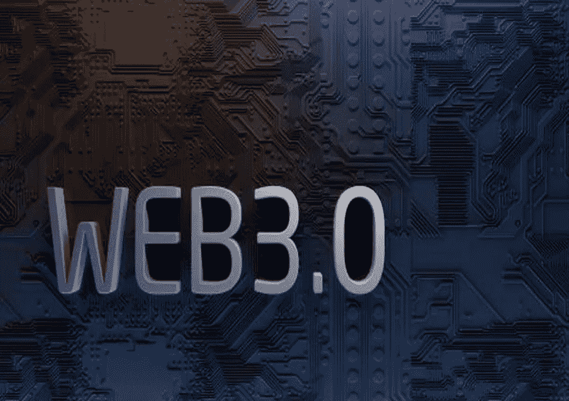

# 成为 Web3.0 开发者:你需要知道的所有概念

> 原文：<https://javascript.plainenglish.io/become-a-web3-0-developer-all-the-concepts-you-need-to-know-845395b32fbd?source=collection_archive---------10----------------------->

## 成为 Web3.0 开发人员需要知道的一切。

Web3.0 是万维网的下一个发展阶段，代表着数据共享和使用方式的根本性变化。最初的万维网是基于静态文档的，而 Web3.0 是基于分散的应用程序的，这些应用程序允许增强安全性、隐私性和互操作性。

Web3.0 的关键技术是 Solidity，这是一种用于在以太坊区块链开发智能合约的编程语言。Solidity 类似于 JavaScript，但它是专门为创建智能合同而设计的。因此，它非常适合开发需要防篡改功能的分散式应用程序。

## 学习区块链的基础知识

什么是区块链？

区块链是所有加密货币交易的数字账本。随着“完成的”块随着一组新的记录被添加到其中，它不断地增长。每个块都包含前一个块的加密哈希、时间戳和事务数据。比特币节点使用区块链来区分合法的比特币交易和试图重新花费已经在其他地方花费的硬币。

**区块链是如何工作的？**

区块链被数学所保护。特别是哈希函数。哈希函数接受任意大小的输入，并将其转换为固定大小的输出。在区块链环境中，哈希函数用于为每个数据块创建唯一的指纹。然后，该指纹用于保护块的内容不被修改。

矿工负责创造区块链的区块。他们的努力会得到加密货币的奖励。要创建一个块，矿工必须解决一个密码问题。这个问题是网络造成的，被设计成很难解决但很容易验证。当一个矿工解决了这个问题，他们就向网络广播这个块。然后，其他节点验证该块及其内容。如果区块有效，它将被添加到区块链，矿工将获得加密货币奖励。

**区块链有什么好处？**

区块链是安全、透明和高效的。它们允许创建分散的应用程序，这些应用程序可以在不需要中央机构的情况下运行。

## 什么是分散式应用？

简而言之，分散式应用程序(dApp)是由对等网络中的多台计算机而不是单台计算机运行的应用程序。dApps 不受任何单一实体的控制，因此提供了比传统应用程序更高的安全性和透明度。

dApps 由区块链技术支持，这是一种分布式数据库，允许安全、透明和防篡改的交易。区块链技术是比特币和以太坊等加密货币的支柱，它作为一种创建更安全和透明的应用程序的方式，正在迅速获得企业和开发者的青睐。

将区块链技术用于 dApps 有许多优点。首先，区块链技术提供了传统应用程序无法实现的安全性和透明性。通过记录区块链上的所有交易，篡改或删除数据而不被发现是不可能的。

此外，区块链技术允许点对点交易，而不需要第三方。这可以降低与传统应用程序相关的成本和费用，并允许更民主和分散的治理。

最后，区块链技术仍处于早期阶段，有进一步发展的巨大潜力。随着技术的不断发展，很可能会产生更多创新的 dApps。

## 2022 年学习前端开发

前端开发是现代职场中最重要、最抢手的技能之一。它指的是使网站看起来和感觉起来都很棒的工作，它对于任何想要为他们的业务创建在线存在的人来说都是必不可少的。

如果你想在 2022 年学习前端开发，有几件事你需要知道。首先，你需要熟悉 HTML、CSS 和 JavaScript。这是构成前端开发的三大核心技术。HTML 用于创建网站的结构，CSS 用于样式化网站，JavaScript 用于增加交互性。

第二，你需要能够自如地使用代码。前端开发是一个非常基于代码的学科，所以如果你想成功，你需要能够写、读和理解代码。

最后，你需要愿意学习。前端开发环境在不断变化，如果您想保持领先，就需要愿意跟上最新的趋势和技术。

## 要成为一名 Web3 开发者，我应该学习后端开发吗？

这个问题的答案取决于你的具体目标和兴趣。如果你想开发 dapps，那么你将需要学习前端和后端开发。但是，如果您只对开发用户界面或后端逻辑感兴趣，那么您可以只关注其中一个领域。

## 了解什么是以太坊及其工作原理

以太坊是一个运行智能合约的分散平台:应用程序完全按照编程运行，没有任何欺诈或第三方干扰的可能性。

以太坊是一个运行智能合约的分散平台:应用程序完全按照编程运行，没有任何欺诈或第三方干扰的可能性。以太坊也是创造新的数字货币的平台。这些货币被称为“以太”。

以太坊也是创造新的数字货币的平台。这些货币被称为“以太”。以太是用于支付以太坊网络计算的货币名称。就像比特币一样，以太可以用来购买商品和服务。

以太是用于支付以太坊网络计算的货币名称。就像比特币一样，以太可以用来购买商品和服务。以太可以像比特币一样在加密货币交易所交易。

以太可以像比特币一样在加密货币交易所交易。以太坊由 Vitalik Buterin 于 2015 年创建。

以太坊由 Vitalik Buterin 于 2015 年创建。以太坊目前是市值第二大的加密货币。

## 智能合同

是两方或多方之间的数字合同或协议，在满足特定条件时自动执行。它们是在区块链上创建的，这是一个分布式的、安全的和透明的分类账。

智能合约是在区块链上创建的，这是一个分布式、安全和透明的分类账。这使得他们安全和防篡改。区块链也是透明的，这意味着所有交易都公开记录，任何人都可以核实。

智能合同可用于简化签约流程。它们有助于减少对律师和公证人等中间人的需求，并能使合同的核查和执行自动化。

智能合同也很灵活，可以定制以满足相关方的特定需求。它们可用于多种目的，例如自动验证和执行合同、跟踪和记录数字资产所有权或管理数字版权。

## 学习可靠性以开发和部署智能合同

Solidity 是一种面向契约的编程语言，用于在以太坊区块链上开发和部署智能契约。它是一种类似 JavaScript 的高级语言，旨在简化智能合约的编写。

Solidity 是以太坊上开发智能合约最流行的编程语言。它具有广泛的特性，使其适用于复杂的契约，并且已经成功地用于创建各种各样的应用程序。

为了使用 Solidity 开发智能合同，您首先需要安装 Solidity 编译器。你可以在 Solidity 网站上找到这样做的说明。

一旦你安装了 Solidity 编译器，你就可以开始编写智能合同了。Solidity 文档提供了一个用 Solidity 编写合同的初学者指南。它涵盖了从语言基础到更高级主题的所有内容，比如模块化和数据结构。

Solidity 网站还提供了一些合同范例，你可以通过研究来学习如何使用这种语言。

一旦你写好了合同，你需要把它编译成可以在以太坊区块链上运行的字节码。您可以使用 Solidity 编译器来完成这项工作。

一旦你的合同被编译，你可以把它部署到以太坊区块链。您可以使用以太坊客户端或第三方部署服务来实现这一点。

## 连接您的 DApp 前端:学习 Web3.js 或 Ethers.js

有许多不同的方法可以将前端连接到 DApp。两个最流行的选项是 Web3.js 和 Ethers.js。我们将比较和对比这两个选项。

Web3.js 是一个 JavaScript 库，允许您与以太坊区块链进行交互。它是由以太坊的联合创始人加文·伍德创建的。Ethers.js 是一个允许你与以太坊区块链和比特币区块链互动的库。它是由 Ethers.js 项目的联合创始人杰弗里·沃伦创建的。

Web3.js 和 Ethers.js 的一个主要区别是，Web3.js 只支持以太坊区块链，而 Ethers.js 同时支持以太坊和比特币区块链。另一个区别是，Web3.js 比 Ethers.js 更受欢迎，拥有更大的开发人员社区。

不过 Ethers.js 相对于 Web3.js 还是有一些优势的，一是比 Web3.js 更轻量级，速度更快，二是支持更多的特性，比如轮询和 WebSocket 支持。最后，它更加模块化，更易于定制和扩展。

那么，应该使用哪个库呢？这取决于你的需求。如果你只需要与以太坊区块链互动，那么 Web3.js 是个不错的选择。如果你需要同时与以太坊和比特币区块链互动，那么 Ethers.js 是一个更好的选择。

## 学习安全帽

HardHat 是一个允许你在以太网上开发分散应用的工具。它是由以太坊基金会创建的，为开发人员提供了一种轻松创建和部署分散式应用程序的方法。

使用 HardHat 的一个好处就是可以轻松访问以太坊网络。您还可以使用它来创建智能合同和管理您的区块链应用程序。

为了使用 HardHat，您首先需要创建一个帐户。然后，您可以下载该软件并开始开发您的应用程序。

HardHat 开发者社区也是学习如何使用该软件的一个很好的资源。有许多教程可以帮助您入门。

总的来说，HardHat 是 web3 开发的一个很好的工具。它使得访问以太坊网络和创建去中心化的应用程序变得容易。

## 学习松露和加纳切

Dapps 可以用于各种各样的事情，比如在线市场、社交网络和文件共享平台。最棒的是他们不可信。这意味着用户可以与它们进行交互，而不必担心应用程序是否值得信任。

唯一的问题是构建 dapps 可能有点棘手。有很多不同的部分使它们工作。如果你对它们都不熟悉，开始会很困难。

这就是松露和加纳切的用武之地。

Truffle 是以太坊的一个开发框架。通过为您提供所需的所有工具，构建 dapps 变得更加容易。Ganache 是一个简化的以太坊区块链，可以用来测试 dapps。这使得调试它们并弄清楚发生了什么变得更加容易。

块菌和加纳切一起使得发展 dapps 变得容易多了。因此，如果您对构建自己的工具感兴趣，那么这两个工具绝对是您想要尝试的。

## 了解如何测试您的智能合约

在部署智能合约之前，您应该对其进行测试，以确保其行为符合预期。有许多方法可以测试您的契约，您采用的方法将取决于契约的复杂性和您的开发环境。

在本文中，我们将讨论测试智能合约的一些最常见的方法。我们还将讨论一些测试契约的技巧以及如何解决常见问题。

**坚固性测试工具**

测试是软件开发的重要部分，对于智能合约来说尤其如此。通过测试您的合同，您可以帮助确保它们按预期工作并且是安全的。

有多种方法可以测试智能合约。一种方法是使用像 Remix 这样的工具在沙盒环境中测试合同。你也可以使用像 Etherscan 这样的工具来测试区块链上的合同。

另一种方法是使用像 Truffle 这样的工具为你的合同编写和执行测试。Truffle 包括一个测试用例库，它还支持模拟环境中的模仿和测试。

最后，您还可以使用类似 EtherCamp 的工具来部署合同，并在真实环境中进行测试。这有助于测试与外部数据或系统交互的契约。

无论你采取哪种方法，彻底测试你的合同是很重要的。通过这样做，您可以帮助确保您的合同安全可靠。

## 如何测试我的分散式应用程序？

测试您的分散式应用程序可能很困难。有许多事情需要考虑，例如您将用于测试的节点，您将如何测试事务有效性，以及您将如何测试您的应用程序的功能。在本文中，我们将讨论如何着手测试您的分布式应用程序。

**测试节点**

测试分散式应用程序的第一步是选择用于测试的节点。为了测试应用程序的功能，至少需要两个节点。其中一个节点将用于向第二个节点发送事务，第二个节点将用于验证事务。

您可以使用任何您喜欢的节点进行测试，但是建议您使用与您将在生产环境中使用的节点相似的节点。这将有助于确保您的应用程序在生产网络上正常工作。

**交易有效性**

测试分布式应用程序的下一步是测试事务的有效性。您需要确保正在发送的事务是有效的，并且它们被网络正确地处理。

您可以使用 getTransaction 方法来验证事务。该方法将事务 ID 作为参数，并返回事务的详细信息。您可以使用此方法来验证事务处理是否正确，以及它是否被添加到正确的块中。

**应用功能**

测试分散式应用程序的最后一步是测试它的功能。您需要确保应用程序按预期运行。

您可以使用 dApp API 来测试您的应用程序的功能。这个 API 允许您发送事务和查询区块链的状态。您还可以使用 API 来获取有关区块链中的块和事务的信息。

测试您的分散式应用程序可能很困难，但是确保您的应用程序在生产网络上正常工作是很重要的。测试应用程序的第一步是选择将用于测试的节点。为了测试应用程序的功能，至少需要两个节点。其中一个节点将用于向第二个节点发送事务，第二个节点将用于验证事务。

有许多课程和培训计划可以帮助你发展这些技能。或者，你可以在使用这些技术的公司找到一份 web3.0 开发工作。

*更多内容看* [***说白了就是***](https://plainenglish.io/) *。报名参加我们的* [***免费周报***](http://newsletter.plainenglish.io/) *。关注我们关于*[***Twitter***](https://twitter.com/inPlainEngHQ)*和*[***LinkedIn***](https://www.linkedin.com/company/inplainenglish/)*。加入我们的* [***社区***](https://discord.gg/GtDtUAvyhW) *。*