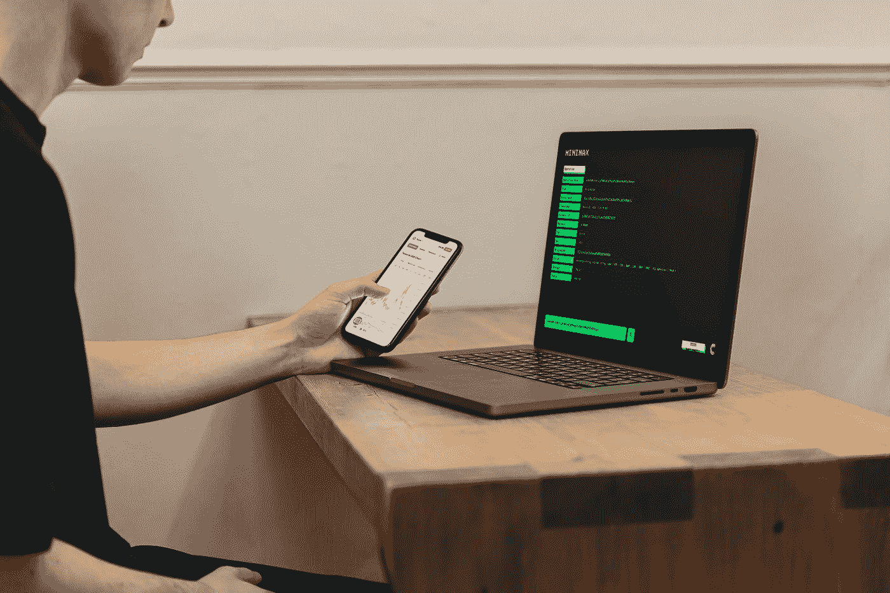
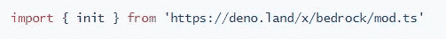
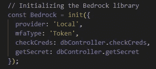
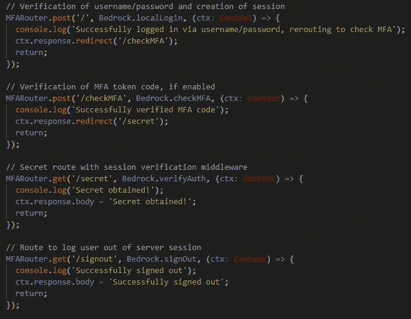

# 介绍基岩 Deno 的认证库

> 原文：<https://javascript.plainenglish.io/bedrock-an-authentication-library-for-deno-b950e90d90d?source=collection_archive---------6----------------------->

## *不要暴露自己——把你的安全建立在基石上*

作者:安东尼·瓦尔迪兹、埃里克·哈根、约翰·豪厄尔和朱利安·康

Photo by [Tezos](https://unsplash.com/@tezos?utm_source=medium&utm_medium=referral) on [Unsplash](https://unsplash.com?utm_source=medium&utm_medium=referral)

*基岩是一个基于策略的身份验证库，内置在 TypeScript 中，供开发人员导入易于使用的中间件。它旨在成为用户登录体验的基础，拥有一套 OAuth 提供程序和本地身份验证策略，可通过 SMS 文本消息、电子邮件和 TOTP 应用程序提供 MFA。*

*不要让自己暴露——把你的安全建立在基石上*

# **德诺？OAuth？MFA？TOTP？什么？**

如果上面的描述听起来不熟悉，那么我们会告诉你，否则，请随意跳到“什么是基岩？”部分。

## 

**在不提及 Node 的情况下描述 Deno 的 *what* 和 *why* 将是一个相当大的挑战(继续尝试)。Ryan Dahl 创建了著名的 Node.js，这是流行的 JavaScript 运行时。几年后，他在 JSConf EU 上发表了一次演讲，详细讲述了他在 Node 开发过程中的遗憾和错误。考虑到这些错误，他宣布了 Deno。JavaScript 和 TypeScript 的现代运行时，作为单个可执行文件和大型内置库提供。默认情况下，它是安全的，对网络和文件读/写访问有限制，除非在运行时明确允许。**

## **[**OAuth**](https://auth0.com/intro-to-iam/what-is-oauth-2/)**

**OAuth 是一种行业标准的身份验证和授权协议，允许用户通过不同的提供商(如 Google、Twitter、LinkedIn 等)登录帐户。此外，通过这些 OAuth 提供者登录，您可以指定权限来检索应用程序要使用的特定帐户数据。**

## **[**MFA**](https://support.microsoft.com/en-us/topic/what-is-multifactor-authentication-e5e39437-121c-be60-d123-eda06bddf661)**

**生活在 21 世纪的几乎每个人都经历过多重身份认证(MFA)。每当你试图登录一个安全的银行网站，一个电子邮件帐户，或其他安全的服务提供商，你可能会使用 MFA。MFA 背后的过程通过让你提供三件事情中的两件来为你和你的数据提供更深层次的安全性:你*知道的事情*，你*拥有的事情*，以及你*拥有的事情*。你*知道的东西*是类似 PIN 或密码的东西，你*拥有的东西*可以是你的手机或电脑，你*拥有的东西*可以是类似面部识别或你的指纹的生物标识符。**

## **[**TOTP**](https://datatracker.ietf.org/doc/html/rfc6238)**

**基于时间的一次性密码(TOTP)是一种常见的 MFA 形式。它使用当前的 [unix](https://www.unixtimestamp.com/) 时间以及特定于帐户的“秘密”作为唯一性的来源，以生成用户将收到的代码来确认他们的身份和验证他们自己。**

***希望现在我们已经提供了一些背景，我们可以开始解释什么是基岩以及为什么你应该使用它。***

# ****太好了！这一切都有道理…那么，你的产品是什么？****

## ****什么是基岩？****

**基岩是一个身份验证库，开发人员可以将其作为中间件导入和部署到 Deno 应用程序中。**

**它提供了大量定制选项，开发人员可以利用这些选项来创建一个安全的、定制的登录门户，以满足他们的项目需求。基岩使得验证用户变得容易，同时降低了他们的跳出率(当使用 OAuth 时)。通过最少的编码将基础连接到您的应用程序，开发人员可以添加健壮的身份验证系统，而不用担心配置错误。**

**对于希望维护本地化验证的开发人员，基岩为 MFA 提供了内置的 TOTP、电子邮件和短信验证选项。一旦用户使用他们的电子邮件和密码登录，开发人员可以选择让用户通过第二阶段的验证，以防止访问受损的帐户。通过 TOTP，用户将使用第三方令牌生成器(如 Google Authenticator ),该生成器提供一个基于时间的代码，该代码与只有用户才能访问的帐户密码相关联。电子邮件和短信的工作方式类似，都是将一个代码发送到用户指定的电子邮件或电话帐户，然后用户可以使用该代码完成登录过程。通过使用 MFA，恶意行为者能够强行进入受损帐户的风险很小，而基岩是专门为防止暴露敏感信息而设计的。**

**使用基岩实现 OAuth 策略简单而有效。我们抽象出了特定于不同 OAuth 提供者的 URIs 的制定过程，以及为用户提供唯一令牌并允许他们通过我们的许多提供者安全登录的请求和响应的幕后过程。**

## **你为什么要做这个？**

**当我们开始在 Deno 领域工作时，我们发现虽然 Deno 生态系统中有一些库通过 OAuth 或 MFA 提供少量的身份验证或授权，*但没有一个包罗万象的身份验证库来实施多种验证策略*。作为创新和大胆的开发人员，我们看到了一个空间，我们可以构建一个工具来改善开发体验，并为数据库和用户带来安全性。**

## ****你为谁做的？****

**基岩是为德诺社区！它是在 MIT 许可下开发的，并且是开源的。谁都可以用！我们热爱 Deno，我们希望看到社区的使用量增长。我们相信，将一个以安全为中心的产品引入一个以安全为中心的运行时将有助于使开发人员的生活更轻松。**

## **好吧，这一切都有道理…我为什么要使用它？安全吗？**

**通过实现 MFA 和 OAuth 2.0，将基岩的库导入您的应用程序将为您和您的用户提供额外的安全层。这两种实践都是行业标准，通过这些标准，您可以向用户提供安全的访问，并随后访问他们的数据。基岩库提供了直观的中间件功能，以便利用其功能，在开发新应用程序或在现有代码库中实施策略时，可以毫不费力地实现这些功能。**

**如上所述，基岩的 MFA 程序中使用的 TOTP 算法遵循 IETF RFC 6238 中概述的标准，该标准也被谷歌、微软等公司遵循。此外， [OAuth2.0](https://oauth.net/2/) 是一种行业标准，通过可信的提供商提供认证和授权服务。因此，这个库是一个很好的方式，可以安全地扩充您现有的应用程序，甚至是您一直想要构建的项目，同时为您的用户提供安全的登录过程。**

## ****等等！我是一个用 Deno 的 dev 怎么用这个？****

**导入我们的[库](https://deno.land/x/bedrock):**

****

**定义您的参数:**

****

**将我们的中间件插入您的路线:**

****

**如果我们引起了您的注意，并且您想深入了解基岩，您可以在这里查看我们的[文档。](https://bedrockauth.dev)**

**坐下来放松一下！**

# ****总结****

**在本文中，我们介绍了什么是 Deno，身份验证的基础知识，并向您介绍了我们的产品基岩。我们解释了实现像基岩这样的认证库的好处，以及如何在您自己的应用程序中利用代码。希望您能更好地了解基岩是一个易于使用的身份验证库，并理解为什么它不仅为您的应用程序，还为您的用户带来了额外的安全性。如果这些概念中的任何一个仍然模糊不清，或者您想更深入地讨论基岩是如何工作的，请随时与我们联系。我们喜欢收到反馈！您可以通过以下链接单独联系我们，也可以通过[bedrock.deno@gmail.com](mailto:bedrock.deno@gmail.com)联系我们。**

# ****基石团队****

**我们要感谢您花时间阅读和了解我们的图书馆！**

**基岩是由 OS Labs tech accelerator 内的 [Anthony Valdez](https://www.linkedin.com/in/va1dez/) 、 [Eric Hagen](https://www.linkedin.com/in/hagenforhire/) 、 [John Howell](https://www.linkedin.com/in/jdh3/) 和 [Julian Kang](https://www.linkedin.com/in/julianswkang/) 开发的。基岩是开源的，根据麻省理工学院的许可可以自由使用。**

**您可以在这里查看我们的 Github 回购计划:**

** [## git hub-OS labs-beta/基岩:Deno 的模块化身份验证库。

### Deno 的一个完全模块化的身份验证库，旨在成为您的应用程序的基础…

github.com](https://github.com/oslabs-beta/Bedrock) 

您可以在这里查看[我们的发布页面:](https://www.bedrockauth.dev)

 [## 基本原则

### Deno 运行时环境基岩的基于策略的身份验证库是一个安全且易于使用的…

www.bedrockauth.dev](https://www.bedrockauth.dev/) 

*更多内容请看*[***plain English . io***](https://plainenglish.io/)*。报名参加我们的* [***免费周报***](http://newsletter.plainenglish.io/) *。关注我们关于*[***Twitter***](https://twitter.com/inPlainEngHQ)*和*[***LinkedIn***](https://www.linkedin.com/company/inplainenglish/)*。查看我们的* [***社区不和谐***](https://discord.gg/GtDtUAvyhW) *加入我们的* [***人才集体***](https://inplainenglish.pallet.com/talent/welcome) *。***