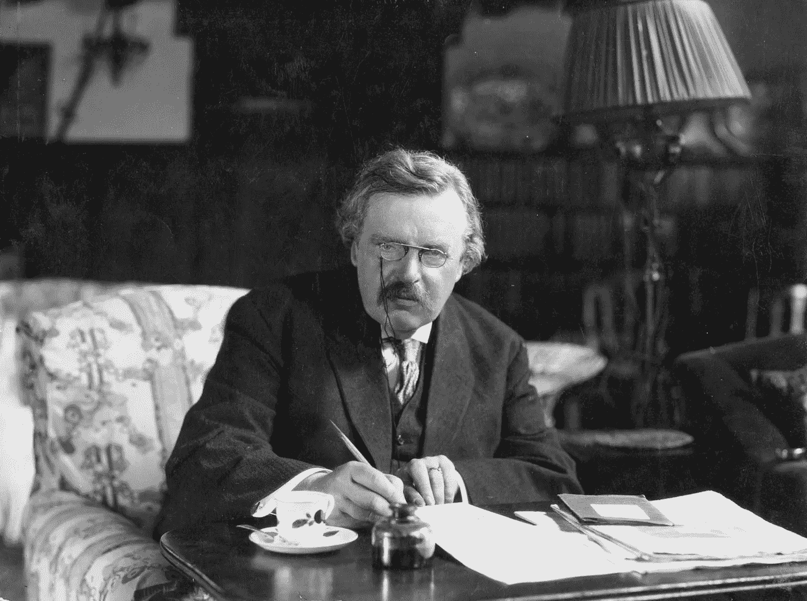

# 在删除或更改代码之前，想想切斯特顿的栅栏

> 原文：<https://javascript.plainenglish.io/before-you-remove-or-change-code-think-of-chestertons-fence-7686f9669aee?source=collection_archive---------8----------------------->

## 当你不明白某件事的目的时，行动前先思考

Photo by [fillvlad](https://www.pexels.com/@fillvlad?utm_content=attributionCopyText&utm_medium=referral&utm_source=pexels) from [Pexels](https://www.pexels.com/photo/fence-next-to-path-on-mountain-by-sea-10278313/?utm_content=attributionCopyText&utm_medium=referral&utm_source=pexels)

> 许多人认为他们在思考，其实他们只是在重新整理他们的偏见 —威廉·詹姆斯

每当开发人员更改代码时，他们的更改可能会修复一部分而破坏另一部分。更改代码的困难在于理解其目的和创建代码背后的需求。

**如果代码存在，很可能是有原因的。**

要删除或更改代码，您首先需要理解开发人员创建它的原因。很难找到代码的目的，因为即使是需求也会更新和过时。

你看到的所有代码都是有原因的，原因是什么，它仍然有效吗？

# **切斯特顿的栅栏**

> "在你不知道竖起篱笆的原因之前，不要拆掉它."― G. K .切斯特顿

我从法南街上读到过切斯特顿的栅栏。G. K .切斯特顿是一位英国作家，他写了大约 80 本书和 4000 篇散文，喜欢用谚语、寓言和任何其他工具来表达自己的观点。他最著名的故事是一个星期四的人。

G.K. Chesterton

在他的一本书里，他[讨论了栅栏及其目的](https://www.goodreads.com/quotes/833466-in-the-matter-of-reforming-things-as-distinct-from-deforming)，下面引用了两句话:

> “为了简单起见，让我们说一个横跨道路的栅栏或大门。更现代的改革家兴高采烈地走上前去说，“我看不出这有什么用；让我们把它清除掉。对此，更聪明的改革家会很好地回答:“如果你看不到它的用处，我当然不会让你把它清理掉。”。走开想一想。然后，当你能回来告诉我你确实看到它的用途时，我可能允许你销毁它。"

和

> 这一悖论基于最基本的常识。大门或栅栏没有在那里生长。它不是由梦游症患者在睡梦中建造的。极不可能是由于某种原因在街上游荡的逃跑的疯子放在那里的。有些人有理由认为这对某人来说是件好事。在我们知道原因是什么之前，我们真的无法判断这个原因是否合理。如果像我们这样的人类所建立的东西看起来完全没有意义和神秘，那么我们极有可能忽略了这个问题的某些方面。有改革者通过假设他们所有的父亲都是傻瓜来克服这个困难；但如果是这样，我们只能说愚蠢似乎是一种遗传疾病。但事实是，没有人有任何理由去摧毁一个社会机构，除非他真的把它视为一个历史机构。如果他知道它是如何产生的，它应该服务于什么目的，他可能真的能够说它们是坏的目的，它们已经成为坏的目的，或者它们是不再服务的目的。但是，如果他只是盯着这个东西看，把它看做一个不知何故突然出现在他面前的毫无意义的怪物，那么，是他而不是传统主义者受到了幻觉的折磨。"

切斯特顿用栅栏和它的目的来让人们在改变流程、规则和代码之前思考。人们很快就认为他们理解了，但他们只是花时间在表面上理解了它，例如，他们浏览了一下。

要拆除围栏，你需要了解它的用途。问问你自己这些关于栅栏的问题

*   这栅栏是把东西挡在里面还是挡在外面？
*   为什么有人把这个栅栏放在这里？
*   如果我们移走栅栏会发生什么

如果你想改变一个规则，你需要理解这个规则的目的，它的存在是为了让我们做某事还是阻止我们做某事？

这些是关于栅栏的问题。如果是删除或更改一些真正重要的东西，比如代码，那该怎么办！

# 切斯特顿密码

就像栅栏一样，看着代码，很容易认为自己理解了它，可以安全地更新/删除代码。

很多时候开发者看着代码会想，是哪个傻逼写了这么可怕的代码，他们一定是傻子。在意识到实际上是你和[很快将此归咎于一个最近离开的开发人员](https://blog.devgenius.io/how-software-development-really-works-always-blame-the-developer-who-left-c27cd0060896)。

人们很容易相信，所有以前的开发人员都是笨手笨脚的傻瓜，他们随时都在编写糟糕的代码。忽略代码可能已经被编写了很多次并修复了错误，每次更新都修复了一个错误或添加了新需要的功能。

您将努力查找所有的用户故事和错误修复，以验证代码是否符合需求。

查看代码并不能给你业务上下文或者创建它的需求的上下文。

代码本身并不能给你全貌，它只能给你一瞥。开发人员很难理解哪些代码是依赖的，以及它如何与系统的其他部分交互。

开发人员很少了解完整的解决方案，或者这段代码如何融入整个系统。在不了解整体解决方案的情况下，很难在不破坏整体解决方案的一部分的情况下对一小部分进行充电。

# **不要删除代码，直到你明白它的作用以及为什么要添加它**

当你看到一些需要更新的代码或定制时，问问自己，是哪个白痴编写了这些糟糕的代码。

*   这种定制或代码的目的是什么？
*   它实现了什么？它的目标是什么？
*   它想避免什么？
*   什么功能与此代码/定制相关联？
*   这依赖于什么？
*   这个目的仍然有效吗？

一知半解会给你很多盲点和足够的空间去犯你看不到的错误。

> “让你陷入麻烦的不是你不知道的事情。这是你肯定知道的，但事实并非如此。”——马克·吐温

系统思维对此有不同的看法，今天的解决方案就是明天的问题。当您更改代码时，您有可能在直接代码和依赖代码中添加一个 bug。

单元测试可能救不了你，因为相关代码可能离你很远，可能没有单元测试。

在删除某个东西之前，您需要了解它为什么会被创建。

# **重建**

> 撕掉它，重新开始

抛弃旧的，用最新的技术、环境和技巧重新创造功能是很吸引人的。

当你看着一个现有的系统，充满了多年的错误修复，改变和优化。很难理解一切的目的。

在重建中，开发人员丢弃他们不理解的部分，他们后来发现这些部分是需要的。

像软件项目一样，开发人员低估了重建功能的复杂性和时间。潜在的收益需要很大，比现有的功能好 10 倍，并具有面向未来的优势。

# **标准、流程、最佳实践**

标准、流程和最佳实践的产生是有充分理由的，人们很容易认为这些是愚蠢的，没有什么意义。

最佳实践没有意义，因为你不理解它们的目的或它们试图阻止什么。不是流程/标准问题，是教育问题。

问问你自己——为什么这个过程存在？它的目的是什么？

在按下 delete 键或做出更改之前，最好先思考一下，暂停一下。改变主意比撤销改变的代码更容易。

> 木匠说“量两次，切一次”

开发者应该说

> “三思而后行，更新代码一次”

我们需要小心，这不是我们一直在做的事情，这就是我们这样做的原因。如果他们的理由不再有效，事情应该被刷新，但是你应该在做出改变之前理解并确认这一点。

# **我们更了解**

有人怀疑以前的开发者是牛仔，不知道他们在做什么。我们经常批评他们的决定，同时对我们自己的工作更加慷慨。

> 每一代人都认为自己比上一代人更聪明，比下一代人更有智慧。乔治·奥威尔

每个开发人员都想象自己是一个比在他们之前开发代码的开发人员更好的开发人员。

通常以前的开发人员是牛仔(除非是我或你)，但他们有一个很好的理由来创建代码。在更改或删除任何代码之前，请三思。

**不要删除代码，直到你明白它的作用和添加它的原因，并且小心不要删除切斯特顿的代码。**

# 进一步阅读

*   [切斯特顿栅栏的谬误](https://abovethelaw.com/2014/01/the-fallacy-of-chestertons-fence/)
*   [法南街——切斯特顿的栅栏](https://fs.blog/2020/03/chestertons-fence/)
*   S [二阶思维](https://fs.blog/2016/04/second-order-thinking/)

*更多内容看* [***说白了。报名参加我们的***](http://plainenglish.io/) **[***免费周报***](http://newsletter.plainenglish.io/) *。在我们的* [***社区不和谐***](https://discord.gg/GtDtUAvyhW) *获得独家获取写作机会和建议。***