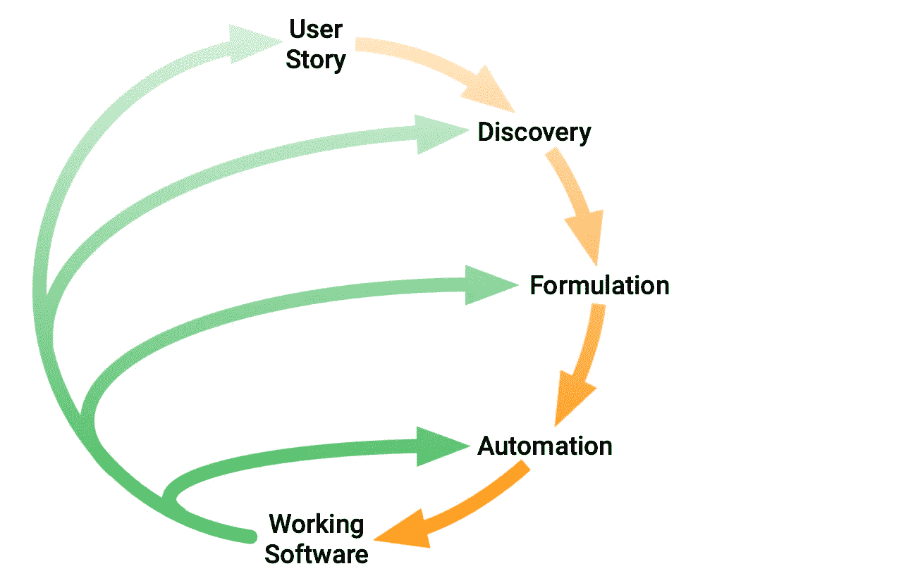
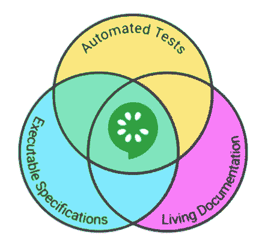

# 行为驱动开发

> 原文：<https://javascript.plainenglish.io/behavior-driven-development-bdd-f843484ab081?source=collection_archive---------5----------------------->

## 遵循 BDD，您从将消费您的代码的人的角度出发。

我开发生涯中最重要的里程碑之一是理解了**行为驱动开发(BDD)** 的原则。每个开发人员都知道，为了构建优秀的软件，编写测试是不可避免的。然而，许多开发人员避免编写测试，或者认为这是一件苦差事。我是你们中的一员；尤其是私下构建软件的时候，写测试的门槛要高很多。为什么？因为你不需要。

*我知道我的代码。我为什么要写测试？*

当我在 2019 年开始开发我的 [Web Highlights Chrome 扩展](https://chrome.google.com/webstore/detail/web-highlights-pdf-web-hi/hldjnlbobkdkghfidgoecgmklcemanhm)时，我没有为它编写任何测试。有这样一个兼职项目意味着有时你没有时间去做它，最终，几个月后你会回来问自己:*“到底是谁写了这段***代码？”*。嗯，是我。在某个时候，当我再次修复一个导致另一个错误的错误时，我决定花一些时间使用 BDD 方法为应用程序编写适当的测试。这样，我不仅确保了现有的功能不会被破坏，而且我还在我的测试文件中提供了软件的动态文档。

*当你写测试的时候，你站在一个会消耗你的代码的人的角度——Patrick Smacchia*

过了一段时间，我越来越喜欢编写测试，尤其是 BDD 过程完全改变了我的想法。我开始痴迷于编写测试。用一种可读和可理解的语言使用例子来编写测试会让你感觉很自然，并且直接为你的软件提供文档。最重要的是，它给了你发展的信心。

## 什么是行为驱动开发(BDD)？

BDD 是一个敏捷的软件开发过程，在这个过程中，应用程序围绕着用户在与它交互时期望体验的行为进行测试和记录。它关注的是系统应该做什么，而不是我们应该如何实现它。BDD 方法使用一种对每个人都可读和可理解的语言来举例说明系统——从领域专家和测试人员到开发人员。

BDD 有两个主要的实践:

*   **举例说明(SbE)** :用例子来说明业务规则。
*   **测试驱动开发(TDD)** :将例子转化为人类可读的、可执行的规范。

虽然 TDD 在创建软件之前定义测试用例来自动测试功能，但是行为驱动开发从用户的角度概述了软件的期望行为，类似于极限编程中的用户故事。

我们需要一种通用语言来应用 BDD，将我们的业务规则转换成每个人都能理解的可执行规范。最常见的方式之一是 **Given-When-Then** 风格。

## 当时给定语言

每个人都能理解的简单明了的语言对于应用 BDD 是必不可少的。这样，所有相关的开发人员和管理人员就可以协作了。行为驱动设计的一个典型例子是直接面向软件逻辑的自然语言场景的公式化。这背后的想法是将一个场景(或测试)分成三个部分——给定、何时、然后。

在行为开始之前，给定的**部分描述了场景的状态。你可以把它看成是设置部分，是测试的前置条件。在**当**阶段，我们的实际行为发生了，在**然后**部分，我们描述了我们期望从我们的行为中得到的改变。也许，这种方法让你想起了[四阶段测试](https://thoughtbot.com/blog/four-phase-test)，它由四个步骤组成:**设置**、**练习**、**验证**和**拆卸**。Given-When-Then 语言采取了前三个步骤，并将它们转换成一种可理解的语言。**

当我们通过例子谈论规范时，这里有一个简单的银行网站的例子:

*   **假设**我使用用户*约翰多伊*登录
*   当我访问银行网站时
*   然后我可以看到我账户的余额

在这种方法中，通常会看到“**和**s”用于组合多个 **THEN** 表达式。

使用 BDD 方法不需要特殊的工具或编程语言，它主要是一种概念性的方法。尽管如此，一个名为**cumber**的流行软件工具在编写 BDD 测试时给了我们很大的支持。它使用所谓的*小黄瓜*语法来描述 Given-When-Then 语言中的测试，并提供额外的关键字，如**和**。以下是我们的银行软件在 Cucumber 的一个特征文件中的样子:

Given-When-Then feature example

## BDD 的好处

使用 BDD 方法有三个显著的好处:

**1。开发人员、测试人员和领域专家之间更好的协作**

行为驱动的软件开发旨在通过一种无处不在的语言来简化开发人员和管理人员之间的协作。在一个**敏捷**环境中，BDD 框架使得将场景转化为自动化测试变得容易，因为我们的用户故事和接受标准已经提供了我们的步骤。

BDD practices (Image: [cucumber.io](https://cucumber.io/img/bdd-practices-diagram.png))

当提炼我们的用户故事时，我们为我们的应用程序定义了一个新的特性。在 BDD 过程中，我们现在将在团队内部进入**发现**阶段。这里我们从**用户故事**中找出至少一个实际例子。从这个例子中，我们**使用 **Given-When-Then** 语言来制定**一个可执行的规范。所有这些都可能发生在团队内部，因为我们使用一种每个人都能理解的语言。

有了可执行的规范，我们就可以进入自动化阶段。通过遵循**测试驱动开发**方法，我们首先为失败的例子编写一个自动化测试。之后，我们将实现软件来使我们的测试工作。

**2。自动生成技术和最终用户文档**

从第一个好处中，您可以获得 BDD 的另一个显著优势。通过使用 BDD 方法描述和测试您的场景，一方面，您可以确保您的软件功能正常工作。另一方面，你也为你的软件创建了活的文档。

Image: [miro.medium.com](https://miro.medium.com/max/1200/1*l8ZO4DM5h_0hBgTzOQau-Q.png)

假设你是团队中的一名新开发人员。现在你应该开发一个新的功能。有许多不同的应用场景。幸运的是，团队创建了许多端到端的测试，以确保现有的功能不会中断。您分析当前的测试以获得一个概述:

很难理解发生了什么，对吗？如果你付出一些努力，这是可能的，但并不简单。这些测试确保我的[web highlighter Chrome 扩展](https://chrome.google.com/webstore/detail/web-highlights-pdf-web-hi/hldjnlbobkdkghfidgoecgmklcemanhm?hl=de&authuser=0)的 Web highlighters 正常工作。

它们很难理解，因为它们是从开发者的角度来写的。相比之下，当你用 BDD 的方式编写测试时，你站在一个会消耗你的代码的角度。上面的例子是对我的测试实际看起来的调整。我想对比两种风格。下面是使用 **BDD** 方法的实际测试。对此你怎么看？

Test descriptions using the BDD aproach

这不是更好读吗？阅读起来毫不费力，并且直接给了我们这个特性的概述。不仅开发人员从这样的测试中受益。团队中的任何其他人都可以查看它们，以快速了解该特性的作用。

 [## Web 亮点— PDF 和 Web 荧光笔

### 在每个网站或 PDF 上创建亮点、书签、标签和文件夹。以结构化的方式组织您的想法和研究…

chrome.google.com](https://chrome.google.com/webstore/detail/web-highlights-pdf-web-hi/hldjnlbobkdkghfidgoecgmklcemanhm?hl=de&authuser=0) 

**3。Given-When-Then 描述更接近日常用语**

这个我们已经讲了很多了，我觉得这个好处是最明显的一个。BDD 场景很容易随着产品的变化而更新。简单的语言很容易编辑。

使用 Given-When-Then 语言有一个**滚雪球效应**:随着每个新场景的加入，为场景编写测试变得更加容易。有时，场景共享相同的步骤，只是与其他场景稍有不同。这使得添加场景变得非常容易，因为我们可以重用现有场景的代码，并且只编辑简单的语言，这很容易，因为它是可以理解的。

## 最后的想法

只有最少的开发人员喜欢编写自动化测试。但是有一个遵循的框架有助于更有动力，并带来其他好处作为副作用。使用 BDD 方法，我们确保了一个功能性的工作应用程序，并获得了我们软件的优秀文档，这是团队中每个人都可以理解的。

我希望你喜欢阅读这篇文章。我总是很乐意回答问题，也乐于接受批评。请随时联系我😊

***如果你想支持我写作，*** [***成为中等会员***](https://medium.com/@mariusbongarts/membership) ***。如果你这样做，我会得到一小笔佣金。谢谢！***

 [## 通过我的推荐链接加入 Medium-Marius bong arts

### 作为一个媒体会员，你的会员费的一部分会给你阅读的作家，你可以完全接触到每一个故事…

medium.com](https://medium.com/@mariusbongarts/membership) 

关注我，不要错过我的下一篇文章。我写了关于 Typescript、Web 组件、前端框架、软件设计模式、Chrome 扩展以及更多的主题！🙏

## 关于我

我是埃森哲互动公司的软件工程分析师。最驱动我的是我想创造一些可能对他人有帮助并改变他人生活的东西的冲动。例如， [**Web Highlights Chrome 扩展**](https://chrome.google.com/webstore/detail/web-highlights-%20-bookmark/hldjnlbobkdkghfidgoecgmklcemanhm) 可以让你高亮显示你在浏览器中访问的每个页面或 PDF 文件上的文本。您可以提供标签来对您的研究进行分组，并快速地重新找到它。你所有的精彩片段都会同步到 web-highlights.com[上的相应网络应用程序中。看看吧！](https://web-highlights.com/)

通过**[**LinkedIn**](https://www.linkedin.com/in/marius-bongarts-6b3638171/)**与我取得联系，或者在 [**Twitter**](https://twitter.com/MariusBongarts) 上关注我。****

**** [## Web 亮点— PDF 和 Web 荧光笔

### 在每个网站或 PDF 上创建亮点、书签、标签和文件夹。以结构化的方式组织您的想法和研究…

chrome.google.com](https://chrome.google.com/webstore/detail/web-highlights-pdf-web-hi/hldjnlbobkdkghfidgoecgmklcemanhm)**** 

## ****进一步阅读****

**** [## 我的第一个 9.99 美元之旅与我的副业

### Chrome 扩展带来的被动收入

medium.com](https://medium.com/@mariusbongarts11/my-journey-to-the-first-9-99-with-my-side-project-3edc13dd1f2d)  [## Web 组件会取代前端框架吗？

### 它们是为解决不同的问题而构建的。

medium.com](https://medium.com/@mariusbongarts11/will-web-components-replace-frontend-frameworks-535891d779ba)  [## 用 Web 组件构建自己的博客组合:基础

### 第 1 部分—定制元素、阴影 DOM 和 HTML 模板

medium.com](https://medium.com/@mariusbongarts11/showcase-your-medium-articles-with-web-components-part-1-basics-d2c6618e9482) 

*更多内容看* [***说白了。报名参加我们的***](https://plainenglish.io/) **[***免费周报***](http://newsletter.plainenglish.io/) *。关注我们*[***Twitter***](https://twitter.com/inPlainEngHQ)*和*[***LinkedIn***](https://www.linkedin.com/company/inplainenglish/)*。查看我们的* [***社区不和谐***](https://discord.gg/GtDtUAvyhW) *加入我们的* [***人才集体***](https://inplainenglish.pallet.com/talent/welcome) *。*******