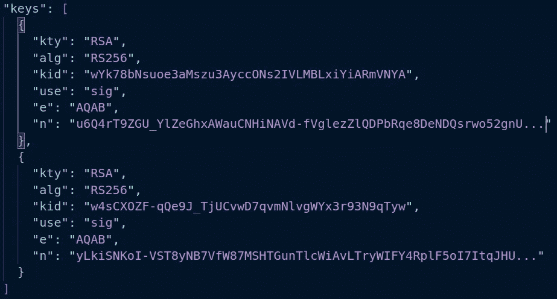

# OAuth 2.1 的幕后

> 原文：<https://javascript.plainenglish.io/behind-the-scenes-of-oauth-2-1-6ecf669965e6?source=collection_archive---------8----------------------->

## 每个 web 开发人员都应该知道 OAuth 2.0 PKCE 流程。


Photo by [Van Tay Media](https://unsplash.com/@vantaymedia?utm_source=unsplash&utm_medium=referral&utm_content=creditCopyText) on [Unsplash](https://unsplash.com/@prasad_jayakumar/likes?utm_source=unsplash&utm_medium=referral&utm_content=creditCopyText)

每个 web 开发人员都应该知道 OAuth 2.0 PKCE 流程。概括地说，该流程包括以下内容:

1.  注册客户端应用程序
2.  创建一个用户并将该用户与客户端应用程序相关联
3.  创建一个密码验证器和密码挑战[PKCE]
4.  构建授权 URL 并将用户重定向到授权服务器。
5.  成功登录后，用户被重定向回客户端。验证状态。
6.  用授权码和代码验证符交换访问令牌

使用以下游乐场获得第一手经验。

[](https://www.oauth.com/playground/authorization-code-with-pkce.html) [## OAuth 2.0 PKCE 流量

### 在开始这个流程之前，您需要注册一个客户端并创建一个用户。注册会给你一个客户…

www.oauth.com](https://www.oauth.com/playground/authorization-code-with-pkce.html) 

OAuth 2.0 和 OpenID Connect 帮助 Web 应用程序:

*   通过 ID 令牌识别用户
*   通过访问令牌访问 API

幕后是关于如何制作这些代币？

*   对称和非对称加密
*   加密哈希函数
*   JSON Web 令牌(JWT，发音为 jot)
*   JWT 签名验证
*   JSON Web 密钥集
*   PKCE

这种理解将有助于开发人员获得知识，并欣赏增强流程的工作。

**对称加密**

*   对称加密使用秘密密钥(密码)来加密内容。
*   要解密对称加密的数据，您需要相同的密钥。
*   常用的实现是高级加密标准(AES)。
*   AES 密钥的大小可以是 128、192 或 256 位。

加密文本在每次运行时都会有所不同——这要归功于初始化向量。

**非对称加密:公钥加密**

*   公钥加密涉及一对密钥，称为**公钥**和**私钥**
*   私钥是一个秘密。可以发布相应的公钥。
*   常用的实现是 Rivest-Shamir-Adelman (RSA)算法。
*   如今 RSA 公钥对的大小是 2048 位(256 字节)。

默认情况下，RSA 加密文本在每次运行时都会有所不同。

**对称加密和非对称加密**

*   对称加密比非对称加密相对更快。
*   但是，“共享秘密”是对称方法的一个固有问题。如果你必须和一个人分享钥匙，你可以打电话，发短信，或者通过一些方式交流。如果你必须与成千上万的人分享，这是不切实际的。此外，与不止一个人分享秘密不再是秘密。
*   非对称方法解决了共享秘密的问题。

检查 SSL/TLS 握手过程以了解其动态。


Source: [https://www.ssl.com/article/ssl-tls-handshake-overview/](https://www.ssl.com/article/ssl-tls-handshake-overview/)

**校验和**

*   校验和散列函数生成散列码，使得检查给定数据的完整性成为可能。
*   我们希望检查完整性的每个字节都应该用于计算校验和。
*   哈希函数必须是确定性的，这意味着相同的消息总是产生相同的哈希。
*   解码生成的哈希代码以获得原始内容是不可能的。意图只是为了证明其真实性。

**加密哈希函数**

> “MD5 校验和可以由能够访问文件的任何人生成。闯入站点或执行中间人攻击的攻击者可以很容易地更改 MD5 校验和，使其与受损文件相匹配。”— [堆栈溢出](https://stackoverflow.com/questions/15194779/md5-vs-gpg-signature#:~:text=MD5%20is%20just%20a%20fingerprint,access%20to%20that%20public%20key.)

数字签名克服了上述缺点。

**签约**

1.  创建内容的哈希代码，以确保数据完整性。
2.  使用私钥加密哈希代码(非对称加密)。加密的散列码被称为数字签名。

**验证**

1.  使用公钥(非对称加密)解密数字签名。输出将是散列码。
2.  验证哈希代码以确保数据完整性。

**JSON Web 令牌**

JSON Web Token (JWT)是一个开放标准( [RFC 7519](https://www.rfc-editor.org/rfc/rfc7519) )，它定义了一种紧凑且独立的方式，以 JSON 对象的形式在各方之间安全地传输信息。该信息可以被验证和信任，因为它是**数字签名的**。

**RS256** 是流行的算法之一。

*   签名算法是 RSASSA-PKCS1-v1_5 ( **RS** )。
*   哈希算法是 SHA256 ( **256** )。


Image Source: [https://community.auth0.com/t/rs256-vs-hs256-jwt-signing-algorithms/58609](https://community.auth0.com/t/rs256-vs-hs256-jwt-signing-algorithms/58609)

使用 JWT 游乐场了解 JWT 有效载荷，签名，及其验证过程。

[](https://jwt.io/) [## JWT。超正析象管(Image Orthicon)

### JSON Web Token (JWT)是一种简洁的、URL 安全的方式，用于表示要在双方之间传输的声明。的…

jwt.io](https://jwt.io/) 

如果你已经到了这个阶段，拍拍自己的背。要进一步探索，请在 Okta 中创建一个开发者帐户(免费帐户)。

 [## Okta 开发人员

### Okta 的开发者版为您的公司提供了评估和探索 Okta 所需的一切。高达 100 MAU，配有…

developer.okta.com](https://developer.okta.com/signup/) 

Okta 默认创建一个授权服务器。导航路径是安全>> API > >授权服务器> >默认。

按照 OAuth 2 标准，每个授权服务器都应该发布元数据 URI。

JWKS 是我们的下一个话题。

```
[https://dev-xxxxxxx-okta.com/oauth2/default/.well-known/oauth-authorization-server](https://dev-68546164.okta.com/oauth2/default/.well-known/oauth-authorization-server)"issuer": "https://dev-xxxxxxxx.okta.com/oauth2/default","authorization_endpoint": "https://dev-xxxxxxxx.okta.com/oauth2/default/v1/authorize","token_endpoint": "https://dev-xxxxxxxx.okta.com/oauth2/default/v1/token","registration_endpoint": "https://dev-xxxxxxxx.okta.com/oauth2/v1/clients",**"jwks_uri": "https://dev-xxxxxxxx.okta.com/oauth2/default/v1/keys"**,
```

**JSON Web 密钥集**

JWT 的签名验证需要公钥。根据所选算法，还需要其他值。为了使这一信息的共享标准化，引入了 JSON Web Key([RFC 7517](https://www.rfc-editor.org/rfc/rfc7517))。



Sample JWKS

让我们把所有的点连接起来:

*   ID 令牌和访问令牌是一个 JWT。
*   只有当签名可以被验证时，JWT 才是可信的。JWKS 通过提供与您的 JWT 相关的公钥扮演了一个重要的角色。
*   此外，JWT 的说法也应该得到核实。在接受有效负载之前，应该遵守到期时间。

最后，让我们用 Okta 思考一下 PKCE(可选部分，随意跳过)。

> 利用授权码授权的 OAuth 2.0 公共客户端
> 容易受到授权码拦截攻击。这个
> 规范描述了攻击以及通过使用代码交换的证明密钥
> (PKCE，发音为“pixy”)——[RFC 7636](https://www.rfc-editor.org/rfc/rfc7636)来缓解
> 威胁的技术

请阅读博客了解更多关于“OAuth 2.0 授权码与 PKCE 流”的细节。相反，我将分享关于如何生成 PKCE 以及如何在我们的本地设置中测试运行 Auth 流的细节。

[](https://developer.okta.com/blog/2019/08/22/okta-authjs-pkce) [## 用 PKCE 流程实现 OAuth 2.0 授权代码

### 想象两个反向连接的杠杆。也就是说，一个上升，另一个下降。一个杠杆是用户…

developer.okta.com](https://developer.okta.com/blog/2019/08/22/okta-authjs-pkce) 

在 Okta 开发人员帐户中创建以下内容:

1.  创建客户端应用程序。
2.  在 Okta 通用目录中创建人员/组。
3.  将人员与客户端应用程序相关联。

 [## 使用重定向模型让用户登录您的 SPA

### 使用 Okta 的重定向模型(打开一个新窗口)将身份验证添加到您的单页应用程序中。这个例子使用 Okta 作为…

developer.okta.com](https://developer.okta.com/docs/guides/sign-into-spa-redirect/react/main/#create-an-okta-integration-for-your-app) 

将访问令牌复制并粘贴到[https://jwt.io/](https://jwt.io/)中。

现在，每个方面都很清楚了:

*   签名已验证。
*   jwt.io 是怎么知道公钥的？检查网络选项卡。将有两个网络请求——一个针对元数据 URI，另一个针对 JWKS。


*更多内容请看*[***plain English . io***](https://plainenglish.io/)*。报名参加我们的* [***免费周报***](http://newsletter.plainenglish.io/) *。关注我们关于*[***Twitter***](https://twitter.com/inPlainEngHQ)[***LinkedIn***](https://www.linkedin.com/company/inplainenglish/)*[***YouTube***](https://www.youtube.com/channel/UCtipWUghju290NWcn8jhyAw)*[***不和***](https://discord.gg/GtDtUAvyhW) *。对增长黑客感兴趣？检查* [***电路***](https://circuit.ooo/) *。***