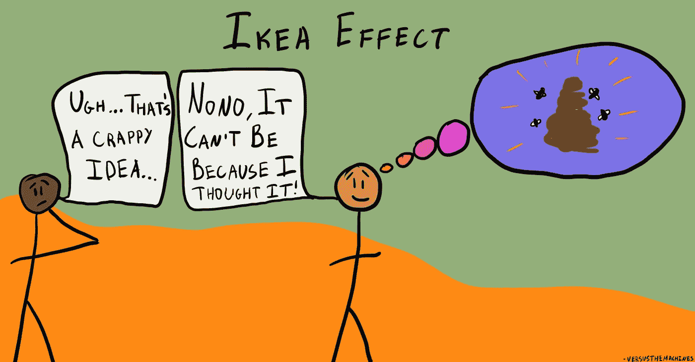

# 作为一名计算机科学学生和企业家富有成效

> 原文：<https://javascript.plainenglish.io/being-productive-as-a-computer-science-student-and-entrepreneur-3fb9eff21d5c?source=collection_archive---------8----------------------->

大约一年来，我一直在一边做企业家，一边学习计算机科学。这使得我很难像我希望的那样高效，但这并没有阻止我提高效率。

这篇文章将回顾保持高效率同时平衡学生和企业家的 5 个最重要的个人结论。

## 总是从关注最具挑战性的任务开始你的一天，✔️

我发现开始富有成效的一天的最好方式是专注于最具挑战性的任务。这样，你就可以把它解决掉，然后继续一天中剩下的任务。当然，重要的是要确保这个挑战性的任务是可以完成的，否则，你只会感到沮丧。但是如果你能设法在早上第一件事就把它敲出公园，你会在这一天剩下的时间里保持良好的状态。

## 休息一下，做些能让你放松的事情，☕️

在今天的社会中，有很大的压力来提高生产力。我们不断被告知，为了成功，我们需要一直工作。这不是真的。要想富有成效，你需要休息一下，做一些能让你放松的事情。

> “如果你不休息一下，你最终会垮掉的。”
> -每一个开发者和企业家

放松的一种方式是到户外散步。新鲜空气和阳光能给你的心情带来奇迹。另一种放松的方式是听音乐。研究表明，听音乐可以降低你的压力水平。最后，你也可以通过看书来放松。正如我们将在本文后面看到的，阅读不仅是知识的来源，也是暂时逃离现实、放松心灵的好方法。

所以，不要因为休息而感到内疚。它们对提高生产力至关重要。只要确保你利用休息时间放松和充电。

## 注意“宜家效应”

注意，一个相当正式的定义来了！

“宜家效应”是一种认知偏差，当人们对自己部分创造的物品赋予过高的价值时就会出现这种偏差。这种偏见是以瑞典家具公司宜家命名的，该公司以销售易于组装的家具而闻名。如果人们花更多的精力去创造物品，他们会更加珍惜它们。

如果上面的段落对你没有任何意义，看看下面的漫画，它抓住了宜家效应的想法。

Image from [https://thedecisionlab.com/biases/ikea-effect](https://thedecisionlab.com/biases/ikea-effect)

这种认知偏差会对生产力产生负面影响，会影响企业家和开发人员。例如，如果你正在做一个项目，并变得过分依赖它，你可能不太可能做出项目成功所必需的改变或妥协。这可能导致浪费时间和精力。

重要的是要意识到“宜家效应”及其对生产力的潜在负面影响。当你在做一个项目时，一定要记住你的目标，并愿意在必要的时候做出改变。

## 获得他人的帮助🙋

如果你正在尝试学习一项新技能，找到一个已经是该领域专家的人并向他们寻求帮助会很有帮助。你可以从比你更有经验的人身上学到很多东西，这可以帮你节省很多时间和减少挫折。

获得帮助的另一个好方法是使用在线资源。有很多网站和论坛，比如 [StackOverflow](https://stackoverflow.com/) ，人们可以在这里分享他们的知识和经验。如果您幸运的话，您的问题已经得到了专家的提问和回答。如果没有，你通常可以找到一个人，无论你想做什么，他都会很乐意帮助你。

Image from @ZeroReasonsWhy_ on Twitter

有时寻求帮助可能很难，尤其是如果你害羞或者觉得自己不够好。但是请记住，每个人都曾经是初学者，每个人都必须从某个地方开始。所以，当您需要帮助时，不要害怕寻求帮助。你会惊讶于你能从别人身上学到多少。

## 投资能帮助你更有效学习的资源📚💡

投资于能帮助你更有效学习的资源是提高生产力的好方法。如果您能找到一种方法来更快地学习并保留您正在学习的信息，您将能够在更短的时间内完成更多的工作。有几种不同的资源可以投资，包括书籍、课程、软件和工具。

提高学习效率的最好方法之一是看书。书籍可以帮助你了解各种不同的话题，还可以教你新的技能和策略。如果你想提高你的生产力，投资一些关于生产力的好书是一个好主意。关于这个主题有几十本好书，我个人的一些建议是:

*   完成工作:大卫·艾伦*的无压力生产力艺术*
*   *詹姆斯 Clear 的原子习惯*
*   有效的管理者:彼得·德鲁克*完成正确事情的权威指南*
*   由 *Cal Newport* 进行的深度加工

毫无疑问，在线课程是了解一个新话题的好方法。然而，小心选择课程很重要，因为有许多低质量的课程会浪费您的时间和金钱。

选择在线课程时，重要的是要确保它来自一个有声望的来源。该课程应由可信的机构提供，比如大学或专业机构。

## 结论

作为一名企业家和开发人员，我知道很容易沉迷于我们的工作。成功的一部分意味着为你的事业付出百分之百的努力。然而，我们绝不能忘记是谁或什么把我们带到那里的。感谢那些支持我们的人是我们在经营业务时保持身心健康的一部分。

你好，感谢你阅读我的博客。我希望你觉得它很有趣，很有启发性。

如果你有兴趣了解更多关于个人发展、商业、金钱和编程的知识，请考虑关注我。我定期发布关于这些主题的有趣而有用的博客帖子，我相信你会发现它们很有帮助，也很有启发性。

*更多内容请看*[***plain English . io***](https://plainenglish.io/)*。报名参加我们的* [***免费周报***](http://newsletter.plainenglish.io/) *。关注我们关于*[***Twitter***](https://twitter.com/inPlainEngHQ)*和*[***LinkedIn***](https://www.linkedin.com/company/inplainenglish/)*。加入我们的* [***社区不和谐***](https://discord.gg/GtDtUAvyhW) *。*