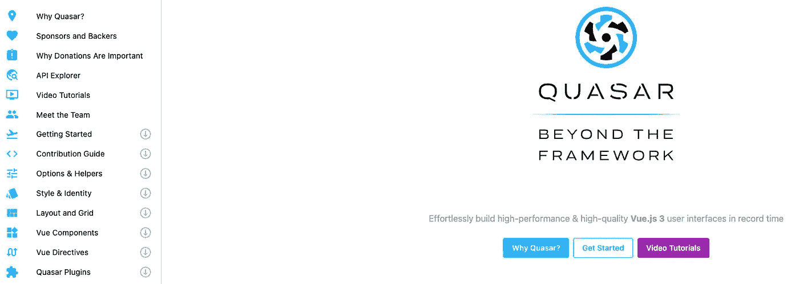
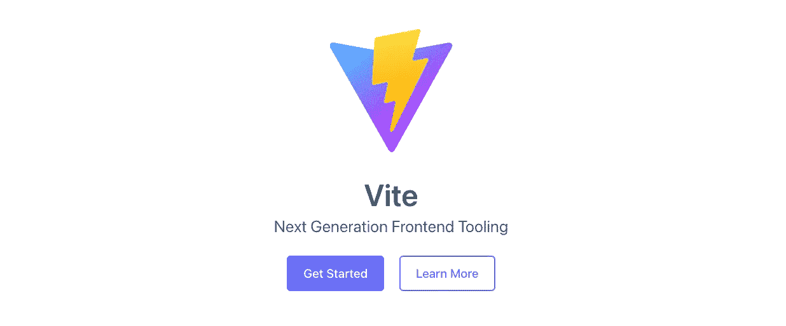

# 面向开发者的最佳 27 款 Vue.js 开发工具

> 原文：<https://javascript.plainenglish.io/best-27-vuejs-development-tools-for-developers-bd972bb5f573?source=collection_archive---------12----------------------->

## 用于网页设计和网页开发的 Vue.js 开发工具介绍。

# BootstrapVue

用于为 Vue.js 构建引导接口的开源库。

BootstrapVue

链接:

 [## BootstrapVue

### 将引导 v4 组件与 Vue.js 快速集成

bootstrap-vue.org](https://bootstrap-vue.org/) 

# Vuex

Vue.js 应用程序的状态管理库。

Vuex

链接:

 [## Vuex 是什么？Vuex

### 请注意，这是适用于 Vuex 4 的文档，适用于 Vue 3。如果你正在寻找 Vuex 3 的文档，它可以和 Vue 一起工作…

vuex.vuejs.org](https://vuex.vuejs.org/) 

# Vue 开发工具

该扩展使得调试 Vue.js 项目变得快速而简单。

Vue Devtools

链接:

 [## Vue 开发工具

### 用于调试 Vue.js 应用程序的浏览器开发工具扩展

devtools.vuejs.org](https://devtools.vuejs.org/) 

# Vue CLI

让 Vue.js 开发者更简单的标准工具。

Vue CLI

链接:

 [## Vue CLI

### 对 Babel、TypeScript、ESLint、PostCSS、PWA、单元测试和端到端测试的现成支持。插件…

cli.vuejs.org](https://cli.vuejs.org/) 

# Vue 路由器

使用直观而强大的语法定义静态和动态路由。

Vue Router

链接:

 [## Vue 路由器

### Vue.js 的官方路由器。用直观而强大的语法定义静态和动态路由。拦截任何…

router.vuejs.org](https://router.vuejs.org/) 

# Vuetifyjs

开源库帮助构建 Vue.js 的材料设计界面。

Vuetifyjs

链接:

 [## vue tify-vue . js 的材料设计框架

### Vuetify 是一个 Vue UI 库，拥有精美的手工材质组件。不需要设计技能-一切…

vuetifyjs.com](https://vuetifyjs.com/en/) 

# Nuxt

一个开源框架，使 web 开发变得简单而强大。

Nuxt

链接:

 [## 直观的 Vue 框架

### 从框架团队和社区中发现关于 Nuxt 的文章。包括提示和技巧！带 Nuxt 的公告…

nuxtjs.org](https://nuxtjs.org/) 

# Vue 元素管理

帮助建立一个简单的管理界面，具有管理网站所需的许多功能。

Vue Element Admin

链接:

 [## GitHub-panjia Chen/vue-element-admin:一个神奇的 vue admin…

### 由 vue-element-admin 赞助的是一个用于管理界面的生产就绪前端解决方案。它基于 vue 和…

github.com](https://github.com/PanJiaChen/vue-element-admin) 

# 阿波罗万岁

使为 Vue.js 项目设置 GraphQL 变得容易。

Vue Apollo

链接:

 [## 阿波罗万岁

### 🚀将 GraphQL 集成到您的 Vue.js 应用中！开始→不要考虑更新 UI 或重新提取查询…

vue-apollo.netlify.app](https://vue-apollo.netlify.app/) 

# 元素 UI

用于 Vue 项目界面开发的 UI 库。

Element UI

链接:

 [## 元素-世界上最流行的 Vue UI 框架

### Element，一套为开发者、设计师和产品经理准备的基于 Vue 2.0 的桌面端组件库

element.eleme.io](https://element.eleme.io/#/en-US) 

# 类星体

Quasar 是一个开源的 Vue.js 框架，帮助构建 SPAs(单页应用程序)、SSR(服务器端渲染应用程序)、PWAs(渐进式 Web 应用程序)…

Quasar

链接:

 [## Quasar 框架——以创纪录的速度构建高性能 VueJS 用户界面

### 所有平台一气呵成地结合了 Quasar UI 和 Quasar CLI 的强大功能。适用于所有平台的一个源代码…

quasar.dev](https://quasar.dev/) 

# 语言 Vue

支持面向 Atom 的 Vue.js 开发的实用程序。

Language Vue

链接:

 [## 语言-vue

### 向 Atom 中的 Vue 组件文件添加语法突出显示和代码片段。最初由…转换而来

atom.io](https://atom.io/packages/language-vue) 

# VuePress

VuePress 是一个以 markdown 为中心的静态站点生成器。

VuePress

链接:

 [## VuePress

### Vue 驱动的静态站点生成器入门介绍以 markdown 为中心的项目结构的最小设置有助于…

v2.vuepress.vuejs.org](https://v2.vuepress.vuejs.org/) 

# Vue.js 指南

Vue.js 开发者最完整详细的指南。

Vuejs Guide

链接:

 [## 简介| Vue.js

### 您正在阅读 Vue 3 的文档！Vue 是一个 JavaScript 框架，用于构建…

vuejs.org](https://vuejs.org/guide/introduction.html) 

# Vue 选择

帮助您使用对 Vue.js 开发人员有用的功能构建组件选择。

Vue Select

链接:

 [## Vue 选择| VueJS 选择 2/选择的组件

### 你希望 HTML 元素能做的一切，都被打包成一个轻量级的、可扩展的 Vue 组件。Vue Select 是一款…

vue-select.org](https://vue-select.org/) 

# 武尤斯

Vue 2 和 Vue 3 组件的必要实用程序集合。

Vueuse

链接:

 [## 武尤斯

### 基本的 Vue 合成工具集 140 多个函数供您选择，仅适用于 Vue 3 和 2…

vueuse.org](https://vueuse.org/) 

# VeeValidate

Vue.js 中的表单验证工具。

VeeValidate

链接:

 [## VeeValidate

### Vue.js 的表单验证🍞简单的声明式验证是熟悉的，易于设置🧘‍♀️灵活…

vee-validate.logaretm.com](https://vee-validate.logaretm.com/v4/) 

# Vant

移动用户界面的界面生成器库。

Vant

链接:

 [## Vant 3 -基于 Vue 的移动 UI 组件

### 基于 Vue 的移动 UI 组件

基于 Vuevant-contrib.gitee.io 构建的移动 UI 组件](https://vant-contrib.gitee.io/vant/#/en-US) 

# Vue 本地

帮助构建跨平台原生移动应用的 JavaScript 框架。

Vue Native

链接:

 [## Vue 本地

### vue Native——移动应用的渐进式 JavaScript 框架

vue-native.io](https://vue-native.io/) 

# Vue-meta

Vue.js 项目的 Cmeta 标记管理器。

Vue-meta

链接:

 [## Vue Meta

### Vue.js 的 HTML 元数据管理器入门→ vue-meta 是 Vue.js 的一个插件，它帮助你管理你的应用程序的…

vue-meta.nuxtjs.org](https://vue-meta.nuxtjs.org/) 

# Vue I18n

插件有助于为项目添加国际特色。

I18n

链接:

 [## Vue I18n

### Vue I18n 是 Vue.js 的国际化插件入门→你可以将国际化引入你的应用…

kazupon.github.io](https://kazupon.github.io/vue-i18n/) 

# Vue 无限载荷

为网站创建无限滚动功能。

Vue Infinite Loading

链接:

 [## vue-无限负载

### Vue.js 的无限滚动插件入门查看 GitHub 开箱即用清晰的 API，内部微调器和更好的…

peachscript.github.io](https://peachscript.github.io/vue-infinite-loading/) 

# 网格体

该工具使构建静态网站和应用程序变得快速而简单。

Gridsome

链接:

 [## Vue.js - Gridsome 的现代站点生成器

### Gridsome 让开发人员可以轻松构建静态生成的网站&默认情况下速度很快的应用程序🚀开源…

gridsome.org](https://gridsome.org/) 

# 轻快地

Vite 是一个构建工具，旨在为现代 web 项目提供更快、更精简的开发体验。

Vite

链接:

 [## 轻快地

### 通过本机 ESM 按需提供文件服务，无需捆绑！热模块更换(HMR ),无论如何都能保持快速…

vitejs.dev](https://vitejs.dev/) 

# vue-多选

帮助网站建立多选功能的开源库。

Vue-multiselect

链接:

 [## Vue-Multiselect | Vue 选择库。

### 基本的单选/下拉菜单不需要太多的配置。选项属性必须是数组。可选…

vue-multiselect.js.org](https://vue-multiselect.js.org/) 

# 韦图尔

在 VSCode 中进行更好的 Vue.js 开发和调试的扩展。

Vetur

链接:

 [## Vetur - Visual Studio 市场

### Visual Studio 代码的扩展-VS 代码的 Vue 工具

marketplace.visualstudio.com](https://marketplace.visualstudio.com/items?itemName=octref.vetur) 

# Vue.js 示例

Vue.js 界面开发示例集

Vuejs Examples

链接:

 [## Vue.js 示例

### 在 Vue.js 中收集了很多有用的例子

vuejsexamples.com](https://vuejsexamples.com/) 

相关文章:

*   [网站的 Javascript UI 框架](https://us.niemvuilaptrinh.com/article/35-ui-frameworks-for-website)
*   [网页开发者备忘单](https://us.niemvuilaptrinh.com/article/top-cheat-sheets-for-web-developer)

# 摘要

我希望这篇文章能为 Vue.js 提供开发工具，如果你有任何问题，请发邮件给我，我会尽快回复。希望大家继续支持网站，让我能写出更多好文章。祝您愉快！

*更多内容看* [***说白了就是***](https://plainenglish.io/) *。报名参加我们的* [***免费周报***](http://newsletter.plainenglish.io/) *。关注我们关于*[***Twitter***](https://twitter.com/inPlainEngHQ)*和*[***LinkedIn***](https://www.linkedin.com/company/inplainenglish/)*。加入我们的* [***社区***](https://discord.gg/GtDtUAvyhW) *。*