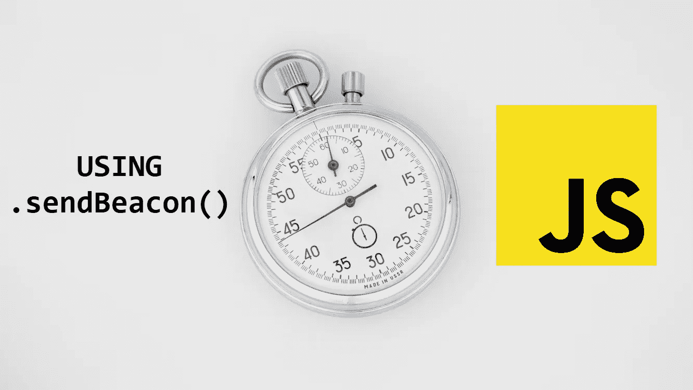

# 使用 sendBeacon()在 JavaScript 中计算“页面时间”的算法

> 原文：<https://javascript.plainenglish.io/best-algorithm-to-implement-time-on-page-in-vanilla-javascript-using-sendbeacon-530bc8391ef5?source=collection_archive---------1----------------------->



*声明:原文章发表于* ***我的官方博客*** *。查看* [*这里*](https://nerdsway.herokuapp.com/blog/best-way-to-implement-time-on-page-in-vanilla-javascript-using-sendbeacon-vvwptpu/)

理想情况下，“**页面上的时间**”是指一个人登陆一个网页和转到另一个网页之间的时间。请记住，如果这个人没有移动到第二页，在该页上的时间不会被计算或添加到平均值中。就好像这个人从来没有来过。但是您不应该将这个指标与会话持续时间混淆。

但是，我们不会做类似谷歌分析的东西。这有两个原因。第一，我们不偷数据，第二，我们没那么聪明。此外，GA 不允许将他们的数据用于开发用途。我们不会跟踪用户，相反，我们将创建一个算法，可以返回用户在该页面上花费的秒数(或分钟数)。

> *相信我，准确率高达 98%*

在做了大量的研究(Google/StackOverflow/Academia)后，我找到了解决这个问题的最佳方法。

**这种方法有问题吗？当然了。是不是哪里都适用？大概吧。但是它能在小规模的实际应用中实现吗？是啊！**

这个解决方案中使用的语言是 JavaScript，因为这是我们知道 DOM 中发生了什么的唯一方法。还因为一位智者曾经说过**“任何可以用 JavaScript 编写的应用程序，最终都会用 JavaScript 编写。”——阿特伍德定律(杰夫·阿特伍德)**

# 理论解释

所以这是我们要做的—

用户访问页面的时刻我们标记时间，比如说 x，每当用户离开页面，我们标记时间，比如说 Y，
所以，花费的时间简单来说就是(Y-Z)秒，或者是？？？

答案是否定的，不是。因为用户没有必要把每一秒钟都花在阅读或阅读页面上。

因此，为了抵消这一点，我们将从总持续时间中减去不活动的时间。

不活跃的时刻就像用户在滚动，或者已经过了 30 秒，而用户甚至没有移动光标、滚动或点击。

## 100%精确花费在页面上的时间

下面这段代码显示了帖子在页面上花费的确切时间，没有考虑任何变量。

```
document.addEventListener("DOMContentLoaded", () => {
    const start = new Date().getTime(); window.addEventListener("beforeunload", () => {
        const end = new Date().getTime();
        const totalTime = (end - start) / 1000

        console.log(totalTime)
    });});
```

但是**那不是**，我们想要的，是基于实际使用案例的具体价值。

## 滚动花费的时间

所以这段代码将最终消除滚动页面所花费的时间，因为用户在滚动页面时不会阅读是非常合理的。

```
let timeSpentScrolling = 0;window.addEventListener('scroll', () => {
    timeSpentScrolling += 1.8;
});
```

这个**值“1.8”**是经过大量的命中&试验努力后发现的😅。请欣赏我的努力，为这篇文章鼓掌。谢了。

注意:不要忘记更新总时间`const totalTime = ((end - start) / 1000) - (timeSpentScrolling / 1000)`

## 处于暂停状态的时间

这是所有案例中最重要的一个。如果用户站起来走开去撒尿怎么办。我们的 JavaScript 会认为他在忙着使用页面，而用户却在享受撒尿的乐趣。

为了避免这些情况，我们将暂时停止时间增量。
我们可以创建一个名为`haltedStartTime`、`haltEndTime`和`isHalted`的新变量。

在做了一个小调查后，发现普通用户每 39 秒就会在**后滚动一次页面。**(保持 **200 字/分钟**阅读速度在估算中)

因此，如果已经过了 39 秒，而用户还没有滚动页面，这只能说明以下情况之一:

*   他/她不在那里
*   他/她花在理解内容上的时间超过了要求
*   他/她很慢

在任何一种情况下，计时器应停止计时。

```
...let isHalted = false;
let haltedStartTime, haltedEndTime;
let totalHaltedTime = 0;const update_halt_state = () => {
    if (isHalted) {
	isHalted = false;
        haltedEndTime = new Date().getTime()
        totalHaltedTime += (haltedEndTime - haltedStartTime) / 1000
    } else {
        isHalted = true;
        haltedStartTime = new Date().getTime()
    }
}window.addEventListener('scroll', () => {
    ...
    update_halt_state()
});document.addEventListener("DOMContentLoaded", () => {
    ...
    setInterval(() => {
	if (new Date().getTime() - start > 39000) {
	    update_halt_state()
	}
    }, 39000) ...
});
```

注意:再次提醒，不要忘记更新总时间
`const totalTime = ((end - start) / 1000) - (timeSpentScrolling / 1000) - totalHaltedTime`

## 使用信标 API —将数据发送到后端

```
window.addEventListener("beforeunload", () => {
    ...
    const totalTime = ((end - start) / 1000) - (timeSpentScrolling / 1000) - totalHaltedTime navigator.sendBeacon("https://topapi2.free.beeceptor.com", {"totalTime":totalTime})
});
```

经过一堆麻烦之后，我发现了这个内置的 JavaScript，它被用来向服务器发送小数据，甚至在页面被终止之后。

现在有人可能会问，“为什么我们不总是使用`navigator.sendBeacon()`而不是`fetch()`？”。
答案是数据的大小，我们只能通过*发送 **64KB** 的有效载荷。sendBeacon()*

# 实际实现的代码

如果您不理解代码部分(这是非常可能的)，这里是完整的代码

> 如果你觉得这有帮助，请鼓掌。
> 
> 我也很感激有人跟踪我😊。
> 
> 请在 Instagram 和 LinkedIn 上与我联系，我们将有一次聊天。
> 
> insta gram/Twitter—@ mrvaibh 0
> LinkedIn—@ mrvaibh

*更多内容请看*[***plain English . io***](https://plainenglish.io/)*。报名参加我们的* [***免费周报***](http://newsletter.plainenglish.io/) *。关注我们关于*[***Twitter***](https://twitter.com/inPlainEngHQ)*和*[***LinkedIn***](https://www.linkedin.com/company/inplainenglish/)*。加入我们的* [***社区不和谐***](https://discord.gg/GtDtUAvyhW) *。*