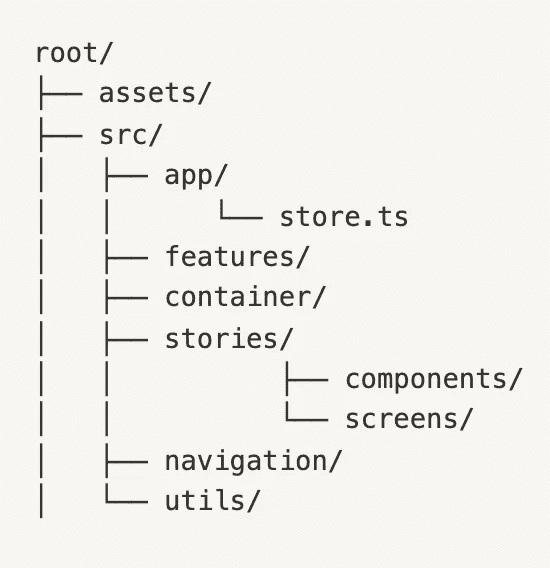
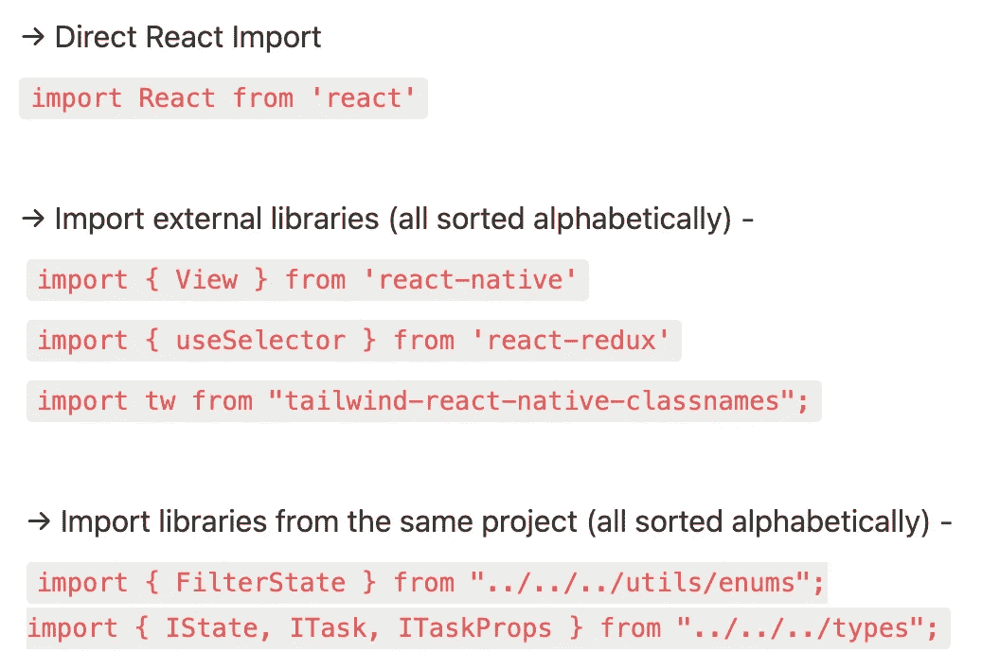

# 最佳编码实践— React 本地版 2022

> 原文：<https://javascript.plainenglish.io/best-coding-practices-react-native-edition-2022-da833c8161de?source=collection_archive---------0----------------------->

## 查看技术行业目前遵循的一些标准最佳编码实践。

Photo by [Arnold Francisca](https://unsplash.com/@clark_fransa?utm_source=medium&utm_medium=referral) on [Unsplash](https://unsplash.com?utm_source=medium&utm_medium=referral)

有没有想过，当你作为初学者开始编码时，几个月后，你写的同一段代码变得难以阅读或理解。对于每个初学者或新加入团队的开发人员来说，这是一个真正的问题。因此，需要遵循编码协议来解决这个基本问题。遵循最佳编码实践有助于我们以后理解代码。每当有新成员加入团队时，维护和扩展我们的应用程序就变得很容易，因为他们也将遵循相同的原则，在整个团队中保持一致性。

更进一步，我们将研究一些目前在技术行业中遵循的标准最佳编码实践(可能在 React-Native 世界中)。

# 1.正确组织文件和文件夹-

无论您的应用程序是什么，react 生态系统中流行的一个基本原则是将所有与代码相关的文件和文件夹保存在 src 文件夹(源文件夹)中，将图像或任何资源文件保存在单独的 assets 文件夹中。这个 src 和 assets 文件夹显示在根文件夹中，如下图所示(React-Native app)

Folder structure

# 2.保持组件和屏幕清洁-

下一个需要注意的要点是保持组件的整洁，这意味着对于所有的 API 获取或 DB 操作，我们需要从组件调度一个动作，最后，reducer 应该改变状态。

还应该将所有长编码的逻辑封装在一个助手函数中，并从组件中调用该函数。

# 3.保持应用程序的响应速度，避免内嵌样式-

确保您的应用在不同大小的设备上呈现时不会中断。在适当的断点处定义样式，使用 flex 等响应元素，并在样式化时提供相对值而不是绝对值。应该避免内联样式，因为它会分散读者对主要代码的注意力，并使他们与许多不必要的行混淆。将它们保存在单独的 style.css 文件中。

在使用 react native 渲染组件时，最好使用`<SafeAreaView>`。它确保组件在所有 iPhone 设备中保持正确定位。

# 4.实用程序文件夹-

确保您的 utils 文件夹仅包含帮助程序、常量和枚举文件。对于配置文件，将它们保存在单独的文件夹中。

# 5.在文件中排序导入-

在逻辑上将所有的导入分成几个部分，并在每个部分之间留出一行空白，这有助于代码审查。确保您应该按照字母顺序和以下顺序对添加到组件/屏幕文件中的所有导入进行排序。

Ordering imports sequentially in the file

# 6.使用 ES6 概念，摆脱遗留代码

如果从零开始，使用当前最新版本的库和使用 ES6 概念总是明智的。

例如:用`let`或`const`代替`var`。

# 7.整洁地记录一切-

确保向您创建的函数添加有意义的 JSDoc 注释。它将指导新开发人员了解这个功能的全部内容。

# 8.从最终的应用程序版本中删除日志-

从最终版本中删除所有的`console.log()`语句，因为太多的日志语句可能会影响应用程序的性能。

# 9.在你的应用中添加测试用例-

众所周知，只有经过全面测试的应用程序才能部署，因此测试在应用程序开发中扮演着至关重要的角色。可以使用 JEST 和 Enzyme 进行单元测试和快照测试，以测试组件是否按照预期呈现。

所以这些是你在构建项目时可以遵循的一些最佳编码实践。它肯定会减少你的应用程序中的错误和崩溃的数量。感谢阅读！

## 进一步阅读

 [## 代码文档被破坏了——但是我认为 Swimm 可能已经修复了它

### 传统的文档管理系统让软件开发人员失望了，是时候来点新的了。游泳吗…

javascript.plainenglish.io](/code-documentation-is-broken-but-i-think-swimm-may-have-fixed-it-daaa7547d834) 

*更多内容看* [***说白了就是***](https://plainenglish.io/) *。报名参加我们的* [***免费周报***](http://newsletter.plainenglish.io/) *。关注我们关于* [***推特***](https://twitter.com/inPlainEngHQ) ，[***LinkedIn***](https://www.linkedin.com/company/inplainenglish/)*，*[***YouTube***](https://www.youtube.com/channel/UCtipWUghju290NWcn8jhyAw)*，以及* [***不和***](https://discord.gg/GtDtUAvyhW) ***。***

***对缩放您的软件启动感兴趣*** *？检查出* [***电路***](https://circuit.ooo/?utm=publication-post-cta) *。*