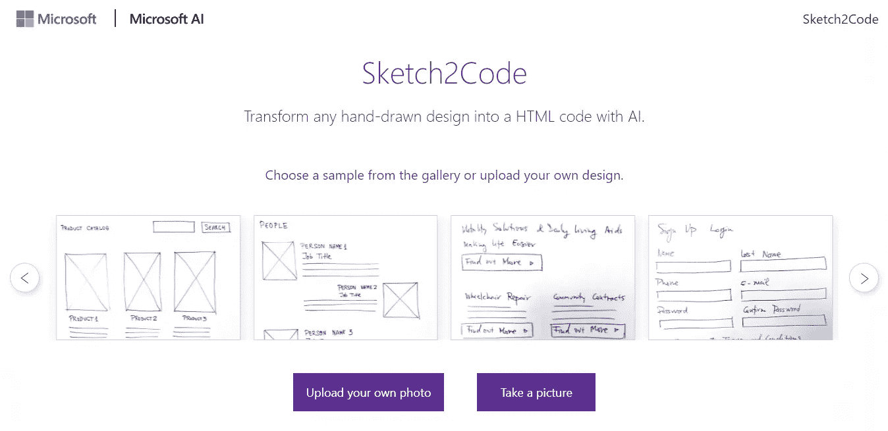
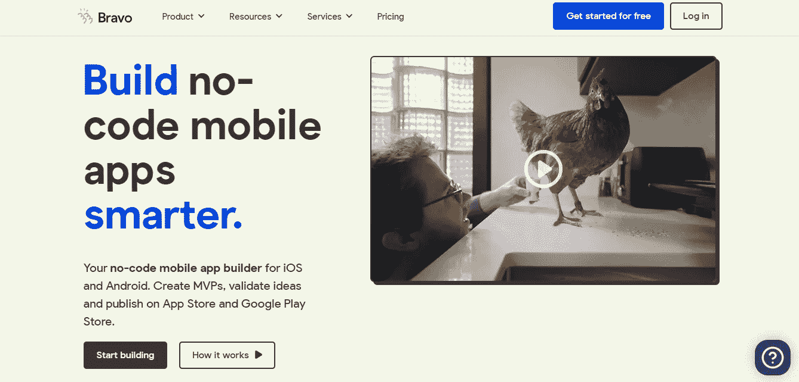
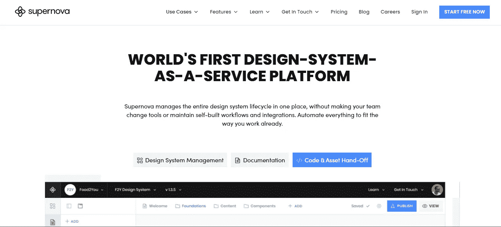
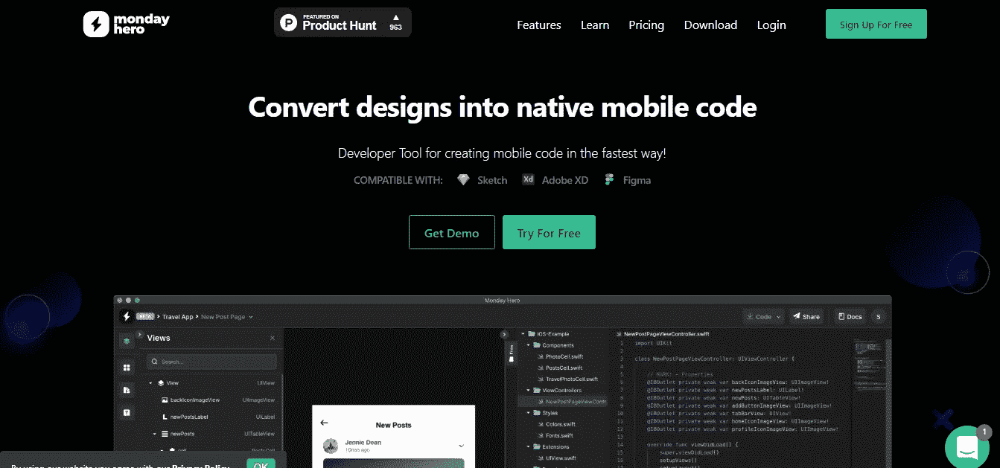
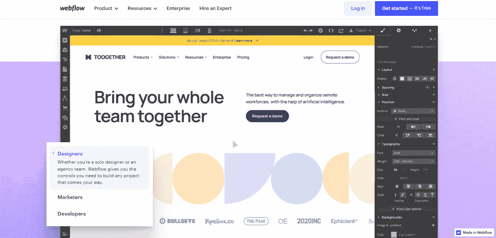
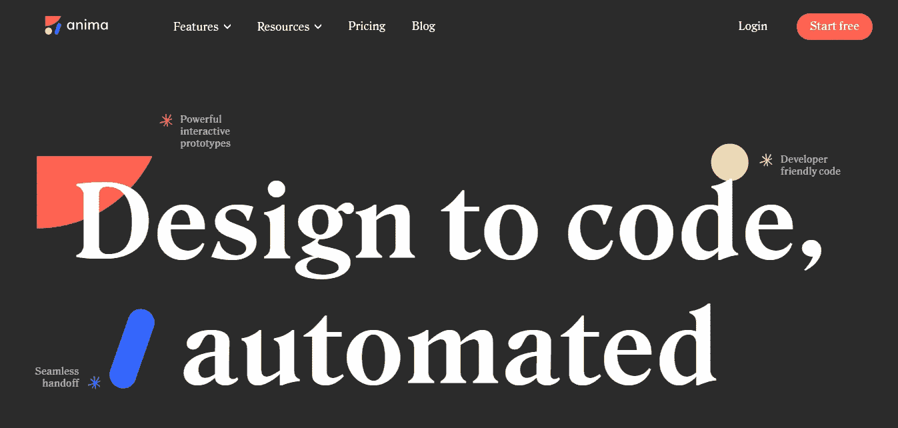
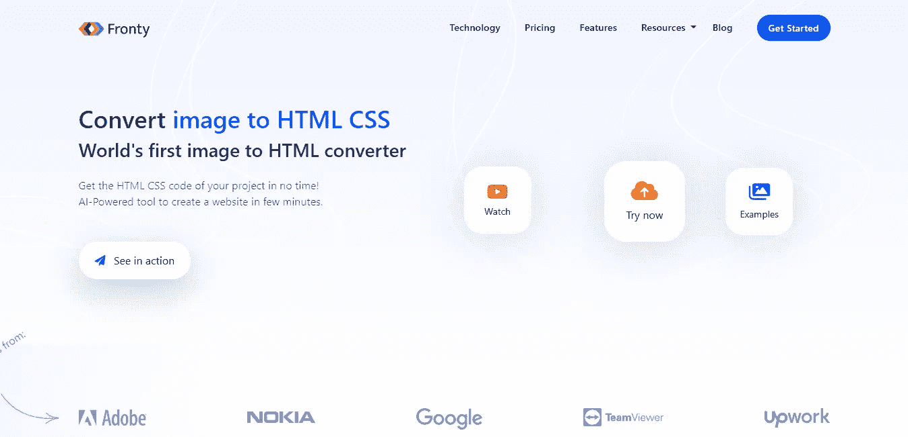

# 最佳设计到代码平台，让您的 Web 开发之旅更加轻松

> 原文：<https://javascript.plainenglish.io/best-design-to-code-platforms-to-make-your-web-development-journey-easier-4ef5125ad9fa?source=collection_archive---------0----------------------->

## 你们可能 100%不知道这些平台。

Photo by [Christina @ wocintechchat.com](https://unsplash.com/@wocintechchat?utm_source=medium&utm_medium=referral) on [Unsplash](https://unsplash.com?utm_source=medium&utm_medium=referral)

我建立网站已经有几年了。首先，我使用了 HTML 和 CSS，然后添加了一些 JavaScript 风格。后来，我尝试用 React 建立网站。

旅程就这样继续着，我开发了许多收入来源。

随着我锻炼得越来越多，最终结果显著改善。由于技术的快速进步，关于用户体验设计、AWS、Docker 和其他主题的最新更新使我的 web 开发生涯变得复杂。

相信我，当我说生产前端或后端的东西需要很长时间。当谈到在前端/后端发现错误时，有些错误很难检测到；是的，有时可能会有挑战性。当你找到它的时候，你会嘲笑自己犯了这样一个愚蠢的错误。

此外，当一个 web 项目中有大量的页面需要设计时，从头开始要花费更多的时间。这就是开发人员使用 CSS 框架的原因。

你可能会惊讶地发现有更好的选择，比如各种按代码设计的平台。更具体地说，他们可以自由使用到某个特定的点。这些网站需要为附加功能付费。

*注意:请记住，没有任何网站赞助我创作这篇文章。简而言之，我没有从网站经营者那里得到任何报酬。*

现在让我们开始吧。

# **1。草图 2 代码**

src: [Sketch2Code](https://sketch2code.azurewebsites.net/)

Mircosoft 创建了 [Sketch2Code](https://sketch2code.azurewebsites.net/) ，托管在微软 Azure(他们的云计算服务)上。

用基本的术语来说，就是用来用 AI 把任何线框或者手绘图纸转换成代码。

是不是很奇妙？

而且都是免费的。

有几个样本可供实验。也可以贴一些手绘的设计。

# **2。精彩**

src: [Bravo](https://www.bravostudio.app/)

我见过的最令人印象深刻的平台之一。更具体地说，

我最常使用它。

为什么？因为完全免费。

还有什么？它是一个无代码的 app 平台。

方法也简单多了；在 Figma(或 Adobe XD)中构建设计，与 Bravo 共享 URL，您的应用程序在几秒钟内即可完成。

我知道你没有考虑所有这些。然而，世界在不断发展，所以开始利用所有这些有趣的平台。

# **3。超新星**

src: [Supernova](https://www.supernova.io/)

另一个您可能经常使用的[精彩平台](https://www.supernova.io/)。

此外，它可以免费使用，并允许您手动导出代码。

是不是很酷？

所以你要做的就是设计你的网站，整个过程，包括导出代码，都是免费的。

# 4.周一英雄

src: [Monday Hero](https://mondayhero.io/)

这个[平台的名字](https://mondayhero.io/)有点独特；我不知道他们为什么选择它，周一英雄。

然而，这个平台的功能要优越得多。几种语言的设计可以转换成本地代码。

是的，你可以不用学习任何编程语言，用任何语言如 Kotlin、Flutter 或 Swift 来设计应用程序。

React 也在他们的等候名单上。

因此，你可以用任何语言构建你的应用，从 Flutter 到 Kotlin。

# **5。Webflow(最明显的一个)**

Src: [Webflow](https://webflow.com/)

我在网站开发早期遇到的[独特平台](https://webflow.com/)之一。

说得更具体一点，那时候，我还没听说过这样的平台。是的，我知道 WordPress，但是它也有局限性，比如不能创建你选择的任何东西。如果你想根据你的喜好添加一个部分，你必须自己使用 elementor 或者代码，这是我不喜欢的。

这就是 webflow 发挥作用的地方。你只需要创建你想要的东西，你就会得到它的代码。

# **6。阿尼玛**

src: [Anima](https://www.animaapp.com/)

作为一名 web 开发人员，我的大部分设计工作都使用 Figma。是的，我[学习了 UI/UX 设计](/why-am-i-learning-ui-ux-design-after-being-a-web-developer-7627e941ef11)，因此，我可以完全依靠自己构建设计。

我选择了 [Anima](https://www.animaapp.com/) ，因为它与 Figma 兼容。简单地说，我需要在 Figma 中建立网站设计，并安装了一个 Anima 插件，这将实际上使我的工作更容易。

代码可以在 React、Vue 甚至 HTML 中导出。

老实说，免费计划不允许您导出代码。所以你必须购买高级订阅，每月 39 美元。

这是我唯一不喜欢的地方。

# 7.弗伦蒂

src: [Fronty](https://fronty.com/)

[Fronty](https://fronty.com/) 是我最后使用的，但也是最重要的。

我喜欢这个平台的一点是，除了将照片转换成代码之外，它还有一个在线编辑器。

你也可以利用这个平台购买虚拟主机和域名。

它也可以免费使用。

这些是我合作过的一些平台。还有一些额外的网站，但我不能告诉你，因为我没有使用过。

就这样——谢谢。

[*如果你喜欢阅读这样的故事，并想帮助我成为一名作家，可以考虑成为一名中等会员*](https://nitinfab.medium.com/membership) *。每月花费 5 美元，你可以无限制地访问媒体内容。如果你通过我的链接注册，我会得到一点佣金。*

 [## 11 愚蠢的简单的一面，作为一个程序员赚取额外的钱

### 没有废话，请不要期待博客，YouTube，自由职业者，或媒体。

javascript.plainenglish.io](/11-stupidly-simple-side-hustles-to-earn-extra-money-as-a-programmer-23fd30ca5cda) 

*更多内容请看*[***o***](https://plainenglish.io/)**。报名参加我们的* [***免费周报***](http://newsletter.plainenglish.io/) *。关注我们* [***推特***](https://twitter.com/inPlainEngHQ) *和*[***LinkedIn***](https://www.linkedin.com/company/inplainenglish/)*。查看我们的* [***社区不和谐***](https://discord.gg/GtDtUAvyhW) *加入我们的* [***人才集体***](https://inplainenglish.pallet.com/talent/welcome) *。**