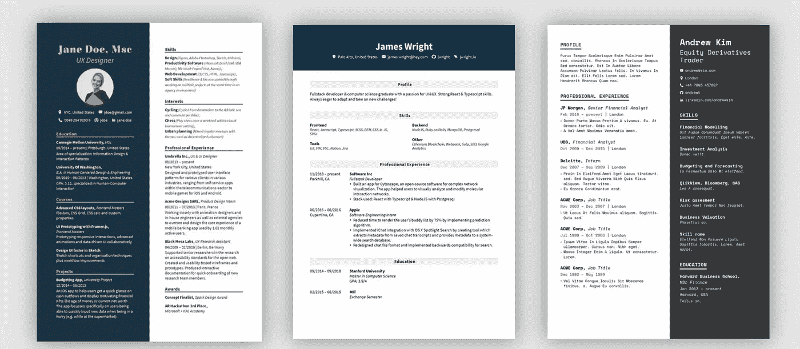
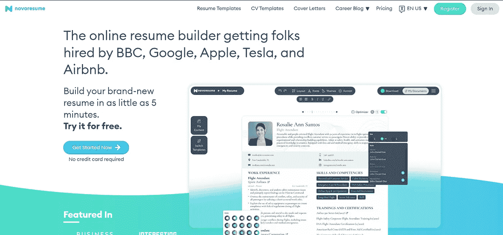
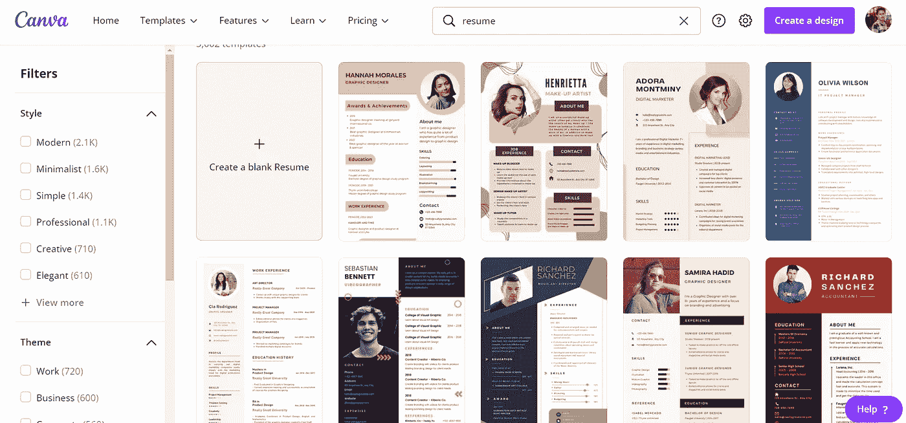

# 2023 年最佳免费在线简历创建者

> 原文：<https://javascript.plainenglish.io/best-free-online-resume-builders-in-2022-23a3844bbb2e?source=collection_archive---------6----------------------->

## 免费制作简历的三大网站

Photo by [João Ferrão](https://unsplash.com/@joaoscferrao?utm_source=medium&utm_medium=referral) on [Unsplash](https://unsplash.com?utm_source=medium&utm_medium=referral)

当我们不得不创建一份新的简历时，我们大多数人都很纠结。如果你没有 photoshop 技能，或者不喜欢摆弄 word 模板，但需要一份高质量的简历，这是适合你的博客。这份简历可能是为了一份新工作或者你的大学申请。在这里分享我的经验和我发现的最容易制作简历的 3 个网站。

1.  **流量 CV**

FlowCV resume templates

说到复建，这是我的首选。在这里，你有大量的模板，这些网站提供的所有服务都是免费的。

你可以创建一份包含任意页数的简历，不像我们后面要看的 Novoresume。你可以使用这个[链接](https://app.flowcv.io/)访问他们的网站。

**2。Novoresume**

Homepage of Novoresume

在我发现 FlowCV 之前，我曾经在这里制作简历。这个网站有几个很酷的模板，可以帮助你找到第一份工作。

但该网站的问题是，如果你在这个网站上寻求免费计划，你只能创建一个一页的简历。但是，如果你对一页感到满意，这是最好的简历生成器，为你提供了很酷的模板。从这个[链接](https://novoresume.com/)查看他们的网站。

**3。Canva**

Canva resume templates

Canva 有大量的模板可以在恢复构建时使用。这个网站不仅仅是用来建立简历的，它对社交媒体文章的创作和更多的作品也非常有用。

如果你有一个 Canva pro 帐户，这是一个很好的网站来建立你的简历。即使你是一个免费用户，这个网站也有大量的模板可供使用。从这个[链接](https://www.canva.com/)查看他们的网站。

上面我列出了三个你可以用来制作简历的网站。其他声称做这项工作的网站要么最终不会让你下载 pdf 文件，要么会强迫你付钱。希望你们能创造出一些很棒的简历来实现你们的梦想。干杯！

*更多内容请看*[*plain English . io*](http://plainenglish.io/)*。报名参加我们的* [*免费每周简讯*](http://newsletter.plainenglish.io/) *。在我们的* [*社区不和谐*](https://discord.gg/GtDtUAvyhW) *获得独家获得写作机会和建议。*