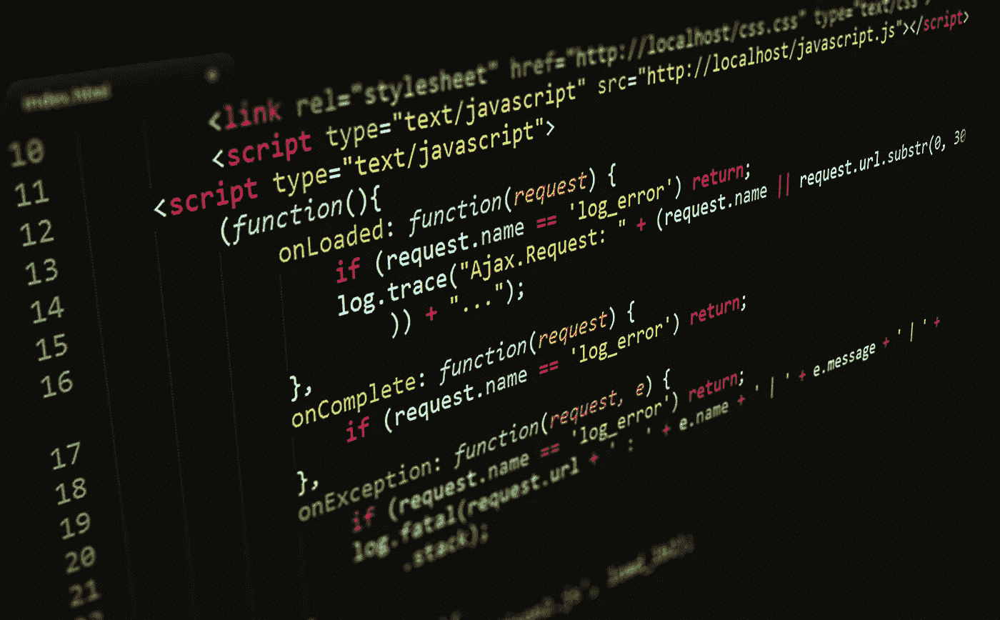

# 2022 年最佳 JavaScript IDE

> 原文：<https://javascript.plainenglish.io/best-javascript-ide-in-2022-d8743f637a7e?source=collection_archive---------9----------------------->

## 找出 2022 年 JavaScript 的最佳 IDE。

那么，你是 JavaScript 开发人员吗？还是你要开始学了？或者，另一方面，你是这种不可思议的语言的导航开发者吗？在任何情况下，您都需要一个好的 IDE 来编写您的 JavaScript 应用程序和项目。那么，用这种语言编码的最佳 ide 是什么呢？什么对你最好？什么能帮助你以最好的方式改进你的代码？让我们来看看…

Javascript Editor

## **编辑器 VS IDE**

开始之前，我们必须澄清术语。这两个术语可以互换使用，它们是编辑器和 IDE，用来表示编写代码和开发应用程序的应用程序。重要的是要知道它们不是一回事。那么，有什么区别呢？

编辑器是一个简单的应用程序，你可以简单地编辑文本文件。这并不意味着它是一个编程工具。此外，记事本或谷歌文档可以归类为编辑器，它们肯定不是为编程而设计的。

另一方面，IDE 的意思是“集成开发环境”，是编辑器的演变。它本质上是一个文本编辑器，有一堆让开发过程变得更容易、更快、也更愉快的嗜好。这些工具可以是集成调试器、语法高亮、与终端的集成、与版本控制的集成、自动完成功能(如 Kyte)等等。

因此，如果你是一名开发人员，你要努力找到最好的 IDE，而不是最好的编辑器，这样你就能提高你的生产力和代码质量。因此，在这个简短的解释之后，我们可以开始浏览 2022 年所有最好的 Javascript IDE。

## **VisualStudio 代码:最广泛使用和喜爱的**

VSCode

你可能已经听说过了。它可以被认为是 IDE 的标准，不仅在 Javascript 上下文中，而且在整个编码和开发领域中都是如此。它由微软拥有、维护和更新，这可能是它如此完整和强大的原因。它可以在 Windows、Mac 和 Linux 上成功运行，具有非常好的性能。

他更大的力量是使用这个 IDE 的大社区，每天都在增强。所有数百个扩展主要是由社区开发和维护的。这使得它成为可能插件数量最多的 IDE。根据 2021 年 stackoverflow.com 开发者调查，它也是最受欢迎的 IDE。

其他优点是 WSL 集成(Linux 的 Windows 子系统)，与控制台的集成，低内存消耗，这使它也可以在旧机器上运行，以及任务管理系统。

也有一些缺点。它们是版本控制中的贫困和有时滞后的事实。我认为它们不是大问题。这是因为，由于集成的终端，如果您熟悉 Git Bash(如果您不熟悉，不用担心，这非常简单)，您可以轻松地自己管理版本控制，滞后可能是代码中的一些小问题，在未来的版本中肯定会得到解决。

那么，你想要一个安全的选择，有数百个插件，很多优点，只有几个缺点吗？啊，免费的？VisualStudio 代码(或 VSCode)是你的选择。

## **网络风暴:过度杀戮的怪物**

WebStorm

开发这个 IDE 主要是为了帮助 Javascript 开发人员编写更好的代码。这是专家的理想解决方案，他们有特殊的需求，需要 Jet Brains 为其服务的所有用户提供的所有功能。WebStorm 和最著名的 Java IDE IntelliJ 是一个家族。它几乎有你需要的一切。它可以在所有的操作系统(Windows、Mac 和 Linux)上工作，它有很多扩展，直接由软件的生产商提供，或者至少是大部分。意味着你拥有更多的安全感，却少了更多的选择和发展自由。

它有很好的终端集成，版本控制系统，这是最用户友好的，它还有有史以来最完整和最强大的调试器。就 ide 而言，IntelliJ 是一个安全的选择。他们的产品肯定更丰富，可以使用，但他们有两个缺点。

第一个缺点是应用程序有点重，所以它不能在所有的 PC 上工作。老实说，这不是一个真正的问题。使用这种软件的人往往至少有一台分立的机器。对很多人来说，最大的问题是价格。如果你是第一年，如果你选择基本版本，一年的使用费用大约为 60 欧元。否则，成本往往会增长很多。所以，它并不适合所有人。只有专业人士才能因为他们所做的工作而负担得起，否则，这也可能是过度杀戮。

如果你是学生，你可以获得这个软件的免费许可证，在 Github student 上创建一个帐户，并使用 GitHub student backpack 的优势。我留个链接给你看看:【https://education.github.com/】**。**

## ***崇高的文本:简单是必须的***

**

*Sublime text*

*你是初学者，还是只有一点编码经验的人？或者对 IDE 风格有特殊偏好的人？这可能是你的理想选择。它更接近于被认为是一个编辑。事实上，它并没有提供很多扩展，屏幕上也没有太多东西。另一方面，它可能是最可定制的一个。你可以在很多不同的可能性中改变主题，并改变所有的设置。没有其他 IDE 能带来类似的个性化体验。*

*这使得它成为我们迄今为止分析过的最不受干扰的 IDE。它也很容易自动化，并使它很容易在多个项目上工作。它运行在每一个操作系统上，也运行在每一台机器上。举例来说，我曾经使用过一台至少有 20 年历史的奔腾 II 机器，Sublime Text 以一种完美的方式工作。因此，很容易理解它是性能最好的一个。*

*这种语言的问题是它缺乏库栈，缺乏调试和其他集成工具，如版本控制，并且缺乏默认打印。反正就是简单的代价。*

## ***荣誉奖***

*显然，有很多其他的 IDE 具有很多特性，绝对可以在您的开发之旅中帮助您。所以，我会列举一些其他好的，如果你读到的三个不符合你的特权，你会觉得有趣和有用。因此，它们是 Vim(专为专家和极端极客设计)、Atom(Github IDE，在版本控制方面简单而出色)、Eclipse(全栈 IDE)和 NetBeans(应用程序开发 IDE)。*

*所以这些都是今年你可以选择使用的最好的 Javascript IDE。当然，你可以在记事本上自由地编码，也可以在纸上，但你将是一个活的迷因。*

*希望你喜欢这篇文章。如果你有，请订阅更多。*

*以下是一些额外的 Javascript 相关文章:*

*Javascript 框架:*

* [## 2022 年最著名的 JavaScript 库和框架

### JavaScript 库和框架及其多种用例。

javascript.plainenglish.io](/javascript-most-famous-libraries-and-framework-in-2022-90c6560f5ca4) 

Java 与 Javascript:

 [## Java 和 JavaScript:它们是一样的吗？

### 在这个世界上，编程语言有各种各样的形式和大小，而我们只知道最著名的语言的名字…

javascript.plainenglish.io](/java-vs-javascript-are-they-the-same-88bbacd03386) 

反应与角度:

 [## Java 和 JavaScript:它们是一样的吗？

### 在这个世界上，编程语言有各种各样的形式和大小，而我们只知道最著名的语言的名字…

javascript.plainenglish.io](/java-vs-javascript-are-they-the-same-88bbacd03386) 

布伦丹·艾希:

 [## 布兰登·艾希:JavaScript 之父

### 在编程领域，有很多重要的人物，他们在这个世界上设计了一些不可思议的东西…

javascript.plainenglish.io](/brendan-eich-the-father-of-javascript-f5baaae43a60) 

全栈 Javascript:

 [## JavaScript 足以让自己成为全栈开发者吗？

### 了解 JavaScript 基础知识及其主要框架会让你成为全栈开发人员吗？你应该投资时间在…

javascript.plainenglish.io](/is-javascript-enough-to-make-yourself-a-fullstack-developer-c2ba0f1e8f07) 

Python VS Javascript:

 [## Python 与 JavaScript:两种最流行的编程语言的比较

### 两种最重要的编程语言的历史和特点

javascript.plainenglish.io](/python-vs-javascript-e8590d346c3b) 

*更多内容请看*[***plain English . io***](http://plainenglish.io/)*。报名参加我们的**[***免费周报***](http://newsletter.plainenglish.io/) *。在我们的* [***社区获得独家访问写作机会和建议***](https://discord.gg/GtDtUAvyhW) *。***