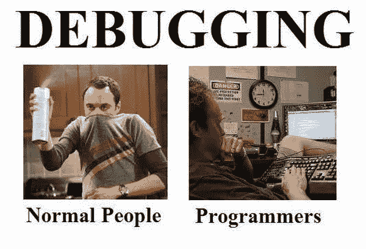
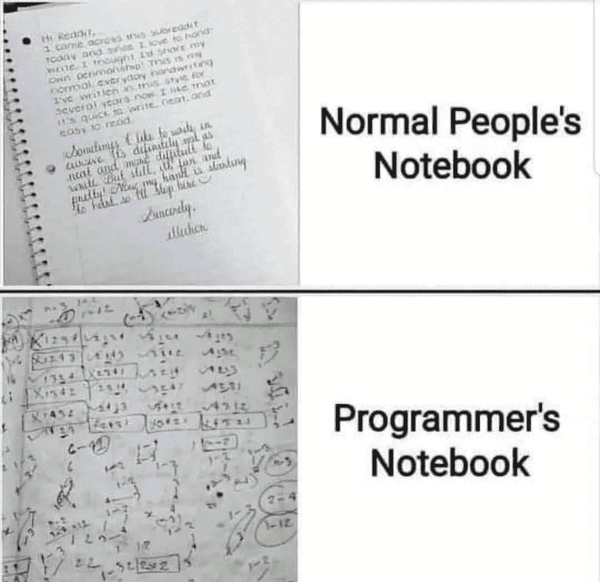
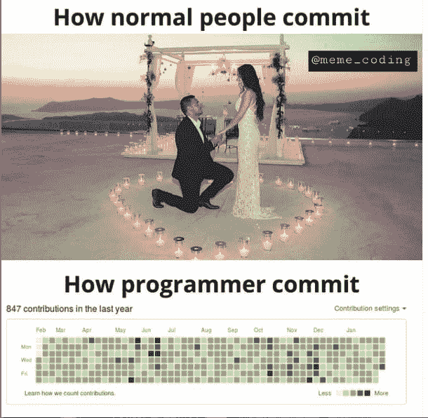
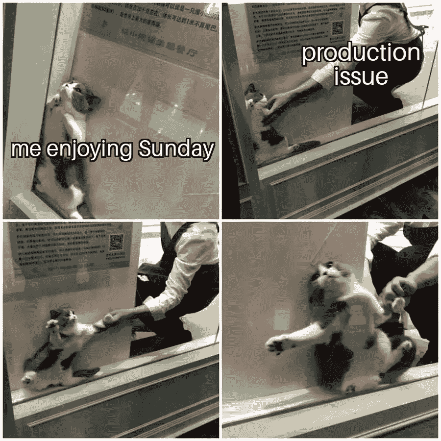
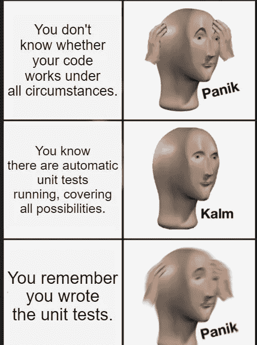

# IT 人士的最佳搞笑照片

> 原文：<https://javascript.plainenglish.io/best-laugher-shots-for-it-people-47132a26bfdc?source=collection_archive---------1----------------------->

## 最佳软件工程相关笑话。

Photo by [Javier Martínez](https://unsplash.com/@cjdante?utm_source=medium&utm_medium=referral) on [Unsplash](https://unsplash.com?utm_source=medium&utm_medium=referral)

我们很多人都有打开脸书或 Instagram 开始新一天的习惯。像我这样的一些人喜欢在忙碌了一天后恢复心情，或者我们只是喜欢脸上带着微笑。

在这里，我正在创建一个每日文章系列，可能需要 1-2 分钟来阅读，但保证会让你脸上带着微笑。

# 我们开始吧

# 当每个人都完成了他们的任务，有人分配给我一个 bug…

Picture Credit:[https://www.facebook.com/yuva.krishna.memes](https://www.facebook.com/yuva.krishna.memes)

# 度假后回来就像…

Picture Credit:[https://www.facebook.com/yuva.krishna.memes](https://www.facebook.com/yuva.krishna.memes)

# 你不会明白…我们做“谷歌搜索”…

Picture credit: [https://www.reddit.com/r/ProgrammerHumor](https://www.reddit.com/r/ProgrammerHumor)

# 这是真的吗？

Picture credit: [https://www.reddit.com/r/ProgrammerHumor](https://www.reddit.com/r/ProgrammerHumor)

# 我们不知道“加入”，但我们知道删除或过滤…

Picture Credit:[https://programmerhumor.io/](https://programmerhumor.io/)

# 杀了它，如果它不起作用…

Picture Credit:[https://programmerhumor.io/](https://programmerhumor.io/)

# 为什么会这样？

Picture Credit:[https://programmerhumor.io/](https://programmerhumor.io/)

# 点击诱饵的世界…

Picture Credit:[https://programmerhumor.io/](https://programmerhumor.io/)

# 我知道…我什么都知道…哈哈

Picture Credit:[https://www.facebook.com/jokesvala/](https://www.facebook.com/jokesvala/)

# 我只喜欢这个带-end 的单词

Picture Credit:[https://www.facebook.com/jokesvala/](https://www.facebook.com/jokesvala/)

# 它昨天还是在开发环境中工作的。为什么现在不行了？

Picture Credit:[https://www.facebook.com/groups/programmer.wey](https://www.facebook.com/groups/programmer.wey)

# 不需要标题…

Picture Credit:[https://programmerhumor.io/](https://programmerhumor.io/)

# 当你要求另一队修理…

Picture Credit:[https://programmerhumor.io/](https://programmerhumor.io/)

# 令人兴奋的是…

Picture Credit: [https://www.monkeyuser.com/](https://www.monkeyuser.com/)

# 奖励加强注射

# 正常人设置闹钟是为了记住起床时间，而程序员…

[https://www.reddit.com/r/ProgrammerHumor](https://www.reddit.com/r/ProgrammerHumor)

# 我们在这个区域处于什么位置？

[https://www.reddit.com/r/ProgrammerHumor](https://www.reddit.com/r/ProgrammerHumor)

# 一些常见问题…

[https://knowyourmeme.com/](https://knowyourmeme.com/)

# 在 COVID 时间内…

[https://aprogrammerlife.com/](https://aprogrammerlife.com/)

# 你如何定义树根？

[https://www.semicolonworld.com/humor](https://www.semicolonworld.com/humor)

# 调试…

[https://twitter.com/webclipse/status/665260017600196608](https://twitter.com/webclipse/status/665260017600196608)

# 程序员如何睡觉…

[https://www.reddit.com/](https://www.reddit.com/)

# 你怎么看字母表？

# 就寝时间…

# 笔记本电脑…

[https://aprogrammerlife.com/](https://aprogrammerlife.com/)

> 如果你喜欢这篇文章，请用这个链接加入 Medium，它可以帮我赚一点钱。

> [“从此链接加入](https://sheetalpatel93.medium.com/membership)”

# 你在想什么？

[https://www.pinterest.ca/](https://www.pinterest.ca/)

# 你喝咖啡还是茶？

# 是的，我们确实经常跑步…

[https://onsizzle.com/t/normal-people](https://onsizzle.com/t/normal-people)

# 数据库管理员如何看待关系…

[https://me.me/](https://me.me/)

# 正常人是怎么犯的？等等，程序员呢？

[https://memesuite.org/programming/110335/](https://memesuite.org/programming/110335/)

# 给你更多的编程笑话…

# 他们嫉妒我的幸福

[https://www.reddit.com/r/ProgrammerHumor/comments/oiiwi3/there_goes_away_one_more_sunday/](https://www.reddit.com/r/ProgrammerHumor/comments/oiiwi3/there_goes_away_one_more_sunday/)

# 不正确，但是让我们想想…

[https://www.reddit.com/r/ProgrammerHumor/comments/oinxee/the_truth_can_hurt_sometimes/](https://www.reddit.com/r/ProgrammerHumor/comments/oinxee/the_truth_can_hurt_sometimes/)

# 我到底做了什么来解决这个问题。也许没什么…

[https://www.reddit.com/r/ProgrammerHumor/comments/oimbw6/things_that_magically_work_but_you_dont_know_why/](https://www.reddit.com/r/ProgrammerHumor/comments/oimbw6/things_that_magically_work_but_you_dont_know_why/)

# 你需要学习交易…来处理 API

[https://www.reddit.com/r/ProgrammerHumor/comments/ohh9nv/200_ok/](https://www.reddit.com/r/ProgrammerHumor/comments/ohh9nv/200_ok/)

# 还有谁会因为认为警告有助于节省时间而忽视警告呢？

[https://www.reddit.com/r/ProgrammerHumor/comments/ofeexz/inner_peace/](https://www.reddit.com/r/ProgrammerHumor/comments/ofeexz/inner_peace/)

# 单元测试意味着增加覆盖率……(有时)

[https://www.reddit.com/r/ProgrammerHumor/](https://www.reddit.com/r/ProgrammerHumor/)

# 人工智能出错

[https://www.reddit.com/r/ProgrammerHumor/comments/ojf2eu/ai/](https://www.reddit.com/r/ProgrammerHumor/comments/ojf2eu/ai/)

# 重新编译…我怎么总是忘记？

[https://www.reddit.com/r/ProgrammerHumor/comments/ojdicf/it_happened_more_than_once/](https://www.reddit.com/r/ProgrammerHumor/comments/ojdicf/it_happened_more_than_once/)

# 一些噩梦…还是现实？

[https://www.monkeyuser.com/2019/great-expectations/?sc=true&dir=random](https://www.monkeyuser.com/2019/great-expectations/?sc=true&dir=random)

# 希望你有美好的一天。

*更多内容请看*[***plain English . io***](https://plainenglish.io/)*。报名参加我们的* [***免费周报***](http://newsletter.plainenglish.io/) *。关注我们关于*[***Twitter***](https://twitter.com/inPlainEngHQ)*和*[***LinkedIn***](https://www.linkedin.com/company/inplainenglish/)*。加入我们的* [***社区不和谐***](https://discord.gg/GtDtUAvyhW) *。*