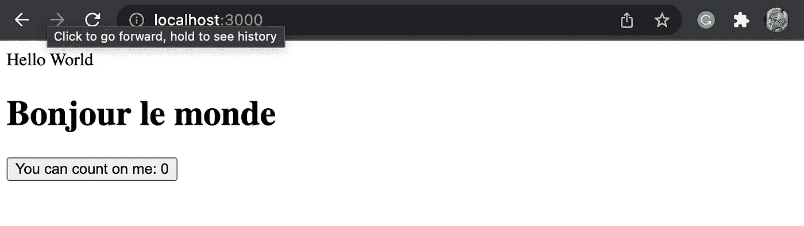

# 为 Web 开发人员寻找瑞士军刀

> 原文：<https://javascript.plainenglish.io/best-of-both-worlds-static-and-dynamic-web-content-3a8b3e0dc2a9?source=collection_archive---------16----------------------->

## 两全其美:使用 Vue 的静态和动态网页内容


Swiss Army Knife | Image source: [wikimedia](https://commons.wikimedia.org/wiki/File:Swiss_army_knife_open_20050612_(cropped).jpg)

通过这篇文章，我阐述了导致一个高效的基于 Vue 的开发环境的原因和步骤；对于任何不耐烦的读者来说，可以直接跳到 Github 项目的结尾。

# 1.为什么动态网站不是最好的

我们喜欢网络的动态体验，但这并不意味着我们应该总是建立一个动态的网站。原因是 1)任何即时生成的内容的延迟风险；JavaScript 是构建 web 交互性的事实语言，其成本很高。

## JavaScript 的成本

当 web 的发展超越了 HTML 的早期版本时，人们开始对动态 web 感到兴奋，并很快将其推向了一个极端。结果，单页应用程序(SPA)网站主宰了网络空间，我们看到了 JavaScript 的广泛使用。

Besides the performance cost, JavaScript is also notoriously confusing and difficult to debug. There are many jokes about JavaScript on Twitter and other sites.

Tim Kadlec 写了一篇关于为什么应该避免过度使用 JavaScript 的深入分析。

> 关于 JavaScript，你最终要支付至少四倍的性能税:1)在网络上下载文件的费用；2)一旦下载，解析和编译未压缩文件的成本；3)执行 JavaScript 的成本；4)内存成本。组合很贵。—蒂姆·卡德莱克，[JavaScript 框架的成本](https://timkadlec.com/remembers/2020-04-21-the-cost-of-javascript-frameworks/)

## Jamstack 的崛起

最有效的网络服务于现成的 HTML。我们现在希望在一瞬间得到结果，这推动了 Jamstack 的流行，jam stack 的特点是使用静态站点生成器(SSG)将 web 翻译成静态 HTML。

有各种各样的前端语言和框架，因此出现了许多 SSG 来满足这些不同的需求。随意浏览 jamstack.org 最受欢迎的网站。我推荐 Eleventy (11ty ),并将在本文的下一部分讨论原因。

[](https://jamstack.org/generators/) [## 静态站点生成器-顶级开源 SSGs | Jamstack

### 看看这个展示了一些最好的、开源的静态站点生成器。这是社区驱动，所以一定要…

jamstack.org](https://jamstack.org/generators/) 

## 动静结合

显然，网络需要有动态的内容；考虑到优化效率，我们需要尽可能多地使用静态 HTML，并将动态内容限制在必要的组件上。

# 2.Web 开发人员的瑞士军刀

当我们发现 web 开发是一项艰巨的任务时，我们不应该感到惊讶，因为我们期待着人们可以想象到的来自 web 的一切。对于 web 开发人员来说，工具和工作流至关重要。在需要添加新功能时，我们是否经常购买额外的工具？我们需要找到那把能为我们做任何事的瑞士军刀。

Vue 是我的答案。

## 某视频剪辑软件

*   Vue.js，简称 Vue，是一个渐进式的 JavaScript 框架。它旨在构建动态 web 组件。我打赌你知道这个。
*   你可能不知道的是，Vue 也是 Eleventy 的模板语言，Eleventy 是一个高性能的静态站点生成器。换句话说，我们可以使用 Vue 来创建静态网页内容。

Vue 不仅能满足需求，还能提供更多优雅的服务。

## SFC 提供更好的开发人员体验

单个文件组件(SFC)是封装了 Vue 组件的模板、逻辑和样式的单个文件。它通过提供组合网页的结构化系统来改善 HTML 创作体验。

SFC 还消除了在开发过程中不断在多个文件之间切换的需要。方便的是，HTML 模板、JavaScript 和 CSS 样式被整齐地组织在同一个文件中。它鼓励编码的可读性，并导致效率和生产力。

[](https://betterprogramming.pub/modern-web-development-how-to-stay-in-flow-state-7ca82e6e4524) [## 现代网络开发:如何保持流畅状态

### 寻找工具和工作流以获得更好的开发体验

better 编程. pub](https://betterprogramming.pub/modern-web-development-how-to-stay-in-flow-state-7ca82e6e4524) 

# 3.如何充分利用 Vue

围绕 Vue 最好的工具有哪些？

*   Vite 给自己贴上了下一代前端工具的标签。它的开发是由 Vue 的创造者尤雨溪领导的。Vue 是我开发动态 web 组件的选择。
*   Eleventy (11ty)对 Vue 有坚实的支持。它的 Vue 插件使得 Vue 在静态站点生成时可以作为模板语言。

A good introduction to Vite as optional viewing. Feel free to watch it at your leisure.

# 4.Vite 和 Eleventy 的集成

为了让两个强大的工具 Vite 和 Eleventy 一起工作，它需要适当的设置。

## 步骤概述

用 Vite add 11ty 初始化项目比反过来更容易。我们将使用以下目录:

*   2 个输入目录:Eleventy 使用的`s_src`和 Vite 使用的`src`。
*   `_site` : Eleventy 构建到这个目录中，然后 Vue 从这个目录中读取
*   `dist` : Vite 输出，是最终输出

你准备好了吗？或许在进入分步指南之前先喝一杯。


Photo by [David Tomaseti](https://unsplash.com/@dtomaseti?utm_source=medium&utm_medium=referral) on [Unsplash](https://unsplash.com?utm_source=medium&utm_medium=referral)

## **第一步。用 Vite 初始化项目。**

我们的项目名称是*艾米丽*。

```
% **npm init vite emily** ✔ Select a framework: › vue
✔ Select a variant: › vue**cd emily**
```

*注意:此时没有必要做* `npm install` *。*

## **第二步。配置 vite.config.js**

Vite 生成的`vite.config.js`文件。如下图所示设置`root`和`build.outDir`。

vite.config.js

*注:目录*`_site`*`dist`*会在后面自动生成。**

## ***步骤三。安装 Eleventy + Vue 插件***

*安装最新版本的`eleventy-plugin-vue`，其中包含 Eleventy 本身。*

```
*npm install -D @11ty/eleventy-plugin-vue@1.0.0-canary.8*
```

**注意:在撰写本文时，npm 安装默认使用与 Vue 冲突的插件的早期版本。有必要明确指定版本。如果需要检查版本，使用* `npm view @11ty/eleventy-plugin-vue versions` *。**

## ***第四步。配置十一项***

*Eleventy 不会自动生成其配置文件。让我们在项目根目录下创建`.eleventy.js`文件。*

*.eleventy.js*

## ***第五步。使用“Hello World”进行验证***

***5a。准备工作***

*Vite 力求开箱即用，所以它为我们生成了目录结构；Eleventy 是极简的，我们需要构建输入目录。*

```
*mkdir -p s_src/assets/images s_src/_includes*
```

*Vite 创建了一些我们不需要的文件。让我们移除它们。*

```
*rm -fr public
rm index.html src/App.vue src/assets/logo.png*
```

***5b。入口点:index.vue***

*因为我们在 Eleventy 中使用 Vue 插件，所以我们项目的主要入口点是`index.vue`。在目录`s_src`下创建这个文件。*

*s_src/index.vue*

**注:第 5 行准备后面要构建的 CSS 文件；第 6 行调用动态 Vue 组件的 JavaScript 第 12 行是安装 Vue 组件的地方。**

*5c。Vue 组件*

*Vite 使用`src/components`来存储其组件文件。我们用下面的来代替 Vite 生成的`HellowWorld.vue`。*

*src/components/HelloWorld.vue (It is adapted from the original example)*

*我们来更新一下`src`下的`main.js`。*

*src/main.js*

****提示:*** *可以创建多个 Vue 组件，在同一个 main.js 文件中按 id 挂载每个组件。**

***5d。构建和测试***

```
*npx @11ty/eleventy
npx vite dev*
```

*您应该在浏览器中的`http://localhost:3000`处看到结果，如下所示。*

**

*Hello World Example built by Vite and Eleventy | Image source: Sean Zhai*

*恭喜你。文字 *Hello World* 来自其 index.vue 源文件 11ty 的结果，法文版 *Bonjour le monde，*和按钮来自 Vite 制作的动态 vue 组件。多么大的成就啊！*

*但它看起来像 80 年代的网络。这并不难解决。事实上，我们已经在每个元素的`class`中定义了样式，但是我们还没有一个有效的`styles.css`。*

# *5.风格化网页*

## *顺风 CSS:让想法更快产生*

*Vue 使用其他 CSS 框架很简单，所以不需要讨论。我想谈谈 Tailwind，原因有二:1) Tailwind CSS 不是作为常规的 CSS 文件交付的，它需要一个构建过程；2)顺风是可以永远改变你的开发程序的一种。*

*A quick summary to explain why Tailwind is unique*

## ***第一步。安装&配置顺风 CSS***

*安装 Tailwind 并创建其初始配置。*

```
*npm install -D tailwindcss@latest postcss@latest autoprefixer@latest
npx tailwindcss init -p*
```

*第二个命令生成了文件`tailwind.config.js`。编辑行`content`,使文件如下所示。*

*tailwind.config.js*

**注:该配置使用了 Tailwind 3.0 推荐格式。内容应包括来自 11ty 构建结果的文件和 Vite 源文件。**

## *第二步。建设*

*创建`css`目录。然后，在`css`目录下创建`tailwind.css`。*

*css/tailwind.css*

*构建顺风，并监控未来的变化。*

```
*npx tailwindcss -i css/tailwind.css -o _site/css/styles.css --watch*
```

*如果 Tailwind 构建正确，它应该会正确地生成 styles.css 文件。假设您的 Vite 服务器仍在运行，您应该会看到由 Tailwind 设计的页面。*

**

*Hello World built with Eleventy & Vite + Tailwind | Image source: Sean Zhai*

# *6.把所有东西放在一起*

*这里有一个 **Github** 库。*

*[](https://github.com/hszhai/vue-vite-11ty-tailwind-emily.git) [## GitHub-hs Zhai/vue-vite-11ty-tailwind-Emily:eleven ty(11ty)网站生成工作流…

github.com](https://github.com/hszhai/vue-vite-11ty-tailwind-emily.git) 

对于开发，Eleventy、Vite 和 Tailwind 都可以观察变化，因此您可以立即看到您所做的任何变化的结果。

```
npx @11ty/eleventy --watch
npx tailwindcss -i css/tailwind.css -o _site/css/styles.css --watch
npx vite dev
```

***注:*** *1。如果使用 Visual Studio 代码，您可以从多个终端运行这些程序。将日志信息保存在单独的窗口中可能更容易。2.或者，您可以在 package.json 中配置它们，并使用* `*npm-run-all*` *来控制这些并行运行。*

在这里，你拥有一切。

# 尾声

我真的很喜欢这个包含 Vite、Eleventy 和 Tailwind 的设置。有了这个，工作几乎总是用 Vue SFC 来完成，web 内容变得更加结构化。

希望这对你有帮助，也请分享你的想法。干杯！

*更多内容请看* [***说白了就是***](http://plainenglish.io/) *。报名参加我们的* [***免费每周简讯***](http://newsletter.plainenglish.io/) *。在我们的* [***社区***](https://discord.gg/GtDtUAvyhW) *获得独家获得写作机会和建议。**