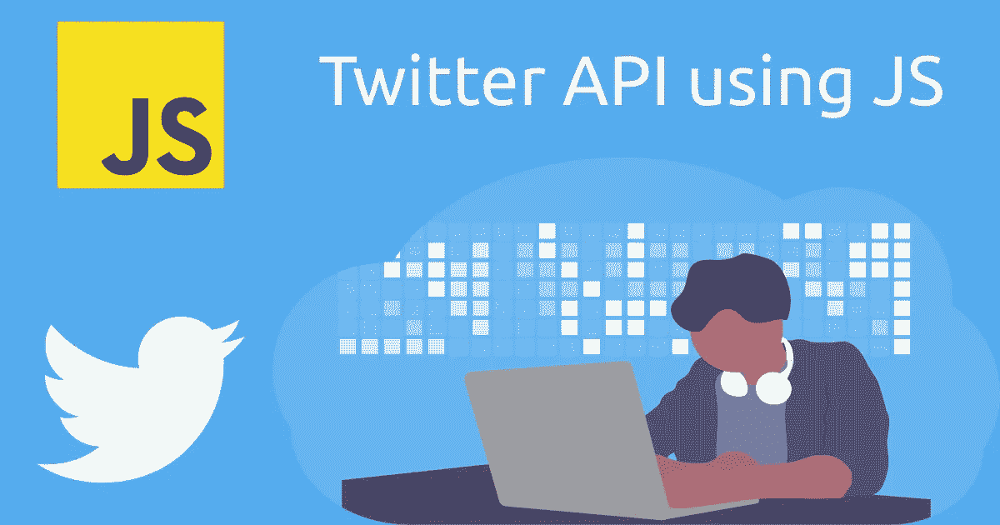

# 使用 JavaScript 通过三个清晰的步骤获得 Twitter API 的最佳途径

> 原文：<https://javascript.plainenglish.io/best-path-to-twitter-api-using-javascript-3-clear-steps-ca3eba503115?source=collection_archive---------7----------------------->

## 关于如何用 JavaScript 从 Twitter API 获取数据的初学者指南。



# 介绍

Twitter 是一个流行的社交媒体平台，用户可以在这里分享他们的观点和想法，并阅读其他用户关于各种主题的帖子。研究人员、开发人员、博客作者和许多领域的人都使用 Twitter 来收集数据。你可以找到一个写得很好的关于如何为 Twitter API 创建开发者账户的 [**博客**](https://blog.learncodeonline.in/introduction-to-twitter-api) 。在这篇博客中，提到了标准搜索 API 可以使用的所有参数和过滤器。强烈建议浏览一下那个博客，了解一下关于 [Twitter 搜索 API](https://blog.learncodeonline.in/introduction-to-twitter-api) 的基本概念。你可以在这里找到 API [的官方文档。](https://developer.twitter.com/en/docs/twitter-api/v1/tweets/search/api-reference/get-search-tweets)

在这篇博文中，我们将探讨如何将 Twitter API 与 JavaScript 结合使用。我们将使用核心的 **Fetch** 库从 Twitter 获取想要的数据，而不是使用任何围绕 Twitter API 的包。我们没有使用任何围绕 Twitter API 包装的模块，比如 **twitter-v2** 和 **twitter-lite** 。目的是让你明白如何利用 Fetch 库使用核心 Twitter API。

# 先决条件

在我们开始使用 Fetch()之前，需要安装以下内容:

1.  *节点*
    要在您的系统上获取并安装**节点**，请转到 [nodejs.dev](https://nodejs.dev/) 并下载 LTS(长期支持)版本。安装后，打开系统上的终端，尝试以下命令，您将看到版本号。这里，npm 是节点应用程序的包管理器。我们需要 npm 为我们的应用程序安装第三方库。
2.  *文本编辑器/ IDE(集成开发环境)*
    你可以使用任何文本编辑器或 IDE。但是，我推荐使用 VSCode，这是微软的一个免费的开源代码编辑器。
3.  *Twitter API 密匙*
    要设置开发者的账号，获取 API 密匙，跟我之前的[博客](https://blog.learncodeonline.in/introduction-to-twitter-api)走。

```
node -vnpm -v
```

# 使用 Fetch 提取数据

在这一节中，我们将看到如何使用 Fetch 模块从 Twitter 中提取数据。Fetch 是一个基于承诺的函数，用于从服务器发送和接收数据。对于这个博客，我们将只关注使用 Fetch 获取数据。

我们在浏览器中使用的 JavaScript(普通 JavaScript)有一个获取模块。这里，我们使用的是**节点**，它是一个 **JavaScript 运行时环境**，通过它我们可以在本地机器上运行 JavaScript。这个运行时环境的核心模块中没有 Fetch。因此，我们需要为我们的项目在外部安装它。

在安装**节点获取**之前，进入你想要工作的任何目录/文件夹，用你选择的名字创建一个文件夹。现在，要安装 Fetch，请打开您在系统上创建的文件夹中的终端，如下所示:

```
npm install node-fetch
```

有两种方法可以处理 fetch()方法:

1.  使用 then()和 catch()
2.  使用异步/等待

# 使用 then()和 catch()

fetch 方法返回一个响应对象，该对象包含一系列有用的基于承诺的方法。这些方法如下:

*   **response.json()** 返回解析为 json 对象的承诺。
*   **response.text()** 返回解析为原始文本的承诺。
*   **response.formData()** 返回解析为 formData 的承诺。
*   **response.blob()** 返回解析为 blob(原始数据的类似文件的对象)的承诺。
*   **response . array buffer()()**返回解析为 ArryBuffer(原始通用二进制数据)的承诺。

由于 Twitter API 返回 JSON 数据，我们将只使用 **response.json()** 方法。以下代码是获取包含 python 关键字且不包含任何转发的所有 tweets 的示例:

```
const fetch = require("node-fetch");const token =  "Bearer BEARER_TOKEN"; // Replace BEARER_TOKEN with your token
const method = "GET";
const options = {
  method: method,
  headers: {
    "Content-type": "application/json",
    Authorization: token,
  },
};const query = "python -filter:retweets";const a = fetch(
  `https://api.twitter.com/1.1/search/tweets.json?q=${query}`,
  options
)
  .then((response) => response.json())
  .then((json) => console.log(json))
  .catch((error) => {
    console.log(error);
  });
```

**注意:**将 BEARER_TOKEN 一词替换为您从开发者门户获得的 Bearer Token。

我们可以为查询分配任何搜索字符串和过滤器。如代码块所示，我们使用 **response.json()** 获取 json 格式的数据。在第一个 **then()** 块中，我们可以使用我们作为参数传递的任何名称来代替响应。如前所述，response.json()再次返回一个承诺。因此，为了解决这个问题，我们又使用了一个 then()块，并得到最终响应作为数据**数据**。在解析承诺的过程中，如果我们得到任何错误，那么控制将被传递给 **catch()** 块。这个块用于处理任何种类的错误。

# 使用异步/等待

要使用 async/await，我们需要创建一个异步函数，并将我们的逻辑放入该函数中。下面的代码展示了我们如何使用带有 fetch()方法的 async/await。

```
const fetch = require("node-fetch");const token =  "Bearer BEARER_TOKEN";   // Replace BEARER_TOKEN with your token
const method = "GET";
const options = {
  method: method,
  headers: {
    "Content-type": "application/json",
    Authorization: token,
  },
};const query = "python -filter:retweets";const getData = async () => {
  try {
    const response = await fetch(
      `https://api.twitter.com/1.1/search/tweets.json?q=${query}`,
      options
    );
    const data = await response.json();
    console.log(data);
  } catch (error) {
    console.log("ERROR");
  }
};getData();
```

如代码所示，await 将解析承诺并返回响应。这里，我们使用了两个 waits 作为 fetch()方法，response.json()都返回承诺。

**注:**我用的是箭头函数，是 JavaScript 版本 ES6 的语法。

对于常见的数据检索任务，上面的代码就足够了。您可以根据需要使用任何查询参数和过滤器，然后将它们分配给**查询。**如果您使用了任何不同的方法或过滤器，请在下面的评论中分享您的专业知识/方法。

# 结论

我们可以使用任何适合他们的方法。可以有其他方法来获取数据。我在这里只提到其中之一。许多人更喜欢使用 [Axios](https://www.npmjs.com/package/axios) ，它的使用方式与我们通过 Twitter API 使用 fetch()方法获取数据的方式相同。

如果你喜欢这个博客，请在评论区告诉我👇。如果你需要任何帮助或者想讨论什么，请告诉我。在 [Twitter](https://bit.ly/3KjwgZV) 或 [LinkedIn](https://bit.ly/3JbsPDm) 上联系我。

如果你想知道 Twitter 搜索 API 是如何工作的，可以看看这个博客👇

[](https://blog.sahilfruitwala.com/guide-to-extract-tweets-using-tweepy) [## 使用 Tweepy 获取推文的综合指南

### Twitter 是这个人工智能时代最受欢迎的数据来源之一。如今，数据几乎是…

blog.sahilfruitwala.com](https://blog.sahilfruitwala.com/guide-to-extract-tweets-using-tweepy) [](https://betterprogramming.pub/an-easy-to-use-guide-for-twitter-search-api-5e1f4835d841) [## Twitter 搜索 API 的易用指南

### 搜索、过滤等

better 编程. pub](https://betterprogramming.pub/an-easy-to-use-guide-for-twitter-search-api-5e1f4835d841) 

*更多内容看* [***说白了。报名参加我们的***](https://plainenglish.io/) **[***免费周报***](http://newsletter.plainenglish.io/) *。关注我们关于*[***Twitter***](https://twitter.com/inPlainEngHQ)*和*[***LinkedIn***](https://www.linkedin.com/company/inplainenglish/)*。加入我们的* [***社区***](https://discord.gg/GtDtUAvyhW) *。***