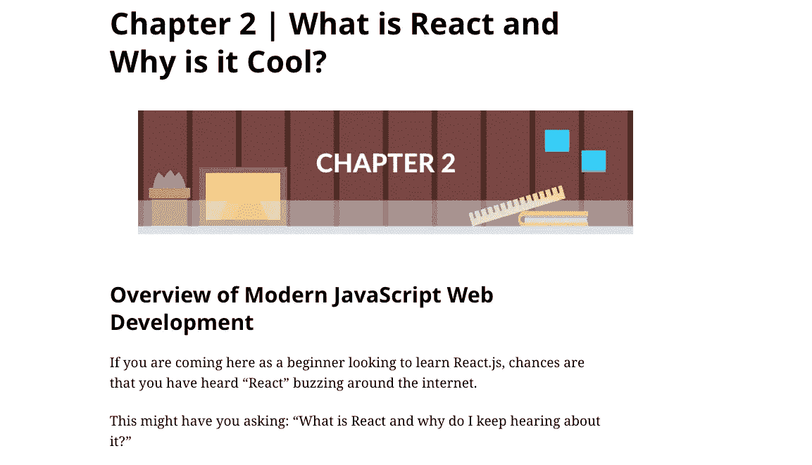

# 免费学习 React 的最佳地点

> 原文：<https://javascript.plainenglish.io/best-place-to-learn-reactjs-free-2ebd66570185?source=collection_archive---------13----------------------->

## 对于希望将自己的技能从基础提升到高级的初学者来说，最值得学习的地方是 React。

# 顶级网站在线学习反应

# freeCodeCamp——前端开发库

[链接](https://www.freecodecamp.org/learn/front-end-development-libraries/)

# React(官网)

[链接](https://vi.reactjs.org/tutorial/tutorial.html)

# W3schools — React 教程

[链接](https://www.w3schools.com/react/default.asp)

# MDN Web 文档 React 入门

[链接](https://developer.mozilla.org/en-US/docs/Learn/Tools_and_testing/Client-side_JavaScript_frameworks/React_getting_started)

# 代码学院——学习反应

[链接](https://www.codecademy.com/learn/react-101)

# egghead——反应初学者指南

[链接](https://egghead.io/courses/the-beginner-s-guide-to-react)

# Sololearn — React + Redux

[链接](https://www.sololearn.com/learning/1097)

# React.js 备忘单

[链接](https://devhints.io/react)

# Scrimba —免费学习 React

[链接](https://scrimba.com/learn/learnreact)

# 反应模式

[链接](https://reactpatterns.com/)

# 30 秒代码

[链接](https://www.30secondsofcode.org/search?keyphrase=react)

# React JS 前端 Web 开发初学者

[链接](https://www.awin1.com/cread.php?awinmid=6554&awinaffid=1036491&platform=dl&ued=https%3A%2F%2Fwww.udemy.com%2Fcourse%2Freact-tutorial%2F)

# 使用 Redux、React-Router、Hooks 和 Auth0 进行反应

[链接](https://www.awin1.com/cread.php?awinmid=6554&awinaffid=1036491&platform=dl&ued=https%3A%2F%2Fwww.udemy.com%2Fcourse%2Fmodern-react%2F)

# 构建您的第一个 React JS 应用程序

[链接](https://www.awin1.com/cread.php?awinmid=6554&awinaffid=1036491&platform=dl&ued=https%3A%2F%2Fwww.udemy.com%2Fcourse%2Fbuild-your-first-react-js-application%2F)

# React vs Angular vs Vue.js 示例

[链接](https://www.awin1.com/cread.php?awinmid=6554&awinaffid=1036491&platform=dl&ued=https%3A%2F%2Fwww.udemy.com%2Fcourse%2Freact-vs-angular-vs-vuejs-by-example%2F)

# 反应基础

[链接](https://www.awin1.com/cread.php?awinmid=6554&awinaffid=1036491&platform=dl&ued=https%3A%2F%2Fwww.udemy.com%2Fcourse%2Freact-fundamentals%2F)

# React JS 与 TypeScript 速成班 2022

[链接](https://www.awin1.com/cread.php?awinmid=6554&awinaffid=1036491&platform=dl&ued=https%3A%2F%2Fwww.udemy.com%2Fcourse%2Freact-js-with-typescript-crash-course-2022%2F)

# 共同进化—反应教程

[链接](https://www.youtube.com/watch?v=QFaFIcGhPoM&list=PLC3y8-rFHvwgg3vaYJgHGnModB54rxOk3&ab_channel=Codevolution)

# 用 Mosh 编程——React 初学者教程

[链接](https://www.youtube.com/watch?v=Ke90Tje7VS0&t=4532s&ab_channel=ProgrammingwithMosh)

# freeCodeCamp.org——学习反应——初学者的完整课程

[链接](https://www.youtube.com/watch?v=DLX62G4lc44&ab_channel=freeCodeCamp.org)

# Traversy Media —初学者学习 React 的完整课程

[链接](https://www.youtube.com/watch?v=w7ejDZ8SWv8&t=3890s&ab_channel=TraversyMedia)

# 需要学习的顶级课程 React

# React —完整指南

*   注册本课程之前，必须具备基本的 HTML、CSS 和 JavaScript 知识。
*   介绍 React 的亮点。
*   了解 React 的工作原理，并将其应用于网站建设。
*   React 钩子教程。
*   介绍 Redux。
*   如何在 TypeScript 中使用 React？

[链接](https://www.awin1.com/cread.php?awinmid=6554&awinaffid=1036491&platform=dl&ued=https%3A%2F%2Fwww.udemy.com%2Fcourse%2Freact-the-complete-guide-incl-redux%2F)

# 仅在 1 小时内做出基本反应

*   帮助您构建 React 组件。
*   如何处理组件中的事件。
*   区分 React 中的两个重要概念，状态和道具。
*   如何在组件之间传递数据？

[链接](https://www.awin1.com/cread.php?awinmid=6554&awinaffid=1036491&platform=dl&ued=https%3A%2F%2Fwww.udemy.com%2Fcourse%2Freact-basic-in-just-1-hour%2F)

# React 教程和项目课程

*   React 简介以及如何设置 React 的工作环境。
*   学习反应钩的基础和进步。
*   使用 Reactjs 建立一个电子商务网站。

[链接](https://www.awin1.com/cread.php?awinmid=6554&awinaffid=1036491&platform=dl&ued=https%3A%2F%2Fwww.udemy.com%2Fcourse%2Freact-tutorial-and-projects-course%2F)

# 2022 年完成 React 开发

*   学习 React 的基础知识。
*   引入了钩子、上下文 API、悬念、反应、懒惰等突出特性。
*   如何使用 GraphQL？
*   了解如何用 React 构建 CSS。
*   介绍主 React 设计模式。

[链接](https://www.awin1.com/cread.php?awinmid=6554&awinaffid=1036491&platform=dl&ued=https%3A%2F%2Fwww.udemy.com%2Fcourse%2Fcomplete-react-developer-zero-to-mastery%2F)

# 高级反应和还原

*   如何构建一个 API？
*   学习高阶分量。
*   了解基于 cookie 的身份验证和基于令牌的身份验证之间的区别。

[链接](https://www.awin1.com/cread.php?awinmid=6554&awinaffid=1036491&platform=dl&ued=https%3A%2F%2Fwww.udemy.com%2Fcourse%2Freact-redux-tutorial%2F)

# 使用 React 和 Redux 进行服务器端渲染

*   需要 React 和 Redux 的基础知识。
*   分享建设大型项目的经验。
*   使用 React、Redux 和 React 路由器进行搜索引擎优化。

[链接](https://www.awin1.com/cread.php?awinmid=6554&awinaffid=1036491&platform=dl&ued=https%3A%2F%2Fwww.udemy.com%2Fcourse%2Fserver-side-rendering-with-react-and-redux%2F)

# 50 天 React 训练营:建立 50 个真实世界 React 项目

*   了解如何使用 React 挂钩和 React 组件。
*   学会使用 React 钩子。
*   实践 50 多个真实项目。

[链接](https://www.awin1.com/cread.php?awinmid=6554&awinaffid=1036491&platform=dl&ued=https%3A%2F%2Fwww.udemy.com%2Fcourse%2Fbuild-real-world-react-programming-projects%2F)

# 学习反应的书籍是免费的

# 反应位

[链接](https://vasanthk.gitbooks.io/react-bits/content/)

# 反应书，你的反应初学者指南

[链接](https://softchris.github.io/react-book/#/)

# 反应书，你的反应初学者指南

[链接](https://softchris.github.io/react-book/#/)

# React JS — React 启蒙

[链接](https://www.reactenlightenment.com/)

# 反应模式

[链接](https://krasimir.gitbooks.io/react-in-patterns/content/)

# React JS 专业人员笔记手册

[链接](https://goalkicker.com/ReactJSBook/)

# 使用 React 进行黑客攻击

[链接](http://www.hackingwithreact.com/)

# Airbnb JavaScript 风格指南

[链接](https://airbnb.io/javascript/react/)

# React 初学者手册

[链接](https://flaviocopes.com/page/react-handbook/)

# 如何在 React.js 电子书中编码

[链接](https://www.digitalocean.com/community/books/how-to-code-in-react-js-ebook)

# 为视觉学习者做出反应

[链接](https://leanpub.com/reactjsforthevisuallearner/read#leanpub-auto-chapter-1--what-is-this-all-about)

相关文章:

*   [全栈 Web 开发最佳在线课程](https://us.niemvuilaptrinh.com/article/top-10-best-web-development-courses-on-udemy)
*   [面向初学者的 40 大免费编程课程](https://us.niemvuilaptrinh.com/article/top-40-free-programming-courses-for-beginners)
*   [免费学习 HTML 和 CSS 的最佳网站](https://us.niemvuilaptrinh.com/article/best-places-to-learn-html-css-free)

# 总结:

我希望这篇文章能帮助你找到学习 React 的最佳网站、书籍和课程。如果您有任何问题，只需发送电子邮件，我会尽快回复。希望大家继续支持网站，让我能写出更多好文章。祝您愉快！

*更多内容看* [***说白了。报名参加我们的***](https://plainenglish.io/) **[***免费周报***](http://newsletter.plainenglish.io/) *。关注我们关于*[***Twitter***](https://twitter.com/inPlainEngHQ)*和*[***LinkedIn***](https://www.linkedin.com/company/inplainenglish/)*。加入我们的* [***社区不和谐***](https://discord.gg/GtDtUAvyhW) *。***