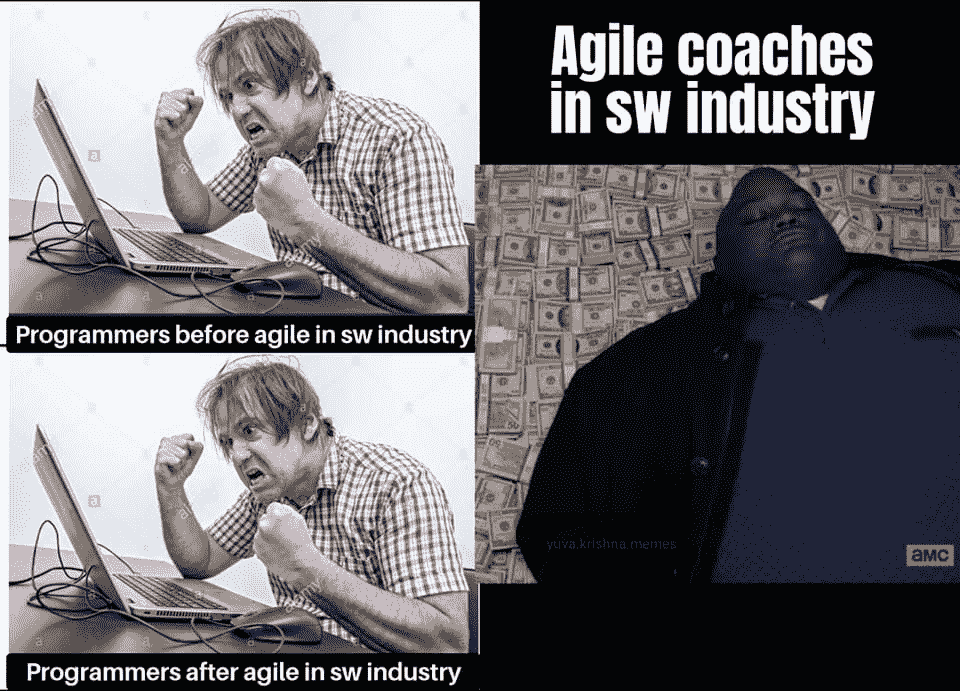

# 最佳编程笑话 2022

> 原文：<https://javascript.plainenglish.io/best-programming-jokes-2022-c3ecd899f87b?source=collection_archive---------1----------------------->

## 与软件开发相关的趋势模因汇编

Photo by [Budka Damdinsuren](https://unsplash.com/@buudkaanaa?utm_source=medium&utm_medium=referral) on [Unsplash](https://unsplash.com?utm_source=medium&utm_medium=referral)

新的一年，新的开始。作为你的微笑专家，我又想出了一篇文章，汇集了我在社交媒体上发现的流行节目笑话。

这些笑话的用意是让你发笑，纠正你的情绪。因为:

## “笑声是人机最好的刷新按钮”

让我们沉浸在笑声中…

# 我在家工作时的挣扎…

Picture Credit: [https://www.facebook.com/yuva.krishna.memes](https://www.facebook.com/yuva.krishna.memes)

# 我们不一样…

Picture Credit: [https://www.reddit.com/r/ProgrammerHumor](https://www.reddit.com/r/ProgrammerHumor)

# 没有升级的感觉…

Picture Credit: [https://www.facebook.com/yuva.krishna.memes](https://www.facebook.com/yuva.krishna.memes)

# 你能找到它吗？

[https://www.reddit.com/r/ProgrammerHumor](https://www.reddit.com/r/ProgrammerHumor)

# 我累了…编译器

Picture Credit: [https://www.facebook.com/yuva.krishna.memes](https://www.facebook.com/yuva.krishna.memes)

# 你在候选人身上看到了什么？

Picture Credit: [https://workchronicles.com/comics/](https://workchronicles.com/comics/)

# 你侮辱了我们…

Picture Credit: [https://www.facebook.com/yuva.krishna.memes](https://www.facebook.com/yuva.krishna.memes)

# 当试抓可以解决问题时，为什么要担心…

Picture Credit:[https://www.reddit.com/r/ProgrammerHumor](https://www.reddit.com/r/ProgrammerHumor)

# 绝对错了…

Picture Credit: [https://www.facebook.com/yuva.krishna.memes](https://www.facebook.com/yuva.krishna.memes)

# 当你在 IDE 中开启智能时…

Picture Credit: [https://www.facebook.com/jokesvala](https://www.facebook.com/jokesvala)

# 哈哈的笑..它改进了过程，但对程序员来说是一样的…

Picture Credit: [https://www.facebook.com/yuva.krishna.memes](https://www.facebook.com/yuva.krishna.memes)

# 我有信任问题…

Picture Credit: [https://www.facebook.com/jokesvala](https://www.facebook.com/jokesvala)

# 喷草…但是是的…这很简单…

Picture Credit: [https://www.facebook.com/yuva.krishna.memes](https://www.facebook.com/yuva.krishna.memes)

# 重读一遍同样的信息…直到你完成任务…

Picture Credit: [https://www.facebook.com/groups/151139362111349](https://www.facebook.com/groups/151139362111349)

# 别担心，你还有很长的路要走…

Picture Credit: [https://www.facebook.com/ProgrammingMemesWorld](https://www.facebook.com/ProgrammingMemesWorld)

# 奖金

# 你喜欢幸运饼干吗？如果你收到这个，作为一个开发者你的反应是什么？

[https://www.facebook.com/yuva.krishna.memes](https://www.facebook.com/yuva.krishna.memes)

# 我也有同样的感觉…当我很少用纸和笔写字的时候…

[https://www.facebook.com/yuva.krishna.memes](https://www.facebook.com/yuva.krishna.memes)

# 我不在乎，我知道这是一种不好的态度，但让我享受这种感觉…

[https://www.facebook.com/yuva.krishna.memes](https://www.facebook.com/yuva.krishna.memes)

# 一切皆有可能..不管怎样，你都可以得到结果。

[https://www.facebook.com/yuva.krishna.memes](https://www.facebook.com/yuva.krishna.memes)

# 让我们来看看 Div 的虚拟世界…在我改变位置进行适当调整后，他们看起来是怎样的…

[https://www.facebook.com/yuva.krishna.memes](https://www.facebook.com/yuva.krishna.memes)

# 当我在代码中发现一个问题时，最常见的事情发生了…

[https://www.monkeyuser.com/](https://www.monkeyuser.com/)

# 下次我会试着写正确的代码…让我们今天就发出请求吧…

[https://www.monkeyuser.com/](https://www.monkeyuser.com/)

# 我的分支在做什么？

[https://www.facebook.com/ProgrammersCreateLife](https://www.facebook.com/ProgrammersCreateLife)

# 当我们每年收到太多的框架时..这很正常…

[https://www.facebook.com/programminggeeks.in](https://www.facebook.com/programminggeeks.in)

# 你喜欢什么？我正在学习一门新的语言…

[https://www.facebook.com/techindustan/](https://www.facebook.com/techindustan/)

# 为帮助我们脱帽致敬…

[https://www.facebook.com/programminggeeks.in](https://www.facebook.com/programminggeeks.in)

# 希望你喜欢，继续关注新的剂量。

*更多内容请看*[***plain English . io***](http://plainenglish.io/)*。报名参加我们的* [***免费周报***](http://newsletter.plainenglish.io/) *。在我们的* [***社区***](https://discord.gg/GtDtUAvyhW) *获得独家获得写作机会和建议。*