# 缓解情绪的最佳编程笑话

> 原文：<https://javascript.plainenglish.io/best-programming-jokes-to-lighten-your-mood-c1e655e92f88?source=collection_archive---------0----------------------->

## 最佳编程笑话汇编

Photo by [Genessa Panainte](https://unsplash.com/@genessapana?utm_source=medium&utm_medium=referral) on [Unsplash](https://unsplash.com?utm_source=medium&utm_medium=referral)

你听说过这样一句话吗，“笑是减轻压力的最佳良药？”

但是怎么做呢？心情不好的时候怎么笑或者微笑？

今天，我试图整理一些我在互联网和社交媒体上发现的最好的与编程相关的**笑话/迷因**。这些笑话让我笑逐颜开，希望也能让你笑逐颜开。

> *我们走吧。准备好注射第一剂。*

# 当你没有为项目创建任何文档，而有人要求时…

Picture Credit:[https://www.reddit.com/r/ProgrammerHumor/](https://www.reddit.com/r/ProgrammerHumor/)

# 斗争是真实的…

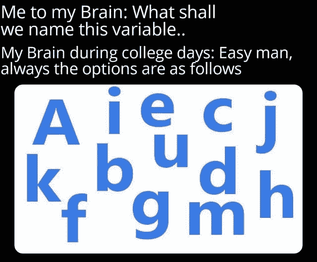

Picture Credit:[https://www.facebook.com/yuva.krishna.memes](https://www.facebook.com/yuva.krishna.memes)

# 为了安全起见，让我们按 2-3 次…

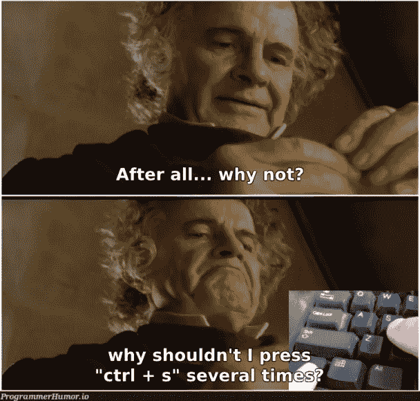

Picture Credit:[https://programmerhumor.io/](https://programmerhumor.io/)

# 当我把 JS 介绍给我刚毕业的表弟时…

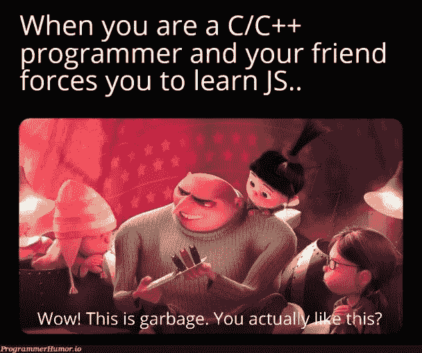

Picture Credit:[https://programmerhumor.io/](https://programmerhumor.io/)

# 让我们演示一下你们开发的东西…

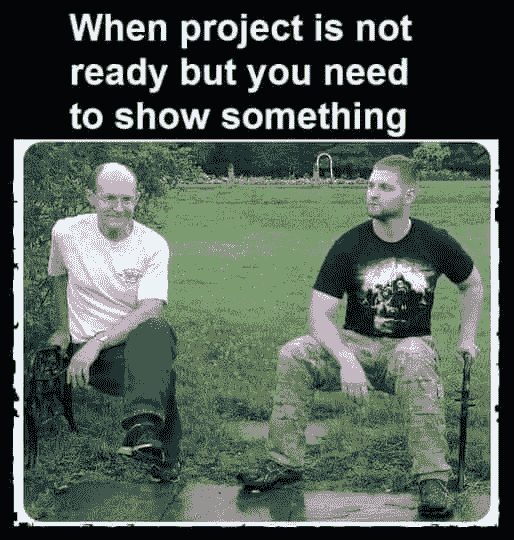

Picture Credit:[https://www.facebook.com/groups/programmingmemesworld](https://www.facebook.com/groups/programmingmemesworld)

# 你用注释吗？

Picture Credit:[https://www.facebook.com/groups/151139362111349](https://www.facebook.com/groups/151139362111349)

# 还有人受够了客户吗？

Picture Credit:[https://www.facebook.com/jokesvala/](https://www.facebook.com/jokesvala/)

# 没有什么是不可能的…

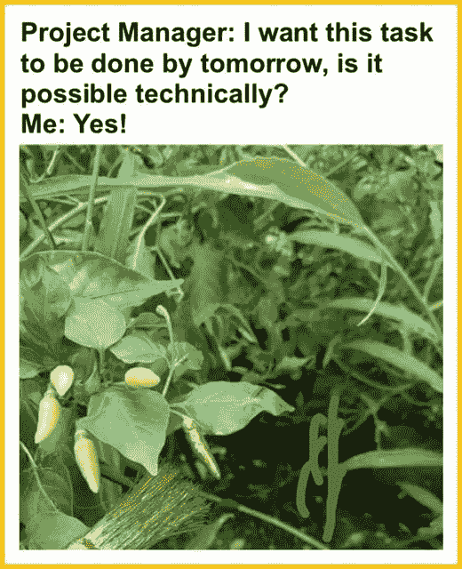

Picture Credit:[https://www.facebook.com/jokesvala/](https://www.facebook.com/jokesvala/)

# 是的，我们可以在 2 个月内完成这个项目…

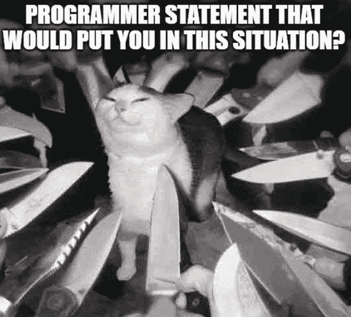

Picture Credit:[https://www.facebook.com/jokesvala/](https://www.facebook.com/jokesvala/)

# 他们到底是如何在一个视频中完成整个项目的？

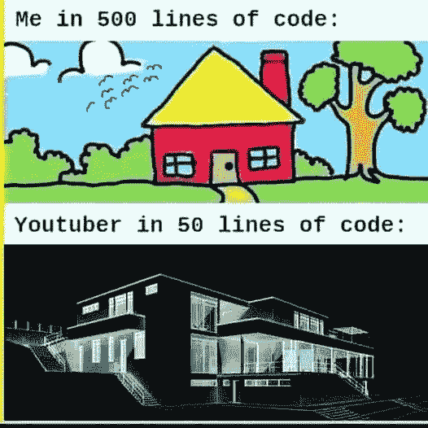

Picture Credit:[https://www.facebook.com/programmingwithKhiZi](https://www.facebook.com/programmingwithKhiZi)

# 这很容易解决…

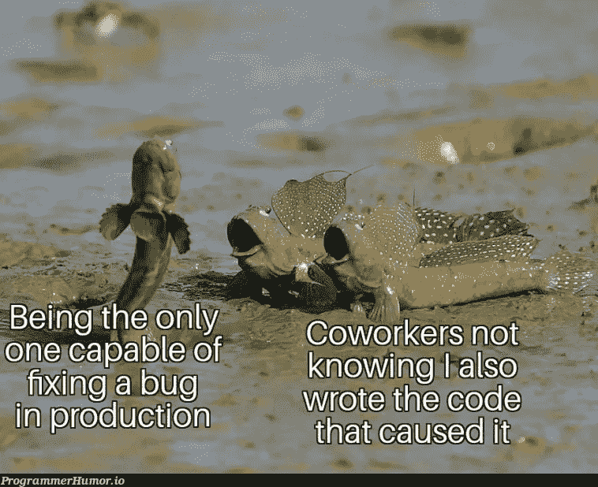

Picture Credit:[https://programmerhumor.io/](https://programmerhumor.io/)

# 重要不重要？我很困惑…

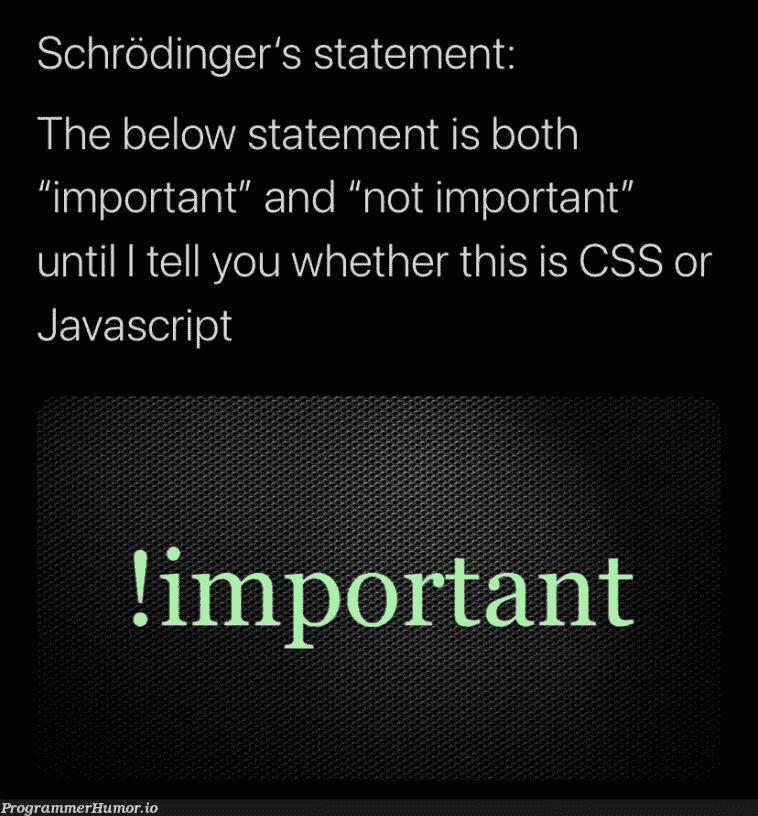

Picture Credit:[https://programmerhumor.io/](https://programmerhumor.io/)

# CS 专业墙绘…

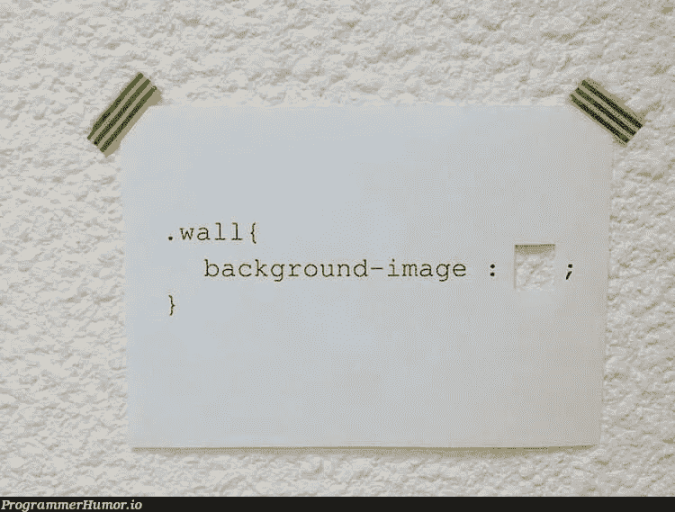

Picture Credit:[https://programmerhumor.io/](https://programmerhumor.io/)

# 奖励内容…

# 真的吗？有人在评论里加这个吗？

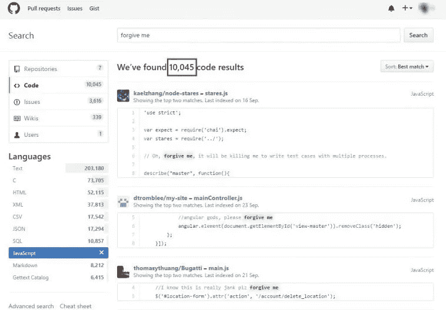

**来源:**[https://programmer humor . io/JavaScript-memes/revolve-me-is-quit-a-comment-comment-in-github-projects-2/](https://programmerhumor.io/javascript-memes/forgive-me-is-quite-a-common-comment-in-github-projects-2/)

# 编译器错误？等等，让我加上分号…

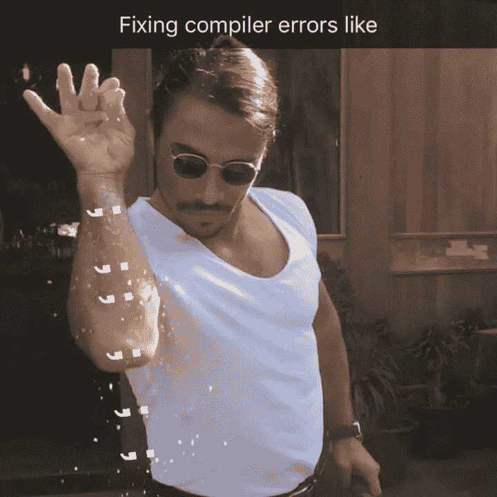

**来源:**[https://programmer humor . io/programming-memes/fixing-compiler-errors-like/](https://programmerhumor.io/programming-memes/fixing-compiler-errors-like/)

# 我以后要这种 AI…

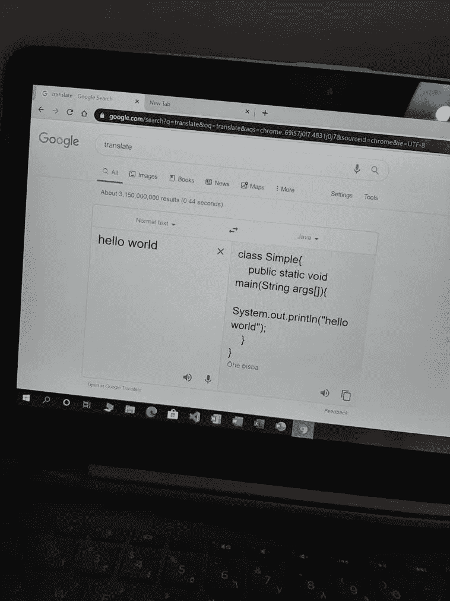

**来源:**[https://programmer humor . io/programming-memes/the-translation-I-need-2/](https://programmerhumor.io/programming-memes/the-translation-i-need-2/)

# 编程家长？你在读这个吗？

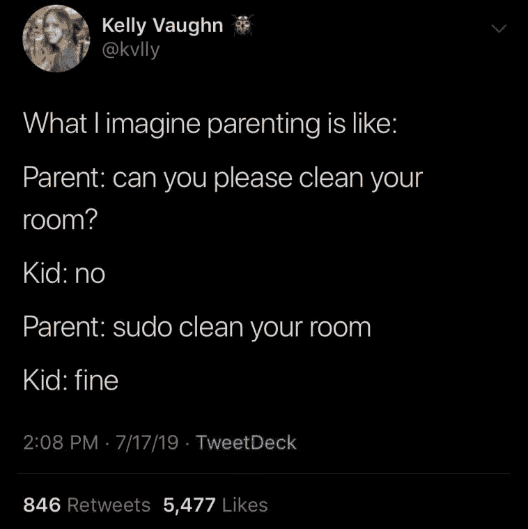

**来源:**[https://programmer humor . io/programming-memes/parents-wish-2/](https://programmerhumor.io/programming-memes/parents-wish-2/)

# 从字面上看，我在大学时代就是这样做的…

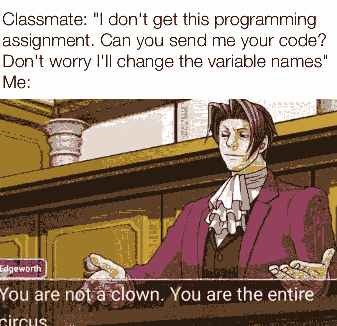

**来源:**[https://programmer humor . io/programming-memes/theres-always-that-one-guy-2/](https://programmerhumor.io/programming-memes/theres-always-that-one-guy-2/)

# 无意冒犯，但黑暗模式就是生活…

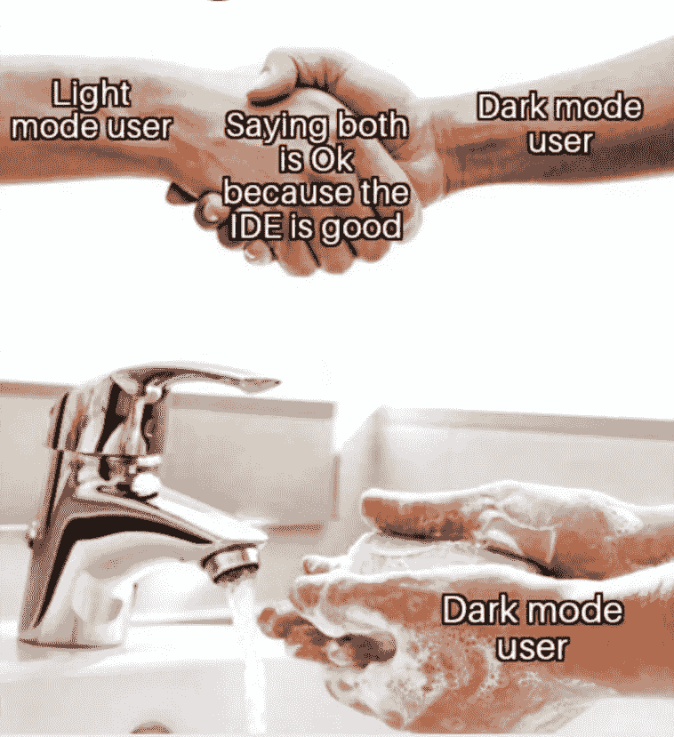

**来源:**[https://programmer humor . io/programming-memes/dark-mode-users-be-like % F0 % 9f % a4 % 90-2/](https://programmerhumor.io/programming-memes/dark-mode-users-be-like%f0%9f%a4%90-2/)

# 哪一个更重要？技术债还是积压？

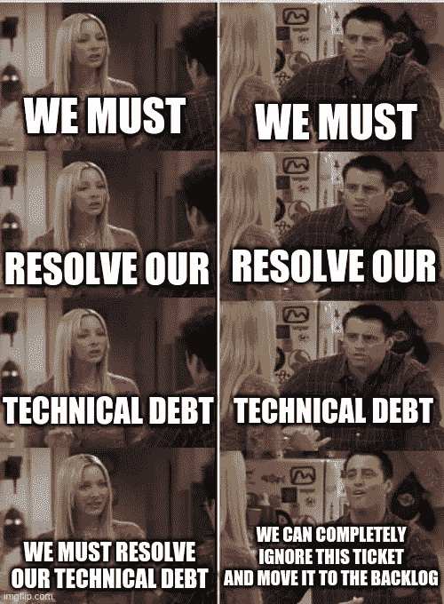

**来源:**[https://programmer humor . io/programming-memes/talking-to-your-po-2/](https://programmerhumor.io/programming-memes/talking-to-your-po-2/)

# 真正的不同…你怀念在办公室工作的日子吗？

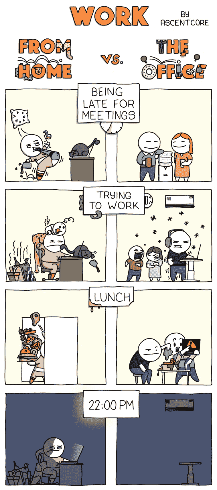

**来源:**[https://programmer humor . io/programming-memes/work-from-home vs . work-from-the-office/](https://programmerhumor.io/programming-memes/work-from-home-vs-work-from-the-office/)

# 经常发生，当我的循环变得无限时…

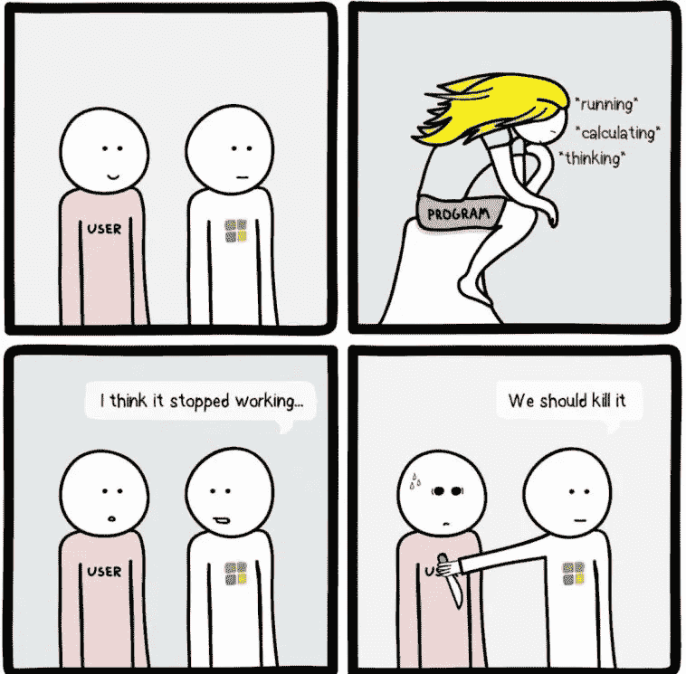

**来源:**[https://programmerhumor.io/programming-memes/just-do-it/](https://programmerhumor.io/programming-memes/just-do-it/)

# 是我… LOL

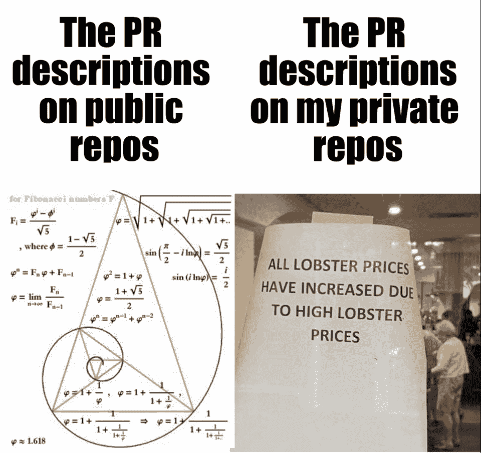

**来源:**[https://www . Reddit . com/r/programmer humor/comments/q 1237g/pr _ descriptions _ in _ private _ repos/](https://www.reddit.com/r/ProgrammerHumor/comments/q1237g/pr_descriptions_in_private_repos/)

# 哈哈…你也是这样吗？

**来源:**[https://www . Reddit . com/r/programmer humor/comments/q0zgkd/the _ power _ of _ the _ sun _ is _ in _ the _ fingers _ of _ my _ hands/](https://www.reddit.com/r/ProgrammerHumor/comments/q0zgkd/the_power_of_the_sun_is_in_the_fingers_of_my_hands/)

# 为什么？为什么要更新？

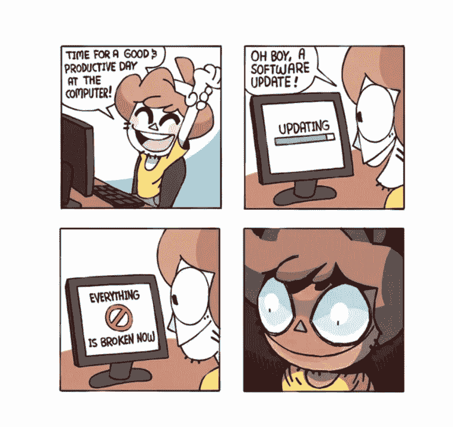

来源:[https://programmer humor . io/programming-memes/windows-10-be-like/](https://programmerhumor.io/programming-memes/windows-10-be-like/)

# 可重用组件在这种情况下不起作用…哈哈

**来源:**[https://www . monkey user . com/assets/images/2021/225-reusable-components . png](https://www.monkeyuser.com/assets/images/2021/225-reusable-components.png)

# 小虫子…

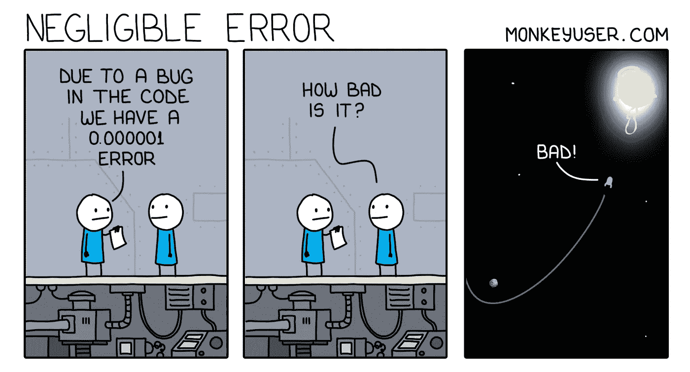

**来源:**[https://www . monkey user . com/assets/images/2021/204-ignorable-error . png](https://www.monkeyuser.com/assets/images/2021/204-negligible-error.png)

# 公关…

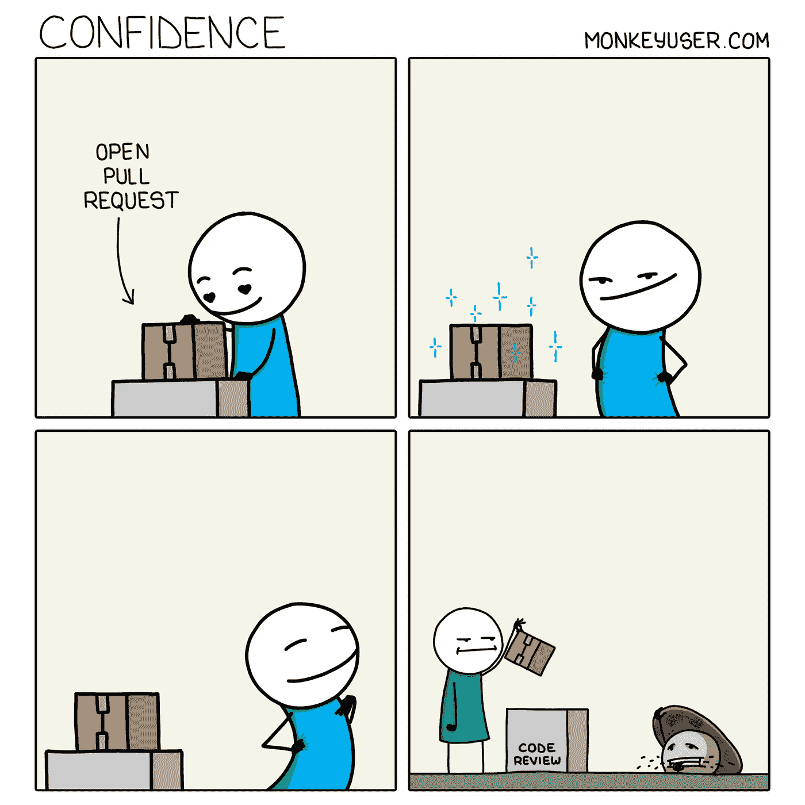

**来源:**[https://www.monkeyuser.com/2021/confidence/?sc=true&dir = random](https://www.monkeyuser.com/2021/confidence/?sc=true&dir=random)

*更多内容请看*[***plain English . io***](https://plainenglish.io/)*。报名参加我们的* [***免费周报***](http://newsletter.plainenglish.io/) *。关注我们关于* [***推特***](https://twitter.com/inPlainEngHQ)[***领英***](https://www.linkedin.com/company/inplainenglish/)**和* [***不和***](https://discord.gg/GtDtUAvyhW) ***。****